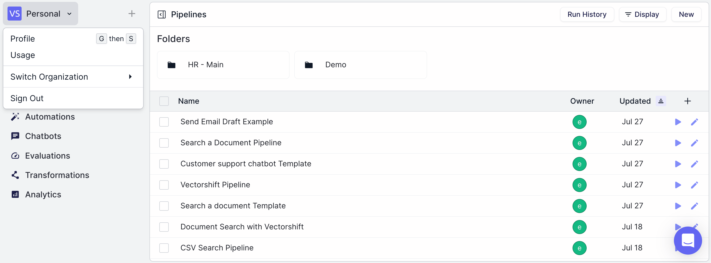

> ## Documentation Index
> Fetch the complete documentation index at: https://docs.vectorshift.ai/llms.txt
> Use this file to discover all available pages before exploring further.

# Profile

> Manage your personal account settings

Your profile includes areas to view/update your username, update your picture and name, and create new Organizations.

You can reach your profile by clicking on the VectorShift logo in the top-left and selecting "Profile" from the dropdown menu.

From this section, you can view/change some of the account details, including:

* Username, required to make an API call to execute a workflow. The username is editable.
* Name and Profile picture.
* User ID, this ID is assigned to each account by default and cannot be changed.
* Change Password.
* Notifications, list of each workflow execution with status and timestamps.
