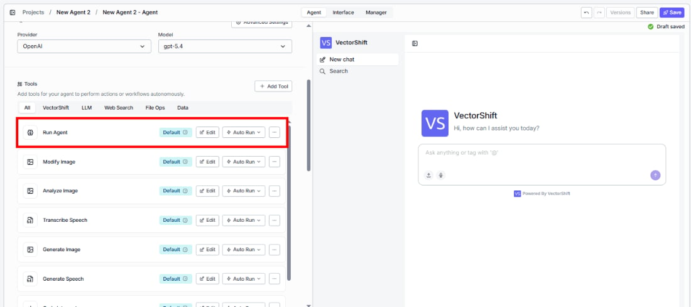
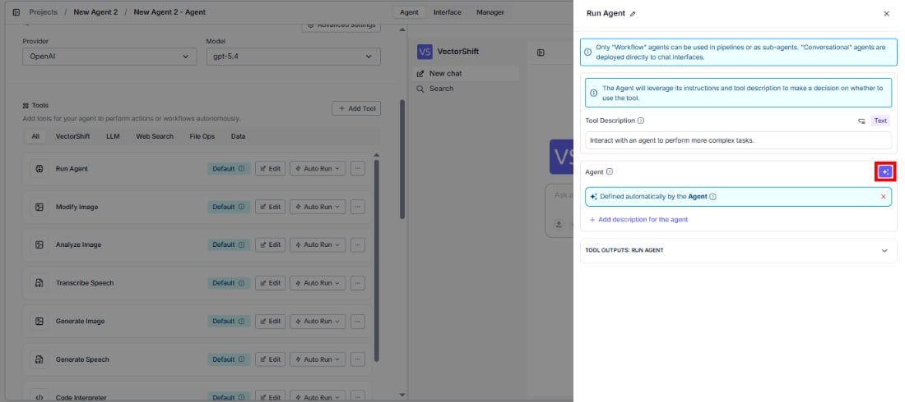
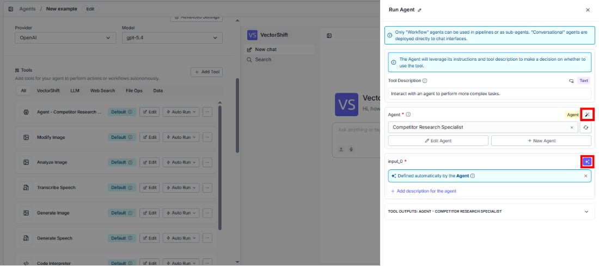
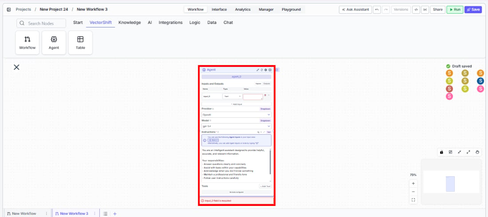
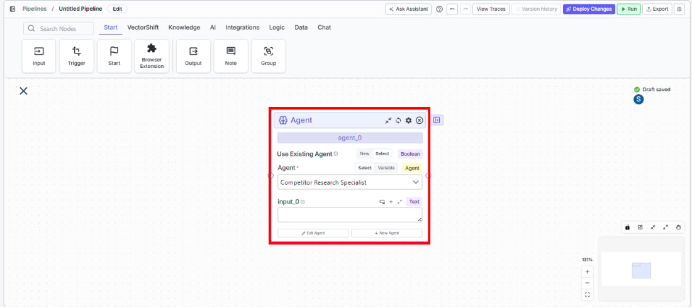
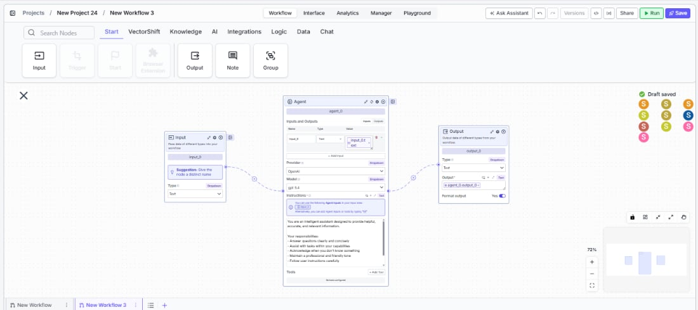
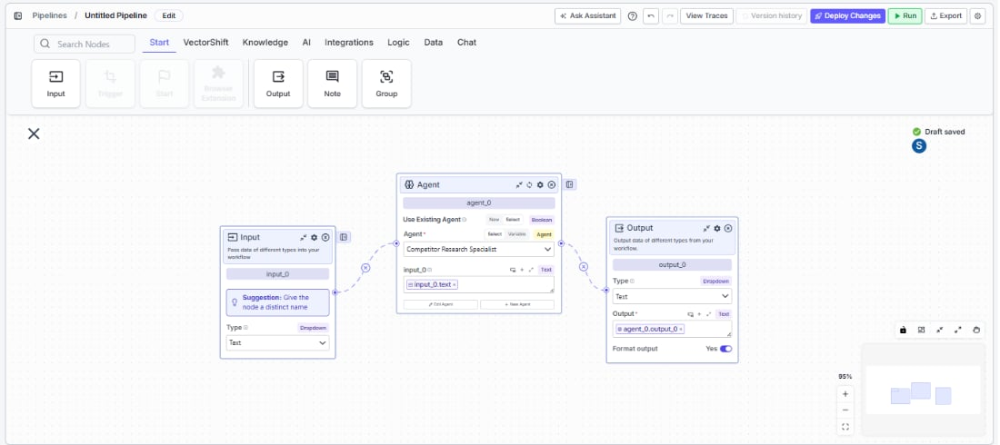

> ## Documentation Index
> Fetch the complete documentation index at: https://docs.vectorshift.ai/llms.txt
> Use this file to discover all available pages before exploring further.

# Agent Node

> Run an existing agent as a sub-agent within your workflows or as a tool inside another agent.

<Card title="Use this node from the SDK" icon="code" href="/sdk/pipeline/nodes/general#agent">
  Add it in Python with `pipeline.add(name="...").agent(...)`. See the SDK reference.
</Card>

The Agent node lets you embed a fully configured agent inside a workflow or use it as a tool within another agent. This enables multi-agent orchestration — for example, you can build a primary agent that delegates research tasks to a specialized sub-agent, or create a workflow that routes customer inquiries through a domain-specific agent before returning a final response.

## Core Functionality

* Run any existing **Workflow**-type agent as a sub-agent within a workflow or another agent
* Dynamically pass inputs to the sub-agent and receive its outputs for downstream use
* Configure the sub-agent inline with custom inputs, outputs, provider, model, and system prompt — or simply reference an already-built agent
* Set up agent dependencies so that one sub-agent can call another in a defined execution order

## Tool Inputs

* `Use Existing Agent` — **Required** · Boolean · Default: `false` (Workflows), `true` (Agents) · When enabled, select a pre-built agent to run. When disabled, configure the agent inline directly on the node.
* `Agent` \* — **Required** · Agent selector · The agent to execute. Only **Workflow**-type agents are supported in workflows and as sub-agents; **Conversational** agents are deployed directly to chat interfaces.
* `Provider` — Optional · Dropdown · Default: `OpenAI` · Select the LLM provider for the agent. Available when configuring inline (Use Existing Agent is off). *(Advanced setting)*
* `Model` — Optional · Dropdown · Default: `gpt-4.1` · Select the LLM model for the agent. Available when configuring inline. *(Advanced setting)*
* `Agent Config` — Optional · Object · The complete agent configuration including instructions, tools, inputs, and outputs. Available when configuring inline.
* Dynamic inputs — When an existing agent is selected, its defined input fields appear automatically on the node for you to connect or fill in.

\* indicates a required field.

## Tool Outputs

* Dynamic outputs — The outputs defined by the selected agent are exposed as output handles on the node. The names and types mirror whatever was configured on the referenced agent's output nodes.

<Tabs>
  <Tab title="Agents">
    ## Overview

    When added as a tool inside an agent, the Agent tool allows your primary agent to delegate tasks to a specialized sub-agent during a conversation. The primary agent decides when to invoke the sub-agent based on the conversation context, passes the relevant inputs, and incorporates the sub-agent's response into its own reply. This is ideal for building multi-agent systems where each agent handles a distinct domain.

    ## Use Cases

    * **Portfolio rebalancing assistant** — A primary financial advisor agent delegates detailed asset allocation calculations to a specialized portfolio optimization sub-agent.
    * **Compliance review workflow** — A client-facing agent routes regulatory questions to a compliance-specialist sub-agent trained on the latest SEC guidelines.
    * **Multi-market research** — A head analyst agent dispatches research queries to region-specific sub-agents (e.g., APAC equities, EU fixed income) and synthesizes the results.
    * **Risk scoring delegation** — A loan processing agent calls a credit-risk sub-agent to evaluate borrower profiles and return a risk score before proceeding.
    * **Earnings call summarizer** — An investment research agent invokes a sub-agent that specializes in parsing and summarizing earnings call transcripts.

    ## How It Works

    1. **Add the tool** — In the agent builder, open the tool panel and navigate to the **VectorShift** category. Select **Agent** to add it as a tool.

    <Frame>
      
    </Frame>

    2. **Select the agent** — In the tool configuration, use the `Agent` dropdown to choose the existing agent you want to run as a sub-agent.
    3. **Configure input fields** — Each input defined on the sub-agent appears as a configurable field. You can either leave a field open so the primary agent fills it automatically based on conversation context, or lock it to a fixed value by entering one directly. Click the sparkle icon to switch a field between dynamic (agent-determined) and static (fixed) mode.

    <Frame>
      
    </Frame>

    To select a specific agent manually, click the sparkle icon on the Agent field and choose from the dropdown.

    <Frame>
      
    </Frame>

    4. **Write a Tool Description** — The Tool Description tells the primary agent what this tool does and when to use it. A good description is specific and action-oriented — for example: *"Use this tool to run a portfolio optimization analysis. Provide the client's risk tolerance and current holdings."* Avoid vague descriptions; the agent relies on this text to decide when to invoke the tool.
    5. **Set Auto Run behavior** — Choose how the tool executes:
       * **Auto Run** — The agent invokes the sub-agent immediately without user intervention.
       * **Require User Approval** — The agent pauses and asks the user for confirmation before running the sub-agent.
       * **Let Agent Decide** — The agent determines at runtime whether to ask for approval or run automatically, based on context.
    6. **Test the tool** — Use the chat interface to send a message that should trigger the sub-agent. Verify that the primary agent correctly delegates, the sub-agent processes the request, and the response is incorporated into the conversation.

    ## Settings

    * `Agent` — Agent selector · Default: none · The sub-agent to execute.
    * `Tool Description` — Text · Default: none · Describes the tool's purpose to the primary agent. Drives when and how the agent decides to invoke it.
    * `Auto Run` — Dropdown · Default: Auto Run · Controls execution behavior (Auto Run, Require User Approval, Let Agent Decide).

    **Advanced Settings:**

    * `Max Turns` — Integer · Default: varies · Maximum number of conversation turns the sub-agent can take before returning.
    * `Model` — Dropdown · Default: inherited from agent · Override the LLM model used by the sub-agent.
    * `Temperature` — Float · Default: model default · Controls randomness in the sub-agent's responses.
    * `Top P` — Float · Default: model default · Nucleus sampling parameter for response generation.
    * `Max Output Tokens` — Integer · Default: model default · Maximum number of tokens in the sub-agent's response.
    * `Tool Input Behavior` — Dropdown · Default: varies · Controls how tool inputs are handled by the sub-agent.

    ## Best Practices

    * **Keep sub-agents focused** — Each sub-agent should handle a single domain (e.g., tax calculations, market data retrieval) rather than being a generalist. This improves accuracy and makes the system easier to debug.
    * **Write precise tool descriptions** — The primary agent uses the description to decide when to call the sub-agent. Include the specific scenarios, required inputs, and expected output format.
    * **Use fixed values for sensitive parameters** — For fields like account IDs or compliance thresholds, lock them to fixed values rather than letting the agent fill them dynamically.
    * **Set appropriate auto-run policies** — Use "Require User Approval" for high-stakes financial actions (e.g., trade execution) and "Auto Run" for read-only operations (e.g., fetching market data).
    * **Limit max turns** — In financial workflows, set a reasonable max turns value to prevent the sub-agent from entering long loops when processing complex queries.

    ## Related Templates

    <CardGroup cols={2}>
      <Card title="Grant Matching AI Agent" href="https://app.vectorshift.ai/marketplace">
        Matches organizations or individuals to relevant grants based on their profile and eligibility criteria.
      </Card>

      <Card title="Contract AI Analyst" href="https://app.vectorshift.ai/marketplace">
        Analyzes contracts to extract key terms, flag risks, and summarize obligations.
      </Card>

      <Card title="IC Memo Agent" href="https://app.vectorshift.ai/marketplace">
        Drafts and reviews investment committee memos using deal data and internal templates.
      </Card>

      <Card title="Customer Support Chatbot" href="https://app.vectorshift.ai/marketplace">
        Handles common customer inquiries and support tickets through conversational AI.
      </Card>
    </CardGroup>

    ## Common Issues

    For troubleshooting and common issues, see the [Common Issues](/docs/common-issues) page.
  </Tab>

  <Tab title="Workflows">
    ## Overview

    In workflows, the Agent node lets you embed a complete agent execution step within your workflow. The node accepts inputs from upstream nodes, runs the selected agent, and passes the agent's outputs to downstream nodes. This is useful for adding conversational AI capabilities, complex reasoning, or multi-step tool use into an otherwise deterministic workflow.

    ## Use Cases

    * **Automated financial report generation** — A workflow collects raw data from multiple sources, passes it to an Agent node that synthesizes the information into a narrative report, and outputs a formatted document.
    * **Invoice processing workflow** — Documents flow through extraction nodes, then an Agent node validates and categorizes each invoice using reasoning and tool calls before writing results to a table.
    * **Client onboarding workflow** — An Agent node handles the conversational portion of KYC verification while the surrounding workflow manages document storage and compliance checks.
    * **Trading signal enrichment** — Market data feeds into an Agent node that applies fundamental and technical analysis reasoning, then outputs buy/hold/sell signals for downstream processing.

    ## How It Works

    1. **Add the node** — On the workflow canvas, open the node panel and navigate to the **VectorShift** category. Drag the **Agent** node onto the canvas.

    <Frame>
      
    </Frame>

    You can also drag the **Agent (Select)** variant, which lets you pick an existing agent directly.

    <Frame>
      
    </Frame>

    2. **Choose existing or inline** — Toggle `Use Existing Agent` on to select a pre-built agent, or leave it off to configure the agent directly on the node. The standard workflow view defaults to inline configuration. To access the `Use Existing Agent` toggle, open the workflow from your dashboard in the **console view** — the toggle appears at the top of the Agent node's configuration panel.
    3. **Select or configure the agent**:
       * **Existing agent**: Choose the agent from the dropdown. Its inputs and outputs automatically appear as handles on the node.
       * **Inline configuration**: Define input names and types (Text, File, List of Files, Audio, Image, Number, Boolean, Integer, DataFrame, etc.), output names and types, select a Provider and Model, and write the system prompt.
    4. **Connect inputs** — Wire upstream node outputs into the Agent node's input handles. Each input corresponds to a field the agent expects.

    <Frame>
      
    </Frame>

    For Agent (Select) nodes, the connection pattern is similar:

    <Frame>
      
    </Frame>

    5. **Configure dependencies** *(optional)* — Use the Dependencies tab to add agent dependencies. This lets you define execution order when multiple sub-agents need to coordinate.
    6. **Connect outputs** — Wire the Agent node's output handles to downstream nodes for further processing.
    7. **Run the workflow** — Execute the workflow. The Agent node runs the agent with the provided inputs and passes results downstream.

    ## Settings

    * `Use Existing Agent` — Boolean · Default: `false` · Toggle between selecting an existing agent or configuring one inline. Access this setting by opening the workflow from your dashboard in the console view.
    * `Agent` — Agent selector · Default: none · The agent to run. Only Workflow-type agents are supported.

    **Inline configuration settings (when Use Existing Agent is off):**

    * `Inputs` — Dynamic · Name and Type pairs defining what the agent accepts. Supported types: Text, File, List of Files, Audio, Image, Number, Boolean, Integer, DataFrame.
    * `Outputs` — Dynamic · Name and Type pairs defining what the agent returns.
    * `Provider` — Dropdown · Default: `OpenAI` · The LLM provider. *(Advanced setting)*
    * `Model` — Dropdown · Default: `gpt-4.1` · The LLM model. *(Advanced setting)*
    * `System Prompt` — Text area · Default: pre-filled with a general-purpose assistant prompt · Instructions that define the agent's behavior, personality, and constraints.
    * `Dependencies` — List · Default: none · Other agents that this agent depends on or can call during execution.

    ## Best Practices

    * **Use Workflow-type agents only** — Conversational agents cannot be used in workflows. Ensure the agent you select or configure is set to Workflow mode.
    * **Define explicit input/output types** — Match input and output types precisely to avoid type-mismatch errors when connecting to other nodes.
    * **Keep system prompts domain-specific** — For financial workflows, include relevant constraints (e.g., "Always cite data sources", "Use ISO currency codes", "Do not provide investment advice without disclaimers").
    * **Use dependencies for multi-agent coordination** — When your workflow requires multiple agents that need to share context or execute in order, use the Dependencies tab rather than chaining Agent nodes sequentially.
    * **Test with representative data** — Before deploying, run the workflow with realistic financial data to verify the agent handles edge cases (missing fields, unusual formats, large datasets).

    ## Related Templates

    <CardGroup cols={2}>
      <Card title="Grant Matching AI Agent" href="https://app.vectorshift.ai/marketplace">
        Matches organizations or individuals to relevant grants based on their profile and eligibility criteria.
      </Card>

      <Card title="Contract AI Analyst" href="https://app.vectorshift.ai/marketplace">
        Analyzes contracts to extract key terms, flag risks, and summarize obligations.
      </Card>

      <Card title="IC Memo Agent" href="https://app.vectorshift.ai/marketplace">
        Drafts and reviews investment committee memos using deal data and internal templates.
      </Card>

      <Card title="Customer Support Chatbot" href="https://app.vectorshift.ai/marketplace">
        Handles common customer inquiries and support tickets through conversational AI.
      </Card>
    </CardGroup>

    ## Common Issues

    For troubleshooting and common issues, see the [Common Issues](/docs/common-issues) page.
  </Tab>
</Tabs>
