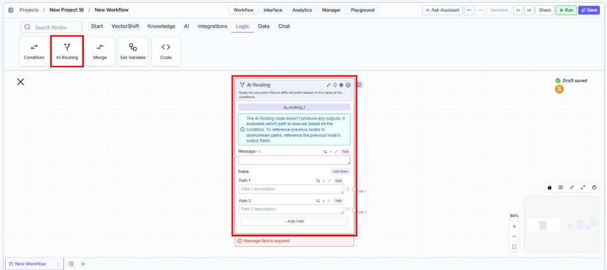
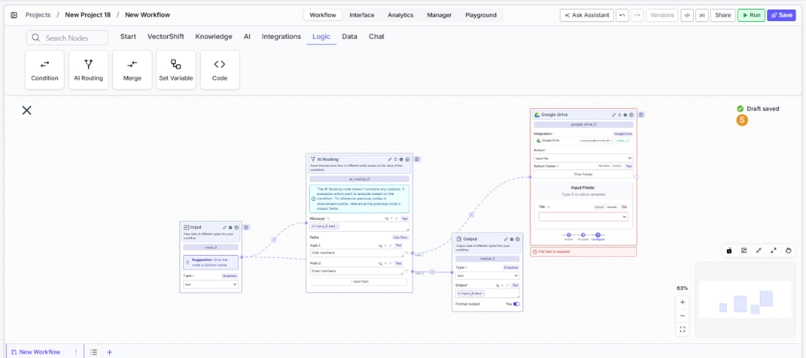

> ## Documentation Index
> Fetch the complete documentation index at: https://docs.vectorshift.ai/llms.txt
> Use this file to discover all available pages before exploring further.

# AI Routing

> Route execution flow to different paths using AI-powered message classification.

<Card title="Use this node from the SDK" icon="code" href="/sdk/pipeline/nodes/logic#ai_routing">
  Add it in Python with `pipeline.add(name="...").ai_routing(...)`. See the SDK reference.
</Card>

The AI Routing node uses an LLM to classify an incoming message and route execution to the matching path. Use it to build intelligent branching workflows — for example, directing customer inquiries to different processing workflows based on intent, or routing financial documents to the correct extraction workflow based on document type.

## Core Functionality

* Classifies an input message using a configurable LLM provider and model
* Routes execution to one of multiple user-defined paths based on the classification result
* Supports any number of paths, each with a natural-language description the LLM uses to decide the match
* Does not produce data outputs — downstream nodes reference previous nodes' output fields directly

## Tool Inputs

* `Message` \* — The text the AI router will classify to determine which path to execute. Required. Text.
* `Shared Memory` — Additional context the AI uses when determining the routing. Text. Use this to pass conversation history or other background information that helps the model make a more accurate classification.
* `Provider` — The LLM provider to use for classification. Dropdown, default: `OpenAI`.- `Model` — The specific model to use for classification. Dropdown, default: `gpt-4o`.- `Temperature` — Controls randomness in the model's classification. Decimal, default: `0.7`. Lower values produce more deterministic routing.- `Max Tokens` — The maximum number of tokens the model can generate. Integer, default: `2048`.- `Top P` — Nucleus sampling parameter. Decimal, default: `1.0`.- `Path Descriptions` — Each path has a natural-language description (e.g., "Customer is asking about billing" or "Document is a tax form"). The LLM reads these descriptions to decide which path matches the input message.

\* *Required field*

## Tool Outputs

The AI Routing node does not produce data outputs. It evaluates which path to execute based on the classification. To access data in downstream nodes, reference the output fields of nodes that ran before the AI Routing node.

***

<Tabs>
  <Tab title="Workflows">
    ### Overview

    In workflows, the AI Routing node sits between upstream data-producing nodes and multiple downstream branches. It reads the `Message` input, uses the configured LLM to classify it against the path descriptions, and activates the matching branch. Use it when you need intelligent, content-aware branching that goes beyond simple string matching — for example, routing support tickets by intent or dispatching financial documents to the right extraction workflow.

    ### Use Cases

    * Route incoming customer messages to billing, technical support, or sales workflows based on intent classification
    * Direct financial documents (invoices, tax forms, contracts) to specialized extraction workflows based on document type
    * Classify transaction descriptions and route to the appropriate categorization or compliance review path
    * Triage risk alerts by severity and route to escalation or standard processing branches
    * Sort incoming emails by topic and forward to the correct department workflow

    ### How It Works

    #### Step 1: Add the AI Routing Node

    In the workflow canvas, click the **Logic** tab in the node palette and click **AI Routing**. Drag it onto the canvas.

    <Frame>
      
    </Frame>

    #### Step 2: Write the Message Input

    In the `Message` field, type the text the AI should classify, or connect it from an upstream node's output. This field is required — the node displays a validation error if left empty.

    #### Step 3: Define Paths

    Each path has a description field. Write a clear, natural-language description of what qualifies a message for that path — for example, "The customer is asking about pricing or billing" or "The document is a quarterly earnings report."

    * **Path 1** comes pre-configured. Enter its description.
    * **Path 2** comes pre-configured. Enter its description.
    * Click **+ Add Path** at the bottom to add more paths as needed.

    Each path creates a separate output handle on the right side of the node that you connect to downstream nodes.

    #### Step 4: Configure the AI Model (Optional)

    The right side of the node exposes advanced model settings:

    * **`Provider`** — Select the LLM provider (default: OpenAI).
    * **`Model`** — Select the specific model (default: gpt-4o).
    * **`Temperature`** — Adjust classification randomness (default: 0.7). Use lower values for more consistent routing.
    * **`Max Tokens`** — Set the token limit (default: 2048).
    * **`Top P`** — Adjust nucleus sampling (default: 1.0).

    Optionally, fill in `Shared Memory` to give the model additional context for classification.

    #### Step 5: Connect Downstream Nodes

    Connect each path's output handle to the downstream nodes that should execute for that classification. Downstream nodes reference the output fields of nodes that ran *before* the AI Routing node — the AI Routing node itself does not pass data through.

    <Frame>
      
    </Frame>

    #### Step 6: Test the Workflow

    Click **Run** to test the workflow. Provide a sample message and verify that the AI routes it to the correct path.

    ### Settings

    | Setting             | Type            | Default | Description                                                            |
    | ------------------- | --------------- | ------- | ---------------------------------------------------------------------- |
    | `Message`           | Text            | —       | The text to classify for routing. Required.                            |
    | `Shared Memory`     | Text            | —       | Additional context for the AI classification.                          |
    | `Provider`          | Dropdown        | OpenAI  | The LLM provider. **Advanced setting.**                                |
    | `Model`             | Dropdown        | gpt-4o  | The specific model for classification. **Advanced setting.**           |
    | `Temperature`       | Decimal         | 0.7     | Controls randomness. Lower = more deterministic. **Advanced setting.** |
    | `Max Tokens`        | Integer         | 2048    | Maximum tokens for classification. **Advanced setting.**               |
    | `Top P`             | Decimal         | 1.0     | Nucleus sampling parameter. **Advanced setting.**                      |
    | `Path Descriptions` | Text (per path) | —       | Natural-language description of each routing path.                     |

    ### Best Practices

    * **Write distinct path descriptions.** The LLM classifies based on descriptions — make them clearly distinguishable. Avoid overlapping language like "billing questions" and "payment questions" in separate paths.
    * **Use low temperature for critical routing.** In financial workflows where misrouting has consequences (e.g., compliance vs. general inquiries), set temperature to 0.1–0.3 for more deterministic classification.
    * **Add a catch-all path.** Include a final path with a description like "Any message that does not match the above categories" to handle edge cases.
    * **Leverage Shared Memory for context.** When routing depends on prior conversation history (e.g., a follow-up message about an earlier topic), pass the conversation context into `Shared Memory`.
    * **Keep path count manageable.** More paths increase the chance of misclassification. If you need many branches, consider cascading AI Routing nodes — first route by broad category, then sub-route within each branch.

    ### Related Templates

    <CardGroup cols={2}>
      <Card title="Document Classification Agent" href="https://app.vectorshift.ai/marketplace">
        Automatically categorizes and tags incoming documents based on content and type.
      </Card>

      <Card title="Application Risk Agent" href="https://app.vectorshift.ai/marketplace">
        Assesses risk levels in incoming applications using scoring models and policy rules.
      </Card>

      <Card title="Refund/Expense Approval AI Agent" href="https://app.vectorshift.ai/marketplace">
        Reviews and routes refund or expense requests based on policy rules and approval thresholds.
      </Card>

      <Card title="CapEx Classification AI Agent" href="https://app.vectorshift.ai/marketplace">
        Classifies capital expenditure items against accounting standards and internal policies.
      </Card>
    </CardGroup>

    ### Common Issues

    For help with common configuration issues, see the [Common Issues](/support) page.
  </Tab>
</Tabs>
