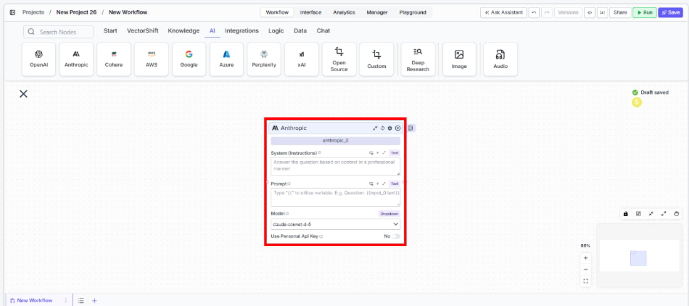
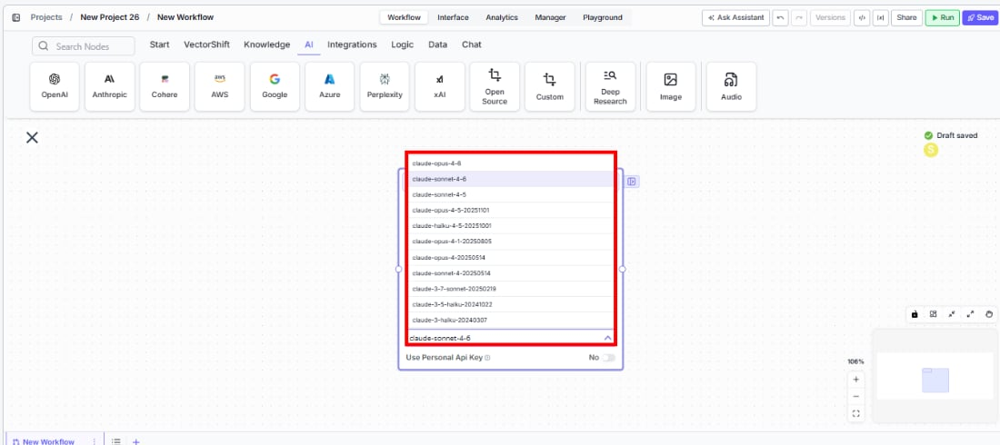
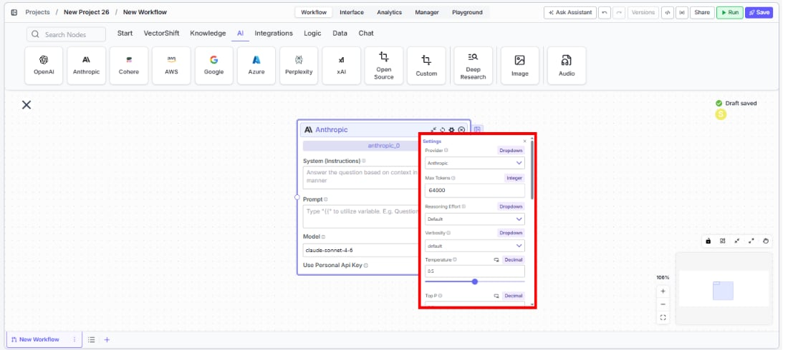
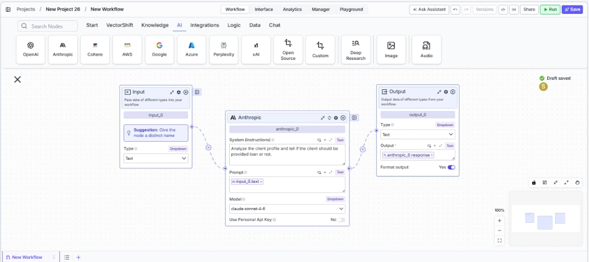

> ## Documentation Index
> Fetch the complete documentation index at: https://docs.vectorshift.ai/llms.txt
> Use this file to discover all available pages before exploring further.

# Anthropic LLM

> Generate text responses using Anthropic's Claude models in your workflows.

<Card title="Use this node from the SDK" icon="code" href="/sdk/pipeline/nodes/llms#llm">
  Add it in Python with `pipeline.add(name="...").llm(...)`. See the SDK reference.
</Card>

The Anthropic LLM node connects your workflows to Anthropic's Claude family of language models. Use it to generate text responses, analyze documents, answer questions grounded in knowledge bases, or produce structured JSON outputs for downstream processing — for example, drafting client summaries from earnings transcripts, classifying support tickets by urgency, or extracting key figures from financial reports.

## Core Functionality

* Generate text completions and conversational responses using Claude models
* Process system instructions and dynamic prompts with variable interpolation
* Stream responses in real time for long-running generations
* Return structured JSON output with optional schema enforcement
* Track token usage and credit consumption per run
* Apply content moderation, PII detection, and safety guardrails
* Retry failed executions automatically with configurable intervals

## Tool Inputs

* `System Instructions` — (String) Instructions that guide the model's behavior, tone, and how it should use data provided in the prompt
* `Prompt` — (String) The data sent to the model. Type `{{` to open the variable builder and reference outputs from other nodes
* `Model` \* — (Enum (Dropdown), default: `claude-sonnet-4-6`) Select from available Claude models. Click **Dropdown** to view all options
* `Use Personal Api Key` — (Boolean, default: `No`) Toggle to use your own Anthropic API key instead of VectorShift's shared key
* `Api Key` — (String) Your Anthropic API key. Only visible when `Use Personal Api Key` is enabled
* `JSON Schema` — (String) JSON schema to enforce structured output format. Only visible when `JSON Response` is enabled in the settings panel

\* indicates a required field

## Tool Outputs

* `response` — (String (or Stream\<String> when streaming)) The generated text response from the model
* `prompt_response` — (String) The combined prompt and response content
* `tokens_used` — (Integer) Total number of tokens consumed (input + output)
* `input_tokens` — (Integer) Number of input tokens sent to the model
* `output_tokens` — (Integer) Number of output tokens generated by the model
* `credits_used` — (Decimal) VectorShift AI credits consumed for this run

<Tabs>
  <Tab title="Workflows">
    ## Overview

    The Anthropic LLM node in workflows lets you place a Claude model directly on the canvas, wire inputs and outputs to other nodes, and configure model behavior through the settings panel. Responses can be streamed for real-time display or returned as a complete block for downstream processing.

    ## Use Cases

    * **Earnings call analysis** — Summarize quarterly earnings transcripts and extract key financial metrics like revenue, EPS, and guidance changes for analyst review.
    * **Regulatory document review** — Parse SEC filings or compliance documents, flagging sections that require legal attention or contain material disclosures.
    * **Client communication drafting** — Generate personalized portfolio update emails by combining market data with client-specific holdings and risk profiles.
    * **Financial data extraction** — Pull structured data from unstructured documents using JSON mode — extract line items from invoices or expense reports into a consistent schema.
    * **Risk assessment narratives** — Produce written risk summaries by combining quantitative model outputs with qualitative market context and historical patterns.

    ## How It Works

    1. **Add the node to your workflow.** From the toolbar, open the **AI** category and drag the **Anthropic** node onto the canvas.

    <Frame>
      
    </Frame>

    2. **Write your System Instructions.** Enter instructions in the `System Instructions` field to define the model's behavior, tone, and how it should use any data provided in the prompt. For example: *"Answer the question based on context in a professional manner."*

    3. **Configure the Prompt.** In the `Prompt` field, type `{{` to open the variable builder and reference outputs from upstream nodes. For example: `Question: {{input_0.text}} Context: {{knowledge_base_0.chunks}}`.

    4. **Select a model.** Use the `Model` dropdown to choose a Claude model. Available options include `claude-sonnet-4-6`, `claude-sonnet-4-5`, `claude-opus-4`, `claude-haiku-4-5`, `claude-3.7-sonnet`, `claude-3.5-haiku`, and others.

    <Frame>
      
    </Frame>

    5. **Enable streaming (optional).** Click the **Streaming** toggle on the node face to receive responses token-by-token. When streaming is enabled, the `response` output type changes to `Stream<String>` — ensure any connected Output node is set to **Streamed Text**.

    6. **Use a personal API key (optional).** Toggle `Use Personal Api Key` to **Yes** to use your own Anthropic API key. An `Api Key` field appears below — paste your key there.

    7. **Open settings.** Click the **gear icon** (⚙) on the node to open the settings panel, where you can configure token limits, temperature, retry behavior, safety features, and more.

    <Frame>
      
    </Frame>

    8. **Connect outputs.** Click the **Outputs** button to open the outputs panel. Wire the `response` output to downstream nodes (e.g., an Output node, another LLM, or a Text node). Use `tokens_used`, `input_tokens`, `output_tokens`, and `credits_used` for monitoring and cost tracking.

    <Frame>
      
    </Frame>

    9. **Run your workflow.** Execute the workflow. The Anthropic node processes its inputs and returns the generated response along with usage metrics.

    ## Settings

    All settings below are accessed via the **gear icon** (⚙) on the node.

    | Setting                     | Type     | Default   | Description                                                                                                                                                              |
    | --------------------------- | -------- | --------- | ------------------------------------------------------------------------------------------------------------------------------------------------------------------------ |
    | `Provider`                  | Dropdown | Anthropic | The LLM provider.                                                                                                                                                        |
    | `Max Tokens`                | Integer  | 64096     | Maximum number of input + output tokens the model will process per run. Different models have different token limits — the workflow will error if the limit is exceeded. |
    | `Reasoning Effort`          | Dropdown | Default   | Controls the depth of reasoning the model applies to its response.                                                                                                       |
    | `Verbosity`                 | Dropdown | Default   | Controls the verbosity of model responses.                                                                                                                               |
    | `Temperature`               | Float    | 0.5       | Controls response creativity. Higher values (toward 1.0) produce more diverse outputs; lower values (toward 0) produce more deterministic responses.                     |
    | `Top P`                     | Float    | 0.5       | Controls token sampling diversity. Higher values consider more tokens at each generation step.                                                                           |
    | `Stream`                    | Boolean  | Off       | Stream responses token-by-token instead of returning the full response at once.                                                                                          |
    | `JSON Response`             | Boolean  | Off       | Return output as structured JSON. When enabled, a `JSON Schema` input appears for optional schema enforcement.                                                           |
    | `Show Sources`              | Boolean  | Off       | Display source documents used for the response. Useful when combining with knowledge base inputs.                                                                        |
    | `Toxic Input Filtration`    | Boolean  | Off       | Filter toxic input content. If the model receives toxic content, it responds with a respectful message instead.                                                          |
    | `Web Search`                | Boolean  | Off       | Enable web search capabilities for the model during generation.                                                                                                          |
    | `Safety`                    | Toggle   | On        | Enable safety guardrails for content filtering.                                                                                                                          |
    | `Safe Context Token Window` | Boolean  | Off       | Automatically reduce context to fit within the model's maximum context window, preventing token-limit errors on variable-length inputs.                                  |
    | `Max # of re-try`           | Integer  | 100       | Maximum number of retry attempts when execution fails. Visible when retry is enabled.                                                                                    |
    | `Max Interval b/w re-try`   | Integer  | —         | Interval in milliseconds between retry attempts.                                                                                                                         |
    | **PII Detection**           |          |           |                                                                                                                                                                          |
    | `Name`                      | Boolean  | Off       | Detect and redact personal names from input before sending to the model.                                                                                                 |
    | `Email`                     | Boolean  | Off       | Detect and redact email addresses from input.                                                                                                                            |
    | `Phone`                     | Boolean  | Off       | Detect and redact phone numbers from input.                                                                                                                              |
    | `Credit Card Info`          | Boolean  | Off       | Detect and redact credit card numbers from input.                                                                                                                        |
    | `Show Guardrail Status`     | Dropdown | —         | Controls whether guardrail status is included in the output.                                                                                                             |

    ## Best Practices

    * **Start with a specific system prompt.** For financial workflows, include explicit instructions about the output format — e.g., "Respond with bullet points," "Include only numerical data," or "Cite the section of the filing."
    * **Use JSON mode for structured extraction.** When pulling financial metrics from documents, enable `JSON Response` and provide a schema to ensure consistent, machine-readable output across runs.
    * **Monitor token usage.** Connect `tokens_used` and `credits_used` outputs to tracking nodes, especially important for high-volume batch processing of financial documents.
    * **Enable Safe Context Token Window for variable-length inputs.** When processing documents of unpredictable size (like earnings transcripts), this prevents token-limit errors by automatically truncating inputs.
    * **Use streaming for client-facing interfaces.** If the Anthropic node powers a chatbot answering investor queries, enable streaming for a more responsive user experience.
    * **Apply PII detection for client data.** When processing client communications or personal financial data, enable the relevant PII detection toggles to prevent sensitive information from being sent to the model.

    ## Related Templates

    <CardGroup cols={2}>
      <Card title="Grant Matching AI Agent" href="https://app.vectorshift.ai/marketplace">
        Matches organizations or individuals to relevant grants based on their profile and eligibility criteria.
      </Card>

      <Card title="IC Memo Agent" href="https://app.vectorshift.ai/marketplace">
        Drafts and reviews investment committee memos using deal data and internal templates.
      </Card>
    </CardGroup>

    ## Common Issues

    For troubleshooting common issues with this node, see the [Common Issues](/support) documentation.
  </Tab>
</Tabs>
