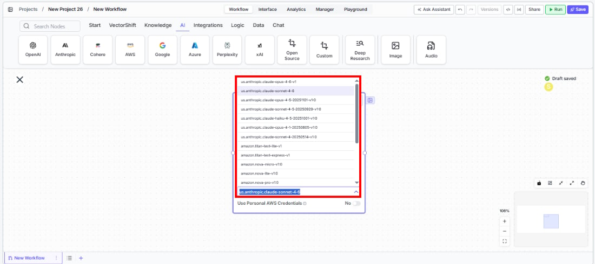
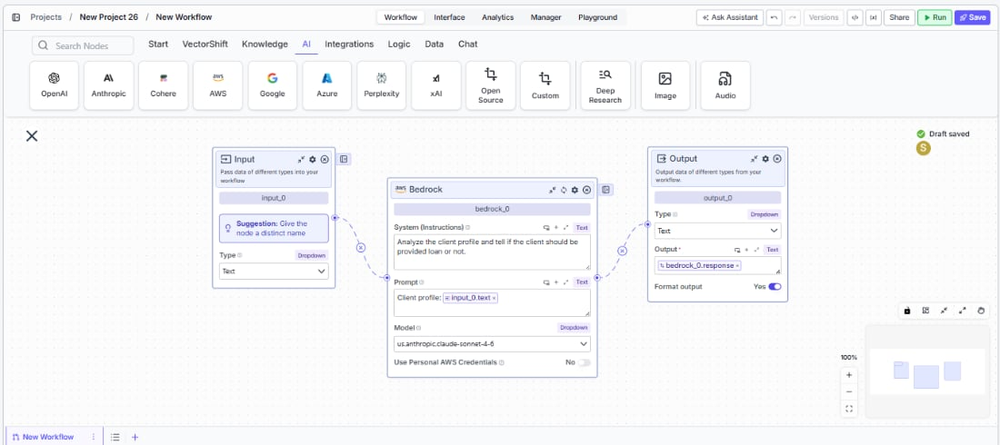

> ## Documentation Index
> Fetch the complete documentation index at: https://docs.vectorshift.ai/llms.txt
> Use this file to discover all available pages before exploring further.

# AWS Bedrock LLM

> Generate text responses using AWS Bedrock models in your workflows.

<Card title="Use this node from the SDK" icon="code" href="/sdk/pipeline/nodes/llms#llm">
  Add it in Python with `pipeline.add(name="...").llm(...)`. See the SDK reference.
</Card>

The AWS Bedrock LLM node connects your workflows to Amazon Bedrock's managed model catalog. Use it to access foundation models from providers like Anthropic Claude, Amazon Titan, and Meta Llama through your AWS account — enabling use cases such as generating investment research summaries, extracting data from regulatory filings, or building compliant AI workflows that keep data within your AWS environment.

## Core Functionality

* Generate text completions using models available through AWS Bedrock
* Authenticate with your own AWS credentials for enterprise-grade access control
* Process system instructions and dynamic prompts with variable interpolation
* Stream responses in real time for long-running generations
* Return structured JSON output with optional schema enforcement
* Track token usage and credit consumption per run
* Apply content moderation, PII detection, and safety guardrails
* Retry failed executions automatically with configurable intervals

## Tool Inputs

* `System Instructions` — (String) Instructions that guide the model's behavior, tone, and how it should use data provided in the prompt
* `Prompt` — (String) The data sent to the model. Type `{{` to open the variable builder and reference outputs from other nodes
* `Model` \* — (Enum (Dropdown), default: `us.anthropic.claude-sonnet-4-5`) Select from available Bedrock models
* `Use Personal AWS Credentials` — (Boolean, default: No) Toggle to authenticate with your own AWS credentials
* `AWS Access Key ID` — (String) Your AWS access key. Only visible when `Use Personal AWS Credentials` is enabled
* `AWS Secret Key` — (String) Your AWS secret key. Only visible when `Use Personal AWS Credentials` is enabled
* `AWS Region` — (Dropdown, default: US East N. Virginia) The AWS region for Bedrock API calls. Only visible when `Use Personal AWS Credentials` is enabled
* `JSON Schema` — (String) JSON schema to enforce structured output format. Only visible when `JSON Response` is enabled in the settings panel

\* indicates a required field

## Tool Outputs

* `response` — (String (or Stream\<String> when streaming)) The generated text response from the model
* `prompt_response` — (String) The combined prompt and response content
* `tokens_used` — (Integer) Total number of tokens consumed (input + output)
* `input_tokens` — (Integer) Number of input tokens sent to the model
* `output_tokens` — (Integer) Number of output tokens generated by the model
* `credits_used` — (Decimal) VectorShift AI credits consumed for this run

<Tabs>
  <Tab title="Workflows">
    ## Overview

    The Bedrock LLM node in workflows lets you place an AWS Bedrock model directly on the canvas, optionally authenticate with your own AWS credentials, and configure model behavior through the settings panel. This is ideal for organizations that require data to stay within their AWS environment or need access to Bedrock-exclusive models.

    ## Use Cases

    * **Compliant document processing** — Process sensitive financial documents using models hosted within your AWS account, ensuring data residency and compliance requirements are met.
    * **Multi-model evaluation** — Compare outputs from different foundation models (Claude, Titan, Llama) available on Bedrock to find the best fit for your financial analysis tasks.
    * **Automated report generation** — Generate quarterly portfolio reports by combining market data with client holdings, using enterprise-grade AWS infrastructure.
    * **Regulatory filing extraction** — Parse and extract structured data from SEC filings or tax documents using JSON mode, keeping all data within your AWS boundary.
    * **Internal knowledge Q\&A** — Build internal chatbots that answer compliance questions by grounding responses in your organization's policy knowledge base.

    ## How It Works

    1. **Add the node to your workflow.** From the toolbar, open the **AI** category and drag the **AWS** node onto the canvas. It appears as "Bedrock" on the node.

    2. **Write your System Instructions.** Enter instructions in the `System Instructions` field to define the model's behavior, tone, and how it should use any data provided in the prompt.

    3. **Configure the Prompt.** In the `Prompt` field, type `{{` to open the variable builder and reference outputs from upstream nodes.

    4. **Select a model.** Use the `Model` dropdown to choose from available Bedrock models, including `us.anthropic.claude-sonnet-4-5` and other foundation models.

    <Frame>
      
    </Frame>

    5. **Enable streaming (optional).** Click the **Streaming** toggle on the node face to receive responses token-by-token. When streaming is enabled, the `response` output type changes to `Stream<String>`.

    6. **Use personal AWS credentials (optional).** Toggle `Use Personal AWS Credentials` to enable authentication with your own AWS account. Three fields appear:
       * `AWS Access Key ID` — Your AWS access key
       * `AWS Secret Key` — Your AWS secret access key
       * `AWS Region` — Select your preferred AWS region (e.g., US East N. Virginia)

    7. **Open settings.** Click the **gear icon** (⚙) on the node to open the settings panel, where you can configure token limits, temperature, retry behavior, safety features, and more.

    8. **Connect outputs.** Click the **Outputs** button to open the outputs panel. Wire the `response` output to downstream nodes. Use `tokens_used`, `input_tokens`, `output_tokens`, and `credits_used` for monitoring.

    <Frame>
      
    </Frame>

    9. **Run your workflow.** Execute the workflow. The Bedrock node processes its inputs through AWS and returns the generated response along with usage metrics.

    ## Settings

    All settings below are accessed via the **gear icon** (⚙) on the node.

    | Setting                     | Type     | Default | Description                                                                                                                              |
    | --------------------------- | -------- | ------- | ---------------------------------------------------------------------------------------------------------------------------------------- |
    | `Provider`                  | Dropdown | Bedrock | The LLM provider.                                                                                                                        |
    | `Max Tokens`                | Integer  | 64000   | Maximum number of input + output tokens the model will process per run.                                                                  |
    | `Reasoning Effort`          | Dropdown | Default | Controls the depth of reasoning the model applies to its response.                                                                       |
    | `Verbosity`                 | Dropdown | Default | Controls the verbosity of model responses.                                                                                               |
    | `Temperature`               | Float    | 0.5     | Controls response creativity. Higher values produce more diverse outputs; lower values produce more deterministic responses. Range: 0–1. |
    | `Top P`                     | Float    | 0.5     | Controls token sampling diversity. Higher values consider more tokens at each generation step. Range: 0–1.                               |
    | `Stream`                    | Boolean  | Off     | Stream responses token-by-token instead of returning the full response at once.                                                          |
    | `JSON Response`             | Boolean  | Off     | Return output as structured JSON. When enabled, a `JSON Schema` input appears for optional schema enforcement.                           |
    | `Show Sources`              | Boolean  | Off     | Display source documents used for the response. Useful when combining with knowledge base inputs.                                        |
    | `Toxic Input Filtration`    | Boolean  | Off     | Filter toxic input content. If the model receives toxic content, it responds with a respectful message instead.                          |
    | `Safe Context Token Window` | Boolean  | Off     | Automatically reduce context to fit within the model's maximum context window.                                                           |
    | `Retry On Failure`          | Boolean  | Off     | Enable automatic retries when execution fails.                                                                                           |
    | `Max # of re-try`           | Integer  | —       | Maximum number of retry attempts. Visible when `Retry On Failure` is enabled.                                                            |
    | `Max Interval b/w re-try`   | Integer  | —       | Interval in milliseconds between retry attempts.                                                                                         |
    | **PII Detection**           |          |         |                                                                                                                                          |
    | `Name`                      | Boolean  | Off     | Detect and redact personal names from input before sending to the model.                                                                 |
    | `Email`                     | Boolean  | Off     | Detect and redact email addresses from input.                                                                                            |
    | `Phone`                     | Boolean  | Off     | Detect and redact phone numbers from input.                                                                                              |
    | `SSN`                       | Boolean  | Off     | Detect and redact Social Security numbers from input.                                                                                    |
    | `Credit Card Info`          | Boolean  | Off     | Detect and redact credit card numbers from input.                                                                                        |
    | `Show Guardrail Status`     | Dropdown | —       | Controls whether guardrail status is included in the output.                                                                             |

    ## Best Practices

    * **Use personal AWS credentials for production workloads.** This ensures data stays within your AWS account and lets you leverage AWS IAM policies for fine-grained access control.
    * **Select the appropriate region.** Choose an AWS region close to your users or one that meets your data residency requirements for compliance-sensitive financial workflows.
    * **Use JSON mode for structured extraction.** When pulling financial metrics from documents, enable `JSON Response` and provide a schema for consistent, machine-readable output.
    * **Enable Safe Context Token Window for variable-length inputs.** Prevents token-limit errors when processing documents of unpredictable size like earnings transcripts or multi-page filings.
    * **Monitor token usage for cost management.** Bedrock charges per token — connect `tokens_used` and `credits_used` to tracking nodes to monitor spend across high-volume processing.
    * **Apply PII detection for regulated data.** When handling client financial data subject to regulatory requirements, enable PII toggles including SSN detection.

    ## Common Issues

    For troubleshooting common issues with this node, see the [Common Issues](/support) documentation.
  </Tab>
</Tabs>
