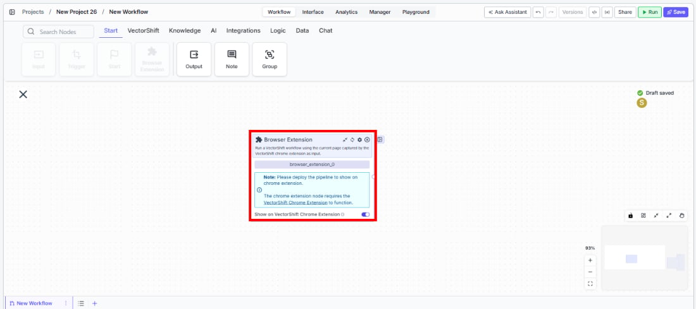
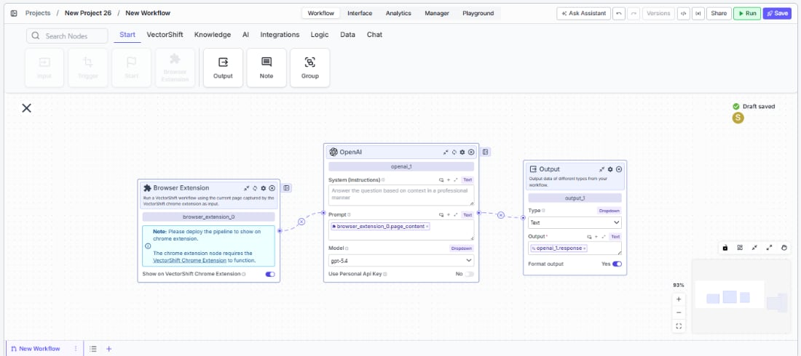

> ## Documentation Index
> Fetch the complete documentation index at: https://docs.vectorshift.ai/llms.txt
> Use this file to discover all available pages before exploring further.

# Browser Extension

> Run a VectorShift workflow using the current page captured by the VectorShift Chrome Extension as input.

<Card title="Use this node from the SDK" icon="code" href="/sdk/pipeline/nodes/start#browser_extension">
  Add it in Python with `pipeline.add(name="...").browser_extension(...)`. See the SDK reference.
</Card>

The Browser Extension node lets you run a VectorShift workflow directly from your browser using the content of the page you are currently viewing. Use it to build workflows that extract, summarize, or analyze any web page on demand — for example, pulling key data from a financial filing, summarizing a competitor's press release, or capturing a screenshot of a dashboard for downstream processing.

## Core Functionality

* Captures the current browser page's content, URL, links, HTML, and screenshot via the VectorShift Chrome Extension
* Feeds captured page data into a workflow as output fields that downstream nodes can consume
* Requires the VectorShift Chrome Extension to be installed and the workflow to be deployed

## Tool Inputs

This node has no configurable input fields. All data is captured automatically from the active browser page when the workflow is triggered via the Chrome Extension.

* `Show on VectorShift Chrome Extension` — Toggle. Default: `on`. Controls whether this workflow appears in the VectorShift Chrome Extension after deployment.

## Tool Outputs

* `page_content` — Text. The text content extracted from the current page.
* `url` — Text. The URL of the current page.
* `page_urls` — List\<Text>. All URLs (links) found on the current page.
* `screenshot` — Image. A screenshot of the current page.
* `page_html` — Text. The raw HTML source of the current page.

***

<Tabs>
  <Tab title="Workflows">
    ### Overview

    In workflows, the Browser Extension node acts as an entry point that captures live web page data when a user triggers the workflow from the Chrome Extension. It outputs the page's text content, URL, links, screenshot, and HTML — making it easy to build automations that process any page a user is viewing. Use it to power on-demand web research, document extraction, or monitoring workflows triggered directly from the browser.

    ### Use Cases

    * Extract key financial metrics from an earnings report page and route them into a structured spreadsheet workflow
    * Capture a screenshot of a live trading dashboard and send it to a Slack channel via a notification node
    * Summarize a lengthy regulatory filing or legal document open in the browser into a concise brief
    * Pull all outbound links from a competitor's product page for competitive intelligence analysis
    * Grab the HTML of a vendor invoice page and feed it into a data extraction workflow

    ### How It Works

    #### Step 1: Add the Browser Extension Node

    In the workflow canvas, click the **Start** tab in the node palette and click **Browser Extension**. Drag it onto the canvas.

    <Frame>
      
    </Frame>

    #### Step 2: Review Settings

    The node has one setting: `Show on VectorShift Chrome Extension`. This toggle is on by default and controls whether the workflow is available in the Chrome Extension after deployment. Leave it on for the workflow to appear in the extension.

    #### Step 3: Connect Downstream Nodes

    Connect the output handles (`page_content`, `url`, `page_urls`, `screenshot`, `page_html`) to downstream nodes. For example, connect `page_content` to an LLM node for summarization, or `screenshot` to an image processing node.

    <Frame>
      
    </Frame>

    #### Step 4: Deploy the Workflow

    The node displays a note: *"Please deploy the workflow to show on chrome extension."* Save and deploy the workflow so it becomes available in the Chrome Extension.

    #### Step 5: Trigger from the Browser

    Open the VectorShift Chrome Extension on any web page. Select the deployed workflow and run it. The node automatically captures the current page's data and passes it to the workflow.

    ### Settings

    | Setting                                | Type   | Default | Description                                                            |
    | -------------------------------------- | ------ | ------- | ---------------------------------------------------------------------- |
    | `Show on VectorShift Chrome Extension` | Toggle | On      | Whether the workflow appears in the Chrome Extension after deployment. |

    ### Best Practices

    * **Deploy before testing.** The Browser Extension node only works after the workflow is deployed — running it on the canvas without deployment will not capture browser data.
    * **Use `page_content` for text analysis.** For summarization, extraction, or classification tasks, `page_content` provides clean text without HTML markup.
    * **Use `page_html` for structured extraction.** When you need to parse specific elements (tables, forms, metadata), use the raw HTML output with a transformation or code node.
    * **Combine `screenshot` with image-to-text.** For pages that render content as images (charts, infographics), pipe the screenshot into an Image to Text node.
    * **Filter `page_urls` for targeted crawling.** Use a Filter List node downstream to narrow the captured URLs to specific domains or patterns before further processing.

    ### Related Templates

    <CardGroup cols={2}>
      <Card title="Webpage Customer Support Agent" href="https://app.vectorshift.ai/marketplace">
        Provides real-time customer support directly embedded within a website interface.
      </Card>

      <Card title="Webpage Compliance Agent" href="https://app.vectorshift.ai/marketplace">
        Scans and evaluates webpage content for regulatory and legal compliance issues.
      </Card>
    </CardGroup>

    ### Common Issues

    For help with common configuration issues, see the [Common Issues](/support) page.
  </Tab>
</Tabs>
