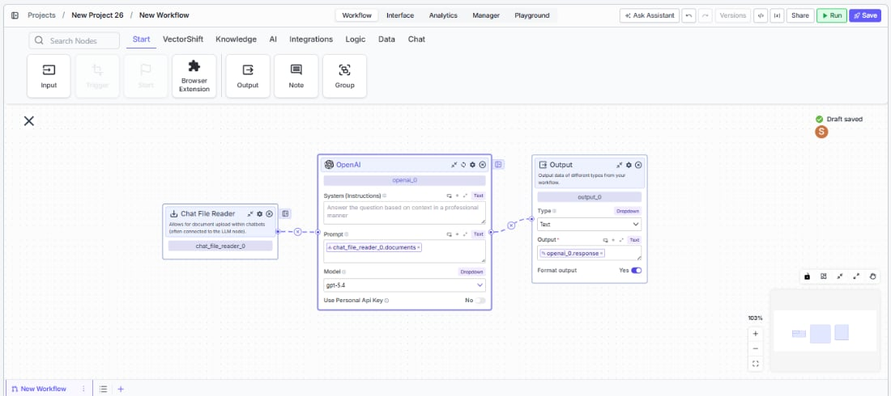
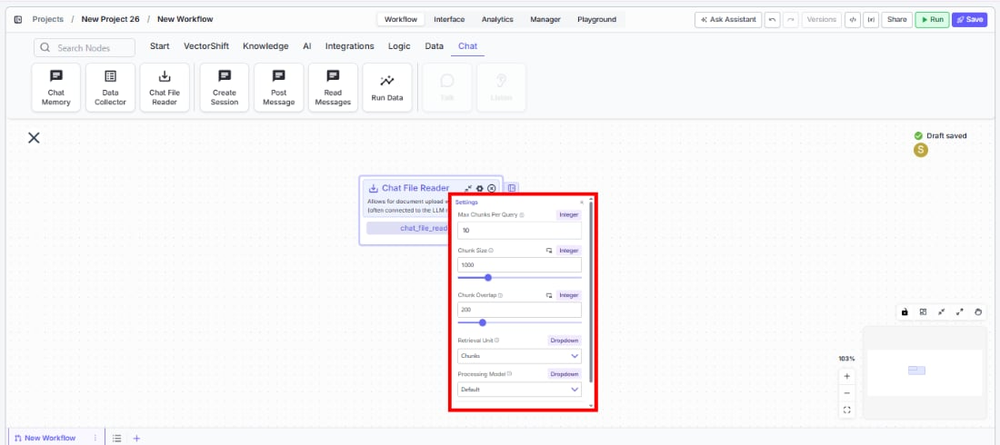
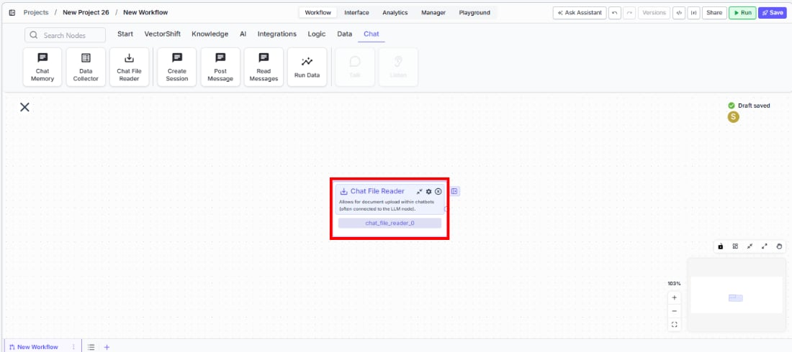

> ## Documentation Index
> Fetch the complete documentation index at: https://docs.vectorshift.ai/llms.txt
> Use this file to discover all available pages before exploring further.

# Chat File Reader

> Allow document uploads within chatbots and process uploaded files into text for downstream use.

<Card title="Use this node from the SDK" icon="code" href="/sdk/pipeline/nodes/chat#chat_file_reader">
  Add it in Python with `pipeline.add(name="...").chat_file_reader(...)`. See the SDK reference.
</Card>

The Chat File Reader node enables document uploads within chatbot interfaces, processing uploaded files into text that downstream nodes can consume. Use it to let end users attach PDFs, Word documents, or other files during a chat conversation — for example, uploading a financial statement for the LLM to analyze, attaching a contract for clause extraction, or submitting an invoice for automated data entry.

## Core Functionality

* Enables file upload capability in deployed chatbot interfaces
* Processes uploaded documents into chunked text using configurable parsing settings
* Supports multiple processing models including Default (standard OCR), Llama Parse (complex documents), Textract (advanced extraction), and Reducto
* Outputs parsed document text as a list that can be connected to LLM or knowledge base nodes

<Frame>
  
</Frame>

<Frame>
  
</Frame>

## Tool Inputs

This node has no user-facing input fields on the canvas. All configuration is done through the Settings panel. Documents are provided by the end user at runtime through the chatbot interface.

## Tool Outputs

* `documents` — List\<Text>. The uploaded file(s) processed into text chunks. Each element contains a chunk of the parsed document content.

***

<Tabs>
  <Tab title="Workflows">
    ### Overview

    In workflows, the Chat File Reader node sits at the front of a chatbot workflow and provides the file upload capability in the deployed chat interface. When an end user uploads a document during a conversation, the node processes it into text chunks and passes them downstream — typically to an LLM node for analysis, summarization, or question answering over the uploaded content.

    ### Use Cases

    * Let users upload financial statements during a chat session and have an LLM summarize key metrics or flag anomalies
    * Accept contract PDFs in a chatbot and extract specific clauses, dates, or party names using downstream extraction nodes
    * Enable invoice uploads for automated line-item extraction and entry into an accounting workflow
    * Allow users to attach compliance documents for real-time regulatory review powered by an LLM
    * Support resume or application uploads in an HR chatbot for automated screening and scoring

    ### How It Works

    #### Step 1: Add the Chat File Reader Node

    In the workflow canvas, click the **Chat** tab in the node palette and click **Chat File Reader**. Drag it onto the canvas.

    <Frame>
      
    </Frame>

    #### Step 2: Connect to an LLM Node

    Connect the `documents` output to an LLM node's input. This is the most common pattern — the LLM receives the parsed document text and can answer questions about it.

    #### Step 3: Configure Settings

    Click the settings icon on the node to open the Settings panel. Adjust the following as needed:

    * **`Max Chunks Per Query`** — The maximum number of chunks to retrieve for each query. Default: `10`.
    * **`Chunk Size`** — The number of tokens per chunk (1 token is approximately 4 characters). Default: `1000`.
    * **`Chunk Overlap`** — The number of overlapping tokens between consecutive chunks. Default: `200`.
    * **`Retrieval Unit`** — How results are returned. Options: `Chunks` (text content only), `Documents` (includes document metadata and relevant snippets), `Pages` (returns complete pages containing relevant content). Default: `Chunks`.
    * **`Processing Model`** — The parsing engine used to extract text from uploaded files. Options: `Default` (standard document parsing and OCR), `Llama Parse` (handles complex features like tables and charts — charged at 0.3 cents per page), `Textract` (most advanced data extraction — charged at 1.5 cents per page), `Reducto`. Default: `Default`.

    #### Step 4: Deploy and Test

    Deploy the workflow as a chatbot. In the chat interface, upload a file and send a message. The Chat File Reader processes the uploaded document and passes the text to connected downstream nodes.

    ### Settings

    | Setting                        | Type     | Default | Description                                                 |
    | ------------------------------ | -------- | ------- | ----------------------------------------------------------- |
    | `Max Chunks Per Query`         | Integer  | 10      | Maximum number of chunks to retrieve per query.             |
    | `Chunk Size`                   | Integer  | 1000    | Tokens per chunk (1 token ≈ 4 characters).                  |
    | `Chunk Overlap`                | Integer  | 200     | Overlapping tokens between consecutive chunks.              |
    | `Retrieval Unit`               | Dropdown | Chunks  | Return format: Chunks, Documents, or Pages.                 |
    | `Processing Model`             | Dropdown | Default | Parsing engine: Default, Llama Parse, Textract, or Reducto. |
    | `Show Success/Failure Outputs` | Toggle   | Off     | Show additional success/failure output handles.             |

    ### Best Practices

    * **Match chunk size to your LLM's context window.** If using a model with a smaller context window, reduce chunk size to ensure each chunk fits comfortably within the token limit.
    * **Increase chunk overlap for dense documents.** For financial reports or legal contracts where context spans paragraph boundaries, increase overlap to 300–400 to avoid splitting critical information across chunks.
    * **Use Llama Parse or Textract for complex documents.** Standard OCR may struggle with tables, charts, or multi-column layouts common in financial statements and annual reports. Llama Parse and Textract handle these better at a per-page cost.
    * **Set retrieval unit to Pages for page-level context.** When users ask questions that require full-page context (e.g., "What's on page 3?"), use the Pages retrieval unit instead of Chunks.
    * **Keep Max Chunks Per Query reasonable.** Setting this too high can overwhelm the LLM with too much context. Start with 10 and adjust based on the complexity of user queries.

    ### Related Templates

    <CardGroup cols={2}>
      <Card title="Customer Support Chatbot" href="https://app.vectorshift.ai/marketplace">
        Handles common customer inquiries and support tickets through conversational AI.
      </Card>

      <Card title="Banking Helpdesk" href="https://app.vectorshift.ai/marketplace">
        Assists banking customers with account inquiries, transactions, and product questions.
      </Card>

      <Card title="Contract AI Analyst" href="https://app.vectorshift.ai/marketplace">
        Analyzes contracts to extract key terms, flag risks, and summarize obligations.
      </Card>

      <Card title="Document Classification Agent" href="https://app.vectorshift.ai/marketplace">
        Automatically categorizes and tags incoming documents based on content and type.
      </Card>
    </CardGroup>

    ### Common Issues

    For help with common configuration issues, see the [Common Issues](/support) page.
  </Tab>
</Tabs>
