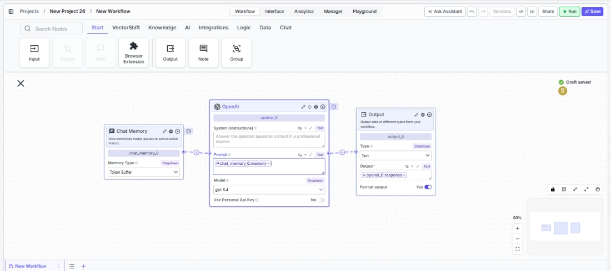
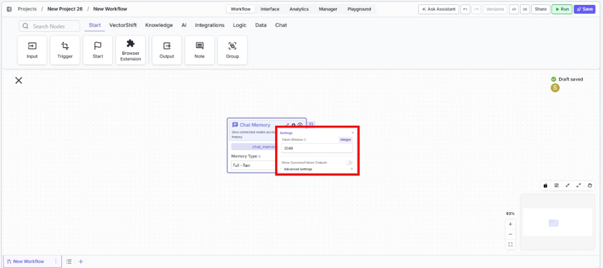
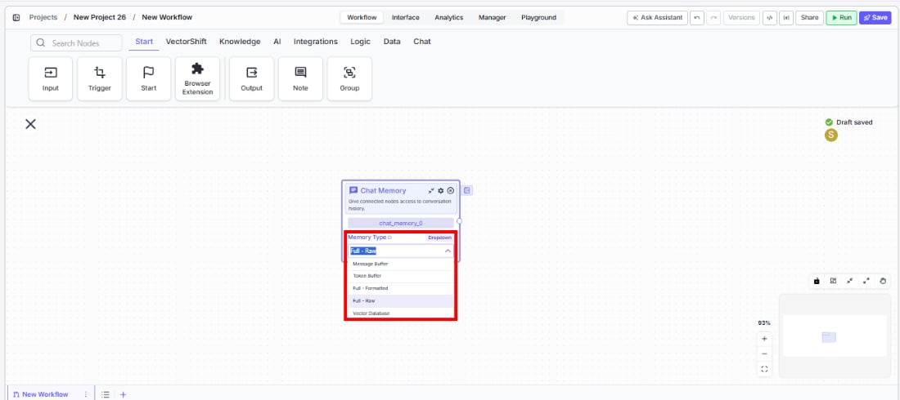
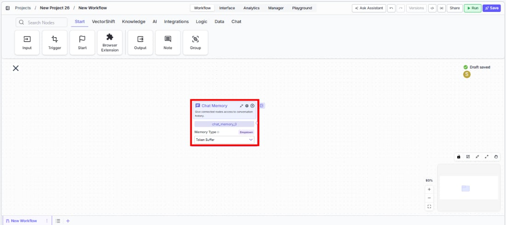

> ## Documentation Index
> Fetch the complete documentation index at: https://docs.vectorshift.ai/llms.txt
> Use this file to discover all available pages before exploring further.

# Chat Memory

> Give connected nodes access to conversation history for multi-turn chatbot interactions.

<Card title="Use this node from the SDK" icon="code" href="/sdk/pipeline/nodes/chat#chat_memory">
  Add it in Python with `pipeline.add(name="...").chat_memory(...)`. See the SDK reference.
</Card>

<Frame>
  
</Frame>

The Chat Memory node gives connected nodes access to conversation history, enabling multi-turn chatbot interactions where the LLM remembers what was said earlier. Use it to build chatbots that maintain context across messages — for example, a financial advisor bot that references earlier questions about a portfolio, a support agent that tracks the issue progression, or a research assistant that builds on prior analysis.

## Core Functionality

* Stores and retrieves conversation history from deployed chatbot sessions
* Supports multiple memory strategies: Token Buffer, Message Buffer, Full - Formatted, Full - Raw, and Vector Database
* Outputs formatted conversation history as text that LLM nodes can consume as context
* Configurable memory window to control how much history is retained

<Frame>
  
</Frame>

## Tool Inputs

* `Memory Type` — Dropdown. Default: `Token Buffer`. The strategy used to store and retrieve conversation history. Options:
  * `Message Buffer` — Returns a set number of previous consecutive messages
  * `Token Buffer` — Returns previous consecutive messages up to a token limit
  * `Full - Formatted` — Returns all previous chat history as formatted text
  * `Full - Raw` — Returns all previous chat history as a structured list with type and message fields
  * `Vector Database` — Stores all messages in a vector database and returns the most similar messages based on the current user message
* `Token Window` — Integer. The memory window size. Default varies by memory type: `2048` for Token Buffer, `10` for Message Buffer, `20` for Vector Database. Not shown for Full - Formatted or Full - Raw.

<Frame>
  
</Frame>

## Tool Outputs

* `memory` — Text. The conversation history in the format of the selected memory type.

***

<Tabs>
  <Tab title="Workflows">
    ### Overview

    In workflows, the Chat Memory node connects to an LLM node to provide conversation context. When deployed as a chatbot, the node captures each exchange and feeds the relevant history back to the LLM on every turn — so the model can reference previous messages, follow up on earlier topics, and maintain a coherent conversation. The memory type you choose controls how history is formatted and how much is retained.

    ### Use Cases

    * Build a financial advisor chatbot that remembers earlier questions about portfolio allocations and references them in follow-up answers
    * Create a customer support bot that tracks the full issue progression across multiple messages without losing context
    * Power an onboarding assistant that guides users through a multi-step process and recalls answers from earlier steps
    * Enable a research chatbot that builds on prior analysis, referencing data points mentioned in previous turns
    * Implement a compliance Q\&A bot that remembers which regulations have already been discussed to avoid repetition

    ### How It Works

    #### Step 1: Add the Chat Memory Node

    In the workflow canvas, click the **Chat** tab in the node palette and click **Chat Memory**. Drag it onto the canvas.

    <Frame>
      
    </Frame>

    #### Step 2: Select a Memory Type

    Use the `Memory Type` dropdown on the node to choose how conversation history is stored and retrieved:

    * **Token Buffer** (default) — Best for most use cases. Keeps as many recent messages as fit within the token window.
    * **Message Buffer** — Returns a fixed number of recent messages. Use when you want a predictable history length.
    * **Full - Formatted** — Returns the entire conversation history. Use for short conversations where you want full context.
    * **Full - Raw** — Returns history as a structured list. Use when downstream processing needs raw message objects.
    * **Vector Database** — Returns semantically similar messages instead of recent ones. Use for long conversations where only relevant context matters.

    #### Step 3: Configure the Memory Window

    Click the settings icon to open the Settings panel. Adjust `Token Window` based on your memory type:

    * For **Token Buffer**: set the maximum number of tokens (default: 2048). The node returns messages from most recent backward until adding another would exceed this limit.
    * For **Message Buffer**: set the number of messages to keep (default: 10).
    * For **Vector Database**: set the number of similar messages to retrieve (default: 20).
    * **Full - Formatted** and **Full - Raw** do not use a memory window — they return everything.

    #### Step 4: Connect to an LLM Node

    Connect the `memory` output to the LLM node's `System` or `Chat History` input. The LLM receives the formatted conversation history and uses it as context for generating responses.

    #### Step 5: Deploy and Test

    Deploy the workflow as a chatbot. Send multiple messages and verify that the LLM's responses reflect awareness of previous turns.

    ### Settings

    | Setting                        | Type     | Default        | Description                                                                               |
    | ------------------------------ | -------- | -------------- | ----------------------------------------------------------------------------------------- |
    | `Memory Type`                  | Dropdown | Token Buffer   | The strategy for storing and retrieving conversation history.                             |
    | `Token Window`                 | Integer  | Varies by type | Memory window size. 2048 for Token Buffer, 10 for Message Buffer, 20 for Vector Database. |
    | `Show Success/Failure Outputs` | Toggle   | Off            | Show additional success/failure output handles.                                           |

    ### Best Practices

    * **Use Token Buffer for most chatbots.** It automatically manages context size and prevents exceeding LLM token limits — ideal for financial advisor or support bots with unpredictable conversation lengths.
    * **Match Token Window to your LLM's context budget.** If your LLM has a 4096-token context and you need room for the system prompt and current message, set the memory window to 2048 or less.
    * **Use Vector Database for long-running sessions.** In conversations that may span dozens of turns (e.g., ongoing compliance reviews), Vector Database retrieves only the most relevant prior messages instead of recent ones.
    * **Use Full - Raw when you need structured parsing.** If downstream nodes need to process individual messages (e.g., counting user questions or extracting specific turns), Full - Raw provides a parseable list format.
    * **Avoid Full modes for long conversations.** Full - Formatted and Full - Raw return the entire history. For conversations that may grow long, this can exceed LLM context limits — use Token Buffer or Message Buffer instead.

    ### Related Templates

    <CardGroup cols={2}>
      <Card title="Customer Support Chatbot" href="https://app.vectorshift.ai/marketplace">
        Handles common customer inquiries and support tickets through conversational AI.
      </Card>

      <Card title="Banking Helpdesk" href="https://app.vectorshift.ai/marketplace">
        Assists banking customers with account inquiries, transactions, and product questions.
      </Card>

      <Card title="Investor Helpdesk" href="https://app.vectorshift.ai/marketplace">
        Handles investor inquiries related to portfolios, statements, and fund performance.
      </Card>

      <Card title="Company Policy Compliance Chatbot" href="https://app.vectorshift.ai/marketplace">
        Answers employee questions about internal policies and flags potential compliance issues.
      </Card>
    </CardGroup>

    ### Common Issues

    For help with common configuration issues, see the [Common Issues](/support) page.
  </Tab>
</Tabs>
