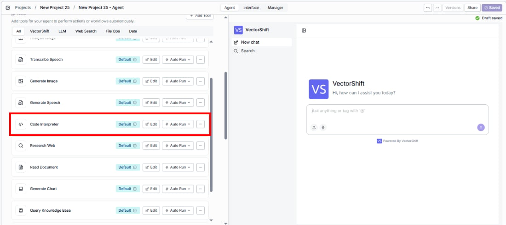
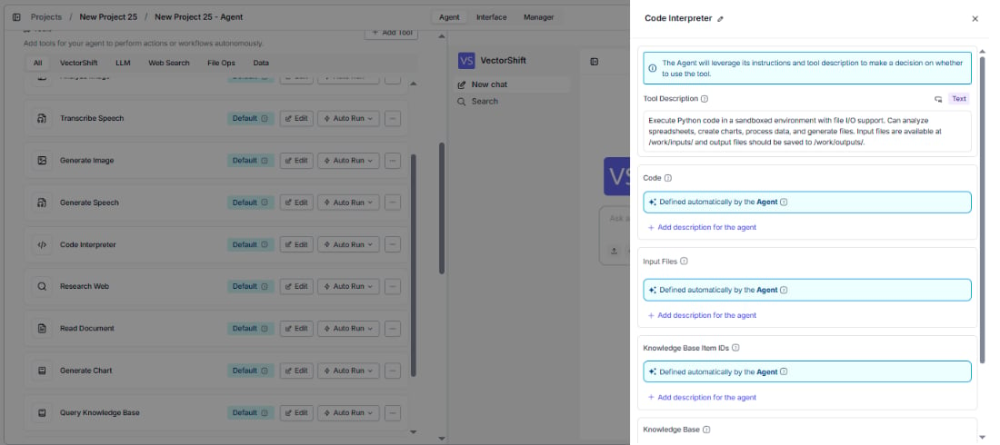
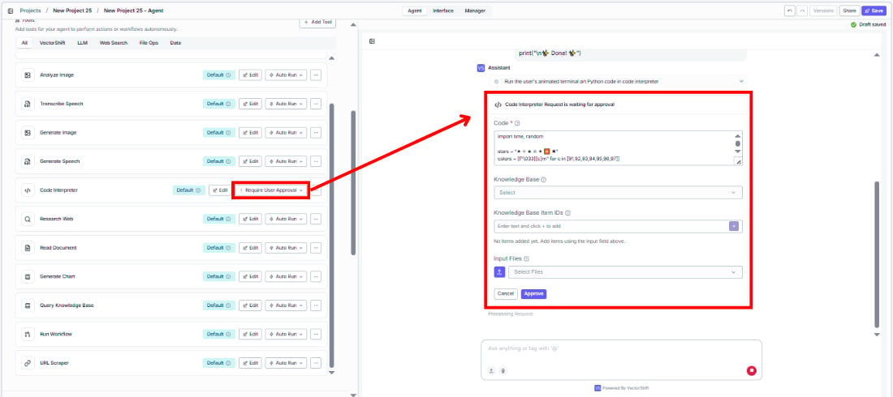
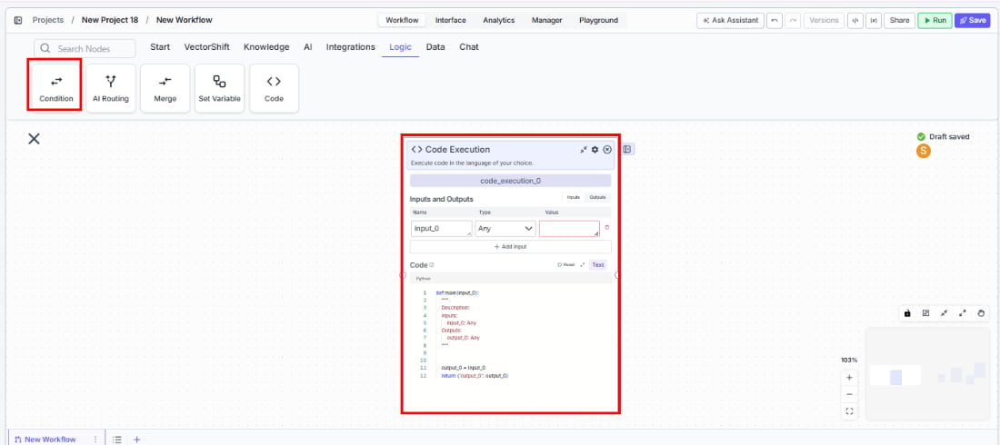
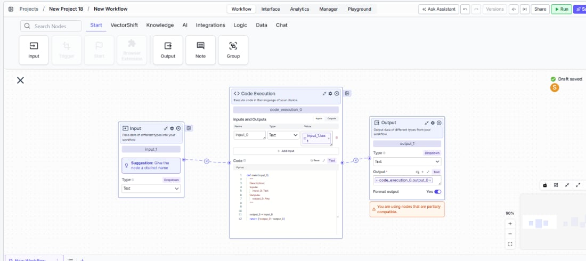

> ## Documentation Index
> Fetch the complete documentation index at: https://docs.vectorshift.ai/llms.txt
> Use this file to discover all available pages before exploring further.

# Code

> Execute custom Python or JavaScript code with configurable inputs and outputs.

<Card title="Use this node from the SDK" icon="code" href="/sdk/pipeline/nodes/logic#code_execution">
  Add it in Python with `pipeline.add(name="...").code_execution(...)`. See the SDK reference.
</Card>

The Code node lets you run custom Python or JavaScript code directly inside your workflow. Define your own inputs and outputs, write transformation logic, call libraries, and return structured results — all without leaving VectorShift. Use it to apply custom business logic to financial data, transform API responses into the exact format you need, or give an agent the ability to compute values on the fly during a conversation.

## Core Functionality

* Executes custom Python or JavaScript code within a workflow
* Supports user-defined inputs and outputs with configurable names and types
* Includes a built-in code editor with boilerplate templates for each language
* Available input/output types include Text, File, Image, and more
* Works in both **Workflows** as a canvas node and **Agents** as the Code tool

## Tool Inputs

* `Input Name` — A user-defined input parameter. You can add multiple inputs by clicking **+ Add**. Each input has a configurable name (e.g., `input_1`) and a type selected from a dropdown (e.g., `Text`, `File`, `Image`).
* `Code` <span style={{ color: 'red' }}>\*</span> — The Python or JavaScript code to execute. Required. The code editor is pre-populated with boilerplate that shows how to access inputs and set the output variable.
* `Language` — Toggle between `Python` and `JavaScript`. The code editor template updates to match the selected language.

<span style={{ color: 'red' }}>\*</span> *Required field*

## Tool Outputs

* `Output Name` — A user-defined output parameter. You can add multiple outputs by clicking **+ Add**. Each output has a configurable name (e.g., `output_1`) and a type selected from a dropdown (e.g., `Text`, `File`, `Image`). The code must assign a value to each defined output variable.

***

<Tabs>
  <Tab title="Agents">
    ### Overview

    In agents, the Code tool lets the agent execute custom Python or JavaScript code during a conversation. You define the inputs, outputs, and code logic — the agent then invokes this tool when appropriate, passing in values from conversation context. Use it when you need the agent to perform calculations, data transformations, or any custom logic that goes beyond what built-in tools offer.

    ### Use Cases

    * Calculate compound interest or amortization schedules from user-provided loan parameters
    * Parse and transform raw JSON API responses into human-readable financial summaries
    * Run custom validation logic on portfolio allocation percentages before proceeding
    * Convert between currencies or units using custom formulas with live rates
    * Generate formatted reports by processing structured data from upstream tools
    * Compute weighted averages or custom scoring across multiple data points

    ### How It Works

    #### Step 1: Add the Code Tool

    From the agent editor, click **+ Add Tool**. Select the **Logic** category and click **+ Add** next to **Code**.

    <Frame>
      
    </Frame>

    #### Step 2: Open the Tool Configuration

    Click **Edit** on the Code tool in the tool list to open its configuration panel.

    <Frame>
      
    </Frame>

    #### Step 3: Select the Language

    Choose between **Python** and **JavaScript** using the language toggle at the top of the configuration panel. The code editor template updates automatically.

    #### Step 4: Define Inputs

    Add input parameters that your code will receive. For each input:

    * Set the **Input Name** (e.g., `input_1`, `principal`, `rate`).
    * Select the **Input Type** from the dropdown (e.g., `Text`).
    * Click **+ Add Input** to add additional inputs.

    Each input field can be filled automatically by the agent based on conversation context, or locked to a fixed value. Click the toggle icon next to a field to switch between these modes.

    #### Step 5: Write Your Code

    Write your logic in the code editor. The default template shows how to access inputs as variables and how to assign values to the output variable:

    **Python:**

    ```python theme={"languages":{}}
    # Access your inputs as variables (e.g., input_1)
    # Assign your result to the output variable
    output = input_1
    ```

    **JavaScript:**

    ```javascript theme={"languages":{}}
    // Access your inputs as variables (e.g., input_1)
    // Assign your result to the output variable
    output = input_1;
    ```

    #### Step 6: Define Outputs

    Add output parameters that your code will return. For each output:

    * Set the **Output Name** (e.g., `output_1`, `result`).
    * Select the **Output Type** from the dropdown (e.g., `Text`).
    * Click **+ Add Output** to add additional outputs.

    Your code must assign a value to each output variable you define.

    #### Step 7: Write a Tool Description

    The **Tool Description** tells the agent when and how to use this tool. Customize it with specifics — for example: *"Use this tool to calculate compound interest. The user will provide the principal, rate, and number of periods."*

    #### Step 8: Set Auto Run Behavior

    Click the **Auto Run** dropdown to control execution:

    * **Auto Run** — The agent runs the code automatically without asking for confirmation.
    * **Require User Approval** — The agent pauses and asks the user before running the code.
    * **Let Agent Decide** — The agent uses its judgment to decide whether to confirm first.

    <Frame>
      
    </Frame>

    #### Step 9: Test the Tool

    In the agent chat panel, ask the agent to perform a calculation or transformation. The agent invokes the Code tool and returns the result. A **Code Interpreter** panel appears in the sidebar showing the executed code and its output.

    ### Settings

    | Setting       | Type        | Default              | Description                                                |
    | ------------- | ----------- | -------------------- | ---------------------------------------------------------- |
    | `Language`    | Toggle      | Python               | Python or JavaScript.                                      |
    | `Input Name`  | Text        | input\_1             | Name of each input parameter. Add more with + Add Input.   |
    | `Input Type`  | Dropdown    | Text                 | Type of each input (Text, File, Image, etc.).              |
    | `Code`        | Code editor | Boilerplate template | The code to execute. Required.                             |
    | `Output Name` | Text        | output\_1            | Name of each output parameter. Add more with + Add Output. |
    | `Output Type` | Dropdown    | Text                 | Type of each output (Text, File, Image, etc.).             |

    ### Best Practices

    * **Name inputs descriptively.** Use meaningful names like `principal`, `rate`, `periods` instead of `input_1`, `input_2` — this helps the agent understand what values to pass.
    * **Write a detailed tool description.** Explain what the code does, what inputs it expects, and what it returns. This guides the agent to invoke it correctly.
    * **Require user approval for irreversible operations.** If the code modifies data or calls external services, set Auto Run to **Require User Approval** so users can review before execution.
    * **Keep code focused.** Write code that does one thing well. For complex multi-step logic, use multiple Code tools chained together.
    * **Handle edge cases in the code.** Add input validation and error handling within your code to avoid silent failures.

    ### Related Templates

    <CardGroup cols={2}>
      <Card title="Snowflake Analytics Agent" href="https://app.vectorshift.ai/marketplace">
        Queries and interprets Snowflake data warehouse data to deliver actionable business insights.
      </Card>

      <Card title="Earnings Call Insight and Sentiment Analyzer" href="https://app.vectorshift.ai/marketplace">
        Analyzes earnings call transcripts for sentiment, key themes, and forward-looking signals.
      </Card>

      <Card title="FX Arbitrage Research Agent" href="https://app.vectorshift.ai/marketplace">
        Identifies and analyzes foreign exchange arbitrage opportunities across markets and instruments.
      </Card>

      <Card title="Capital Account Statements Agent" href="https://app.vectorshift.ai/marketplace">
        Processes and validates capital account statements for accuracy and investor reporting.
      </Card>
    </CardGroup>

    ### Common Issues

    For help with common configuration issues, see the [Common Issues](/support) page.
  </Tab>

  <Tab title="Workflows">
    ### Overview

    In workflows, the Code Execution node lets you write and run custom Python or JavaScript code on the canvas. Define typed inputs connected from upstream nodes, write your transformation logic, and output structured results to downstream nodes. Use it for any custom processing step — data transformations, calculations, format conversions, or business logic that isn't covered by built-in nodes.

    ### Use Cases

    * Transform raw API response JSON into a structured format for downstream processing
    * Calculate financial metrics (IRR, NPV, CAGR) from extracted spreadsheet values
    * Apply custom data validation rules before writing results to a database or file
    * Parse and reformat dates, currencies, or account numbers across different standards
    * Merge and deduplicate data from multiple upstream sources using custom logic

    ### How It Works

    #### Step 1: Add the Code Execution Node

    In the workflow canvas, click the **Logic** tab in the node palette and click **Code**. Drag it onto the canvas.

    <Frame>
      
    </Frame>

    #### Step 2: Select the Language

    Use the language toggle at the top of the node to switch between **Python** and **JavaScript**. The code editor template updates to match.

    #### Step 3: Define Inputs

    Each input has a name and a type:

    * **Name** — Type a name in the text field (default: `input_1`). This becomes the variable name in your code.
    * **Type** — Select from the dropdown: `Text`, `File`, `Image`, and more.
    * Click **+ Add** to add more inputs. Click the red **−** button to remove an input.

    Connect each input's left-side handle to the output of an upstream node.

    #### Step 4: Write Your Code

    The code editor is pre-populated with boilerplate showing how to access inputs and set the output:

    ```python theme={"languages":{}}
    # Access your inputs as variables (e.g., input_1)
    # Use the 'output' variable to set the result
    output = input_1
    ```

    Replace the boilerplate with your custom logic. Your code can access all defined inputs as variables by name.

    #### Step 5: Define Outputs

    Each output has a name and a type:

    * **Name** — Type a name in the text field (default: `output_1`). Your code must assign a value to this variable.
    * **Type** — Select from the dropdown to match the data your code returns.
    * Click **+ Add** to add more outputs. Click the red **−** button to remove one.

    Connect each output's right-side handle to downstream nodes.

    <Frame>
      
    </Frame>

    #### Step 6: Test the Workflow

    Click **Run** to execute the workflow. The Code Execution node runs your code with the upstream input values and passes the output to downstream nodes.

    ### Settings

    | Setting       | Type        | Default              | Description                                         |
    | ------------- | ----------- | -------------------- | --------------------------------------------------- |
    | `Language`    | Toggle      | Python               | Python or JavaScript.                               |
    | `Input Name`  | Text        | input\_1             | Name of each input parameter. Add more with + Add.  |
    | `Input Type`  | Dropdown    | Text                 | Type of each input (Text, File, Image, etc.).       |
    | `Code`        | Code editor | Boilerplate template | The Python or JavaScript code to execute. Required. |
    | `Output Name` | Text        | output\_1            | Name of each output parameter. Add more with + Add. |
    | `Output Type` | Dropdown    | Text                 | Type of each output (Text, File, Image, etc.).      |

    ### Best Practices

    * **Match input/output types to connected nodes.** Ensure the types you select for inputs and outputs match what upstream nodes produce and downstream nodes expect. A type mismatch causes runtime errors.
    * **Use descriptive variable names.** Rename `input_1` to something meaningful like `raw_json` or `account_balance`. This makes the code more readable and the node connections easier to understand on the canvas.
    * **Test with small inputs first.** Before connecting a large data workflow, test your code with a simple hardcoded input to verify the logic works correctly.
    * **Return the correct output variable.** Your code must assign a value to the exact variable name defined in the output field. If your output is named `result`, your code must set `result = ...`.
    * **Keep external dependencies minimal.** Stick to standard library functions when possible. If your code requires external packages, verify they are available in the VectorShift execution environment.

    ### Related Templates

    <CardGroup cols={2}>
      <Card title="Snowflake Analytics Agent" href="https://app.vectorshift.ai/marketplace">
        Queries and interprets Snowflake data warehouse data to deliver actionable business insights.
      </Card>

      <Card title="Earnings Call Insight and Sentiment Analyzer" href="https://app.vectorshift.ai/marketplace">
        Analyzes earnings call transcripts for sentiment, key themes, and forward-looking signals.
      </Card>

      <Card title="FX Arbitrage Research Agent" href="https://app.vectorshift.ai/marketplace">
        Identifies and analyzes foreign exchange arbitrage opportunities across markets and instruments.
      </Card>

      <Card title="Capital Account Statements Agent" href="https://app.vectorshift.ai/marketplace">
        Processes and validates capital account statements for accuracy and investor reporting.
      </Card>
    </CardGroup>

    ### Common Issues

    For help with common configuration issues, see the [Common Issues](/support) page.
  </Tab>
</Tabs>
