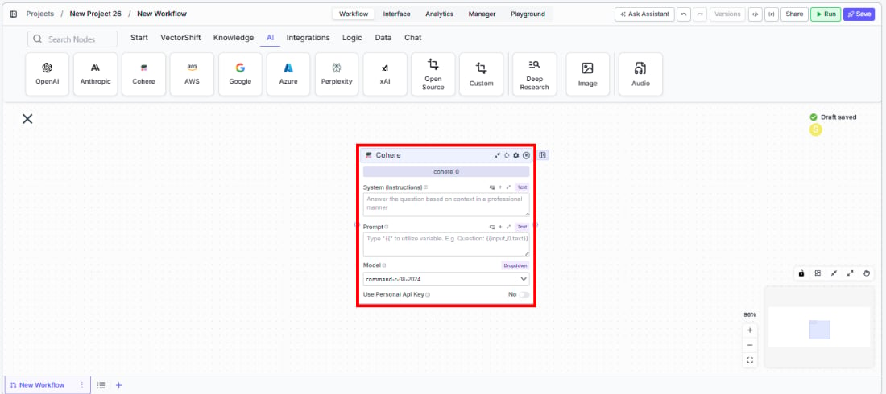
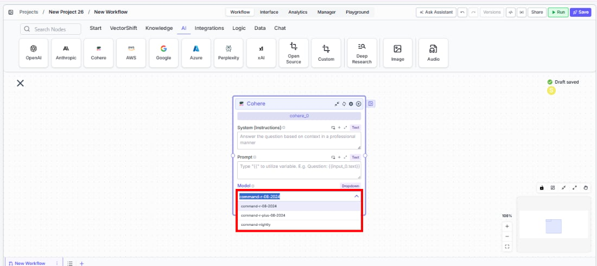
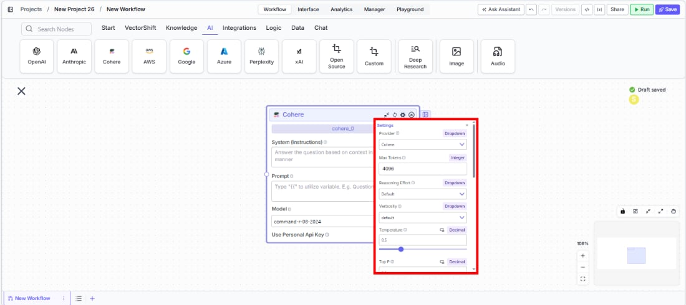
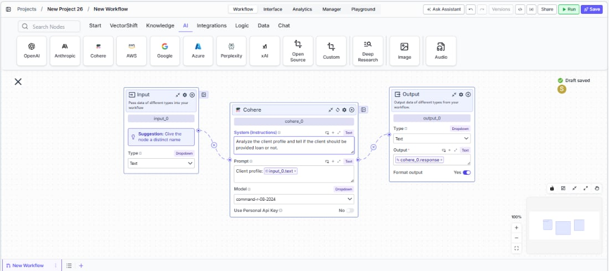

> ## Documentation Index
> Fetch the complete documentation index at: https://docs.vectorshift.ai/llms.txt
> Use this file to discover all available pages before exploring further.

# Cohere LLM

> Generate text responses using Cohere's Command models in your workflows.

<Card title="Use this node from the SDK" icon="code" href="/sdk/pipeline/nodes/llms#llm">
  Add it in Python with `pipeline.add(name="...").llm(...)`. See the SDK reference.
</Card>

The Cohere LLM node connects your workflows to Cohere's Command family of language models. Use it to generate text responses, summarize documents, or produce structured outputs — for example, condensing lengthy compliance reports into executive summaries, classifying transaction descriptions by category, or generating natural-language explanations of quantitative model outputs.

## Core Functionality

* Generate text completions and conversational responses using Cohere Command models
* Process system instructions and dynamic prompts with variable interpolation
* Stream responses in real time for long-running generations
* Return structured JSON output with optional schema enforcement
* Track token usage and credit consumption per run
* Apply content moderation, PII detection, and safety guardrails
* Retry failed executions automatically with configurable intervals

## Tool Inputs

* `System Instructions` — (String) Instructions that guide the model's behavior, tone, and how it should use data provided in the prompt
* `Prompt` — (String) The data sent to the model. Type `{{` to open the variable builder and reference outputs from other nodes
* `Model` \* — (Enum (Dropdown), default: `command-r-06-2024`) Select from available Cohere models. Click **Dropdown** to view all options
* `Use Personal Api Key` — (Boolean, default: `No`) Toggle to use your own Cohere API key instead of VectorShift's shared key
* `Api Key` — (String) Your Cohere API key. Required when `Use Personal Api Key` is enabled — the node will show a validation error if left blank
* `JSON Schema` — (String) JSON schema to enforce structured output format. Only visible when `JSON Response` is enabled in the settings panel

\* indicates a required field

## Tool Outputs

* `response` — (String (or Stream\<String> when streaming)) The generated text response from the model
* `prompt_response` — (String) The combined prompt and response content
* `tokens_used` — (Integer) Total number of tokens consumed (input + output)
* `input_tokens` — (Integer) Number of input tokens sent to the model
* `output_tokens` — (Integer) Number of output tokens generated by the model
* `credits_used` — (Decimal) VectorShift AI credits consumed for this run

<Tabs>
  <Tab title="Workflows">
    ## Overview

    The Cohere LLM node in workflows lets you place a Command model directly on the canvas, wire inputs and outputs to other nodes, and configure model behavior through the settings panel. Cohere models are well-suited for retrieval-augmented generation (RAG) and enterprise search workflows.

    ## Use Cases

    * **Compliance report summarization** — Condense lengthy regulatory filings or audit reports into concise executive summaries, highlighting key findings and action items.
    * **Transaction categorization** — Classify financial transactions by type, merchant category, or risk level using natural language understanding.
    * **Client Q\&A from documents** — Build knowledge-grounded chatbots that answer client questions about portfolio performance, fund prospectuses, or policy documents.
    * **Data extraction from filings** — Extract structured fields from unstructured financial documents using JSON mode — for example, pulling key terms from loan agreements.
    * **Multilingual financial content** — Generate or translate financial communications across languages for global client bases using Cohere's multilingual capabilities.

    ## How It Works

    1. **Add the node to your workflow.** From the toolbar, open the **AI** category and drag the **Cohere** node onto the canvas.

    <Frame>
      
    </Frame>

    2. **Write your System Instructions.** Enter instructions in the `System Instructions` field to define the model's behavior, tone, and how it should use any data provided in the prompt.

    3. **Configure the Prompt.** In the `Prompt` field, type `{{` to open the variable builder and reference outputs from upstream nodes.

    4. **Select a model.** Use the `Model` dropdown to choose a Cohere model. Available options include `command-r-06-2024`, `command-r-08-2024`, `command-r-plus-08-2024`, and `command-nightly`.

    <Frame>
      
    </Frame>

    5. **Use a personal API key (optional).** Toggle `Use Personal Api Key` to **Yes** to use your own Cohere API key. An `Api Key` field appears — paste your key there. The node will display a validation error ("Api Key field is Required!") if the field is left blank.

    6. **Open settings.** Click the **gear icon** (⚙) on the node to open the settings panel, where you can configure token limits, temperature, retry behavior, safety features, and more.

    <Frame>
      
    </Frame>

    7. **Connect outputs.** Click the **Outputs** button to open the outputs panel. Wire the `response` output to downstream nodes. Use `tokens_used`, `input_tokens`, `output_tokens`, and `credits_used` for monitoring.

    <Frame>
      
    </Frame>

    8. **Run your workflow.** Execute the workflow. The Cohere node processes its inputs and returns the generated response along with usage metrics.

    ## Settings

    All settings below are accessed via the **gear icon** (⚙) on the node.

    | Setting                     | Type     | Default | Description                                                                                                                              |
    | --------------------------- | -------- | ------- | ---------------------------------------------------------------------------------------------------------------------------------------- |
    | `Provider`                  | Dropdown | Cohere  | The LLM provider.                                                                                                                        |
    | `Max Tokens`                | Integer  | 64096   | Maximum number of input + output tokens the model will process per run.                                                                  |
    | `Reasoning Effort`          | Dropdown | Default | Controls the depth of reasoning the model applies to its response.                                                                       |
    | `Verbosity`                 | Dropdown | Default | Controls the verbosity of model responses.                                                                                               |
    | `Temperature`               | Float    | 0.5     | Controls response creativity. Higher values produce more diverse outputs; lower values produce more deterministic responses. Range: 0–1. |
    | `Top P`                     | Float    | 0.5     | Controls token sampling diversity. Higher values consider more tokens at each generation step. Range: 0–1.                               |
    | `Stream`                    | Boolean  | Off     | Stream responses token-by-token instead of returning the full response at once.                                                          |
    | `JSON Response`             | Boolean  | Off     | Return output as structured JSON. When enabled, a `JSON Schema` input appears for optional schema enforcement.                           |
    | `Show Sources`              | Boolean  | Off     | Display source documents used for the response. Useful when combining with knowledge base inputs.                                        |
    | `Toxic Input Filtration`    | Boolean  | Off     | Filter toxic input content. If the model receives toxic content, it responds with a respectful message instead.                          |
    | `Safe Context Token Window` | Boolean  | Off     | Automatically reduce context to fit within the model's maximum context window.                                                           |
    | `Retry On Failure`          | Boolean  | Off     | Enable automatic retries when execution fails.                                                                                           |
    | `Max # of re-try`           | Integer  | —       | Maximum number of retry attempts. Visible when `Retry On Failure` is enabled.                                                            |
    | `Max Interval b/w re-try`   | Integer  | —       | Interval in milliseconds between retry attempts.                                                                                         |
    | **PII Detection**           |          |         |                                                                                                                                          |
    | `Name`                      | Boolean  | Off     | Detect and redact personal names from input before sending to the model.                                                                 |
    | `Email`                     | Boolean  | Off     | Detect and redact email addresses from input.                                                                                            |
    | `Phone`                     | Boolean  | Off     | Detect and redact phone numbers from input.                                                                                              |
    | `SSN`                       | Boolean  | Off     | Detect and redact Social Security numbers from input.                                                                                    |
    | `Credit Card Info`          | Boolean  | Off     | Detect and redact credit card numbers from input.                                                                                        |
    | `Show Guardrail Status`     | Dropdown | —       | Controls whether guardrail status is included in the output.                                                                             |

    ## Best Practices

    * **Leverage Cohere for RAG workflows.** Cohere Command models are optimized for retrieval-augmented generation — pair the Cohere node with a Knowledge Base Reader for accurate, grounded responses to financial queries.
    * **Use JSON mode for structured extraction.** When pulling data from financial documents, enable `JSON Response` and provide a schema to ensure consistent output across runs.
    * **Monitor token usage.** Connect `tokens_used` and `credits_used` outputs to tracking nodes for cost visibility, especially when processing large document batches.
    * **Enable Safe Context Token Window for variable-length inputs.** Prevents token-limit errors when processing documents of unpredictable size.
    * **Apply PII detection for sensitive data.** Enable relevant PII toggles (including SSN) when processing client financial records or personal information.
    * **Use streaming for interactive interfaces.** Enable streaming when the Cohere node powers a client-facing chatbot for a more responsive user experience.

    ## Common Issues

    For troubleshooting common issues with this node, see the [Common Issues](/support) documentation.
  </Tab>
</Tabs>
