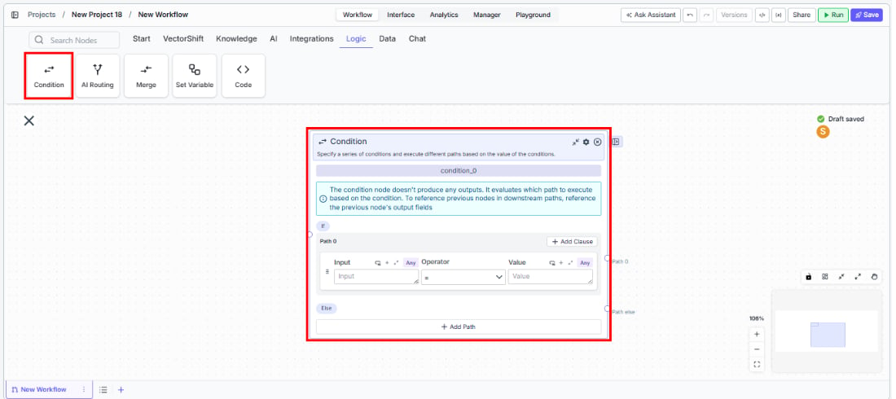
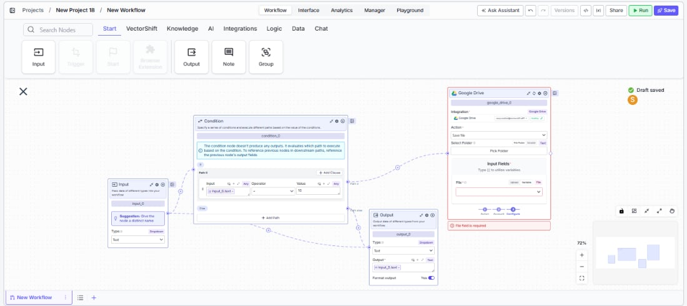

> ## Documentation Index
> Fetch the complete documentation index at: https://docs.vectorshift.ai/llms.txt
> Use this file to discover all available pages before exploring further.

# Condition

> Branch workflow execution based on conditional logic with support for multiple paths and operators.

<Card title="Use this node from the SDK" icon="code" href="/sdk/pipeline/nodes/logic#condition">
  Add it in Python with `pipeline.add(name="...").condition(...)`. See the SDK reference.
</Card>

The Condition node lets you branch your workflow into different execution paths based on conditional logic. Define rules using operators like "contains," "equals," "is empty," and more — and route data to the correct downstream path based on whether those conditions are met. Use it to build decision trees in financial workflows, filter records by status, or apply different processing logic depending on input values.

## Core Functionality

* Evaluates one or more conditions per path using configurable operators
* Supports multiple paths — each path can have its own set of conditions
* Conditions within a path can be combined with logical AND
* Includes a default/fallback path for inputs that don't match any condition
* Does not produce data outputs — downstream nodes reference previous nodes' output fields directly

## Tool Inputs

* `Input` \* — The data source to evaluate. Select from a dropdown of available upstream node outputs. Required.
* `Key` — The specific key or field within the input to evaluate. Text. Use this when the input is structured data (e.g., JSON) and you need to check a specific property.
* `Operator` \* — The comparison operator to apply. Required. Dropdown with the following options:
  * `Check contains` — Input contains the specified value
  * `Check does not contain` — Input does not contain the specified value
  * `Check does not equal` — Input does not equal the specified value
  * `Check does not begin` — Input does not begin with the specified value
  * `Check does not end with` — Input does not end with the specified value
  * `Check is less than or equal` — Input is less than or equal to the value
  * `Check is less than` — Input is less than the value
  * `is True` — Input evaluates to true
  * `is False` — Input evaluates to false
  * `is Empty` — Input is empty or null
  * `is not Empty` — Input is not empty
  * `List does not contain` — A list input does not contain the specified value
  * `List contains list` — A list input contains all items in the specified list
* `Value` — The value to compare against. Text. Not required for unary operators (`is True`, `is False`, `is Empty`, `is not Empty`).

\* *Required field*

## Tool Outputs

The Condition node does not produce data outputs. It evaluates which path to execute based on the conditions. To access data in downstream nodes, reference the output fields of nodes that ran before the Condition node.

***

<Tabs>
  <Tab title="Workflows">
    ### Overview

    In workflows, the Condition node sits between upstream data-producing nodes and multiple downstream branches. It evaluates each path's conditions in order and activates the first matching path. If no path matches, the default path executes. Use it to implement if/else logic — for example, routing approved transactions to one branch and flagged transactions to another.

    ### Use Cases

    * Route transactions above a threshold to a review workflow and below to auto-approval
    * Filter incoming documents by type (invoice vs. receipt vs. statement) for different extraction workflows
    * Check whether an API response contains an error field and branch to error handling
    * Validate that required fields are not empty before proceeding with data processing
    * Branch based on customer tier (premium vs. standard) to apply different pricing logic
    * Direct flagged compliance records to manual review and clean records to automated processing

    ### How It Works

    #### Step 1: Add the Condition Node

    In the workflow canvas, click the **Logic** tab in the node palette and click **Condition**. Drag it onto the canvas.

    <Frame>
      
    </Frame>

    #### Step 2: Configure Path 0

    Path 0 is the first condition path. Each row in a path defines one condition:

    1. Select an **Input** from the dropdown — this connects to an upstream node's output.
    2. Optionally enter a **Key** if the input is structured data and you want to check a specific field.
    3. Choose an **Operator** from the dropdown (e.g., `Check contains`, `is Empty`, `Check is less than`).
    4. Enter a **Value** to compare against (not needed for unary operators like `is True` or `is Empty`).

    To add more conditions within the same path, click **And** to add another condition row. All conditions in a path must be true for the path to activate (logical AND).

    Click **+ Add Clause** to add another condition row to the current path.

    #### Step 3: Configure Additional Paths

    **Path 1** serves as the default/fallback path (marked with **+ Not / Default**). It activates when no other path's conditions are met. You can also add conditions to Path 1 to make it conditional rather than a catch-all.

    Click **+ Add Path** at the bottom to add more paths (Path 2, Path 3, etc.). Each additional path gets its own set of condition rows.

    #### Step 4: Select Operators

    Click the **Operator** dropdown to see all available comparison operators. The full list includes string checks (contains, begins, ends), numeric comparisons (less than, less than or equal), boolean checks (is True, is False), emptiness checks (is Empty, is not Empty), and list operations (List does not contain, List contains list).

    #### Step 5: Connect Downstream Nodes

    Each path creates a separate output handle on the right side of the node. Connect each handle to the downstream nodes that should execute for that path. Downstream nodes reference the output fields of nodes that ran *before* the Condition node.

    <Frame>
      
    </Frame>

    #### Step 6: Run the Workflow

    Click **Run** at the bottom of the node to test. The Condition node evaluates each path's conditions in order and activates the first match.

    ### Settings

    | Setting        | Type     | Default | Description                                                      |
    | -------------- | -------- | ------- | ---------------------------------------------------------------- |
    | `Input`        | Dropdown | —       | The upstream node output to evaluate. Required.                  |
    | `Key`          | Text     | —       | The specific field within structured input to check.             |
    | `Operator`     | Dropdown | —       | The comparison operator. Required. See full list in Tool Inputs. |
    | `Value`        | Text     | —       | The value to compare against. Not needed for unary operators.    |
    | `And`          | Button   | —       | Adds a logical AND condition within the same path.               |
    | `+ Add Clause` | Button   | —       | Adds another condition row to the current path.                  |
    | `+ Add Path`   | Button   | —       | Adds a new path with its own conditions.                         |

    ### Best Practices

    * **Use Path 1 as a catch-all.** Keep the default path (Path 1 / Not / Default) as a fallback for any inputs that don't match your defined conditions. This prevents data from silently dropping out of the workflow.
    * **Order paths by priority.** The Condition node evaluates paths in order and activates the first match. Put your most specific conditions in Path 0 and broader conditions in later paths.
    * **Combine conditions with And for precision.** Use multiple conditions within a single path to create precise filters — for example, "amount is greater than 10000 AND status equals pending."
    * **Use is Empty / is not Empty for validation.** Before processing, check that required fields are not empty. This prevents downstream errors from missing data.
    * **Keep condition counts manageable.** If you need many conditions, consider chaining multiple Condition nodes or using AI Routing for intent-based classification instead of manual rules.

    ### Related Templates

    <CardGroup cols={2}>
      <Card title="CapEx Classification AI Agent" href="https://app.vectorshift.ai/marketplace">
        Classifies capital expenditure items against accounting standards and internal policies.
      </Card>

      <Card title="Document Classification Agent" href="https://app.vectorshift.ai/marketplace">
        Automatically categorizes and tags incoming documents based on content and type.
      </Card>

      <Card title="Application Risk Agent" href="https://app.vectorshift.ai/marketplace">
        Assesses risk levels in incoming applications using scoring models and policy rules.
      </Card>

      <Card title="Refund/Expense Approval AI Agent" href="https://app.vectorshift.ai/marketplace">
        Reviews and routes refund or expense requests based on policy rules and approval thresholds.
      </Card>
    </CardGroup>

    ### Common Issues

    For help with common configuration issues, see the [Common Issues](/support) page.
  </Tab>
</Tabs>
