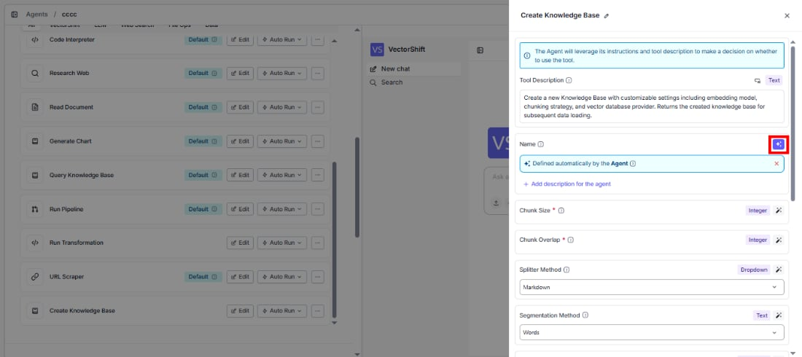
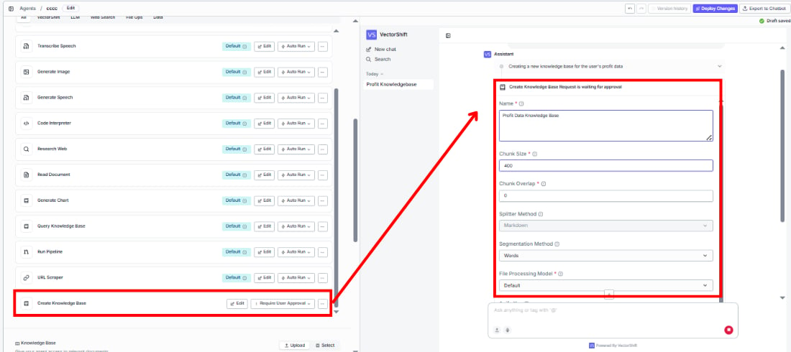
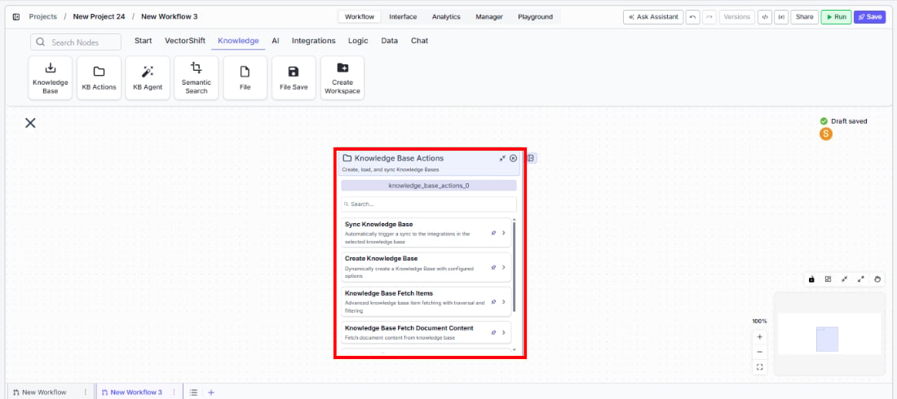
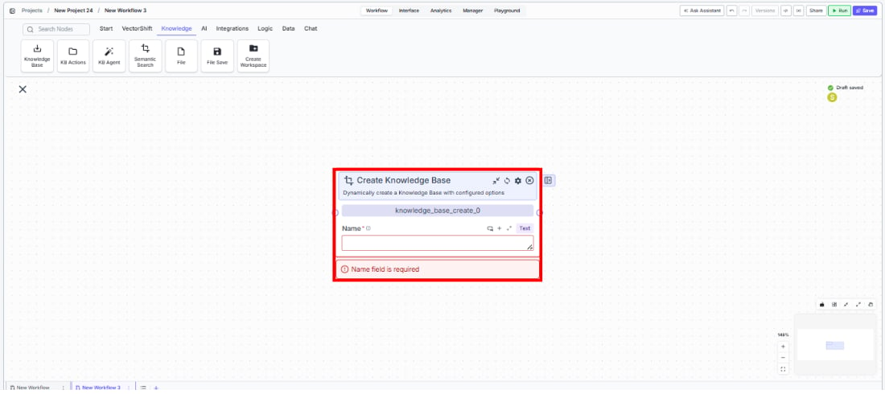
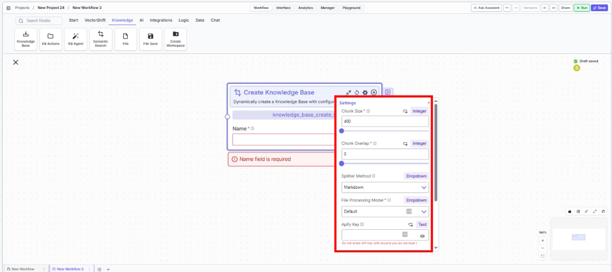
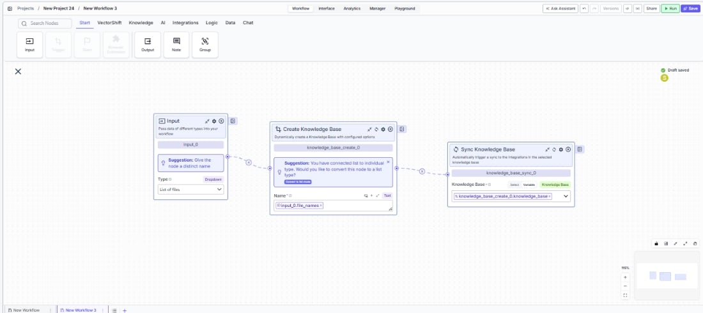

> ## Documentation Index
> Fetch the complete documentation index at: https://docs.vectorshift.ai/llms.txt
> Use this file to discover all available pages before exploring further.

# Create Knowledge Base

> Dynamically create a new knowledge base with configured chunking, embedding, and processing options.

<Card title="Use this node from the SDK" icon="code" href="/sdk/pipeline/nodes/knowledge#knowledge_base_create">
  Add it in Python with `pipeline.add(name="...").knowledge_base_create(...)`. See the SDK reference.
</Card>

The Create Knowledge Base node lets you programmatically provision a new knowledge base with full control over chunking strategy, embedding model, and document processing settings. Use it to automate knowledge base creation as part of onboarding workflows — for example, spinning up a dedicated knowledge base per client, or creating topic-specific knowledge bases from incoming document batches.

## Core Functionality

* Create a new knowledge base on-the-fly with a specified name and configuration
* Configure chunking parameters (size, overlap, splitter method, segmentation method) to control how documents are broken into retrievable segments
* Select the embedding model and file processing model used for the knowledge base
* Optionally enable hybrid mode, document analysis, and advanced parsing options
* Return a knowledge base reference that downstream nodes or tools can use to load documents into

## Tool Inputs

* `Name` \* — **Required** · Text · The name of the knowledge base to create.
* `File Processing Model` — Dropdown · Default: `default` · The file processing implementation used for parsing documents (e.g., Docparser). *(Advanced setting)*
* `Embedding Model` — Dropdown · Default: `voyageai/voyage-4-lite` · The embedding model used to generate vector representations. Format: `provider/model`. *(Advanced setting)*
* `Chunk Size` — Integer · Default: `400` · Min: `1`, Max: `4096` · The size of text chunks stored in the knowledge base. *(Advanced setting)*
* `Chunk Overlap` — Integer · Default: `0` · Min: `0`, Max: `4095` · The number of overlapping characters between consecutive chunks. *(Advanced setting)*
* `Splitter Method` — Dropdown · Default: `Markdown` · Options: `Sentence`, `Markdown`, `Dynamic` · Strategy for grouping segmented text into final chunks. *(Advanced setting)*
* `Segmentation Method` — Dropdown · Default: `Words` · Options: `Words`, `Sentences`, `Paragraphs` · The method used to break text into units before chunking. Appears when Splitter Method is set to `Dynamic`. *(Advanced setting)*
* `Analyze Documents` — Boolean · Default: `false` · When enabled, analyzes document contents and enriches them during parsing. *(Advanced setting)*
* `Hybrid Mode` — Boolean · Default: `false` · Whether to create a hybrid knowledge base that combines vector and keyword search. *(Advanced setting)*
* `Apify Key` — Text · Optional · Apify API key for scraping URLs. *(Advanced setting)*

\* indicates a required field.

## Tool Outputs

* `knowledge_base` — Knowledge Base · A reference to the newly created knowledge base. Use this output to connect to downstream nodes such as Knowledge Base Loader or Sync Knowledge Base.

<Tabs>
  <Tab title="Agents">
    ## Overview

    When added as a tool inside an agent, Create Knowledge Base allows the agent to provision new knowledge bases during a conversation. The agent can create knowledge bases on demand — for example, when a user requests a new project workspace or when incoming documents need to be organized into a fresh collection.

    ## Use Cases

    * **Client onboarding automation** — An agent creates a dedicated knowledge base for each new client, named after the client's account, ready to receive their compliance documents.
    * **Dynamic research collections** — A research agent spins up a new knowledge base per investment thesis or market sector when a user starts a new analysis project.
    * **Regulatory document organization** — An agent automatically creates separate knowledge bases for different regulatory frameworks (SEC, MiFID II, Basel III) as documents are classified.
    * **Portfolio-specific knowledge stores** — An agent creates a knowledge base per portfolio to store and retrieve relevant analyst reports, earnings transcripts, and market data.
    * **Audit trail setup** — A compliance agent creates timestamped knowledge bases for each audit cycle to maintain clean separation of evidence collections.

    ## How It Works

    1. **Add the tool** — In the agent builder, open the tool panel and navigate to the **Knowledge** category. Select **Create Knowledge Base** to add it as a tool.
    2. **Configure the tool** — The primary field is `Knowledge Base Name`. You can either leave it open for the agent to fill dynamically based on conversation context, or lock it to a fixed value. Click the sparkle icon to switch fields between dynamic (agent-determined) and static (fixed) mode.

    <Frame>
      
    </Frame>

    3. **Configure advanced settings** — Optionally adjust `Chunk Size`, `Chunk Overlap`, `Splitter Method`, `File Processing Model`, `Embedding Model`, `Analyze Documents`, and `Hybrid Mode`. These are typically locked to fixed values since they represent technical configuration rather than conversational parameters.
    4. **Write a Tool Description** — Describe when and why the agent should create a knowledge base. Example: *"Use this tool to create a new knowledge base when the user requests a new project workspace. Name it after the project."*
    5. **Set Auto Run behavior** — Choose how the tool executes:
       * **Auto Run** — Creates the knowledge base immediately without confirmation.
       * **Require User Approval** — Pauses for the user to confirm before creating.
       * **Let Agent Decide** — The agent determines whether to ask for approval based on context.

    <Frame>
      
    </Frame>

    6. **Test the tool** — In the chat interface, ask the agent to create a knowledge base and verify it appears in your knowledge base list.

    ## Settings

    * `Knowledge Base Name` — Text · Default: none · The name for the new knowledge base. Can be filled by the agent or locked to a fixed value.
    * `Tool Description` — Text · Default: none · Describes the tool's purpose to the agent.
    * `Auto Run` — Dropdown · Default: Auto Run · Controls execution behavior.

    **Advanced Settings:**

    * `File Processing Model` — Dropdown · Default: `default` · Document parsing implementation.
    * `Embedding Model` — Dropdown · Default: `voyageai/voyage-4-lite` · Vector embedding model.
    * `Chunk Size` — Integer · Default: `400` · Text chunk size (1–4096).
    * `Chunk Overlap` — Integer · Default: `0` · Overlap between chunks (0–4095).
    * `Splitter Method` — Dropdown · Default: `Markdown` · Chunking strategy (Sentence, Markdown, Dynamic).
    * `Analyze Documents` — Boolean · Default: `false` · Enable document content analysis.
    * `Hybrid Mode` — Boolean · Default: `false` · Enable hybrid vector + keyword search.
    * `Apify Key` — Text · Optional · API key for URL scraping via Apify.

    ## Best Practices

    * **Use descriptive names** — Let the agent generate meaningful names that include client identifiers, dates, or project codes for easy retrieval later.
    * **Lock chunking parameters** — Set `Chunk Size`, `Chunk Overlap`, and `Splitter Method` to fixed values appropriate for your document types. Financial documents with tables work well with Markdown splitter.
    * **Require approval for production use** — Set Auto Run to "Require User Approval" when creating knowledge bases in production environments to prevent accidental proliferation.
    * **Pair with Knowledge Base Loader** — After creating a knowledge base, chain it with a Knowledge Base Loader tool to immediately populate it with documents.
    * **Match embedding models to your retrieval workflow** — Ensure the embedding model you select here matches what your downstream Semantic Search or Knowledge Base Reader nodes expect.

    ## Related Templates

    <CardGroup cols={2}>
      <Card title="IC Memos Knowledge Base" href="https://app.vectorshift.ai/marketplace">
        Centralized searchable repository of investment committee memos for quick reference.
      </Card>

      <Card title="Custom API Chatbot" href="https://app.vectorshift.ai/marketplace">
        A configurable chatbot that connects to custom APIs to retrieve and present dynamic data.
      </Card>

      <Card title="Company Policy Compliance Chatbot" href="https://app.vectorshift.ai/marketplace">
        Answers employee questions about internal policies and flags potential compliance issues.
      </Card>

      <Card title="Investor Helpdesk" href="https://app.vectorshift.ai/marketplace">
        Handles investor inquiries related to portfolios, statements, and fund performance.
      </Card>
    </CardGroup>

    ## Common Issues

    For troubleshooting and common issues, see the [Common Issues](/docs/common-issues) page.
  </Tab>

  <Tab title="Workflows">
    ## Overview

    In workflows, the Create Knowledge Base node provisions a new knowledge base as a workflow step. The node outputs a knowledge base reference that can be wired into downstream nodes — such as Knowledge Base Loader to populate it with documents, or Sync Knowledge Base to keep it updated. This is ideal for automated workflows that need to create and populate knowledge bases without manual intervention.

    ## Use Cases

    * **Batch client setup** — A workflow iterates over a list of new client records and creates a dedicated knowledge base for each, pre-configured with the appropriate chunking and embedding settings.
    * **Document ingestion workflow** — A workflow receives uploaded documents, creates a knowledge base named after the document batch, and immediately loads the documents into it.
    * **Scheduled knowledge refresh** — A triggered workflow creates a new knowledge base version on a schedule, loads updated documents, and swaps it in for the previous version.
    * **Multi-tenant data isolation** — A workflow creates isolated knowledge bases per tenant to ensure document separation in a multi-client environment.

    ## How It Works

    1. **Add the node** — On the workflow canvas, open the node panel and navigate to the **Knowledge** category. Drag **Create Knowledge Base** onto the canvas.

    <Frame>
      
    </Frame>

    <Frame>
      
    </Frame>

    2. **Set the name** — Enter a name for the knowledge base in the `Name` field. This field is required — the node will show a validation error if left empty. You can also connect a text input from an upstream node to set the name dynamically.
    3. **Configure processing settings** — Expand the settings to configure `File Processing Model`, `Embedding Model`, `Chunk Size`, `Chunk Overlap`, `Splitter Method`, and other options as needed.

    <Frame>
      
    </Frame>

    4. **Connect the output** — Wire the `knowledge_base` output to downstream nodes that need the new knowledge base reference (e.g., Knowledge Base Loader, Sync Knowledge Base).

    <Frame>
      
    </Frame>

    5. **Run the workflow** — Execute the workflow. The node creates the knowledge base and passes the reference downstream.

    ## Settings

    * `Name` — Text · **Required** · The name of the knowledge base to create.

    **Advanced Settings:**

    * `File Processing Model` — Dropdown · Default: `default` · The document parsing implementation (e.g., Docparser).
    * `Embedding Model` — Dropdown · Default: `voyageai/voyage-4-lite` · The embedding model for vector generation.
    * `Vector DB Provider` — Text · Default: `qdrant` · The vector database backend.
    * `Collection Name` — Text · Default: `voyage-4-lite` · The collection name in the vector database.
    * `Embedding Provider` — Text · Default: `voyageai` · The embedding provider.
    * `Precision` — Text · Default: `Float16` · Vector precision setting.
    * `Sharded` — Boolean · Default: `true` · Whether to shard the knowledge base.
    * `Chunk Size` — Integer · Default: `400` · Text chunk size (1–4096).
    * `Chunk Overlap` — Integer · Default: `0` · Overlap between chunks (0–4095).
    * `Splitter Method` — Dropdown · Default: `Markdown` · Options: Sentence, Markdown, Dynamic.
    * `Segmentation Method` — Dropdown · Default: `Words` · Options: Words, Sentences, Paragraphs. Visible when Splitter Method is Dynamic.
    * `Analyze Documents` — Boolean · Default: `false` · Analyze and enrich document contents during parsing.
    * `Hybrid Mode` — Boolean · Default: `false` · Create a hybrid knowledge base combining vector and keyword search.
    * `Apify Key` — Text · Optional · Apify API key for URL scraping.

    ## Best Practices

    * **Always provide a name** — The `Name` field is required and the node will fail validation without it. Use upstream text nodes to generate dynamic names when creating multiple knowledge bases.
    * **Use consistent embedding models** — Ensure the embedding model matches your organization's standard so that cross-knowledge-base queries produce consistent results.
    * **Set chunk size based on content type** — For dense financial documents, smaller chunk sizes (200–400) improve retrieval precision. For narrative content, larger chunks (400–800) preserve context.
    * **Enable document analysis for complex PDFs** — Turn on `Analyze Documents` when working with financial reports that contain tables, charts, and mixed layouts.
    * **Chain with loader nodes** — Create Knowledge Base only provisions the empty knowledge base. Always follow it with a Knowledge Base Loader or file upload step to populate it.

    ## Related Templates

    <CardGroup cols={2}>
      <Card title="IC Memos Knowledge Base" href="https://app.vectorshift.ai/marketplace">
        Centralized searchable repository of investment committee memos for quick reference.
      </Card>

      <Card title="Custom API Chatbot" href="https://app.vectorshift.ai/marketplace">
        A configurable chatbot that connects to custom APIs to retrieve and present dynamic data.
      </Card>

      <Card title="Company Policy Compliance Chatbot" href="https://app.vectorshift.ai/marketplace">
        Answers employee questions about internal policies and flags potential compliance issues.
      </Card>

      <Card title="Investor Helpdesk" href="https://app.vectorshift.ai/marketplace">
        Handles investor inquiries related to portfolios, statements, and fund performance.
      </Card>
    </CardGroup>

    ## Common Issues

    For troubleshooting and common issues, see the [Common Issues](/docs/common-issues) page.
  </Tab>
</Tabs>
