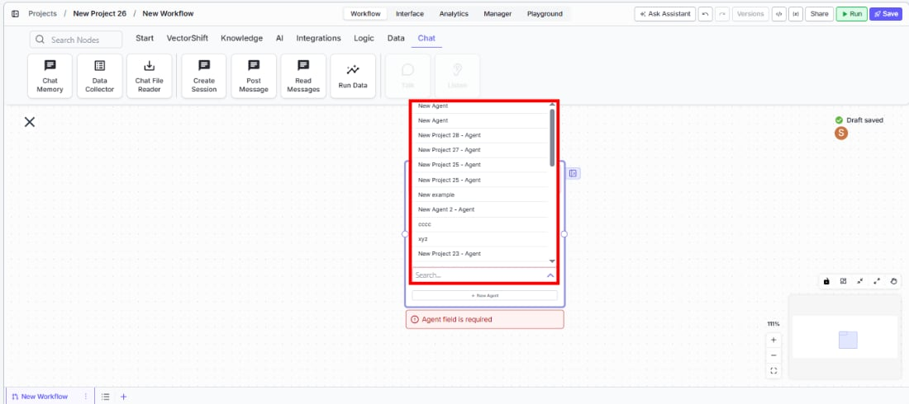
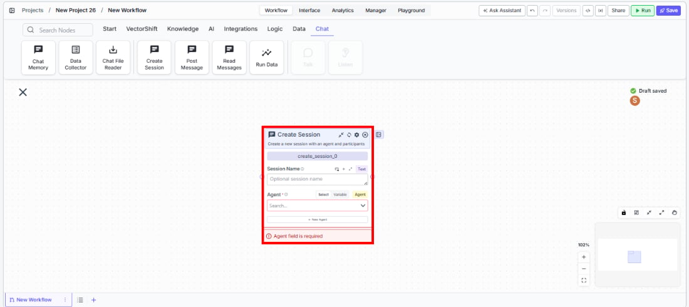
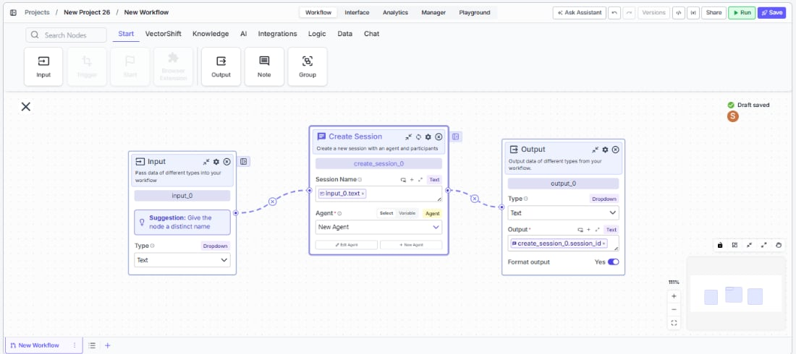

> ## Documentation Index
> Fetch the complete documentation index at: https://docs.vectorshift.ai/llms.txt
> Use this file to discover all available pages before exploring further.

# Create Session

> Create a new session with an agent and participants from within a workflow.

<Card title="Use this node from the SDK" icon="code" href="/sdk/pipeline/nodes/chat#create_session">
  Add it in Python with `pipeline.add(name="...").create_session(...)`. See the SDK reference.
</Card>

<Frame>
  
</Frame>

The Create Session node creates a new conversational session with a specified agent from within a workflow. Use it to programmatically spin up agent chat sessions — for example, initializing a client onboarding session when a new lead comes in, starting an automated compliance review conversation, or creating a support session that a human agent can later join.

## Core Functionality

* Creates a new agent session programmatically from within a workflow
* Links the session to a specific agent selected from your account
* Returns a session ID that downstream nodes (Post Message, Read Messages) can use to interact with the session
* Supports optional session naming for easier identification

## Tool Inputs

* `Session Name` — Text. Optional. A human-readable name for the session. Placeholder: "Optional session name".
* `Agent` \* — Agent. Required. The agent to use for the session. Select from existing agents in your account via a searchable dropdown, or switch to Variable mode to pass an agent reference dynamically. Includes a **+ New Agent** button to create a new agent inline.

\* *Required field*

## Tool Outputs

* `session_id` — Text. The unique identifier of the created session. Use this to post messages or read messages in downstream nodes.

***

<Tabs>
  <Tab title="Workflows">
    ### Overview

    In workflows, the Create Session node initializes a new agent conversation that other Chat nodes can interact with. It outputs a `session_id` that you pass to Post Message and Read Messages nodes to send messages to and receive responses from the agent. This enables workflows that orchestrate multi-turn agent conversations programmatically — useful for automated testing, batch processing, or triggering agent interactions from external events.

    ### Use Cases

    * Automatically create a client onboarding session when a new CRM record is created, then post introductory questions via Post Message
    * Spin up a compliance review session for each new transaction, feed the transaction details, and read the agent's assessment
    * Orchestrate automated QA testing of an agent by creating sessions and posting scripted test messages
    * Initialize a financial analysis session from a trigger node when new market data arrives, then read the agent's insights
    * Create named sessions for each department's weekly reporting workflow so conversations are easy to track and audit

    ### How It Works

    #### Step 1: Add the Create Session Node

    In the workflow canvas, click the **Chat** tab in the node palette and click **Create Session**. Drag it onto the canvas.

    <Frame>
      
    </Frame>

    #### Step 2: Select an Agent

    In the `Agent` field, use the searchable dropdown to select an existing agent from your account. This field is required — the node shows a validation error ("Agent field is required") if left empty.

    You can toggle between **Select** mode (pick from a dropdown) and **Variable** mode (pass an agent reference from an upstream node). The **+ New Agent** button lets you create a new agent directly from within the node.

    #### Step 3: Set a Session Name (Optional)

    Enter a name in the `Session Name` field to give the session a human-readable label. This is optional but helpful for tracking sessions in logs or dashboards.

    #### Step 4: Connect Downstream Nodes

    <Frame>
      
    </Frame>

    Connect the `session_id` output to downstream Post Message or Read Messages nodes. These nodes use the session ID to interact with the newly created agent session.

    #### Step 5: Test the Workflow

    Click **Run** to test. The node creates a session and outputs the session ID. Verify that downstream nodes can successfully post to and read from the session.

    ### Settings

    | Setting                        | Type        | Default | Description                                                                 |
    | ------------------------------ | ----------- | ------- | --------------------------------------------------------------------------- |
    | `Session Name`                 | Text        | —       | Optional human-readable name for the session.                               |
    | `Agent`                        | Agent       | —       | The agent to use. Required.                                                 |
    | `Show Success/Failure Outputs` | Toggle      | Off     | Show additional success/failure output handles. **Advanced setting.**       |
    | `Dependencies`                 | List\<Path> | —       | Specify node dependencies to control execution order. **Advanced setting.** |

    ### Best Practices

    * **Name sessions descriptively.** Use session names that include context (e.g., client name, date, workflow type) so sessions are easy to find and audit later.
    * **Pair with Post Message and Read Messages.** Create Session alone only initializes the conversation — use Post Message to send input and Read Messages to retrieve the agent's responses.
    * **Use Variable mode for dynamic agent selection.** When building workflows that route to different agents based on conditions (e.g., different departments), switch the Agent field to Variable mode and connect it to upstream logic.
    * **Add dependencies for execution ordering.** If the session must be created after another node completes (e.g., after fetching client data), use the Dependencies advanced setting to enforce the correct order.
    * **Store session IDs for follow-up workflows.** If you need to continue a conversation later (e.g., in a subsequent workflow run), save the session ID output to a database or variable for reuse.

    ### Related Templates

    <CardGroup cols={2}>
      <Card title="Customer Support Chatbot" href="https://app.vectorshift.ai/marketplace">
        Handles common customer inquiries and support tickets through conversational AI.
      </Card>

      <Card title="Banking Helpdesk" href="https://app.vectorshift.ai/marketplace">
        Assists banking customers with account inquiries, transactions, and product questions.
      </Card>

      <Card title="Investor Helpdesk" href="https://app.vectorshift.ai/marketplace">
        Handles investor inquiries related to portfolios, statements, and fund performance.
      </Card>

      <Card title="Company Policy Compliance Chatbot" href="https://app.vectorshift.ai/marketplace">
        Answers employee questions about internal policies and flags potential compliance issues.
      </Card>
    </CardGroup>

    ### Common Issues

    For help with common configuration issues, see the [Common Issues](/support) page.
  </Tab>
</Tabs>
