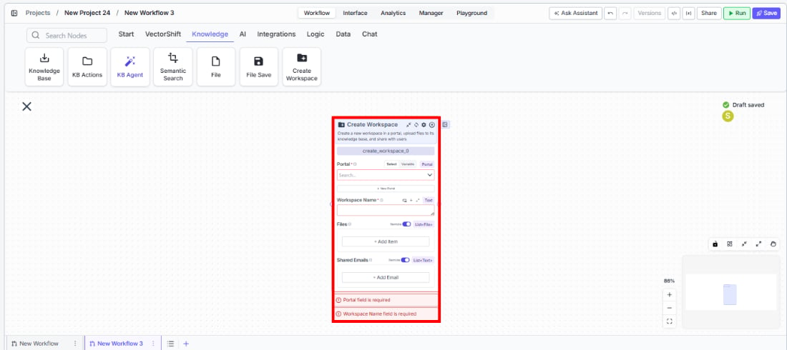
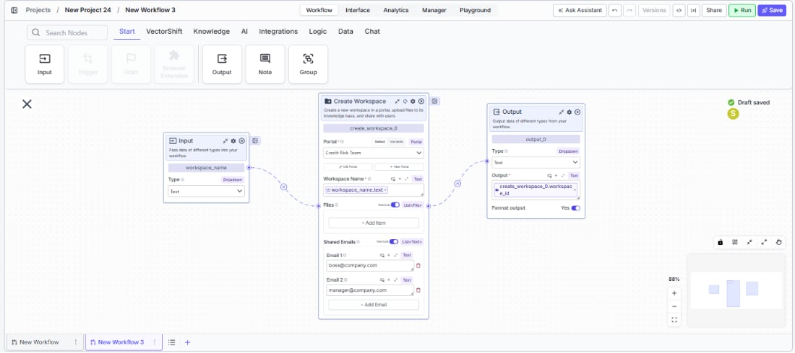

> ## Documentation Index
> Fetch the complete documentation index at: https://docs.vectorshift.ai/llms.txt
> Use this file to discover all available pages before exploring further.

# Create Workspace

> Create a new portal workspace, upload files, and share access with users.

<Card title="Use this node from the SDK" icon="code" href="/sdk/pipeline/nodes/knowledge#create_workspace">
  Add it in Python with `pipeline.add(name="...").create_workspace(...)`. See the SDK reference.
</Card>

The Create Workspace node creates a new workspace within a portal, optionally uploading files and sharing access with specified users via email. Use it to automate portal provisioning — for example, spinning up a client workspace with pre-loaded documents as part of an onboarding workflow, or creating project-specific workspaces that are shared with the relevant team members.

## Core Functionality

* Create a new workspace within an existing portal
* Upload files to the workspace at creation time
* Share the workspace with users by email
* Return workspace metadata for downstream reference

## Tool Inputs

* `Portal` \* — **Required** · Portal selector · The portal to create the workspace in.
* `Workspace Name` \* — **Required** · Text · The name of the new workspace.
* `Files` — File list · Optional · Files to upload to the workspace. Use **+ Add Item** to add multiple files.
* `Shared Emails` — Text list · Optional · Email addresses of users to share the workspace with. Use **+ Add Item** to add multiple emails.

\* indicates a required field.

## Tool Outputs

* Workspace metadata outputs including workspace identifiers and configuration details are available via the Outputs panel.

<Tabs>
  <Tab title="Workflows">
    ## Overview

    In workflows, the Create Workspace node provisions a new portal workspace as a workflow step. You can pre-load it with files and share it with users — all in a single automated operation. This is ideal for client onboarding workflows, project setup automations, or any workflow that needs to create isolated workspaces within a portal.

    ## Use Cases

    * **Client onboarding** — A workflow creates a dedicated workspace for a new client, uploads their initial documents, and shares access with the client's email address.
    * **Project provisioning** — A workflow creates a workspace per project, pre-loaded with templates and shared with team members.
    * **Automated workspace setup** — A triggered workflow creates workspaces on a schedule or in response to form submissions, with pre-configured files and access.
    * **Multi-tenant content delivery** — A workflow creates isolated workspaces for different users or teams, each with their own set of documents and permissions.

    ## How It Works

    1. **Add the node** — On the workflow canvas, open the node panel and navigate to the **Knowledge** category. Drag **Create Workspace** onto the canvas.

    <Frame>
      
    </Frame>

    2. **Select the portal** — Use the `Portal` selector to choose the portal where the workspace will be created. This field is required.
    3. **Set the workspace name** — Enter a name in the `Workspace Name` field or connect an upstream text node. This field is required.
    4. **Add files** *(optional)* — Use **+ Add Item** to add files that should be uploaded to the workspace at creation time, or connect upstream file outputs.
    5. **Add shared emails** *(optional)* — Use **+ Add Item** to specify email addresses of users who should receive access to the workspace.
    6. **Configure dependencies** *(optional)* — Use the Dependencies tab if this node depends on other nodes completing first.
    7. **Connect outputs** — Wire workspace outputs to downstream nodes if needed.

    <Frame>
      
    </Frame>

    8. **Run the workflow** — Execute the workflow. The node creates the workspace, uploads files, and shares access.

    ## Settings

    * `Portal` — Portal selector · **Required** · The target portal.
    * `Workspace Name` — Text · **Required** · The name for the new workspace.
    * `Files` — File list · Optional · Files to upload to the workspace.
    * `Shared Emails` — Text list · Optional · Email addresses for sharing access.

    ## Best Practices

    * **Use dynamic workspace names** — Connect upstream text nodes to generate unique workspace names that include client names, project IDs, or dates.
    * **Pre-load essential files** — Upload onboarding documents, templates, or reference materials at workspace creation time so users have everything they need immediately.
    * **Validate email addresses** — Ensure shared email addresses are valid before passing them to the node to avoid failed sharing operations.
    * **Use dependencies for ordered execution** — If the files to upload come from upstream processing steps, use the Dependencies tab to ensure those steps complete before workspace creation.

    ## Related Templates

    <CardGroup cols={2}>
      <Card title="Customer Support Chatbot" href="https://app.vectorshift.ai/marketplace">
        Handles common customer inquiries and support tickets through conversational AI.
      </Card>

      <Card title="Company Policy Compliance Chatbot" href="https://app.vectorshift.ai/marketplace">
        Answers employee questions about internal policies and flags potential compliance issues.
      </Card>

      <Card title="Investor Helpdesk" href="https://app.vectorshift.ai/marketplace">
        Handles investor inquiries related to portfolios, statements, and fund performance.
      </Card>

      <Card title="Banking Helpdesk" href="https://app.vectorshift.ai/marketplace">
        Assists banking customers with account inquiries, transactions, and product questions.
      </Card>
    </CardGroup>

    ## Common Issues

    For troubleshooting and common issues, see the [Common Issues](/docs/common-issues) page.
  </Tab>
</Tabs>
