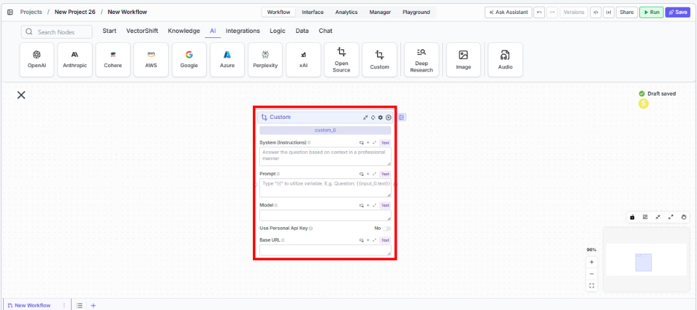
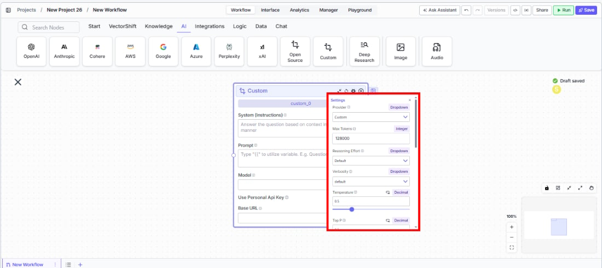

> ## Documentation Index
> Fetch the complete documentation index at: https://docs.vectorshift.ai/llms.txt
> Use this file to discover all available pages before exploring further.

# Custom LLM

> Connect to any OpenAI-compatible model provider or locally hosted LLM in your workflows.

<Card title="Use this node from the SDK" icon="code" href="/sdk/pipeline/nodes/llms#llm">
  Add it in Python with `pipeline.add(name="...").llm(...)`. See the SDK reference.
</Card>

The Custom LLM node lets you connect your workflows to any model provider that supports the OpenAI Chat API format, or to a locally hosted LLM. Use it to access specialized models from providers like Together AI, Replicate, or Fireworks — or connect to a local model running via LM Studio or Ollama — enabling use cases such as running proprietary fine-tuned models for financial analysis, evaluating open-source models for cost optimization, or prototyping with local models before scaling to production.

## Core Functionality

* Connect to any LLM provider compatible with the OpenAI Chat API format
* Access local models via LM Studio, Ollama, or other local serving frameworks
* Specify a custom base URL, model name, and API key
* Process system instructions and dynamic prompts with variable interpolation
* Stream responses in real time for long-running generations
* Track token usage and credit consumption per run
* Apply content moderation, PII detection, and safety guardrails
* Retry failed executions automatically with configurable intervals

## Tool Inputs

* `System Instructions` — (String) Instructions that guide the model's behavior, tone, and how it should use data provided in the prompt
* `Prompt` — (String) The data sent to the model. Type `{{` to open the variable builder and reference outputs from other nodes
* `Model` \* — (String (Text input)) The model identifier to use. This is a free-text field — enter the exact model name as specified by your provider
* `Use Personal Api Key` — (Boolean, default: `No`) Toggle to provide your own API key
* `Base URL` \* — (String) The base URL of your model provider (e.g., `https://api.together.xyz` or `http://localhost:1234/v1`)
* `Api Key` — (String) Your API key for the model provider. Required when `Use Personal Api Key` is enabled

\* indicates a required field

## Tool Outputs

* `response` — (String (or Stream\<String> when streaming)) The generated text response from the model
* `tokens_used` — (Integer) Total number of tokens consumed (input + output)
* `input_tokens` — (Integer) Number of input tokens sent to the model
* `output_tokens` — (Integer) Number of output tokens generated by the model
* `credits_used` — (Decimal) VectorShift AI credits consumed for this run

<Tabs>
  <Tab title="Workflows">
    ## Overview

    The Custom LLM node in workflows lets you connect to any OpenAI-compatible model endpoint by specifying a base URL, model name, and API key. This provides maximum flexibility — you can use commercial API providers, privately hosted models, or local development servers, all within the same workflow canvas.

    ## Use Cases

    * **Fine-tuned model deployment** — Connect to a custom fine-tuned model hosted on Together AI or Replicate that's been trained on your organization's financial documents and terminology.
    * **Local model prototyping** — Test and iterate with locally hosted models via LM Studio or Ollama before committing to a cloud provider for production workloads.
    * **Cost-optimized batch processing** — Route high-volume, low-complexity tasks (like transaction tagging) to cost-effective open-source models while reserving premium models for complex analysis.
    * **Multi-provider evaluation** — Compare outputs from different model providers by swapping the base URL and model name to find the best quality-to-cost ratio for your financial workflows.
    * **Private infrastructure compliance** — Connect to models hosted within your organization's private infrastructure to meet data residency and security requirements.

    ## How It Works

    1. **Add the node to your workflow.** From the toolbar, open the **AI** category and drag the **Custom** node onto the canvas.

    <Frame>
      
    </Frame>

    2. **Write your System Instructions.** Enter instructions in the `System Instructions` field to define the model's behavior, tone, and how it should use any data provided in the prompt.

    3. **Configure the Prompt.** In the `Prompt` field, type `{{` to open the variable builder and reference outputs from upstream nodes.

    4. **Enter the model name.** In the `Model` field, type the exact model identifier as specified by your provider (e.g., `meta-llama/Llama-3-70b-chat-hf` for Together AI, or `local-model` for LM Studio).

    5. **Set the Base URL.** Enter the base URL for your model provider in the `Base URL` field. Examples:
       * Together AI: `https://api.together.xyz`
       * Replicate: `https://api.replicate.com`
       * Local LM Studio: `http://localhost:1234/v1`

    6. **Provide an API key (optional).** Toggle `Use Personal Api Key` to **Yes** and enter your provider's API key. For local models, you may use a placeholder key (e.g., `lm-studio`).

    7. **Open settings.** Click the **gear icon** (⚙) on the node to configure token limits, temperature, retry behavior, and more.

    <Frame>
      
    </Frame>

    8. **Connect outputs and run.** Wire the `response` output to downstream nodes. Execute the workflow to process inputs through your custom model endpoint.

    ## Settings

    All settings below are accessed via the **gear icon** (⚙) on the node.

    | Setting                     | Type     | Default | Description                                                                                                                              |
    | --------------------------- | -------- | ------- | ---------------------------------------------------------------------------------------------------------------------------------------- |
    | `Provider`                  | Dropdown | Custom  | The LLM provider.                                                                                                                        |
    | `Max Tokens`                | Integer  | 128000  | Maximum number of input + output tokens the model will process per run.                                                                  |
    | `Reasoning Effort`          | Dropdown | Default | Controls the depth of reasoning the model applies. Options: Default, Low, Medium, High.                                                  |
    | `Verbosity`                 | Dropdown | Default | Controls the verbosity of model responses.                                                                                               |
    | `Temperature`               | Float    | 0.5     | Controls response creativity. Higher values produce more diverse outputs; lower values produce more deterministic responses. Range: 0–1. |
    | `Top P`                     | Float    | 0.5     | Controls token sampling diversity. Higher values consider more tokens at each generation step. Range: 0–1.                               |
    | `Stream Response`           | Boolean  | Off     | Stream responses token-by-token instead of returning the full response at once.                                                          |
    | `Show Sources`              | Boolean  | Off     | Display source documents used for the response. Useful when combining with knowledge base inputs.                                        |
    | `Toxic Input Filtration`    | Boolean  | Off     | Filter toxic input content. If the model receives toxic content, it responds with a respectful message instead.                          |
    | `Safe Context Token Window` | Boolean  | Off     | Automatically reduce context to fit within the model's maximum context window.                                                           |
    | `Retry On Failure`          | Boolean  | Off     | Enable automatic retries when execution fails.                                                                                           |
    | `Max # of re-try`           | Integer  | —       | Maximum number of retry attempts. Visible when `Retry On Failure` is enabled.                                                            |
    | `Max Interval b/w re-try`   | Integer  | —       | Interval in milliseconds between retry attempts.                                                                                         |
    | **PII Detection**           |          |         |                                                                                                                                          |
    | `Name`                      | Boolean  | Off     | Detect and redact personal names from input before sending to the model.                                                                 |
    | `Email`                     | Boolean  | Off     | Detect and redact email addresses from input.                                                                                            |
    | `Phone`                     | Boolean  | Off     | Detect and redact phone numbers from input.                                                                                              |
    | `Credit Card Info`          | Boolean  | Off     | Detect and redact credit card numbers from input.                                                                                        |
    | `Show Guardrail Status`     | Dropdown | —       | Controls whether guardrail status is included in the output.                                                                             |

    ## Best Practices

    * **Verify base URL format.** Ensure your base URL does not include a trailing slash and matches the provider's API documentation exactly. A common mistake is including extra path segments.
    * **Match model names precisely.** The model identifier must exactly match what the provider expects. Check your provider's model catalog for the correct string.
    * **Start with local models for prototyping.** Use LM Studio or Ollama during development to iterate quickly without incurring API costs, then swap to a cloud provider for production.
    * **Set appropriate Max Tokens.** Different custom models have vastly different context windows. Set `Max Tokens` to match your model's actual limit to avoid errors.
    * **Enable retry for unreliable endpoints.** If connecting to a self-hosted or development server, enable `Retry On Failure` with reasonable intervals to handle transient failures.
    * **Apply PII detection for client data.** Even when using private infrastructure, enable PII toggles as a defense-in-depth measure for workflows processing sensitive financial information.

    ## Related Templates

    <CardGroup cols={2}>
      <Card title="Custom API Chatbot" href="https://app.vectorshift.ai/marketplace">
        A configurable chatbot that connects to custom APIs to retrieve and present dynamic data.
      </Card>
    </CardGroup>

    ## Common Issues

    For troubleshooting common issues with this node, see the [Common Issues](/support) documentation.
  </Tab>
</Tabs>
