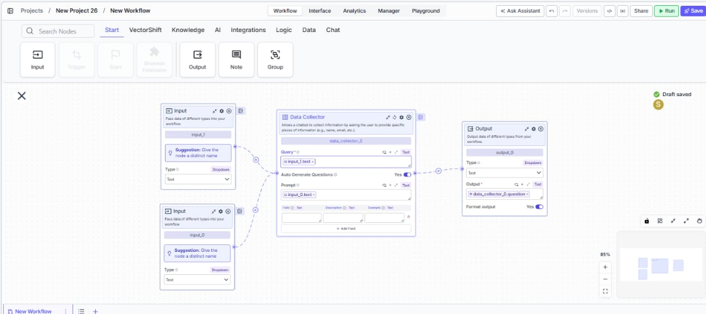
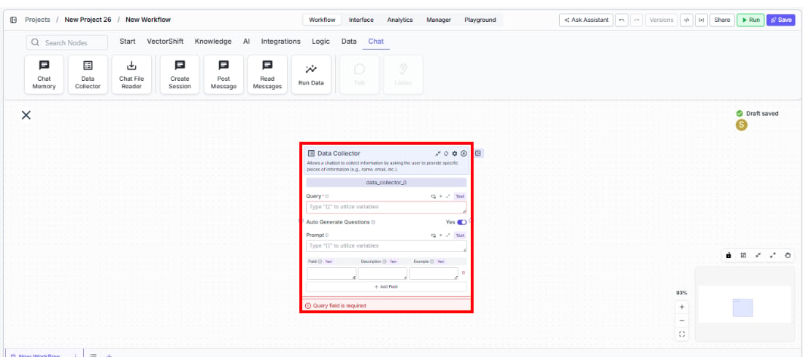
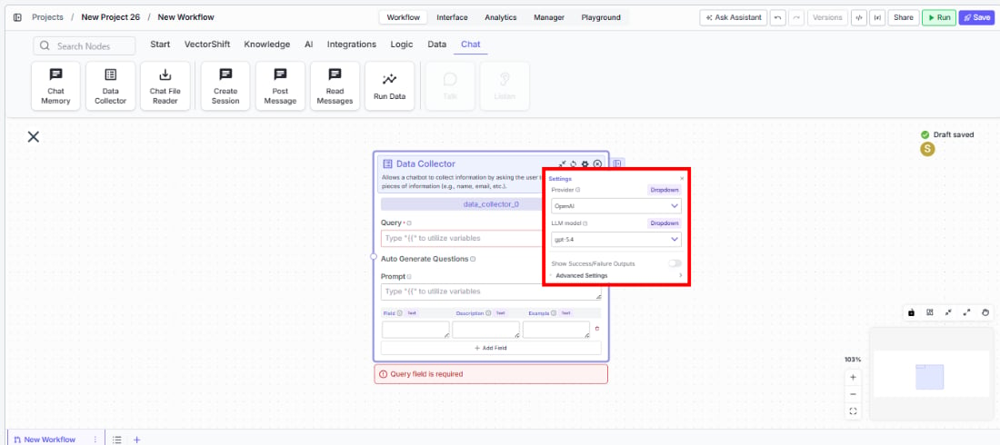

> ## Documentation Index
> Fetch the complete documentation index at: https://docs.vectorshift.ai/llms.txt
> Use this file to discover all available pages before exploring further.

# Data Collector

> Collect structured information from chatbot users by defining fields and auto-generating questions.

<Card title="Use this node from the SDK" icon="code" href="/sdk/pipeline/nodes/chat#data_collector">
  Add it in Python with `pipeline.add(name="...").data_collector(...)`. See the SDK reference.
</Card>

The Data Collector node enables chatbots to gather structured information from users by asking targeted questions and extracting specific data fields from their responses. Use it to build intake forms within a conversation — for example, collecting client details for account opening, gathering incident information for a support ticket, or capturing financial data points for a loan application.

## Core Functionality

* Defines a set of fields (with descriptions and examples) to collect from the user during a chat conversation
* Uses an LLM to auto-generate contextual questions that guide the user through providing each field
* Analyzes user responses against the defined fields to extract and validate collected data
* Supports manual mode where collected data is passed to a downstream LLM for custom question generation

## Tool Inputs

* `Query` \* — Text. Required. The user's message to be analyzed for data collection. Typically connected from the chatbot input. Supports variables via `{{}}` syntax.
* `Auto Generate Questions` — Toggle. Default: `Yes` (on). When enabled, the node uses an LLM to automatically generate questions in successive order until all fields are collected. When disabled, the node outputs the collected data as a JSON-like object for a downstream LLM to handle question generation.
* `Prompt` — Text. Optional. Specific instructions for how the LLM should collect the information. Supports variables via `{{}}` syntax.
* `Field` — Text. The name of the data field to collect (e.g., "Name", "Email", "Account Number").
* `Description` — Text. A description of the field to help the LLM understand what to ask for.
* `Example` — Text. An example value for the field to guide the LLM's question generation.

<Frame>
  
</Frame>

Fields are added as rows in a table. Click **+ Add Field** to add more fields. Each row can be deleted with the trash icon.

\* *Required field*

## Tool Outputs

* `question` — Text. The next question to be asked to the user. Only available when `Auto Generate Questions` is enabled.
* `collected_data` — Text. The structured data collected so far. Only available when `Auto Generate Questions` is disabled. Format: `{'Field1': 'Collected_Data', 'Field2': 'Collected_Data'}`.

***

<Tabs>
  <Tab title="Workflows">
    ### Overview

    In workflows, the Data Collector node sits in a chatbot workflow and orchestrates a multi-turn data gathering flow. When Auto Generate Questions is enabled, it uses an LLM to ask the user for each defined field in sequence, analyzing their responses to determine what has been collected and what remains. The `question` output connects to the chatbot response, creating a guided conversation that collects all required information before proceeding.

    ### Use Cases

    * Collect client onboarding details (name, email, company, role) through a conversational chatbot before routing to account creation
    * Gather financial information (income, expenses, credit score range) for a loan pre-qualification chatbot
    * Build an IT support intake flow that collects incident type, severity, affected system, and description before creating a ticket
    * Capture trade details (instrument, quantity, price, counterparty) through a conversational interface for order entry
    * Collect KYC (Know Your Customer) information from clients through a guided chat experience

    ### How It Works

    #### Step 1: Add the Data Collector Node

    In the workflow canvas, click the **Chat** tab in the node palette and click **Data Collector**. Drag it onto the canvas.

    <Frame>
      
    </Frame>

    #### Step 2: Connect the Query Input

    Connect the chatbot's user input to the `Query` field. This is the user's message that the node will analyze to extract data. This field is required — the node shows a validation error if left empty.

    #### Step 3: Define Fields to Collect

    In the fields table, add each piece of information you want to collect:

    * **`Field`** — The name of the data point (e.g., "Full Name").
    * **`Description`** — What the field represents (e.g., "The user's legal full name").
    * **`Example`** — A sample value (e.g., "John Smith").

    Click **+ Add Field** to add more rows. Remove unwanted rows with the trash icon.

    #### Step 4: Configure Auto Generate Questions

    <Frame>
      
    </Frame>

    Leave `Auto Generate Questions` toggled on (default) to let the node automatically generate and ask questions. If you prefer custom question logic, toggle it off and connect the `collected_data` output to a downstream LLM with your own prompting.

    #### Step 5: Add a Prompt (Optional)

    Use the `Prompt` field to give the LLM specific instructions on how to collect information — for example, "Be polite and professional. Ask one question at a time. If the user provides unclear information, ask for clarification."

    #### Step 6: Configure the LLM Provider (Optional)

    Click the settings icon to open the Settings panel. Adjust:

    * **`Provider`** — The LLM provider for question generation. Default: `OpenAI`. Options include OpenAI, Anthropic, Cohere, Perplexity, Google, Open Source, AWS, Azure, xAI, Groq, and Custom.
    * **`LLM model`** — The specific model to use. Default varies by provider.

    #### Step 7: Connect the Output

    Connect the `question` output to the chatbot's response output. When deployed, the chatbot will ask the auto-generated question, wait for the user's response, and loop back until all fields are collected.

    ### Settings

    | Setting                        | Type     | Default | Description                                                           |
    | ------------------------------ | -------- | ------- | --------------------------------------------------------------------- |
    | `Query`                        | Text     | —       | The user's message to analyze. Required.                              |
    | `Auto Generate Questions`      | Toggle   | Yes     | Automatically generate and ask questions for each field.              |
    | `Prompt`                       | Text     | —       | Instructions for how the LLM should collect information.              |
    | `Fields`                       | Table    | —       | Fields to collect with name, description, and example columns.        |
    | `Provider`                     | Dropdown | OpenAI  | The LLM provider for question generation. **Advanced setting.**       |
    | `LLM model`                    | Dropdown | Varies  | The specific model for question generation. **Advanced setting.**     |
    | `Show Success/Failure Outputs` | Toggle   | Off     | Show additional success/failure output handles. **Advanced setting.** |

    ### Best Practices

    * **Write clear field descriptions and examples.** The LLM uses descriptions and examples to generate relevant questions — vague descriptions lead to vague questions. For a "Revenue" field, describe it as "Annual revenue in USD" with an example like "\$5,000,000".
    * **Use the Prompt field to set conversation tone.** For financial or compliance use cases, include instructions like "Maintain a professional tone" or "If the user declines to provide information, explain why it's needed."
    * **Limit fields to what's essential.** Long data collection flows increase drop-off. Collect only what's needed up front and gather optional details later.
    * **Pair with Chat Memory for context.** Connect a Chat Memory node upstream so the Data Collector's LLM can reference the full conversation when generating follow-up questions.
    * **Test with edge cases.** Try providing partial information, incorrect formats, or refusing to answer to verify that the LLM handles these gracefully.

    ### Related Templates

    <CardGroup cols={2}>
      <Card title="KYC Agent" href="https://app.vectorshift.ai/marketplace">
        Verifies customer identities and performs Know Your Customer checks for onboarding compliance.
      </Card>

      <Card title="Customer Support Chatbot" href="https://app.vectorshift.ai/marketplace">
        Handles common customer inquiries and support tickets through conversational AI.
      </Card>

      <Card title="InfoSec Questionnaire Assistant" href="https://app.vectorshift.ai/marketplace">
        Auto-fills and reviews information security questionnaires using internal security documentation.
      </Card>

      <Card title="Banking Helpdesk" href="https://app.vectorshift.ai/marketplace">
        Assists banking customers with account inquiries, transactions, and product questions.
      </Card>
    </CardGroup>

    ### Common Issues

    For help with common configuration issues, see the [Common Issues](/support) page.
  </Tab>
</Tabs>
