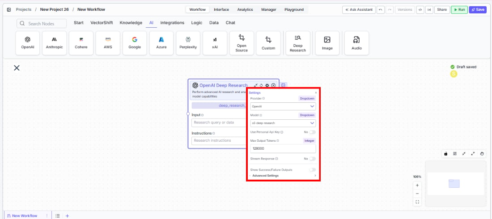
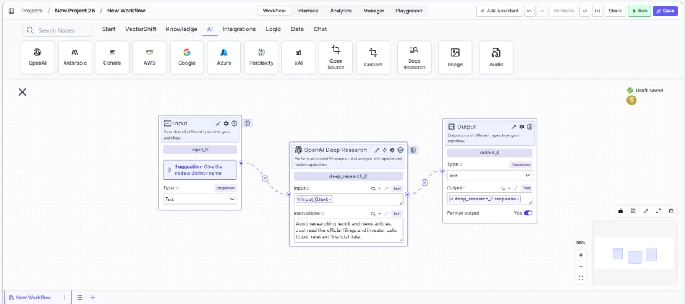

> ## Documentation Index
> Fetch the complete documentation index at: https://docs.vectorshift.ai/llms.txt
> Use this file to discover all available pages before exploring further.

# Deep Research

> Perform advanced AI research and analysis with specialized deep research models.

<Card title="Use this node from the SDK" icon="code" href="/sdk/pipeline/nodes/data-loaders#deep_research">
  Add it in Python with `pipeline.add(name="...").deep_research(...)`. See the SDK reference.
</Card>

The Deep Research node performs in-depth AI research and analysis using specialized models with built-in web search and tool-use capabilities. Use it to conduct comprehensive research on complex topics — for example, compiling competitive landscape reports for investment due diligence, synthesizing regulatory developments across multiple jurisdictions, or producing detailed market analysis reports that would otherwise require hours of manual research.

## Core Functionality

* Perform multi-step research using specialized deep research models with built-in web search
* Process research queries and custom instructions for targeted analysis
* Maintain conversation context across sequential research tasks
* Stream research output in real time for long-running analyses
* Track token usage and credit consumption per research run
* Return structured metadata including response IDs, timestamps, and error details
* Support multiple providers including OpenAI, Azure, Anthropic, and Google

## Tool Inputs

* `Input` — (String) The research query or data to analyze. Accepts free text or references to other node outputs via `{{variable}}` syntax
* `Instructions` — (String) Specific instructions for the research task — use this to guide the model's research focus, depth, and output format
* `Model` \* — (Enum (Dropdown), default: `o3-deep-research`) Select from available deep research models. Options vary by provider
* `Use Personal Api Key` — (Boolean, default: `No`) Toggle to use your own API key instead of VectorShift's shared key
* `Api Key` — (String) Your API key. Only visible when `Use Personal Api Key` is enabled

\* indicates a required field

## Tool Outputs

* `response` — (String (or Stream\<String> when streaming)) The research output and findings
* `conversation` — (String) The updated conversation including the research response — useful for chaining sequential research tasks
* `id` — (String) The unique ID of the research response
* `created_at` — (String) Timestamp when the research was completed
* `incomplete_details` — (String) Details about any incomplete aspects of the research
* `error` — (String) Error message if the research failed
* `tokens_used` — (Integer) Total number of tokens consumed during research
* `input_tokens` — (Integer) Number of input tokens used
* `output_tokens` — (Integer) Number of output tokens generated
* `credits_used` — (Decimal) VectorShift AI credits consumed for this run

<Tabs>
  <Tab title="Workflows">
    ## Overview

    The Deep Research node in workflows lets you place a specialized research model on the canvas that can autonomously search the web, synthesize information from multiple sources, and produce comprehensive research reports. Unlike standard LLM nodes, this node is designed for complex, multi-step research tasks where the model needs to gather and analyze information before responding.

    ## Use Cases

    * **Investment due diligence** — Research a target company's financials, market position, competitive landscape, and regulatory history to produce a comprehensive due diligence report.
    * **Regulatory monitoring** — Track and synthesize recent regulatory developments across jurisdictions — for example, summarizing new SEC guidance, EU MiFID updates, or APAC compliance changes.
    * **Market analysis reports** — Generate detailed market analysis covering sector trends, key players, recent deals, and forward-looking indicators for portfolio strategy discussions.
    * **Competitive intelligence** — Research competitor product launches, pricing changes, partnership announcements, and financial performance to inform strategic planning.
    * **Incident research** — Investigate the background, timeline, and implications of market events (e.g., a flash crash, major earnings miss, or regulatory action) by synthesizing web sources.
    * **Thematic research** — Explore emerging themes like AI in fintech, ESG scoring methodologies, or digital asset regulation by aggregating insights from multiple sources.

    ## How It Works

    1. **Add the node to your workflow.** From the toolbar, open the **AI** category and drag the **Deep Research** node onto the canvas. It appears as "OpenAI Deep Research" by default.

    2. **Enter your research query.** In the `Input` field, enter the research question or topic. You can type directly or reference outputs from upstream nodes using `{{variable}}` syntax — for example, `{{input_0.text}}`.

    3. **Provide research instructions (optional).** In the `Instructions` field, specify how the model should conduct the research — for example, what sources to prioritize, what format to use for the output, or what aspects to focus on.

    4. **Select a model.** Use the `Model` dropdown to choose a deep research model. The default is `o3-deep-research`. Other available models include `gpt-5`, `gpt-5-mini`, `gpt-5-nano`, `gpt-4.5`, `gpt-4.1`, and variants.

    5. **Open settings.** Click the **gear icon** (⚙) to open the settings panel. Here you can change the provider, configure token limits, enable streaming.

    <Frame>
      
    </Frame>

    6. **Connect outputs.** Click the **Outputs** button to open the outputs panel. Wire the `response` output to downstream nodes for the research findings. Use `conversation` to chain sequential research tasks. Monitor costs with `tokens_used` and `credits_used`.

    <Frame>
      
    </Frame>

    7. **Run your workflow.** Execute the workflow. The Deep Research node processes the query, conducts web-based research, and returns comprehensive findings along with metadata and usage metrics.

    ## Settings

    Settings are accessed via the **gear icon** (⚙) on the node.

    | Setting                        | Type     | Default            | Description                                                                                     |
    | ------------------------------ | -------- | ------------------ | ----------------------------------------------------------------------------------------------- |
    | `Provider`                     | Dropdown | OpenAI             | The provider for the deep research model. Options include OpenAI, Azure, Anthropic, and Google. |
    | `Model`                        | Dropdown | `o3-deep-research` | The deep research model to use. Available models vary by provider.                              |
    | `Use Personal Api Key`         | Boolean  | No                 | Toggle to use your own API key for the selected provider.                                       |
    | `Max Output Tokens`            | Integer  | 128000             | Maximum number of tokens in the research output.                                                |
    | `Stream Response`              | Boolean  | No                 | Stream the research response in real time instead of returning it all at once.                  |
    | `Show Success/Failure Outputs` | Boolean  | —                  | Display additional success and failure output ports on the node.                                |

    ## Best Practices

    * **Write specific research instructions.** The more targeted your `Instructions` field, the more relevant the research output. Instead of "Research Company X," try "Research Company X's Q4 2025 earnings, focusing on revenue growth, margin trends, and management guidance for 2026."
    * **Chain research tasks with conversation output.** Wire the `conversation` output of one Deep Research node into the input of another to build cumulative research across multiple steps — useful for multi-phase due diligence workflows.
    * **Monitor token usage carefully.** Deep research tasks can consume significantly more tokens than standard LLM calls due to multi-step reasoning and web search. Connect `tokens_used` and `credits_used` to monitoring nodes.
    * **Use the error and incomplete\_details outputs.** Wire these outputs to conditional logic nodes to handle cases where research is incomplete or encounters errors — important for production workflows that need reliability.
    * **Select the right model for the task.** Use `o3-deep-research` for comprehensive research tasks. For faster, lighter research, consider `gpt-5-mini` or `gpt-4.1` variants when available through your provider.
    * **Enable streaming for long research tasks.** Deep research can take longer than standard LLM calls. Enable streaming so users see incremental progress rather than waiting for the full result.

    ## Related Templates

    <CardGroup cols={2}>
      <Card title="FX Arbitrage Research Agent" href="https://app.vectorshift.ai/marketplace">
        Identifies and analyzes foreign exchange arbitrage opportunities across markets and instruments.
      </Card>

      <Card title="Earnings Call Insight and Sentiment Analyzer" href="https://app.vectorshift.ai/marketplace">
        Analyzes earnings call transcripts for sentiment, key themes, and forward-looking signals.
      </Card>

      <Card title="Grant Matching AI Agent" href="https://app.vectorshift.ai/marketplace">
        Matches organizations or individuals to relevant grants based on their profile and eligibility criteria.
      </Card>

      <Card title="Investment Memo Generator" href="https://app.vectorshift.ai/marketplace">
        Automatically generates structured investment memos from deal data and research inputs.
      </Card>
    </CardGroup>

    ## Common Issues

    For troubleshooting common issues with this node, see the [Common Issues](/support) documentation.
  </Tab>
</Tabs>
