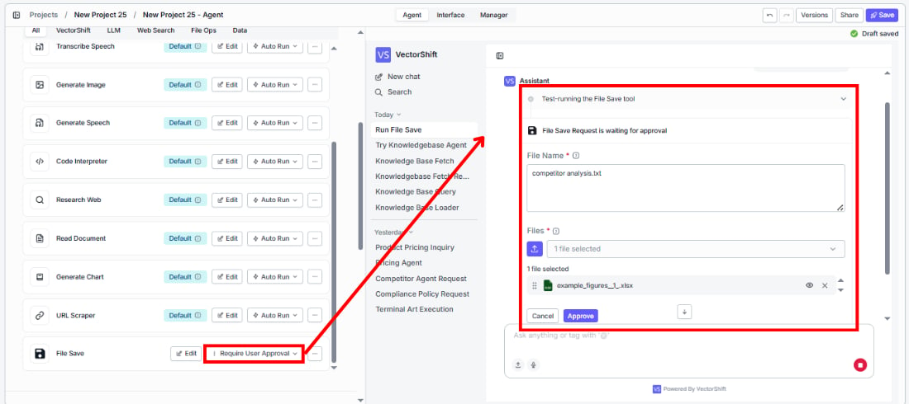
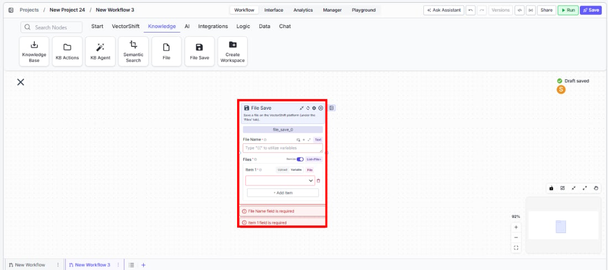
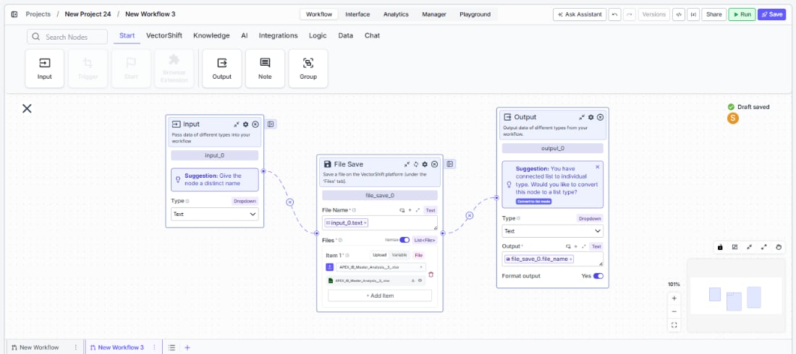

> ## Documentation Index
> Fetch the complete documentation index at: https://docs.vectorshift.ai/llms.txt
> Use this file to discover all available pages before exploring further.

# File Save

> Save files to the VectorShift platform's Files tab for persistent storage.

<Card title="Use this node from the SDK" icon="code" href="/sdk/pipeline/nodes/general#file_save">
  Add it in Python with `pipeline.add(name="...").file_save(...)`. See the SDK reference.
</Card>

The File Save node saves one or more files to the VectorShift platform, storing them under the Files tab. Use it to persist generated outputs — for example, saving a PDF report produced by your workflow, archiving processed documents for later retrieval, or storing exported CSV data files that users can download from the platform.

## Core Functionality

* Save one or more files to the VectorShift platform's Files tab
* Specify a custom file name for the saved file
* Accept file inputs from any upstream node that outputs files
* Return the saved file name(s) as output for downstream reference

## Tool Inputs

* `File Name` \* — **Required** · Text · The name to save the file as on the platform.
* `Files` \* — **Required** · List of Files · The file(s) to save.

\* indicates a required field.

## Tool Outputs

* `file_name` — List of Text · The name(s) of the saved file(s).

<Tabs>
  <Tab title="Agents">
    ## Overview

    When added as a tool inside an agent, File Save allows the agent to persist files to the VectorShift platform during a conversation. The agent can save generated reports, processed documents, or any file output from other tools to the platform's Files tab, making them available for later access.

    ## Use Cases

    * **Report archival** — An agent generates a financial analysis report and saves it to the platform so the user can download it later.
    * **Document processing output** — An agent processes and transforms uploaded documents, then saves the cleaned versions to the platform.
    * **Export data files** — An agent compiles data into a CSV or Excel file and saves it for the user to retrieve.
    * **Backup conversation artifacts** — An agent saves important files produced during a conversation for persistent storage.

    ## How It Works

    1. **Add the tool** — In the agent builder, open the tool panel and navigate to the **VectorShift** category. Select **File Save** to add it as a tool.
    2. **Configure input fields** — The `File Name` and `Files` fields can be left for the agent to fill dynamically based on conversation context, or locked to fixed values.
    3. **Write a Tool Description** — Describe when the agent should save files. Example: *"Use this tool to save a generated report to the platform. Provide the file and a descriptive name."*
    4. **Set Auto Run behavior** — Choose how the tool executes:
       * **Auto Run** — Saves the file immediately.
       * **Require User Approval** — Pauses for user confirmation before saving.
       * **Let Agent Decide** — The agent determines whether approval is needed.

    <Frame>
      
    </Frame>

    5. **Test the tool** — Generate or upload a file in the chat and ask the agent to save it.

    ## Settings

    * `File Name` — Text · Default: none · The name for the saved file.
    * `Files` — File list · Default: none · The files to save.
    * `Tool Description` — Text · Default: none · Describes the tool's purpose to the agent.
    * `Auto Run` — Dropdown · Default: Auto Run · Controls execution behavior.

    ## Best Practices

    * **Use descriptive file names** — Include dates, client names, or report types in file names so saved files are easy to find later.
    * **Lock file names for standardized outputs** — When the agent always produces the same type of file, lock the name to a consistent naming convention.
    * **Use approval for important saves** — Set to "Require User Approval" to let users verify the file content before it's persisted to the platform.

    ## Related Templates

    <CardGroup cols={2}>
      <Card title="Investment Memo Generator" href="https://app.vectorshift.ai/marketplace">
        Automatically generates structured investment memos from deal data and research inputs.
      </Card>

      <Card title="Newsletter Writer Agent" href="https://app.vectorshift.ai/marketplace">
        Generates professional newsletters from raw content inputs, data, or briefs.
      </Card>

      <Card title="Term Sheet Agent" href="https://app.vectorshift.ai/marketplace">
        Generates and reviews term sheets by extracting and validating key deal terms.
      </Card>

      <Card title="Control Checker and Writer Agent" href="https://app.vectorshift.ai/marketplace">
        Audits existing controls and drafts new control documentation based on compliance requirements.
      </Card>
    </CardGroup>

    ## Common Issues

    For troubleshooting and common issues, see the [Common Issues](/docs/common-issues) page.
  </Tab>

  <Tab title="Workflows">
    ## Overview

    In workflows, the File Save node persists files generated during workflow execution to the VectorShift platform's Files tab. Connect upstream file outputs to this node to save them for later access, download, or use in other workflows.

    ## Use Cases

    * **Workflow output storage** — A workflow generates reports, transformed files, or exported data and saves them to the platform for user access.
    * **Intermediate file archival** — A workflow saves intermediate processing results as files for debugging or audit purposes.
    * **Scheduled report generation** — A cron-triggered workflow generates daily or weekly reports and saves them with timestamped names.
    * **File conversion output** — A workflow converts files between formats and saves the converted versions to the platform.

    ## How It Works

    1. **Add the node** — On the workflow canvas, open the node panel and navigate to the **Knowledge** category. Drag **File Save** onto the canvas.

    <Frame>
      
    </Frame>

    2. **Set the file name** — Enter a name in the `File Name` field or connect an upstream text node for dynamic naming.
    3. **Connect file input** — Wire upstream file outputs to the `Files` input. This field is required.

    <Frame>
      
    </Frame>

    4. **Connect outputs** *(optional)* — Wire the `file_name` output to downstream nodes if you need to reference the saved file name.
    5. **Run the workflow** — Execute the workflow. The node saves the file(s) to the platform.

    ## Settings

    * `File Name` — Text · **Required** · The name to save the file as.
    * `Files` — File list · **Required** · The files to save.

    ## Best Practices

    * **Use dynamic file names** — Connect upstream text nodes to generate unique file names (e.g., including timestamps or identifiers) to avoid overwriting previous saves.
    * **Place at the end of processing chains** — Position File Save after all transformations are complete so the final version is saved.
    * **Validate file inputs** — Ensure the upstream nodes actually produce file outputs before connecting to File Save to avoid runtime errors.

    ## Related Templates

    <CardGroup cols={2}>
      <Card title="Investment Memo Generator" href="https://app.vectorshift.ai/marketplace">
        Automatically generates structured investment memos from deal data and research inputs.
      </Card>

      <Card title="Newsletter Writer Agent" href="https://app.vectorshift.ai/marketplace">
        Generates professional newsletters from raw content inputs, data, or briefs.
      </Card>

      <Card title="Term Sheet Agent" href="https://app.vectorshift.ai/marketplace">
        Generates and reviews term sheets by extracting and validating key deal terms.
      </Card>

      <Card title="Control Checker and Writer Agent" href="https://app.vectorshift.ai/marketplace">
        Audits existing controls and drafts new control documentation based on compliance requirements.
      </Card>
    </CardGroup>

    ## Common Issues

    For troubleshooting and common issues, see the [Common Issues](/docs/common-issues) page.
  </Tab>
</Tabs>
