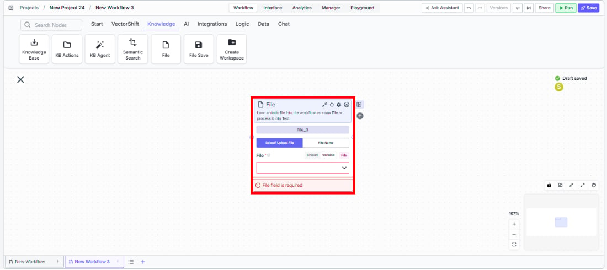
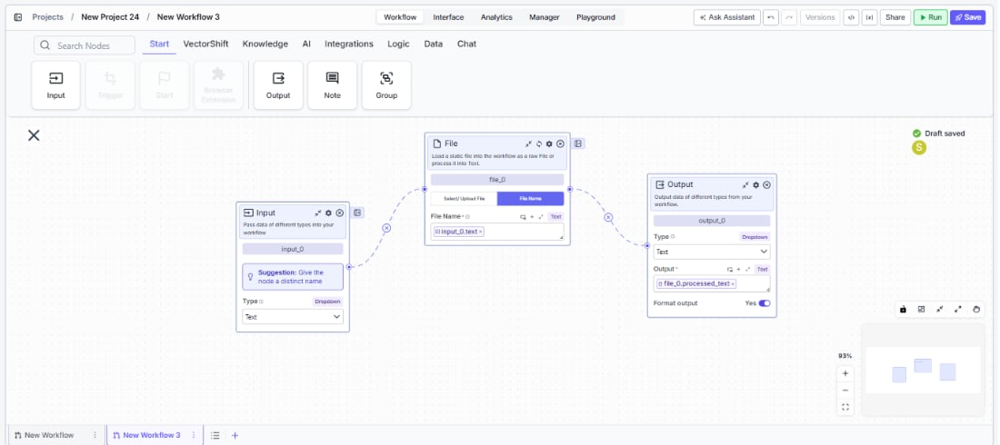

> ## Documentation Index
> Fetch the complete documentation index at: https://docs.vectorshift.ai/llms.txt
> Use this file to discover all available pages before exploring further.

# File

> Load a static file into a workflow as a raw file or process it into text.

<Card title="Use this node from the SDK" icon="code" href="/sdk/pipeline/nodes/data-loaders#file">
  Add it in Python with `pipeline.add(name="...").file(...)`. See the SDK reference.
</Card>

The File node loads a static file into your workflow, either as a raw file reference or processed into text. You can upload a file directly or reference an existing file from the VectorShift platform by name. Use it to bring documents into your workflow for processing — for example, loading a PDF contract for extraction, feeding a CSV into a data transformation workflow, or providing an image for analysis.

## Core Functionality

* Upload a file directly into the workflow or select an existing file from the VectorShift Files tab
* Output the file as a raw file reference, as processed text, or both
* Choose the document processing model (Default, Llama Parse, Textract, Reducto) for text extraction
* Reference files by name for dynamic file selection at runtime

## Tool Inputs

* `File` \* — **Required** · File upload · The file to load into the workflow. Drag and drop or click to upload.
* `File Name` \* — **Required** · Text · The name of the file. When using "File Name" mode, this references an existing file on the VectorShift platform.
* `Selected Option` — Dropdown · Default: `Select/ Upload File` · Options: `Select/ Upload File`, `File Name` · Choose between uploading a file directly or referencing a file by name from the platform.
* `File Parser` — Dropdown · Default: `Default` · Options: `Default`, `Llama Parse`, `Textract`, `Reducto` · The processing model for document parsing. Default includes standard OCR. Llama Parse handles complex features like tables and charts (0.3¢/page). Textract provides advanced extraction (1.5¢/page).

\* indicates a required field.

## Tool Outputs

* `file` — File · The raw file that was loaded.
* `processed_text` — Text · The text content extracted from the file using the selected parser.
* `file_name` — Text · The name of the loaded file.

<Tabs>
  <Tab title="Workflows">
    ## Overview

    In workflows, the File node provides a static file as input to the workflow. The file is loaded once at build time (or referenced by name at runtime) and its outputs — raw file, processed text, and file name — can be wired to any downstream node that accepts those types.

    ## Use Cases

    * **Document processing workflow** — Load a PDF financial report into the workflow and pass the processed text to an LLM for summarization or data extraction.
    * **Template-based generation** — Load a document template file and pass it to downstream nodes that fill in dynamic content.
    * **File format conversion** — Load a file and pass it through conversion nodes (e.g., CSV to Excel, text to file).
    * **Knowledge base population** — Load a file and pass it to a Knowledge Base Loader node to add it to a knowledge base.

    ## How It Works

    1. **Add the node** — On the workflow canvas, open the node panel and navigate to the **Knowledge** category. Drag **File** onto the canvas.

    <Frame>
      
    </Frame>

    2. **Choose the input mode** — Select `Select/ Upload File` to upload a file directly, or `File Name` to reference an existing file from the VectorShift Files tab by name.
    3. **Provide the file** — Upload a file or enter the file name depending on the selected mode.
    4. **Configure the parser** *(optional)* — If you need processed text output, choose the appropriate file parser (Default, Llama Parse, Textract, or Reducto) based on your document complexity.
    5. **Connect outputs** — Wire `file`, `processed_text`, or `file_name` to downstream nodes as needed.

    <Frame>
      
    </Frame>

    6. **Run the workflow** — Execute the workflow. The node loads the file and passes its outputs downstream.

    ## Settings

    * `Selected Option` — Dropdown · Default: `Select/ Upload File` · Upload directly or reference by name.
    * `File` — File upload · **Required** (when uploading) · The file to load.
    * `File Name` — Text · **Required** (when referencing by name) · The file name on the VectorShift platform.
    * `File Parser` — Dropdown · Default: `Default` · Document processing model.

    ## Best Practices

    * **Choose the right parser for your documents** — Use Default for standard text documents. Use Llama Parse for documents with complex tables, charts, or multi-column layouts. Use Textract for the most accurate extraction from scanned documents.
    * **Use File Name mode for dynamic workflows** — When building reusable workflows, reference files by name so the same workflow can process different files by changing the name parameter.
    * **Connect the appropriate output** — Use `file` when downstream nodes need the raw file (e.g., Knowledge Base Loader). Use `processed_text` when downstream nodes need text content (e.g., LLM nodes, text transformation nodes).

    ## Related Templates

    <CardGroup cols={2}>
      <Card title="Document Classification Agent" href="https://app.vectorshift.ai/marketplace">
        Automatically categorizes and tags incoming documents based on content and type.
      </Card>

      <Card title="Contract AI Analyst" href="https://app.vectorshift.ai/marketplace">
        Analyzes contracts to extract key terms, flag risks, and summarize obligations.
      </Card>

      <Card title="Term Sheet Agent" href="https://app.vectorshift.ai/marketplace">
        Generates and reviews term sheets by extracting and validating key deal terms.
      </Card>

      <Card title="Validation Agent" href="https://app.vectorshift.ai/marketplace">
        Validates data and documents against predefined rules, schemas, or compliance standards.
      </Card>
    </CardGroup>

    ## Common Issues

    For troubleshooting and common issues, see the [Common Issues](/docs/common-issues) page.
  </Tab>
</Tabs>
