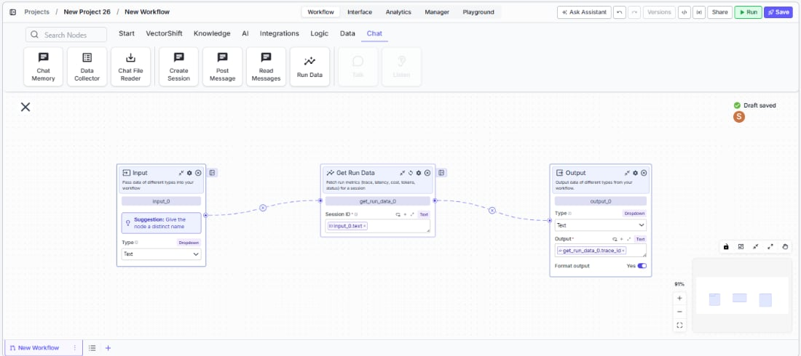
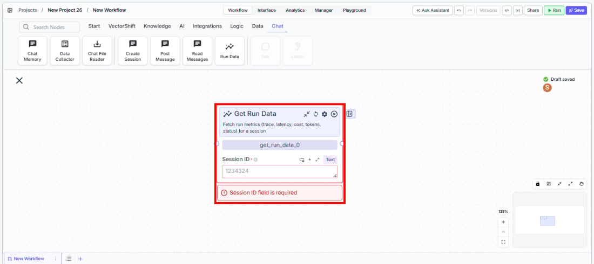

> ## Documentation Index
> Fetch the complete documentation index at: https://docs.vectorshift.ai/llms.txt
> Use this file to discover all available pages before exploring further.

# Get Run Data

> Fetch run metrics including trace, latency, cost, tokens, and status for a session.

<Card title="Use this node from the SDK" icon="code" href="/sdk/pipeline/nodes/chat#get_run_data">
  Add it in Python with `pipeline.add(name="...").get_run_data(...)`. See the SDK reference.
</Card>

The Get Run Data node fetches aggregated run metrics for a session, including trace ID, latency, cost, token usage, cache hit rates, and execution status. Use it to monitor and analyze workflow or agent execution performance — for example, tracking API costs across sessions, measuring response latency for SLA compliance, or checking whether a session completed successfully before proceeding.

## Core Functionality

* Fetches aggregated run metrics for a session by session ID
* Returns performance data: total latency, token usage, API cost, cache hit rates
* Returns execution status: success, failure, in\_progress, or not\_found
* Provides timing information: start time, end time, and trace ID for debugging

## Tool Inputs

* `Session ID` \* — Text. Required. The session ID (execution\_id) to fetch run metrics for.

\* *Required field*

## Tool Outputs

* `tokens` — Integer. Total tokens across all spans in the session.
* `avg_api_latency` — Decimal. Average API latency across LLM spans in seconds.
* `avg_cache_hit_rate` — Decimal. Average cache hit rate across LLM spans (0.0 to 1.0).
* `total_ai_cost` — Decimal. Total AI credits/cost across spans.
* `status` — Text. Aggregated status of the run (success, failure, in\_progress, not\_found).
* `status_message` — Text. Last status message from the run, if any.
* `trace_id` — Text. Trace ID associated with this session run.
* `total_latency` — Integer. Total latency in nanoseconds.
* `start_time` — Text. Earliest span start time.
* `end_time` — Text. Latest span end time.
* `total_cache_savings` — Decimal. Total cache savings across LLM spans.
* `total_cached_tokens` — Integer. Total cached tokens across LLM spans.

***

<Tabs>
  <Tab title="Workflows">
    ### Overview

    In workflows, the Get Run Data node connects to a session (via session ID) and retrieves performance and execution metrics. Use it after running an agent session to check costs, latency, token usage, and completion status. This enables monitoring workflows, cost tracking dashboards, and conditional logic based on execution results.

    <Frame>
      
    </Frame>

    ### Use Cases

    * Track total AI cost per session to monitor spending against budget thresholds and trigger alerts when costs exceed limits
    * Check session status after running an automated analysis to verify completion before sending results to stakeholders
    * Measure average API latency across sessions to monitor SLA compliance for customer-facing chatbots
    * Calculate cache hit rates to evaluate prompt caching effectiveness and optimize for cost savings
    * Log trace IDs and timing data for debugging failed or slow-running agent sessions

    ### How It Works

    #### Step 1: Add the Get Run Data Node

    In the workflow canvas, click the **Chat** tab and click **Run Data**.

    <Frame>
      
    </Frame>

    #### Step 2: Connect the Session ID

    Connect the `Session ID` input from an upstream Create Session or other node that provides a session/execution ID.

    #### Step 3: Connect Outputs

    Connect the relevant metric outputs to downstream nodes. For example, connect `status` to a condition node to branch on success/failure, or connect `total_ai_cost` to a notification node for cost alerts.

    #### Step 4: Test

    Run the workflow and verify that metrics are returned correctly for the specified session.

    ### Settings

    | Setting                        | Type   | Default | Description                                           |
    | ------------------------------ | ------ | ------- | ----------------------------------------------------- |
    | `Session ID`                   | Text   | —       | The session/execution ID. Required.                   |
    | `Show Success/Failure Outputs` | Toggle | Off     | Show additional output handles. **Advanced setting.** |

    ### Best Practices

    * **Use for cost monitoring.** Connect `total_ai_cost` to threshold checks and notifications to prevent runaway spending.
    * **Check status before proceeding.** Route the `status` output to a condition node to ensure the session completed successfully before acting on its results.
    * **Log metrics for analytics.** Store trace IDs, latency, and token counts for long-term performance analysis and optimization.
    * **Monitor cache effectiveness.** Track `avg_cache_hit_rate` and `total_cache_savings` to measure the impact of prompt caching strategies.
    * **Pair with Create Session and Post Message.** The full pattern is: Create Session → Post Message → Get Run Data to orchestrate and then measure agent interactions.

    ### Related Templates

    <CardGroup cols={2}>
      <Card title="Customer Support Chatbot" href="https://app.vectorshift.ai/marketplace">
        Handles common customer inquiries and support tickets through conversational AI.
      </Card>

      <Card title="Banking Helpdesk" href="https://app.vectorshift.ai/marketplace">
        Assists banking customers with account inquiries, transactions, and product questions.
      </Card>

      <Card title="CRM Insights Digest Agent" href="https://app.vectorshift.ai/marketplace">
        Summarizes and surfaces key CRM data insights for sales and relationship management teams.
      </Card>

      <Card title="Investor Helpdesk" href="https://app.vectorshift.ai/marketplace">
        Handles investor inquiries related to portfolios, statements, and fund performance.
      </Card>
    </CardGroup>

    ### Common Issues

    For help with common configuration issues, see the [Common Issues](/support) page.
  </Tab>
</Tabs>
