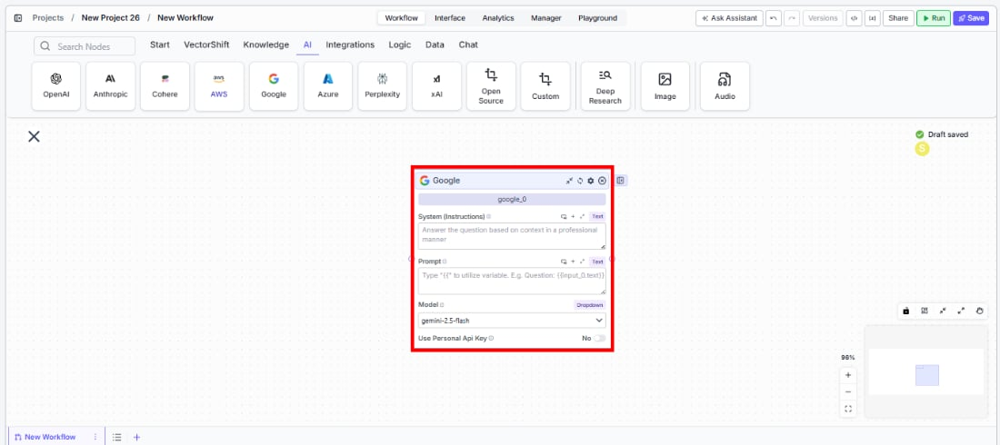
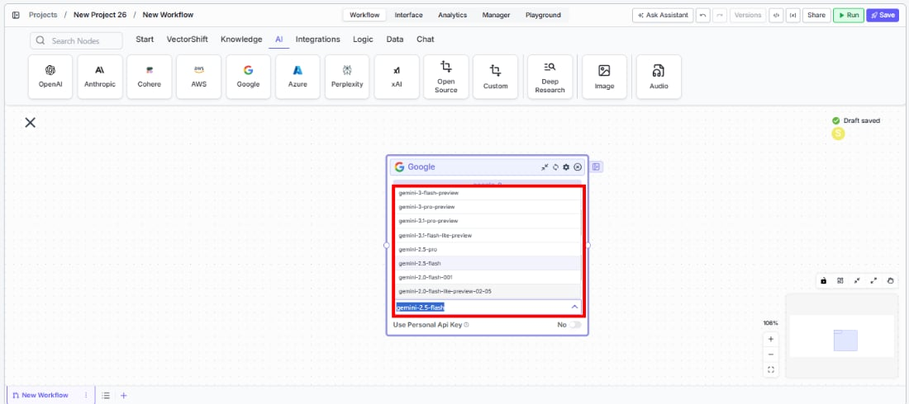
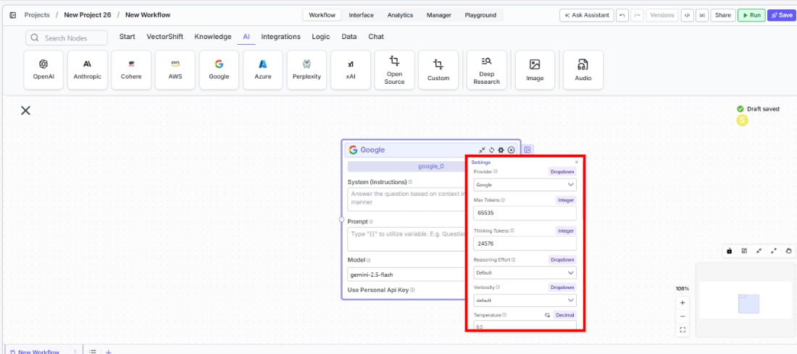
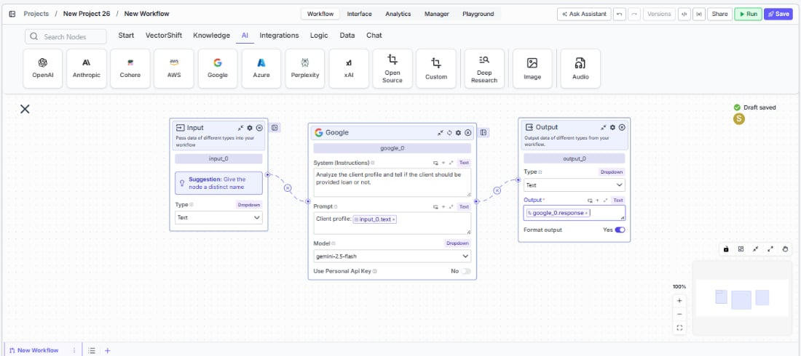

> ## Documentation Index
> Fetch the complete documentation index at: https://docs.vectorshift.ai/llms.txt
> Use this file to discover all available pages before exploring further.

# Google LLM

> Generate text responses using Google's Gemini models in your workflows.

<Card title="Use this node from the SDK" icon="code" href="/sdk/pipeline/nodes/llms#llm">
  Add it in Python with `pipeline.add(name="...").llm(...)`. See the SDK reference.
</Card>

The Google LLM node connects your workflows to Google's Gemini family of language models. Use it to generate text responses, analyze documents, answer questions grounded in knowledge bases, or produce structured JSON outputs — for example, summarizing earnings reports with extended thinking capabilities, classifying regulatory documents, or extracting structured data from financial filings.

## Core Functionality

* Generate text completions and conversational responses using Gemini models
* Process system instructions and dynamic prompts with variable interpolation
* Configure thinking tokens for extended reasoning on complex tasks
* Stream responses in real time for long-running generations
* Return structured JSON output with optional schema enforcement
* Track token usage and credit consumption per run
* Apply content moderation, PII detection, and safety guardrails
* Retry failed executions automatically with configurable intervals

## Tool Inputs

* `System Instructions` — (String) Instructions that guide the model's behavior, tone, and how it should use data provided in the prompt
* `Prompt` — (String) The data sent to the model. Type `{{` to open the variable builder and reference outputs from other nodes
* `Model` \* — (Enum (Dropdown), default: `gemini-2.5-flash`) Select from available Gemini models. Click **Dropdown** to view all options
* `Use Personal Api Key` — (Boolean, default: `No`) Toggle to use your own Google API key instead of VectorShift's shared key
* `Api Key` — (String) Your Google API key. Only visible when `Use Personal Api Key` is enabled
* `JSON Schema` — (String) JSON schema to enforce structured output format. Only visible when `JSON Response` is enabled

\* indicates a required field

## Tool Outputs

* `response` — (String (or Stream\<String> when streaming)) The generated text response from the model
* `prompt_response` — (String) The combined prompt and response content
* `tokens_used` — (Integer) Total number of tokens consumed (input + output)
* `input_tokens` — (Integer) Number of input tokens sent to the model
* `output_tokens` — (Integer) Number of output tokens generated by the model
* `credits_used` — (Decimal) VectorShift AI credits consumed for this run

<Tabs>
  <Tab title="Workflows">
    ## Overview

    The Google LLM node in workflows lets you place a Gemini model directly on the canvas, wire inputs and outputs to other nodes, and configure model behavior through the settings panel. Google Gemini models offer large context windows and extended thinking capabilities, making them well-suited for complex analysis tasks.

    ## Use Cases

    * **Extended reasoning for financial analysis** — Leverage thinking tokens to perform multi-step financial reasoning, such as evaluating a company's valuation based on multiple data points across filings and market data.
    * **Large document processing** — Analyze lengthy regulatory documents or multi-page contracts using Gemini's large context window to capture all relevant details in a single pass.
    * **Earnings call summarization** — Summarize quarterly earnings transcripts, extracting key metrics like revenue, EPS, and forward guidance for analyst review.
    * **Structured data extraction** — Pull structured fields from unstructured financial documents using JSON mode for consistent, machine-readable output.
    * **Client Q\&A systems** — Build knowledge-grounded chatbots that answer investor or client questions using retrieved context from knowledge bases.

    ## How It Works

    1. **Add the node to your workflow.** From the toolbar, open the **AI** category and drag the **Google** node onto the canvas.

    <Frame>
      
    </Frame>

    2. **Write your System Instructions.** Enter instructions in the `System Instructions` field to define the model's behavior, tone, and how it should use any data provided in the prompt.

    3. **Configure the Prompt.** In the `Prompt` field, type `{{` to open the variable builder and reference outputs from upstream nodes.

    4. **Select a model.** Use the `Model` dropdown to choose a Gemini model. Available options include `gemini-2.5-flash`, `gemini-2.5-pro`, `gemini-2.5-flash-preview`, `gemini-2.0-flash-001`, `gemini-2.0-pro-preview`, and others.

    <Frame>
      
    </Frame>

    5. **Open settings.** Click the **gear icon** (⚙) on the node to open the settings panel, where you can configure thinking tokens, token limits, temperature, retry behavior, and more.

    <Frame>
      
    </Frame>

    6. **Connect outputs.** Click the **Outputs** button to open the outputs panel. Wire the `response` output to downstream nodes. Use token and credit outputs for monitoring.

    <Frame>
      
    </Frame>

    7. **Run your workflow.** Execute the workflow. The Google node processes its inputs and returns the generated response along with usage metrics.

    ## Settings

    All settings below are accessed via the **gear icon** (⚙) on the node.

    | Setting                        | Type     | Default | Description                                                                                                                              |
    | ------------------------------ | -------- | ------- | ---------------------------------------------------------------------------------------------------------------------------------------- |
    | `Provider`                     | Dropdown | Google  | The LLM provider.                                                                                                                        |
    | `Max Tokens`                   | Integer  | 80535   | Maximum number of input + output tokens the model will process per run.                                                                  |
    | `Thinking Tokens`              | Integer  | 24576   | Maximum number of tokens the model can use for extended thinking and reasoning before generating a response.                             |
    | `Reasoning Effort`             | Dropdown | Default | Controls the depth of reasoning. Options: Default, Minimal, Low, Medium, High, None.                                                     |
    | `Verbosity`                    | Dropdown | Default | Controls the verbosity of model responses.                                                                                               |
    | `Temperature`                  | Float    | 0.5     | Controls response creativity. Higher values produce more diverse outputs; lower values produce more deterministic responses. Range: 0–1. |
    | `Top P`                        | Float    | 0.5     | Controls token sampling diversity. Higher values consider more tokens at each generation step. Range: 0–1.                               |
    | `Stream Response`              | Boolean  | Off     | Stream responses token-by-token instead of returning the full response at once.                                                          |
    | `JSON Output`                  | Boolean  | Off     | Return output as structured JSON. When enabled, a `JSON Schema` input appears for optional schema enforcement.                           |
    | `Show Sources`                 | Boolean  | Off     | Display source documents used for the response.                                                                                          |
    | `Toxic Input Filtration`       | Boolean  | Off     | Filter toxic input content.                                                                                                              |
    | `Safe Context Token Window`    | Boolean  | Off     | Automatically reduce context to fit within the model's maximum context window.                                                           |
    | `Retry On Failure`             | Boolean  | Off     | Enable automatic retries when execution fails.                                                                                           |
    | `Max Retries`                  | Integer  | —       | Maximum number of retry attempts. Visible when `Retry On Failure` is enabled.                                                            |
    | `Max Interval b/w re-try`      | Integer  | —       | Interval in milliseconds between retry attempts.                                                                                         |
    | **PII Detection**              |          |         |                                                                                                                                          |
    | `Name`                         | Boolean  | Off     | Detect and redact personal names from input.                                                                                             |
    | `Email`                        | Boolean  | Off     | Detect and redact email addresses from input.                                                                                            |
    | `Phone`                        | Boolean  | Off     | Detect and redact phone numbers from input.                                                                                              |
    | `Credit Card`                  | Boolean  | Off     | Detect and redact credit card numbers from input.                                                                                        |
    | `Address`                      | Boolean  | Off     | Detect and redact physical addresses from input.                                                                                         |
    | `Show Success/Failure Outputs` | Boolean  | —       | Display additional success and failure output ports on the node.                                                                         |

    ## Best Practices

    * **Use thinking tokens for complex analysis.** When the model needs to reason through multi-step financial calculations or weigh competing data points, increase the `Thinking Tokens` setting to give it more reasoning capacity.
    * **Leverage large context windows.** Gemini models support very large context windows — use this to feed entire financial documents rather than chunking, for more coherent analysis.
    * **Use JSON mode for structured extraction.** Enable `JSON Output` and provide a schema when extracting data from financial documents for consistent output.
    * **Monitor token usage carefully.** Thinking tokens count toward total usage. Connect `tokens_used` and `credits_used` to monitoring nodes.
    * **Enable Safe Context Token Window for variable-length inputs.** Prevents token-limit errors when processing documents of unpredictable size.
    * **Apply PII detection including address.** Google supports address-level PII detection in addition to standard fields — enable it for workflows processing client correspondence.

    ## Related Templates

    <CardGroup cols={2}>
      <Card title="Grant Matching AI Agent" href="https://app.vectorshift.ai/marketplace">
        Matches organizations or individuals to relevant grants based on their profile and eligibility criteria.
      </Card>

      <Card title="Spreadsheet Comparison Assistant" href="https://app.vectorshift.ai/marketplace">
        Compares two or more spreadsheets to identify discrepancies, changes, and anomalies.
      </Card>

      <Card title="Control Checker and Writer Agent" href="https://app.vectorshift.ai/marketplace">
        Audits existing controls and drafts new control documentation based on compliance requirements.
      </Card>

      <Card title="Application Risk Agent" href="https://app.vectorshift.ai/marketplace">
        Assesses risk levels in incoming applications using scoring models and policy rules.
      </Card>
    </CardGroup>

    ## Common Issues

    For troubleshooting common issues with this node, see the [Common Issues](/support) documentation.
  </Tab>
</Tabs>
