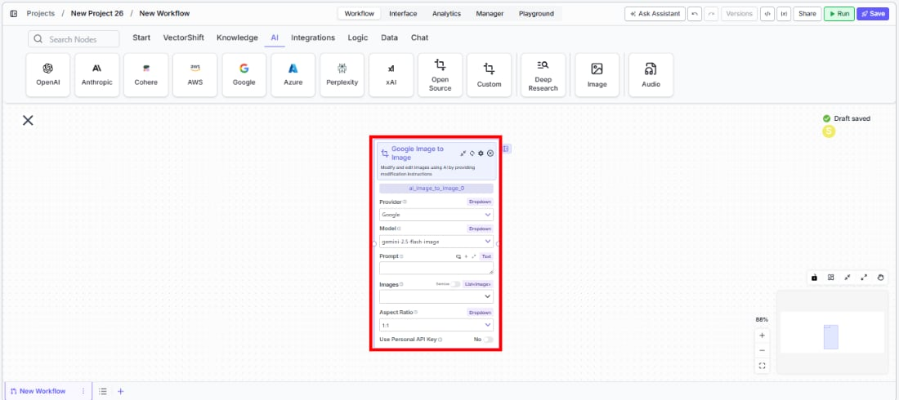

> ## Documentation Index
> Fetch the complete documentation index at: https://docs.vectorshift.ai/llms.txt
> Use this file to discover all available pages before exploring further.

# Image to Image

> Modify and edit images using AI models in your workflows and agents.

<Card title="Use this node from the SDK" icon="code" href="/sdk/pipeline/nodes/multi-modal#ai_image_to_image">
  Add it in Python with `pipeline.add(name="...").ai_image_to_image(...)`. See the SDK reference.
</Card>

The Image to Image node uses AI to modify existing images based on text instructions. Use it to edit, transform, or enhance images — for example, adding annotations to financial charts, applying branding to report visuals, redacting sensitive information from document scans, or transforming presentation graphics to match a consistent style.

## Core Functionality

* Modify and edit images using AI based on text prompts
* Support multiple input images (1–3) for best results
* Select aspect ratio for output images
* Choose from available image generation providers and models
* Use personal API keys for dedicated access

## Tool Inputs

* `Provider` \* — (Enum (Dropdown), default: `Google`) Select the model provider
* `Model` \* — (Enum (Dropdown), default: `gemini-2.5-flash-image`) Select the image-to-image model
* `Prompt` \* — (String) Instructions for how the AI should modify the images. Be specific about desired changes
* `Images` \* — (List\<Image>) Array of input images to modify. Provide 1–3 images for best results
* `Aspect Ratio` — (Enum (Dropdown), default: `1:1`) Select the aspect ratio for the output image. Workflows only
* `Use Personal API Key` — (Boolean, default: `No`) Toggle to use your own API key from the model provider
* `Api Key` — (String) Your API key. Only visible when `Use Personal API Key` is enabled

\* indicates a required field

## Tool Outputs

* `image` — (Image) The modified image

<Tabs>
  <Tab title="Agents">
    ## Overview

    The Image to Image tool in agents allows the AI to modify images during conversations based on user requests. The agent can automatically determine what modifications to make based on conversation context, or you can lock specific fields to fixed values.

    ## Use Cases

    * **Chart annotation** — Users can ask the agent to add labels, highlights, or callouts to financial charts and graphs.
    * **Brand consistency** — Apply consistent branding, color schemes, or watermarks to report visuals during a conversation.
    * **Document redaction** — Redact sensitive information from document images before sharing.
    * **Presentation graphics** — Transform or restyle presentation visuals to match corporate templates.

    ## How It Works

    1. **Add the tool to your agent.** In the agent builder, click **Add Tool** and select **Image to Image** from the available tools.

    2. **Configure input fields.** Each field can either be filled automatically by the agent based on conversation context, or locked to a fixed value:
       * `Provider` — Select the model provider (e.g., Google)
       * `Model` — Choose the image model (e.g., `gemini-2.5-flash-image`)
       * `Prompt` — The agent fills this based on the user's request, or you can set a fixed instruction
       * `Use Personal API Key` — Toggle if using your own key

    3. **Write the Tool Description.** Provide a clear description of what this tool does so the agent knows when to use it. For example: *"Use this tool to modify or edit images. Describe the desired changes clearly."*

    4. **Set Auto Run behavior.** Choose how the tool executes:
       * **Auto Run** — Executes automatically without user confirmation
       * **Require User Approval** — Asks the user before executing
       * **Let Agent Decide** — The agent determines whether to ask for approval

    5. **Test the tool.** Send a message to the agent with an image and modification instructions to verify the tool works correctly.

    ## Settings

    | Setting                | Type     | Default                  | Description                    |
    | ---------------------- | -------- | ------------------------ | ------------------------------ |
    | `Provider`             | Dropdown | Google                   | The image generation provider. |
    | `Model`                | Dropdown | `gemini-2.5-flash-image` | The image-to-image model.      |
    | `Use Personal API Key` | Boolean  | No                       | Use your own API key.          |

    ## Best Practices

    * **Write specific prompts.** Instead of "make it better," use precise instructions like "add a red circle highlighting the revenue growth bar in Q4."
    * **Provide 1–3 images.** The model works best with a small number of high-quality input images.
    * **Use Require User Approval for client-facing agents.** This lets users review modifications before they're applied.

    ## Common Issues

    For troubleshooting common issues with this node, see the [Common Issues](/support) documentation.
  </Tab>

  <Tab title="Workflows">
    ## Overview

    The Image to Image node in workflows lets you place an image modification model on the canvas, connect input images and text prompts, and output the modified image to downstream nodes.

    ## Use Cases

    * **Batch image processing** — Process multiple financial charts or document images through consistent modification instructions.
    * **Automated report styling** — Apply consistent visual transformations to charts and graphics generated by upstream nodes.
    * **Document preprocessing** — Clean up, enhance, or annotate scanned financial documents before further processing.
    * **Visual content generation** — Create variations of marketing or presentation visuals at scale.

    ## How It Works

    1. **Add the node to your workflow.** From the toolbar, open the **Image** category and drag the **Image to Image** node onto the canvas.

    <Frame>
      
    </Frame>

    2. **Select a provider and model.** Choose the `Provider` (e.g., Google) and `Model` (e.g., `gemini-2.5-flash-image`) from the dropdowns.

    3. **Write your prompt.** In the `Prompt` field, describe how you want the images modified. Be as specific as possible.

    4. **Connect input images.** Wire image outputs from upstream nodes to the `Images` input, or upload images directly.

    5. **Set aspect ratio.** Choose the output aspect ratio from the `Aspect Ratio` dropdown.

    6. **Connect the output.** Wire the `image` output to downstream nodes for further processing or display.

    7. **Run your workflow.** Execute the workflow to process the images.

    ## Settings

    | Setting                | Type     | Default                  | Description                                                                                              |
    | ---------------------- | -------- | ------------------------ | -------------------------------------------------------------------------------------------------------- |
    | `Provider`             | Dropdown | Google                   | The image generation provider.                                                                           |
    | `Model`                | Dropdown | `gemini-2.5-flash-image` | The image-to-image model. Options include `gemini-2.5-flash-image` and `gemini-2.0-flash-image-preview`. |
    | `Aspect Ratio`         | Dropdown | `1:1`                    | Output image aspect ratio.                                                                               |
    | `Use Personal API Key` | Boolean  | No                       | Use your own API key from the provider.                                                                  |

    ## Best Practices

    * **Be specific in your prompts.** Detailed modification instructions produce better results than vague descriptions.
    * **Use 1–3 input images.** The model performs best with a small number of inputs.
    * **Test with sample images first.** Verify the modification quality before running batch workflows.

    ## Common Issues

    For troubleshooting common issues with this node, see the [Common Issues](/support) documentation.
  </Tab>
</Tabs>
