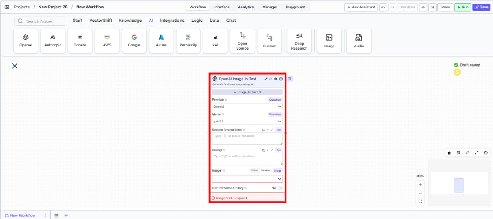
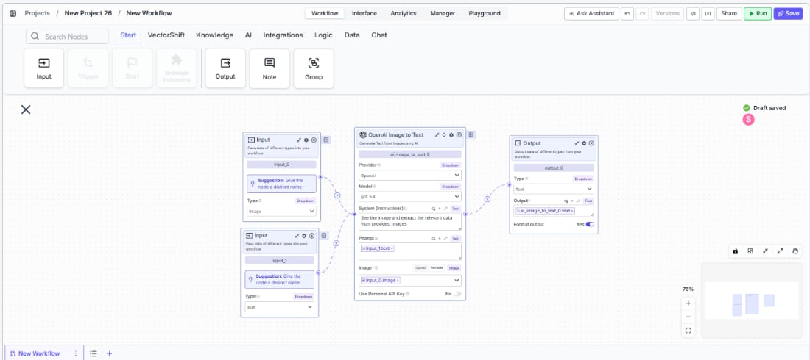

> ## Documentation Index
> Fetch the complete documentation index at: https://docs.vectorshift.ai/llms.txt
> Use this file to discover all available pages before exploring further.

# Image to Text

> Analyze images and generate text descriptions using AI models in your workflows and agents.

<Card title="Use this node from the SDK" icon="code" href="/sdk/pipeline/nodes/multi-modal#ai_image_to_text">
  Add it in Python with `pipeline.add(name="...").ai_image_to_text(...)`. See the SDK reference.
</Card>

The Image to Text node uses AI to analyze images and generate text descriptions, summaries, or structured data. Use it to extract information from financial charts, read text from document scans, describe visual content, or convert image-based data into machine-readable formats — for example, transcribing handwritten notes from meeting whiteboards, extracting data from screenshot tables, or describing chart trends from financial reports.

## Core Functionality

* Analyze images and generate text descriptions using vision-capable AI models
* Support multiple providers including OpenAI, Anthropic, Google, and xAI
* Process system instructions and prompts to guide image analysis
* Return structured JSON output with optional schema enforcement
* Stream responses for real-time output
* Track token usage per run

## Tool Inputs

* `Provider` \* — (Enum (Dropdown), default: `OpenAI`) Select the model provider (OpenAI, Anthropic, Google, xAI)
* `Model` \* — (Enum (Dropdown), default: `chatgpt-4o-latest`) Select the vision model. Options vary by provider
* `System (Instructions)` — (String) Instructions guiding how the model should analyze the image
* `Prompt` — (String) Specific instructions for what to analyze in the image
* `Image` \* — (Image) The image to analyze
* `Use Personal API Key` — (Boolean, default: `No`) Toggle to use your own API key
* `Api Key` — (String) Your API key. Only visible when `Use Personal API Key` is enabled
* `JSON Schema` — (String) JSON schema for structured output. Only visible when `JSON Response` is enabled

\* indicates a required field

## Tool Outputs

* `text` — (String (or Stream\<String> when streaming)) The generated text analysis of the image
* `tokens_used` — (Integer) Total number of tokens consumed

<Tabs>
  <Tab title="Agents">
    ## Overview

    The Image to Text tool in agents allows the AI to analyze images shared during conversations. The agent can automatically interpret images based on conversation context or follow specific analysis instructions you configure.

    ## Use Cases

    * **Financial chart interpretation** — Users share charts and the agent describes trends, key data points, and anomalies.
    * **Document scanning** — Extract text content from photographed or scanned financial documents.
    * **Receipt processing** — Analyze expense receipts to extract amounts, vendors, and dates.
    * **Visual compliance checks** — Review marketing materials or document images for compliance issues.

    ## How It Works

    1. **Add the tool to your agent.** In the agent builder, click **Add Tool** and select **Image to Text** from the available tools.

    2. **Configure input fields.** Each field can either be filled automatically by the agent based on conversation context, or locked to a fixed value:
       * `Provider` — Select the vision model provider
       * `Model` — Choose the vision model
       * `System (Instructions)` — Set analysis instructions
       * `Prompt` — The agent fills this based on the user's request
       * `Image` — The agent uses images shared in the conversation

    3. **Write the Tool Description.** Describe what the tool does so the agent knows when to use it. For example: *"Use this tool to analyze the content of images. Describe what you see in detail."*

    4. **Set Auto Run behavior.** Choose: Auto Run, Require User Approval, or Let Agent Decide.

    5. **Test the tool.** Share an image with the agent and ask it to analyze the content.

    ## Settings

    | Setting           | Type     | Default             | Description                        |
    | ----------------- | -------- | ------------------- | ---------------------------------- |
    | `Provider`        | Dropdown | OpenAI              | The vision model provider.         |
    | `Model`           | Dropdown | `chatgpt-4o-latest` | The vision model.                  |
    | `Max Tokens`      | Integer  | 128000              | Maximum output tokens.             |
    | `Temperature`     | Float    | 0.7                 | Controls response creativity.      |
    | `Top P`           | Float    | 0.9                 | Controls token sampling diversity. |
    | `JSON Response`   | Boolean  | Off                 | Return structured JSON output.     |
    | `Stream Response` | Boolean  | Off                 | Stream the response.               |

    ## Best Practices

    * **Write specific analysis prompts.** Instead of "describe this image," use "extract all numerical data from this financial chart including axis labels, data points, and trends."
    * **Choose the right provider for your task.** GPT-4o models excel at detailed image analysis; Claude models are strong at document interpretation.
    * **Use JSON mode for data extraction.** When extracting structured data from images, enable JSON Response with a schema.

    ## Related Templates

    <CardGroup cols={2}>
      <Card title="Document Classification Agent" href="https://app.vectorshift.ai/marketplace">
        Automatically categorizes and tags incoming documents based on content and type.
      </Card>

      <Card title="Contract AI Analyst" href="https://app.vectorshift.ai/marketplace">
        Analyzes contracts to extract key terms, flag risks, and summarize obligations.
      </Card>

      <Card title="Validation Agent" href="https://app.vectorshift.ai/marketplace">
        Validates data and documents against predefined rules, schemas, or compliance standards.
      </Card>

      <Card title="Term Sheet Agent" href="https://app.vectorshift.ai/marketplace">
        Generates and reviews term sheets by extracting and validating key deal terms.
      </Card>
    </CardGroup>

    ## Common Issues

    For troubleshooting common issues with this node, see the [Common Issues](/support) documentation.
  </Tab>

  <Tab title="Workflows">
    ## Overview

    The Image to Text node in workflows lets you connect an image input to a vision model and output the generated text analysis to downstream nodes. This is useful for building automated image processing workflows.

    ## Use Cases

    * **Batch document OCR** — Process stacks of scanned financial documents and extract text for indexing or search.
    * **Chart data extraction** — Extract numerical data from financial charts and feed it to downstream analysis nodes.
    * **Visual quality assurance** — Automatically describe and verify visual content in generated reports.
    * **Multimodal workflows** — Combine image analysis with text processing for end-to-end document understanding workflows.

    ## How It Works

    1. **Add the node to your workflow.** From the toolbar, open the **Image** category and drag the **Image to Text** node onto the canvas.

    <Frame>
      
    </Frame>

    2. **Select a provider and model.** Choose the `Provider` (e.g., OpenAI) and `Model` (e.g., `gpt-4.1`) from the dropdowns.

    3. **Configure instructions.** Enter analysis instructions in the `System (Instructions)` and `Prompt` fields.

    4. **Connect the image input.** Wire an image output from an upstream node to the `Image` input.

    5. **Connect outputs.** Wire the `text` output to downstream nodes for further processing.

    <Frame>
      
    </Frame>

    6. **Run your workflow.** Execute the workflow to analyze the image and generate text.

    ## Settings

    | Setting                        | Type     | Default             | Description                                                 |
    | ------------------------------ | -------- | ------------------- | ----------------------------------------------------------- |
    | `Provider`                     | Dropdown | OpenAI              | The vision model provider (OpenAI, Anthropic, Google, xAI). |
    | `Model`                        | Dropdown | `chatgpt-4o-latest` | The vision model.                                           |
    | `Max Tokens`                   | Integer  | 128000              | Maximum output tokens.                                      |
    | `Temperature`                  | Float    | 0.7                 | Controls response creativity.                               |
    | `Top P`                        | Float    | 0.9                 | Controls token sampling diversity.                          |
    | `JSON Response`                | Boolean  | Off                 | Return structured JSON output.                              |
    | `Stream Response`              | Boolean  | Off                 | Stream the response.                                        |
    | `Use Personal API Key`         | Boolean  | No                  | Use your own API key.                                       |
    | `Show Success/Failure Outputs` | Boolean  | —                   | Display additional output ports.                            |

    ## Best Practices

    * **Use specific prompts for extraction tasks.** Guide the model with detailed instructions about what to extract from the image.
    * **Enable JSON mode for structured data.** Provide a schema when you need consistent structured output across many images.
    * **Adjust temperature for consistency.** Lower temperature (closer to 0) for factual extraction; higher for creative descriptions.

    ## Related Templates

    <CardGroup cols={2}>
      <Card title="Document Classification Agent" href="https://app.vectorshift.ai/marketplace">
        Automatically categorizes and tags incoming documents based on content and type.
      </Card>

      <Card title="Contract AI Analyst" href="https://app.vectorshift.ai/marketplace">
        Analyzes contracts to extract key terms, flag risks, and summarize obligations.
      </Card>

      <Card title="Validation Agent" href="https://app.vectorshift.ai/marketplace">
        Validates data and documents against predefined rules, schemas, or compliance standards.
      </Card>

      <Card title="Term Sheet Agent" href="https://app.vectorshift.ai/marketplace">
        Generates and reviews term sheets by extracting and validating key deal terms.
      </Card>
    </CardGroup>

    ## Common Issues

    For troubleshooting common issues with this node, see the [Common Issues](/support) documentation.
  </Tab>
</Tabs>
