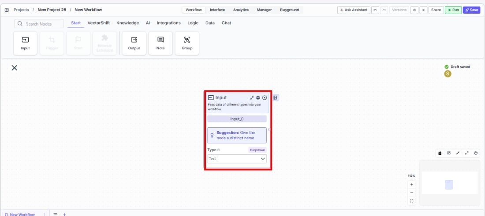
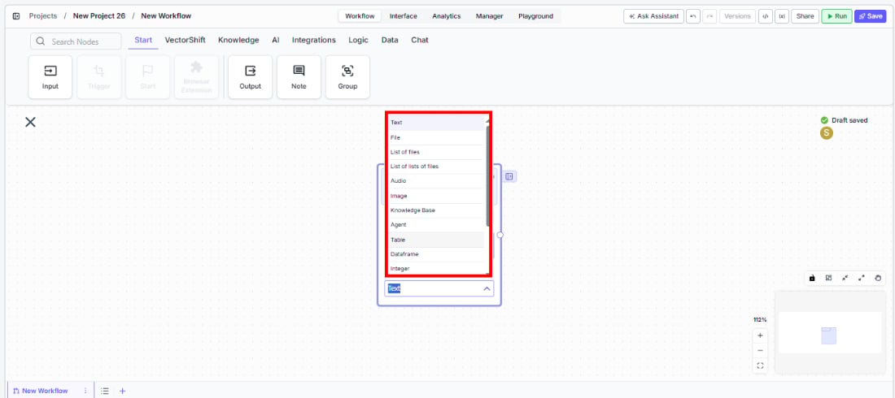
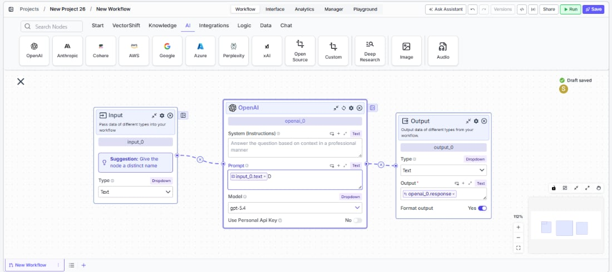

> ## Documentation Index
> Fetch the complete documentation index at: https://docs.vectorshift.ai/llms.txt
> Use this file to discover all available pages before exploring further.

# Input

> Pass data of different types into your workflow as an entry point for execution.

<Card title="Use this node from the SDK" icon="code" href="/sdk/pipeline/nodes/start#input">
  Add it in Python with `pipeline.add(name="...").input(...)`. See the SDK reference.
</Card>

The Input node is the primary entry point for passing data into a workflow. It defines a typed input that users or external systems provide when the workflow runs — for example, a text prompt for an LLM, a PDF file for extraction, an image for analysis, or structured data like tables and integers for processing. Each Input node creates a corresponding field in the workflow's run interface, API, or chatbot.

## Core Functionality

* Defines a typed input parameter for the workflow that appears in the run interface, API, or chatbot
* Supports a wide range of data types: Text, File, List of files, Audio, Image, Knowledge Base, Agent, Table, Dataframe, Integer, Decimal, Boolean, Timestamp, List of text, and more
* Optionally sets a default value to use when no input is provided at runtime
* The node name becomes the input field label — give each Input node a distinct, descriptive name

## Tool Inputs

This node has no upstream input connections. It receives data from users or external systems at runtime.

* `Type` — Dropdown. Default: `Text`. The data type of the input. Options: Text, File, List of files, List of lists of files, Audio, Image, Knowledge Base, Agent, Table, Dataframe, Integer, Decimal, Boolean, Timestamp, List of text, List of lists of text.

## Tool Outputs

The output field changes based on the selected `Type`:

* `text` — Text. The text that was passed in. (When Type is Text.)
* `file` — File. The file that was passed in. (When Type is File.)
* `processed_text` — Text. The processed text of the file. (When Type is File.)
* `file_name` — Text. The name of the file. (When Type is File.)
* Other types produce corresponding typed outputs (e.g., Image, Audio, Integer, etc.).

***

<Tabs>
  <Tab title="Workflows">
    ### Overview

    In workflows, the Input node defines what data the workflow expects when it runs. Each Input node becomes a field in the workflow's execution interface — whether that's the Run dialog, an API call, a chatbot message, or a form. The node outputs the provided data to downstream nodes for processing. Use multiple Input nodes to accept several parameters (e.g., a document and a query) in a single workflow run.

    ### Use Cases

    * Accept a text query from a user and route it to an LLM node for financial analysis or summarization
    * Receive a PDF upload (financial statement, invoice, contract) and pass it through extraction and processing nodes
    * Collect structured inputs like account numbers (Integer), transaction amounts (Decimal), or approval flags (Boolean) for automated workflows
    * Accept an image (receipt, check, ID document) for OCR or image-to-text processing
    * Provide a Knowledge Base reference as input to scope a semantic search to a specific data source

    ### How It Works

    #### Step 1: Add the Input Node

    In the workflow canvas, click the **Start** tab in the node palette and click **Input**. Drag it onto the canvas.

    <Frame>
      
    </Frame>

    #### Step 2: Name the Input

    The node displays a suggestion: *"Give the node a distinct name."* Rename the node to describe the input (e.g., "User Query", "Upload Document", "Account Number"). The name appears as the field label when the workflow is run.

    #### Step 3: Select the Data Type

    Use the `Type` dropdown to select the appropriate data type. The default is `Text`. Choose from: Text, File, List of files, List of lists of files, Audio, Image, Knowledge Base, Agent, Table, Dataframe, Integer, Decimal, Boolean, Timestamp, List of text, or List of lists of text.

    The output handle updates to match the selected type.

    <Frame>
      
    </Frame>

    #### Step 4: Configure Settings (Optional)

    Click the settings icon to open the Settings panel:

    * **`Description`** — Enter a description for this input. This text appears as a hint in the run interface to help users understand what to provide.
    * **`Use Default Value`** — Toggle on to set a default value that is used when no input is provided at runtime. When enabled, a default value field appears where you can enter the fallback value.

    #### Step 5: Connect to Downstream Nodes

    Connect the output handle to the downstream node that processes this input. For example, connect a Text output to an LLM's prompt input, or a File output to a file processing node.

    <Frame>
      
    </Frame>

    ### Settings

    | Setting             | Type     | Default | Description                                               |
    | ------------------- | -------- | ------- | --------------------------------------------------------- |
    | `Type`              | Dropdown | Text    | The data type of the input.                               |
    | `Description`       | Text     | —       | A description shown as a hint in the run interface.       |
    | `Use Default Value` | Toggle   | Off     | Enable to set a fallback value when no input is provided. |

    ### Best Practices

    * **Give each Input node a descriptive name.** The node name becomes the field label in the run interface. "User Query" is far clearer than "input\_0" for someone running the workflow.
    * **Use the Description field.** Add a brief description (e.g., "Upload a PDF financial statement") so users running the workflow know exactly what to provide.
    * **Set default values for optional inputs.** If an input has a sensible default (e.g., a default date range or model name), enable `Use Default Value` so the workflow can run without requiring every field.
    * **Match the Type to your data.** Using the correct type (Integer, Decimal, Boolean) instead of always using Text ensures downstream nodes receive properly typed data and avoids unnecessary type conversion steps.
    * **Use multiple Input nodes for multi-parameter workflows.** If your workflow needs a query and a file, add two Input nodes rather than trying to combine them into one.

    ### Common Issues

    For help with common configuration issues, see the [Common Issues](/support) page.
  </Tab>
</Tabs>
