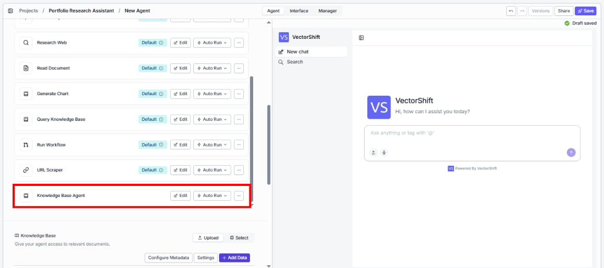
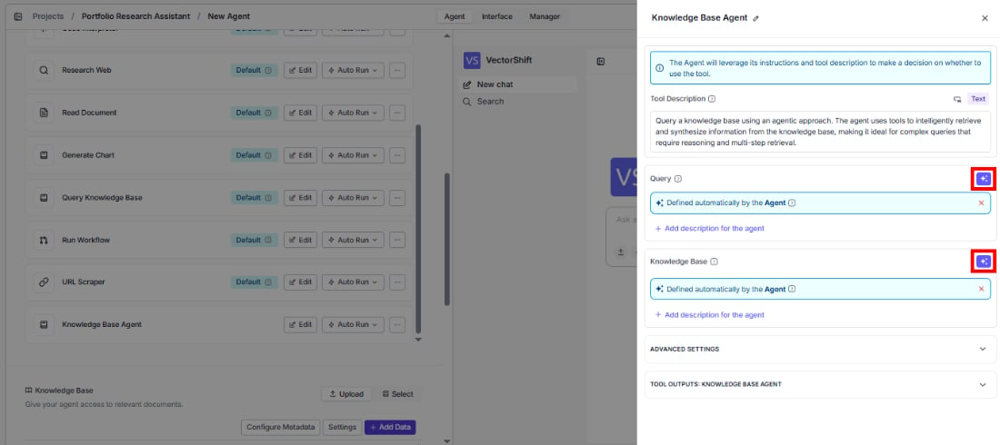
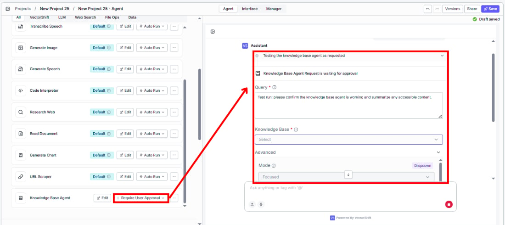
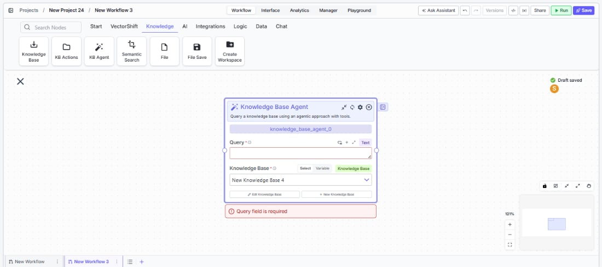
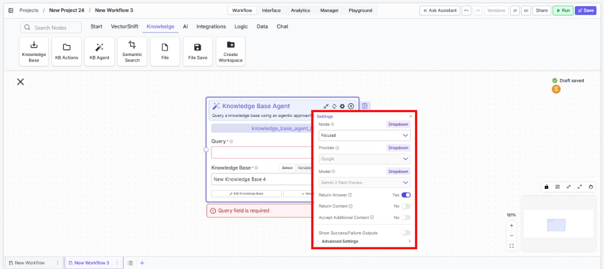
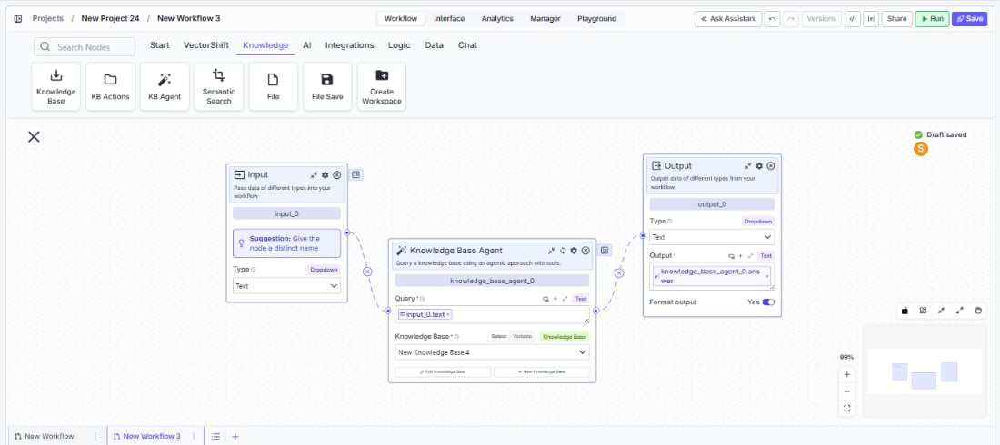

> ## Documentation Index
> Fetch the complete documentation index at: https://docs.vectorshift.ai/llms.txt
> Use this file to discover all available pages before exploring further.

# Knowledge Base Agent

> Query a knowledge base using an agentic approach that intelligently determines the best retrieval strategy.

<Card title="Use this node from the SDK" icon="code" href="/sdk/pipeline/nodes/knowledge#knowledge_base_agent">
  Add it in Python with `pipeline.add(name="...").knowledge_base_agent(...)`. See the SDK reference.
</Card>

The Knowledge Base Agent node queries a knowledge base using an AI-powered agentic approach with tools. Instead of performing a simple vector search, it uses an LLM to reason about the query, determine the best retrieval strategy, and synthesize a coherent answer from the retrieved context. Use it to build intelligent Q\&A systems — for example, answering complex compliance questions across a regulatory document library, or synthesizing insights from multiple earnings reports stored in a knowledge base.

## Core Functionality

* Query a knowledge base using an AI agent that reasons about the best retrieval approach
* Choose between Fast, Focused, and Deep query modes to balance speed and thoroughness
* Optionally return the source context and chunks used to generate the answer
* Accept additional context (e.g., conversation history) to improve query relevance
* Select the LLM provider and model powering the agent's reasoning

## Tool Inputs

* `Knowledge Base` \* — **Required** · Knowledge Base selector · The knowledge base to query.
* `Query` \* — **Required** · Text · The natural language query. The agent uses this to determine the best way to query the knowledge base. Include the key criteria needed to answer the query.
* `Mode` — Dropdown · Default: `Focused` · Options: `Fast`, `Focused`, `Deep` · Controls the query effort — Fast for quick answers, Focused for balanced depth, Deep for thorough analysis.
* `Return Answer` — Boolean · Default: `true` · When enabled, generates a synthesized answer from the knowledge base.
* `Return Context` — Boolean · Default: `false` · When enabled, returns the relevant context and chunks used to generate the answer.
* `Accept Additional Context` — Boolean · Default: `false` · When enabled, shows an additional context input to provide supplementary information to the agent. *(Advanced setting)*
* `Additional Context` — Text · Optional · Additional context to help the agent understand the query better (e.g., conversation history, user preferences). Appears when `Accept Additional Context` is enabled.
* `Provider` — Dropdown · Default: `Google` · The LLM provider used by the agent. *(Advanced setting)*
* `Model` — Dropdown · Default: `gemini-3-flash-preview` · The LLM model used by the agent. *(Advanced setting)*

\* indicates a required field.

## Tool Outputs

* `answer` — Text · The answer synthesized by the agent from the knowledge base.
* `context` — Text · The formatted context and chunks used by the agent to generate the answer. Only present when `Return Context` is enabled.

<Tabs>
  <Tab title="Agents">
    ## Overview

    When added as a tool inside an agent, the Knowledge Base Agent enables your primary agent to delegate complex knowledge base queries to a specialized retrieval agent. The primary agent passes the query, the retrieval agent reasons about the best search strategy, fetches relevant chunks, and returns a synthesized answer — all within the conversation flow.

    ## Use Cases

    * **Regulatory Q\&A assistant** — A client-facing agent delegates SEC filing questions to a Knowledge Base Agent tool connected to a regulatory document library, returning precise citations.
    * **Investment research copilot** — An analyst agent queries a knowledge base of earnings transcripts and annual reports to answer specific questions about company performance.
    * **Policy lookup for advisors** — A financial advisor agent uses a Knowledge Base Agent to retrieve and summarize relevant sections from internal compliance policies.
    * **Due diligence support** — An M\&A agent queries a knowledge base of target company documents to answer specific due diligence questions with sourced context.
    * **Client portfolio FAQ** — A wealth management agent queries product knowledge bases to answer client questions about fund strategies, fees, and performance history.

    ## How It Works

    1. **Add the tool** — In the agent builder, open the tool panel and navigate to the **Knowledge** category. Select **Knowledge Base Agent** to add it as a tool.

    <Frame>
      
    </Frame>

    2. **Select the knowledge base** — Use the `Knowledge Base` selector to choose which knowledge base the agent will query.
    3. **Configure input fields** — The `Query` field can be left open for the primary agent to fill dynamically based on conversation context, or locked to a fixed value for consistent queries. Click the sparkle icon to switch fields between dynamic and static mode.

    <Frame>
      
    </Frame>

    4. **Write a Tool Description** — Describe when the agent should use this tool. Example: *"Use this tool to answer questions about SEC regulatory filings. Provide a specific, detailed query including the regulation name or section number."*
    5. **Set Auto Run behavior** — Choose how the tool executes:
       * **Auto Run** — Queries the knowledge base immediately.
       * **Require User Approval** — Pauses for user confirmation before querying.
       * **Let Agent Decide** — The agent determines whether approval is needed based on context.

    <Frame>
      
    </Frame>

    6. **Test the tool** — Send a question in the chat interface that should trigger the knowledge base query and verify the agent returns a relevant, sourced answer.

    ## Settings

    * `Knowledge Base` — Knowledge Base selector · Default: none · The knowledge base to query.
    * `Tool Description` — Text · Default: none · Describes when and how the agent should use this tool.
    * `Auto Run` — Dropdown · Default: Auto Run · Controls execution behavior.

    **Advanced Settings:**

    * `Provider` — Dropdown · Default: `Google` · LLM provider for the retrieval agent.
    * `Model` — Dropdown · Default: `gemini-3-flash-preview` · LLM model for the retrieval agent.
    * `Mode` — Dropdown · Default: `Focused` · Query depth (Fast, Focused, Deep).
    * `Return Context` — Boolean · Default: `false` · Return source chunks alongside the answer.
    * `Accept Additional Context` — Boolean · Default: `false` · Enable additional context input.

    ## Best Practices

    * **Write specific queries** — The more specific the query, the better the agent can target its retrieval. Include entity names, date ranges, and specific metrics rather than broad questions.
    * **Use Deep mode for complex questions** — When queries span multiple documents or require cross-referencing (e.g., comparing financials across quarters), use Deep mode for thorough analysis.
    * **Enable Return Context for auditable answers** — In regulated industries, enable Return Context so users can verify the sources behind every answer.
    * **Provide additional context for follow-ups** — Enable Accept Additional Context and pass conversation history so the agent understands follow-up questions in context.
    * **Match the knowledge base to the query domain** — Connect the tool to a knowledge base that contains the relevant documents. A single agent can have multiple Knowledge Base Agent tools, each pointing to a different knowledge base.

    ## Related Templates

    <CardGroup cols={2}>
      <Card title="Contract AI Analyst" href="https://app.vectorshift.ai/marketplace">
        Analyzes contracts to extract key terms, flag risks, and summarize obligations.
      </Card>

      <Card title="Investor Helpdesk" href="https://app.vectorshift.ai/marketplace">
        Handles investor inquiries related to portfolios, statements, and fund performance.
      </Card>

      <Card title="Company Policy Compliance Chatbot" href="https://app.vectorshift.ai/marketplace">
        Answers employee questions about internal policies and flags potential compliance issues.
      </Card>

      <Card title="IC Memos Knowledge Base" href="https://app.vectorshift.ai/marketplace">
        Centralized searchable repository of investment committee memos for quick reference.
      </Card>
    </CardGroup>

    ## Common Issues

    For troubleshooting and common issues, see the [Common Issues](/docs/common-issues) page.
  </Tab>

  <Tab title="Workflows">
    ## Overview

    In workflows, the Knowledge Base Agent node acts as an intelligent retrieval step that queries a knowledge base, reasons about the best search strategy, and returns a synthesized answer. Connect upstream nodes to provide the query and optionally additional context, then wire the answer output to downstream nodes for further processing or display.

    ## Use Cases

    * **Automated report enrichment** — A workflow collects key questions from a template, passes each to a Knowledge Base Agent node connected to a research library, and assembles the answers into a formatted report.
    * **Compliance screening workflow** — A workflow feeds extracted document clauses into a Knowledge Base Agent to check them against a regulatory knowledge base and flag potential issues.
    * **Customer inquiry routing** — A workflow uses a Knowledge Base Agent to attempt answering a customer question; if the confidence is low, it routes to a human agent.
    * **Batch Q\&A processing** — A workflow iterates over a list of analyst questions and queries a knowledge base for each, outputting a structured Q\&A document.

    ## How It Works

    1. **Add the node** — On the workflow canvas, open the node panel and navigate to the **Knowledge** category. Drag **Knowledge Base Agent** onto the canvas.

    <Frame>
      
    </Frame>

    2. **Set the query** — Enter a query in the `Query` field or connect an upstream text node. This field is required.
    3. **Select the knowledge base** — Use the `Knowledge Base` selector to choose the target knowledge base. This field is required. You can select from existing knowledge bases or connect a knowledge base reference from an upstream node.
    4. **Configure mode and options** — Set the query `Mode` (Fast, Focused, Deep), toggle `Return Context` if you need source chunks, and enable `Accept Additional Context` if supplementary information is available.

    <Frame>
      
    </Frame>

    5. **Configure advanced settings** — Optionally change the `Provider` and `Model` for the retrieval agent, and adjust settings like `Return Context` and `Accept Additional Context`.
    6. **Connect outputs** — Wire the `answer` output (and optionally `context`) to downstream nodes for further processing.

    <Frame>
      
    </Frame>

    7. **Run the workflow** — Execute the workflow. The node queries the knowledge base and passes the synthesized answer downstream.

    ## Settings

    * `Query` — Text · **Required** · The natural language query to send to the knowledge base agent.
    * `Knowledge Base` — Knowledge Base selector · **Required** · The knowledge base to query. Supports Select, Variable, and Knowledge Base connection modes.

    **Advanced Settings:**

    * `Provider` — Dropdown · Default: `Google` · LLM provider for the retrieval agent.
    * `Model` — Dropdown · Default: `gemini-3-flash-preview` · LLM model for the retrieval agent.
    * `Mode` — Dropdown · Default: `Focused` · Query depth (Fast, Focused, Deep).
    * `Return Context` — Boolean · Default: `false` · Return the source context and chunks used.
    * `Accept Additional Context` — Boolean · Default: `false` · Show an additional context input field.
    * `Show Source/Chunk Output` — Boolean · Controls whether source and chunk details are shown in outputs.

    ## Best Practices

    * **Choose the right mode for your use case** — Use Fast for simple lookups, Focused for standard Q\&A, and Deep when queries require reasoning across multiple documents.
    * **Enable Return Context for traceability** — In financial workflows, always enable Return Context so downstream nodes can include citations and source references in generated reports.
    * **Use variables for dynamic knowledge base selection** — When building multi-tenant workflows, connect the Knowledge Base input via a variable to dynamically select the correct knowledge base per run.
    * **Pair with condition nodes** — Add a condition node after the Knowledge Base Agent to check answer quality or relevance before passing results downstream.
    * **Provide additional context from upstream** — Enable Accept Additional Context and connect relevant upstream outputs (e.g., extracted entities, user preferences) to improve retrieval accuracy.

    ## Related Templates

    <CardGroup cols={2}>
      <Card title="Contract AI Analyst" href="https://app.vectorshift.ai/marketplace">
        Analyzes contracts to extract key terms, flag risks, and summarize obligations.
      </Card>

      <Card title="Investor Helpdesk" href="https://app.vectorshift.ai/marketplace">
        Handles investor inquiries related to portfolios, statements, and fund performance.
      </Card>

      <Card title="Company Policy Compliance Chatbot" href="https://app.vectorshift.ai/marketplace">
        Answers employee questions about internal policies and flags potential compliance issues.
      </Card>

      <Card title="IC Memos Knowledge Base" href="https://app.vectorshift.ai/marketplace">
        Centralized searchable repository of investment committee memos for quick reference.
      </Card>
    </CardGroup>

    ## Common Issues

    For troubleshooting and common issues, see the [Common Issues](/docs/common-issues) page.
  </Tab>
</Tabs>
