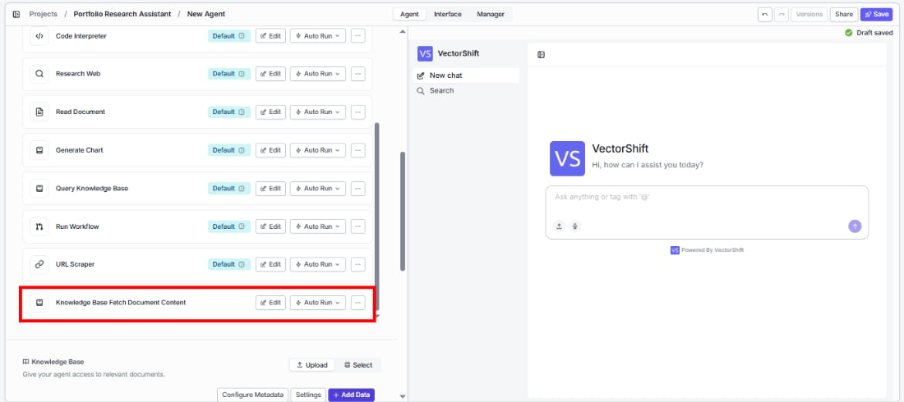
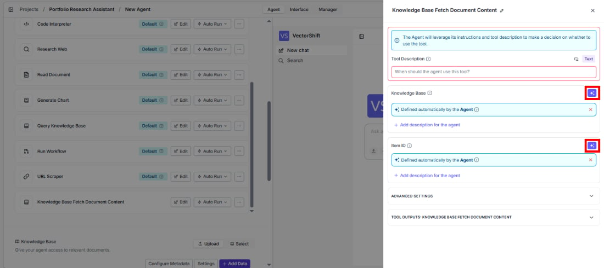
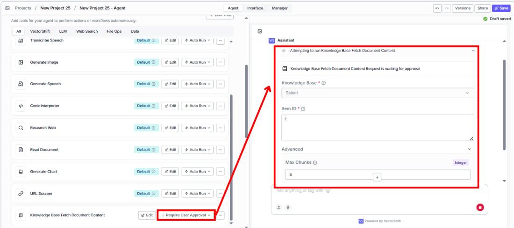
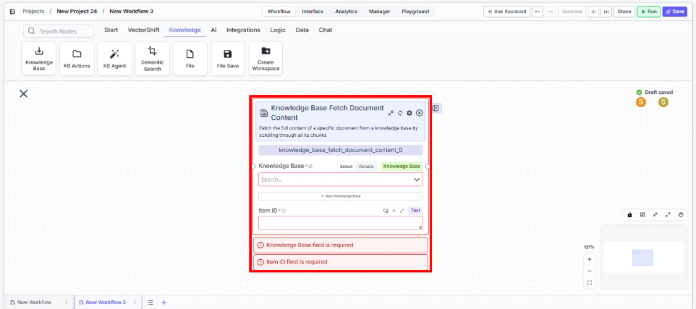

> ## Documentation Index
> Fetch the complete documentation index at: https://docs.vectorshift.ai/llms.txt
> Use this file to discover all available pages before exploring further.

# Knowledge Base Fetch Document Content

> Fetch the full content of a specific document from a knowledge base by reading through all its chunks.

<Card title="Use this node from the SDK" icon="code" href="/sdk/pipeline/nodes/knowledge#knowledge_base_fetch_document_content">
  Add it in Python with `pipeline.add(name="...").knowledge_base_fetch_document_content(...)`. See the SDK reference.
</Card>

The Knowledge Base Fetch Document Content node retrieves the complete text content of a specific document stored in a knowledge base. Unlike semantic search which returns relevant chunks, this node returns the entire document — similar to a `cat` command for reading a file. Use it when you need the full text of a known document — for example, retrieving a complete contract for clause-by-clause analysis, or pulling an entire earnings transcript for summarization.

## Core Functionality

* Fetch the full content of a specific document from a knowledge base by its item ID
* Reassemble all chunks belonging to the document into a single formatted text output
* Control the maximum number of chunks included to handle very large documents
* Works with any document type stored in the knowledge base (PDFs, text files, web pages, etc.)

## Tool Inputs

* `Knowledge Base` \* — **Required** · Knowledge Base selector · The knowledge base containing the document to fetch.
* `Item ID` \* — **Required** · Text · The item ID of the document to fetch content from. Typically obtained from a Knowledge Base Fetch Items or Knowledge Base List Items node.
* `Max Chunks` — Integer · Default: `200` · Maximum number of chunks to include in the content. *(Advanced setting)*

\* indicates a required field.

## Tool Outputs

* `document_content` — Text · The full document content as formatted text, reassembled from all chunks.

<Tabs>
  <Tab title="Agents">
    ## Overview

    When added as a tool inside an agent, Knowledge Base Fetch Document Content lets the agent retrieve the complete text of a specific document during a conversation. The agent can use this to read full documents when a user asks about a specific file, rather than relying on chunk-based search results that may miss important context.

    ## Use Cases

    * **Full contract review** — An agent fetches the complete text of a specific contract from a legal knowledge base when a user asks to review all terms and conditions.
    * **Earnings transcript analysis** — An agent retrieves a full earnings call transcript to answer detailed questions that span multiple sections of the document.
    * **Regulatory filing retrieval** — A compliance agent fetches complete SEC filings when a user needs to review an entire document rather than isolated excerpts.
    * **Policy document lookup** — An HR or compliance agent retrieves full policy documents by ID when users need to understand the complete policy context.
    * **Report compilation** — An agent fetches multiple full documents by their IDs to compile a comprehensive research report from existing materials.

    ## How It Works

    1. **Add the tool** — In the agent builder, open the tool panel and navigate to the **Knowledge** category. Select **Knowledge Base Fetch Document Content** to add it as a tool.

    <Frame>
      
    </Frame>

    2. **Select the knowledge base** — Use the `Knowledge Base` selector to choose which knowledge base contains the documents.
    3. **Configure input fields** — The `Item ID` field can be left open for the agent to fill dynamically (e.g., after listing items with another tool), or locked to a fixed value for a specific document. Click the sparkle icon to switch fields between dynamic and static mode.

    <Frame>
      
    </Frame>

    4. **Write a Tool Description** — Describe when the agent should fetch full document content. Example: *"Use this tool to read the complete content of a specific document from the knowledge base. Provide the item ID of the document you want to read."*
    5. **Set Auto Run behavior** — Choose how the tool executes:
       * **Auto Run** — Fetches the document immediately.
       * **Require User Approval** — Pauses for user confirmation.
       * **Let Agent Decide** — The agent determines whether approval is needed.

    <Frame>
      
    </Frame>

    6. **Test the tool** — Ask the agent to retrieve a specific document and verify the full content is returned.

    ## Settings

    * `Knowledge Base` — Knowledge Base selector · Default: none · The knowledge base containing the target document.
    * `Item ID` — Text · Default: none · The ID of the document to fetch.
    * `Tool Description` — Text · Default: none · Describes the tool's purpose to the agent.
    * `Auto Run` — Dropdown · Default: Auto Run · Controls execution behavior.

    **Advanced Settings:**

    * `Max Chunks` — Integer · Default: `200` · Limits the number of chunks included in the output.

    ## Best Practices

    * **Pair with Knowledge Base Fetch Items** — Use the Knowledge Base Fetch Items tool first to let the agent discover available documents and their IDs, then use this tool to read the full content of a specific document.
    * **Set appropriate max chunks** — For very large documents (e.g., annual reports), consider increasing Max Chunks beyond 200 to ensure the full document is returned. For shorter documents, the default is sufficient.
    * **Use for targeted retrieval** — This tool is best when the agent knows which specific document to read. For broad queries across many documents, use Knowledge Base Agent or Semantic Search instead.
    * **Include item ID guidance in the tool description** — Tell the agent how to obtain item IDs (e.g., from a previous Fetch Items call) so it knows the correct workflow.

    ## Related Templates

    <CardGroup cols={2}>
      <Card title="Contract AI Analyst" href="https://app.vectorshift.ai/marketplace">
        Analyzes contracts to extract key terms, flag risks, and summarize obligations.
      </Card>

      <Card title="Document Comparison AI Agent" href="https://app.vectorshift.ai/marketplace">
        Side-by-side comparison of documents to highlight differences and track revisions.
      </Card>

      <Card title="Control Checker and Writer Agent" href="https://app.vectorshift.ai/marketplace">
        Audits existing controls and drafts new control documentation based on compliance requirements.
      </Card>

      <Card title="Term Sheet Agent" href="https://app.vectorshift.ai/marketplace">
        Generates and reviews term sheets by extracting and validating key deal terms.
      </Card>
    </CardGroup>

    ## Common Issues

    For troubleshooting and common issues, see the [Common Issues](/docs/common-issues) page.
  </Tab>

  <Tab title="Workflows">
    ## Overview

    In workflows, the Knowledge Base Fetch Document Content node retrieves the complete text of a specific document from a knowledge base. Connect an upstream node to provide the item ID, and wire the document content output to downstream nodes for processing — such as summarization, analysis, or formatting.

    ## Use Cases

    * **Document processing workflow** — A workflow lists all documents in a knowledge base, iterates over each, and fetches the full content for batch processing (e.g., summarization or classification).
    * **Targeted document extraction** — A workflow receives a document ID from user input, fetches the full content, and passes it to an LLM for analysis.
    * **Compliance document review** — A workflow fetches specific regulatory documents by ID and runs them through compliance checking nodes.
    * **Report assembly** — A workflow fetches multiple documents by their IDs and combines their content into a consolidated report.

    ## How It Works

    1. **Add the node** — On the workflow canvas, open the node panel and navigate to the **Knowledge** category. Drag **Knowledge Base Fetch Document Content** onto the canvas.

    <Frame>
      
    </Frame>

    2. **Select the knowledge base** — Use the `Knowledge Base` selector to choose the knowledge base. This field is required. You can select from existing knowledge bases or connect a reference from an upstream node.
    3. **Provide the item ID** — Enter an item ID in the `Item ID` field or connect an upstream node that outputs the document ID. This field is required.
    4. **Connect the output** — Wire the `document_content` output to downstream nodes for processing.
    5. **Run the workflow** — Execute the workflow. The node fetches the document content and passes it downstream.

    ## Settings

    * `Knowledge Base` — Knowledge Base selector · **Required** · The knowledge base to fetch from. Supports Select, Variable, and Knowledge Base connection modes.
    * `Item ID` — Text · **Required** · The item ID of the document to fetch.

    **Advanced Settings:**

    * `Max Chunks` — Integer · Default: `200` · Maximum number of chunks to include in the output.

    ## Best Practices

    * **Chain with Knowledge Base Fetch Items** — Use a Knowledge Base Fetch Items node upstream to get the list of available document IDs, then pass them to this node.
    * **Handle large documents carefully** — Documents with more than 200 chunks will be truncated at the default Max Chunks value. Increase this setting for large financial reports or legal documents.
    * **Validate item IDs** — Ensure the item ID exists in the selected knowledge base. Invalid IDs will result in empty or error outputs.
    * **Use for full-document operations** — This node is ideal when you need the entire document (e.g., for summarization or conversion). For targeted retrieval of relevant passages, use Semantic Search instead.

    ## Related Templates

    <CardGroup cols={2}>
      <Card title="Contract AI Analyst" href="https://app.vectorshift.ai/marketplace">
        Analyzes contracts to extract key terms, flag risks, and summarize obligations.
      </Card>

      <Card title="Document Comparison AI Agent" href="https://app.vectorshift.ai/marketplace">
        Side-by-side comparison of documents to highlight differences and track revisions.
      </Card>

      <Card title="Control Checker and Writer Agent" href="https://app.vectorshift.ai/marketplace">
        Audits existing controls and drafts new control documentation based on compliance requirements.
      </Card>

      <Card title="Term Sheet Agent" href="https://app.vectorshift.ai/marketplace">
        Generates and reviews term sheets by extracting and validating key deal terms.
      </Card>
    </CardGroup>

    ## Common Issues

    For troubleshooting and common issues, see the [Common Issues](/docs/common-issues) page.
  </Tab>
</Tabs>
