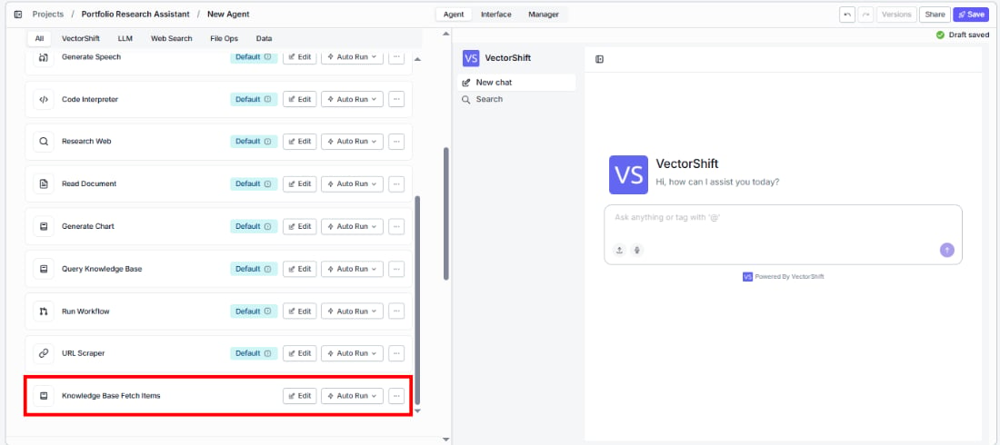
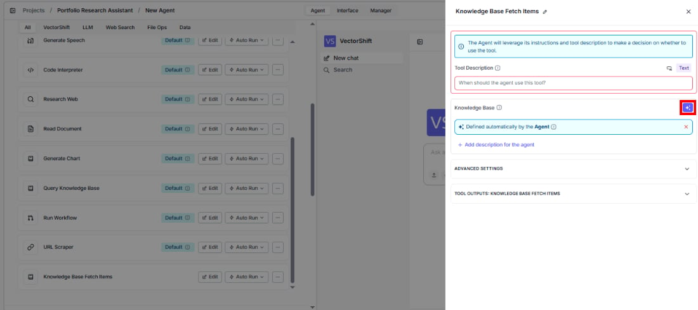
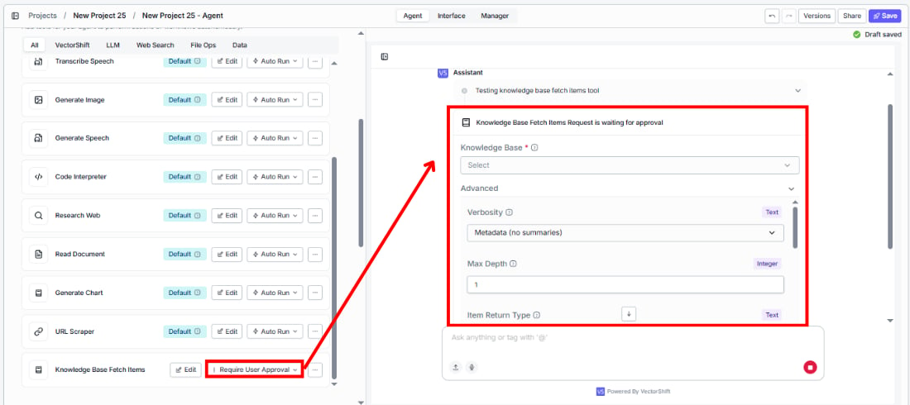

> ## Documentation Index
> Fetch the complete documentation index at: https://docs.vectorshift.ai/llms.txt
> Use this file to discover all available pages before exploring further.

# Knowledge Base Fetch Items

> List and navigate knowledge base items (folders and documents) with traversal, filtering, and output shaping capabilities.

<Card title="Use this node from the SDK" icon="code" href="/sdk/pipeline/nodes/knowledge#knowledge_base_fetch_items">
  Add it in Python with `pipeline.add(name="...").knowledge_base_fetch_items(...)`. See the SDK reference.
</Card>

The Knowledge Base Fetch Items node lists documents and folders stored in a knowledge base with powerful navigation capabilities — analogous to an `ls` command for browsing files and folders. Use it to discover what content exists in a knowledge base, navigate folder hierarchies, filter by file type, and retrieve item IDs for downstream processing. For example, you can list all PDF documents in a specific folder, browse the top-level structure of a knowledge base, or recursively discover all items to build a document index.

## Core Functionality

* List documents and folders in a knowledge base with pagination support
* Navigate folder hierarchies with configurable traversal depth
* Filter items by type (folders only, documents only, or all) and by file extension
* Control output verbosity from metadata-only to full summaries
* Sort results by specified fields in ascending or descending order
* Return structured item data, statistics, formatted text, and item IDs

## Tool Inputs

* `Knowledge Base` \* — **Required** · Knowledge Base selector · The knowledge base to list items from.
* `Root IDs` — Text · Default: empty (lists from root) · Filter to list items in a specific folder. Provide folder ID(s) to scope the listing. Acts as the target directory.
* `Max Depth` — Integer · Default: `0` · Maximum depth for descendant traversal. `1` = current directory only; `0` = recursive discovery to traverse all descendants until the limit is reached. *(Advanced setting)*
* `Sort Fields` — Text · Default: empty · Comma-separated field names to sort results by. *(Advanced setting)*
* `Sort Orders` — Text · Default: empty · Comma-separated sort directions (`asc` or `desc`) corresponding to sort fields. *(Advanced setting)*
* `Limit` — Integer · Default: `50` · Maximum number of items to return. *(Advanced setting)*
* `Offset` — Integer · Default: `0` · Number of items to skip for pagination. *(Advanced setting)*
* `Item Return Type` — Text · Default: `ALL` · Type of items to return: `FOLDERS`, `DOCUMENTS`, or `ALL`. *(Advanced setting)*
* `Filter` — Text · Default: empty · JSON filter object for advanced filtering. Supports `eq` and `neq` operators on the `file_extension` field. Example: `{"type": "condition", "field": "file_extension", "operator": "eq", "value": "pdf"}`. *(Advanced setting)*
* `Verbosity` — Text · Default: `metadata` · Output verbosity level: `metadata` (no summaries), `short` (short summaries), or `long` (short and long summaries). *(Advanced setting)*

\* indicates a required field.

## Tool Outputs

* `kb_items` — List of Text · The knowledge base items as structured data.
* `stats` — Text · JSON-serialized statistics about the listing results.
* `formatted_text` — Text · Human-readable formatted text representation of the items.
* `kb_item_ids` — List of Text · The IDs of the returned knowledge base items.

<Tabs>
  <Tab title="Agents">
    ## Overview

    When added as a tool inside an agent, Knowledge Base Fetch Items lets the agent browse and discover the contents of a knowledge base during a conversation. The agent can navigate folder structures, filter by file type, and retrieve document IDs — then use those IDs with other tools like Knowledge Base Fetch Document Content to read specific documents.

    ## Use Cases

    * **Document discovery** — An agent lists all documents in a client's knowledge base to help a user find a specific filing or report by name.
    * **Folder navigation** — An agent browses the folder structure of a regulatory knowledge base, helping users navigate through organized collections of compliance documents.
    * **File type filtering** — An agent lists only PDF documents in a knowledge base when a user asks to review all uploaded reports, filtering out other file types.
    * **Knowledge base auditing** — An agent inventories the contents of a knowledge base to identify missing documents or outdated files for a portfolio review.
    * **Document indexing** — An agent recursively lists all items in a knowledge base with short summaries to build a quick reference index for a user.

    ## How It Works

    1. **Add the tool** — In the agent builder, open the tool panel and navigate to the **Knowledge** category. Select **Knowledge Base Fetch Items** to add it as a tool.

    <Frame>
      
    </Frame>

    2. **Select the knowledge base** — Use the `Knowledge Base` selector to choose which knowledge base to browse.
    3. **Configure input fields** — Fields like `Root IDs`, `Limit`, `Sort Orders`, and `Filter` can be left for the agent to fill dynamically based on user requests, or locked to fixed values for constrained browsing. Click the sparkle icon to switch fields between dynamic and static mode.

    <Frame>
      
    </Frame>

    4. **Write a Tool Description** — Describe when the agent should list items. Example: *"Use this tool to browse and list documents in the knowledge base. You can filter by folder, file type, and control how many results to return."*
    5. **Set Auto Run behavior** — Choose how the tool executes:
       * **Auto Run** — Lists items immediately.
       * **Require User Approval** — Pauses for user confirmation.
       * **Let Agent Decide** — The agent determines whether approval is needed.

    <Frame>
      
    </Frame>

    6. **Test the tool** — Ask the agent to show documents in the knowledge base and verify it returns the expected listing.

    ## Settings

    * `Knowledge Base` — Knowledge Base selector · Default: none · The knowledge base to browse.
    * `Tool Description` — Text · Default: none · Describes the tool's purpose to the agent.
    * `Auto Run` — Dropdown · Default: Auto Run · Controls execution behavior.

    **Advanced Settings:**

    * `Root IDs` — Text · Default: empty · Target folder ID(s) for scoped listing.
    * `Max Depth` — Integer · Default: `0` · Traversal depth (0 = recursive, 1 = current level only).
    * `Sort Fields` — Text · Default: empty · Fields to sort by.
    * `Sort Orders` — Text · Default: empty · Sort directions (asc/desc).
    * `Limit` — Integer · Default: `50` · Max items to return.
    * `Offset` — Integer · Default: `0` · Pagination offset.
    * `Item Return Type` — Text · Default: `ALL` · Filter by FOLDERS, DOCUMENTS, or ALL.
    * `Filter` — Text · Default: empty · JSON filter for file extension filtering.
    * `Verbosity` — Text · Default: `metadata` · Output detail level (metadata, short, long).

    ## Best Practices

    * **Use metadata verbosity for browsing** — When the agent is just discovering what documents exist, use `metadata` verbosity for faster results. Switch to `short` or `long` when the user needs content summaries.
    * **Pair with Fetch Document Content** — Use this tool to find document IDs, then chain with Knowledge Base Fetch Document Content to read the full content of specific documents.
    * **Set reasonable limits** — For large knowledge bases, keep the limit manageable (50–100) and use pagination via offset for browsing through results.
    * **Use filters sparingly** — Only apply file extension filters when the user explicitly requests them. The agent should avoid adding filters that were not asked for.
    * **Scope with Root IDs for large knowledge bases** — When a knowledge base has many folders, provide a Root ID to limit browsing to a specific section rather than listing everything.

    ## Related Templates

    <CardGroup cols={2}>
      <Card title="Document Classification Agent" href="https://app.vectorshift.ai/marketplace">
        Automatically categorizes and tags incoming documents based on content and type.
      </Card>

      <Card title="Validation Agent" href="https://app.vectorshift.ai/marketplace">
        Validates data and documents against predefined rules, schemas, or compliance standards.
      </Card>

      <Card title="Contract AI Analyst" href="https://app.vectorshift.ai/marketplace">
        Analyzes contracts to extract key terms, flag risks, and summarize obligations.
      </Card>

      <Card title="Document Comparison AI Agent" href="https://app.vectorshift.ai/marketplace">
        Side-by-side comparison of documents to highlight differences and track revisions.
      </Card>
    </CardGroup>

    ## Common Issues

    For troubleshooting and common issues, see the [Common Issues](/docs/common-issues) page.
  </Tab>

  <Tab title="Workflows">
    ## Overview

    In workflows, the Knowledge Base Fetch Items node lists documents and folders from a knowledge base as a workflow step. The node outputs structured item data, statistics, formatted text, and item IDs that can be wired to downstream nodes for processing — such as iterating over documents, filtering results, or passing IDs to a Fetch Document Content node.

    ## Use Cases

    * **Batch document processing** — A workflow lists all documents in a knowledge base, then iterates over the item IDs to fetch and process each document individually.
    * **Knowledge base inventory** — A workflow periodically lists all items in a knowledge base and generates a report of document counts, types, and folder structure.
    * **Conditional document routing** — A workflow lists items filtered by type, then routes different document categories to different processing workflows.
    * **Incremental sync detection** — A workflow lists items with pagination to identify new or updated documents since the last processing run.

    ## How It Works

    1. **Add the node** — On the workflow canvas, open the node panel and navigate to the **Knowledge** category. Drag **Knowledge Base Fetch Items** onto the canvas.
    2. **Select the knowledge base** — Use the `Knowledge Base` selector to choose the target knowledge base. This field is required.
    3. **Configure listing options** — Set `Limit`, `Offset`, `Item Return Type`, and other parameters as needed. For recursive traversal, leave `Max Depth` at 0.
    4. **Connect outputs** — Wire the desired outputs (`kb_items`, `stats`, `formatted_text`, `kb_item_ids`) to downstream nodes.
    5. **Run the workflow** — Execute the workflow. The node lists items and passes the results downstream.

    ## Settings

    * `Knowledge Base` — Knowledge Base selector · **Required** · The knowledge base to list items from.
    * `Root IDs` — Text · Default: empty · Target folder ID(s) for scoped listing.

    **Advanced Settings:**

    * `Max Depth` — Integer · Default: `0` · Traversal depth (0 = recursive, 1 = current level).
    * `Sort Fields` — Text · Default: empty · Comma-separated fields to sort by.
    * `Sort Orders` — Text · Default: empty · Comma-separated sort directions.
    * `Limit` — Integer · Default: `50` · Maximum number of items to return.
    * `Offset` — Integer · Default: `0` · Pagination offset.
    * `Item Return Type` — Text · Default: `ALL` · FOLDERS, DOCUMENTS, or ALL.
    * `Filter` — Text · Default: empty · JSON filter for file extension filtering.
    * `Verbosity` — Text · Default: `metadata` · Output detail level.

    ## Best Practices

    * **Use pagination for large knowledge bases** — Set `Limit` and `Offset` to paginate through large collections rather than requesting all items at once.
    * **Filter by item type when possible** — If you only need documents (not folders), set `Item Return Type` to `DOCUMENTS` to reduce noise in the output.
    * **Use kb\_item\_ids for downstream chaining** — The `kb_item_ids` output is ideal for passing to a loop or to Knowledge Base Fetch Document Content nodes.
    * **Choose verbosity based on need** — Use `metadata` for fast enumeration, `short` for quick summaries, and `long` only when you need detailed document descriptions with a lower limit.

    ## Related Templates

    <CardGroup cols={2}>
      <Card title="Document Classification Agent" href="https://app.vectorshift.ai/marketplace">
        Automatically categorizes and tags incoming documents based on content and type.
      </Card>

      <Card title="Validation Agent" href="https://app.vectorshift.ai/marketplace">
        Validates data and documents against predefined rules, schemas, or compliance standards.
      </Card>

      <Card title="Contract AI Analyst" href="https://app.vectorshift.ai/marketplace">
        Analyzes contracts to extract key terms, flag risks, and summarize obligations.
      </Card>

      <Card title="Document Comparison AI Agent" href="https://app.vectorshift.ai/marketplace">
        Side-by-side comparison of documents to highlight differences and track revisions.
      </Card>
    </CardGroup>

    ## Common Issues

    For troubleshooting and common issues, see the [Common Issues](/docs/common-issues) page.
  </Tab>
</Tabs>
