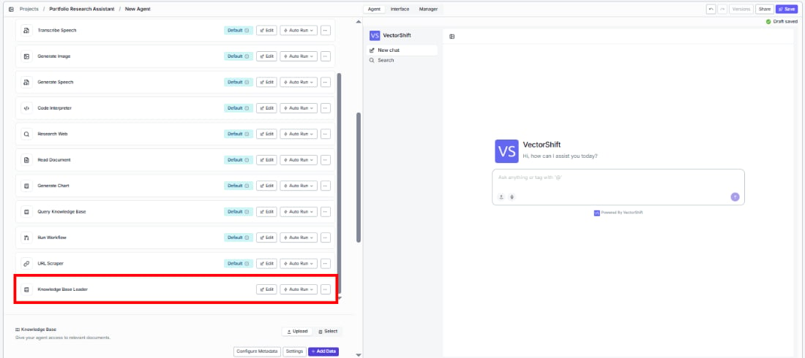
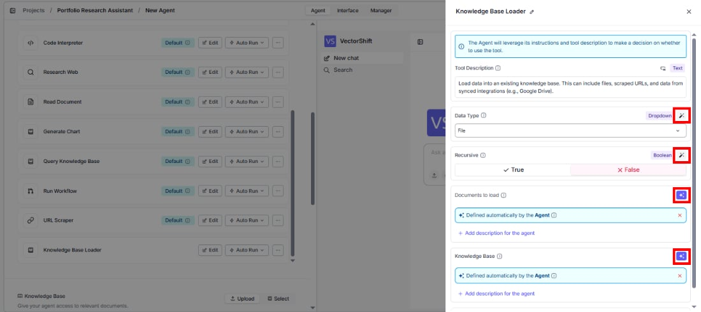
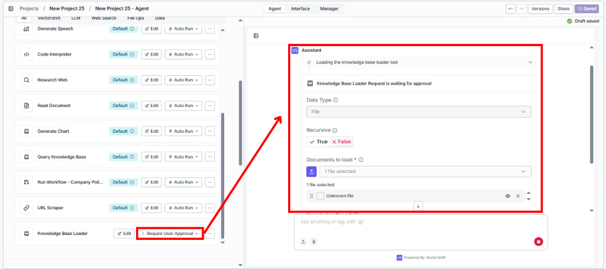
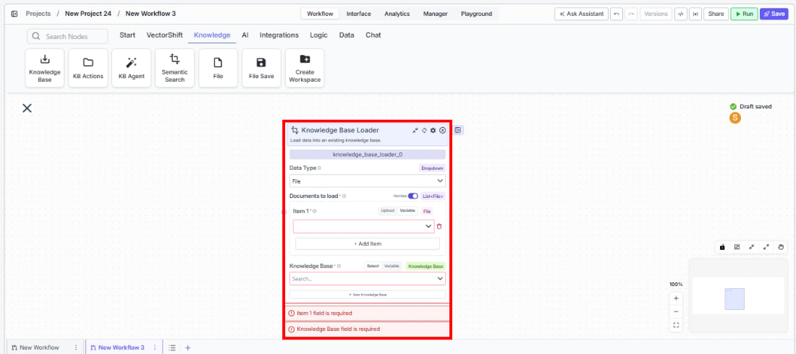
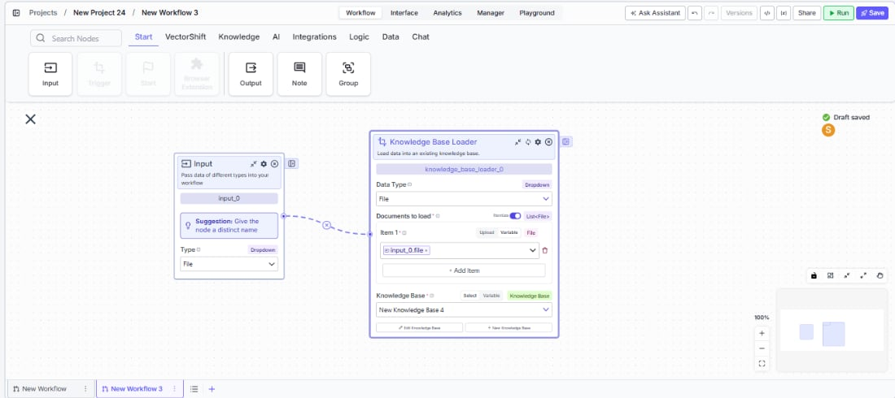

> ## Documentation Index
> Fetch the complete documentation index at: https://docs.vectorshift.ai/llms.txt
> Use this file to discover all available pages before exploring further.

# Knowledge Base Loader

> Load files or URLs into an existing knowledge base for indexing and retrieval.

<Card title="Use this node from the SDK" icon="code" href="/sdk/pipeline/nodes/knowledge#knowledge_base_loader">
  Add it in Python with `pipeline.add(name="...").knowledge_base_loader(...)`. See the SDK reference.
</Card>

The Knowledge Base Loader node loads data into an existing knowledge base. It supports uploading files (PDFs, documents, spreadsheets) or scraping URLs, with optional automatic rescraping on a schedule. Use it to populate a knowledge base with content — for example, loading a batch of financial reports into a client knowledge base, or adding a set of web pages that should be periodically refreshed.

## Core Functionality

* Load files or URLs into an existing knowledge base
* Choose between File and URL document types
* Add multiple items (files or URLs) in a single operation
* Configure automatic rescraping frequency for URL sources (Never, Daily, Weekly, Monthly)
* Works with any existing knowledge base — pair with Create Knowledge Base to build and populate in one workflow

## Tool Inputs

* `Knowledge Base` \* — **Required** · Knowledge Base selector · The knowledge base to load data into.
* `Document Type` — Dropdown · Default: `File` · Options: `File`, `URL` · The type of document to load.
* `Documents` \* — **Required** · File or URL list · The files or URLs to load into the knowledge base. Use the **+ Add Item** button to add multiple items.
* `Rescrape Frequency` — Dropdown · Default: `Never` · Options: `Never`, `Daily`, `Weekly`, `Monthly` · How often to rescrape URL sources for updated content. Only applicable when Document Type is URL.

\* indicates a required field.

## Tool Outputs

This node does not produce outputs. It performs a load operation into the selected knowledge base.

<Tabs>
  <Tab title="Agents">
    ## Overview

    When added as a tool inside an agent, the Knowledge Base Loader enables the agent to load files or URLs into a knowledge base during a conversation. The agent can accept documents from users and add them to a designated knowledge base, or scrape URLs provided in the conversation.

    ## Use Cases

    * **Client document ingestion** — An agent accepts uploaded financial documents from a client and loads them into their dedicated knowledge base for future retrieval.
    * **Research URL collection** — An agent scrapes analyst report URLs shared in conversation and loads them into a research knowledge base with weekly rescraping enabled.
    * **Policy document updates** — A compliance agent loads updated regulatory documents into the compliance knowledge base when new versions are shared.
    * **Meeting notes archival** — An agent loads meeting transcripts and notes into a project knowledge base after each client call.
    * **Evidence collection** — An audit agent loads supporting documents into an audit-specific knowledge base as users provide them during the review process.

    ## How It Works

    1. **Add the tool** — In the agent builder, open the tool panel and navigate to the **Knowledge** category. Select **Knowledge Base Loader** to add it as a tool.

    <Frame>
      
    </Frame>

    2. **Select the knowledge base** — Use the `Knowledge Base` selector to choose which knowledge base to load data into.
    3. **Configure input fields** — Set the `Document Type` (File or URL). The document items can be filled by the agent based on files or URLs provided in conversation, or locked to fixed values. Click the sparkle icon to switch fields between dynamic and static mode.

    <Frame>
      
    </Frame>

    4. **Write a Tool Description** — Describe when the agent should load documents. Example: *"Use this tool to load files or URLs into the client's knowledge base. Accept files uploaded by the user or URLs shared in conversation."*
    5. **Set Auto Run behavior** — Choose how the tool executes:
       * **Auto Run** — Loads documents immediately.
       * **Require User Approval** — Pauses for user confirmation before loading.
       * **Let Agent Decide** — The agent determines whether approval is needed.

    <Frame>
      
    </Frame>

    6. **Test the tool** — Upload a file or share a URL in the chat and ask the agent to add it to the knowledge base.

    ## Settings

    * `Knowledge Base` — Knowledge Base selector · Default: none · The target knowledge base.
    * `Document Type` — Dropdown · Default: `File` · File or URL.
    * `Rescrape Frequency` — Dropdown · Default: `Never` · URL rescraping schedule.
    * `Tool Description` — Text · Default: none · Describes the tool's purpose to the agent.
    * `Auto Run` — Dropdown · Default: Auto Run · Controls execution behavior.

    ## Best Practices

    * **Lock the knowledge base selection** — In most cases, set the Knowledge Base field to a fixed value so the agent always loads into the correct knowledge base rather than guessing.
    * **Use "Require User Approval" for production** — Loading documents is a write operation that modifies the knowledge base. Use approval mode to prevent accidental uploads.
    * **Set rescrape frequency for dynamic URLs** — When loading web pages that update regularly (e.g., news sources, market data pages), enable daily or weekly rescraping.
    * **Pair with Create Knowledge Base** — When onboarding new clients, use Create Knowledge Base first, then Knowledge Base Loader to populate it — all within the same agent conversation.

    ## Related Templates

    <CardGroup cols={2}>
      <Card title="IC Memos Knowledge Base" href="https://app.vectorshift.ai/marketplace">
        Centralized searchable repository of investment committee memos for quick reference.
      </Card>

      <Card title="Company Policy Compliance Chatbot" href="https://app.vectorshift.ai/marketplace">
        Answers employee questions about internal policies and flags potential compliance issues.
      </Card>

      <Card title="Custom API Chatbot" href="https://app.vectorshift.ai/marketplace">
        A configurable chatbot that connects to custom APIs to retrieve and present dynamic data.
      </Card>

      <Card title="Investor Helpdesk" href="https://app.vectorshift.ai/marketplace">
        Handles investor inquiries related to portfolios, statements, and fund performance.
      </Card>
    </CardGroup>

    ## Common Issues

    For troubleshooting and common issues, see the [Common Issues](/docs/common-issues) page.
  </Tab>

  <Tab title="Workflows">
    ## Overview

    In workflows, the Knowledge Base Loader node loads files or URLs into an existing knowledge base as a workflow step. Connect upstream nodes to provide the documents or URLs, and the node handles the loading operation. This is ideal for automated document ingestion workflows that process and store content without manual intervention.

    ## Use Cases

    * **Automated document ingestion** — A workflow receives uploaded files from a form interface and loads them into a knowledge base automatically.
    * **Scheduled web scraping** — A triggered workflow scrapes a list of financial news URLs and loads them into a market intelligence knowledge base on a daily schedule.
    * **Workflow-driven population** — A workflow creates a new knowledge base, then immediately loads a set of seed documents into it using the Knowledge Base Loader.
    * **Multi-source aggregation** — A workflow collects documents from multiple integrations (email attachments, file uploads, API responses) and loads them all into a central knowledge base.

    ## How It Works

    1. **Add the node** — On the workflow canvas, open the node panel and navigate to the **Knowledge** category. Drag **Knowledge Base Loader** onto the canvas.

    <Frame>
      
    </Frame>

    2. **Set the document type** — Choose `File` or `URL` from the `Data Type` dropdown.
    3. **Add items to load** — Add one or more items using the **+ Add Item** button, or connect upstream file/URL outputs to the item inputs.
    4. **Select the knowledge base** — Use the `Knowledge Base` selector to choose the target knowledge base. This field is required.
    5. **Configure rescrape frequency** *(URL only)* — If loading URLs, set the rescrape frequency to control how often the content is refreshed.

    <Frame>
      
    </Frame>

    6. **Run the workflow** — Execute the workflow. The node loads all provided items into the knowledge base.

    ## Settings

    * `Data Type` — Dropdown · Default: `File` · Options: File, URL.
    * `Documents to Load` — File/URL list · **Required** · The items to load. Use + Add Item for multiple entries.
    * `Knowledge Base` — Knowledge Base selector · **Required** · The target knowledge base. Supports Select, Variable, and Knowledge Base connection modes.
    * `Rescrape Frequency` — Dropdown · Default: `Never` · Options: Never, Daily, Weekly, Monthly. URL rescraping schedule.

    ## Best Practices

    * **Validate inputs before loading** — Ensure file or URL inputs are valid before they reach the Knowledge Base Loader. Invalid files will fail silently or produce errors.
    * **Use dependencies for ordered execution** — When chaining with Create Knowledge Base, use the dependencies feature to ensure the knowledge base exists before attempting to load.
    * **Batch wisely** — Loading many large files at once can take time. Consider breaking very large batches into smaller groups.
    * **Set appropriate rescrape schedules** — For financial data pages that update daily, use Daily rescraping. For static reference documents, leave it at Never.
    * **Connect to upstream data sources** — Wire file outputs from File nodes, API nodes, or other data loaders directly into the Knowledge Base Loader's item inputs.

    ## Related Templates

    <CardGroup cols={2}>
      <Card title="IC Memos Knowledge Base" href="https://app.vectorshift.ai/marketplace">
        Centralized searchable repository of investment committee memos for quick reference.
      </Card>

      <Card title="Company Policy Compliance Chatbot" href="https://app.vectorshift.ai/marketplace">
        Answers employee questions about internal policies and flags potential compliance issues.
      </Card>

      <Card title="Custom API Chatbot" href="https://app.vectorshift.ai/marketplace">
        A configurable chatbot that connects to custom APIs to retrieve and present dynamic data.
      </Card>

      <Card title="Investor Helpdesk" href="https://app.vectorshift.ai/marketplace">
        Handles investor inquiries related to portfolios, statements, and fund performance.
      </Card>
    </CardGroup>

    ## Common Issues

    For troubleshooting and common issues, see the [Common Issues](/docs/common-issues) page.
  </Tab>
</Tabs>
