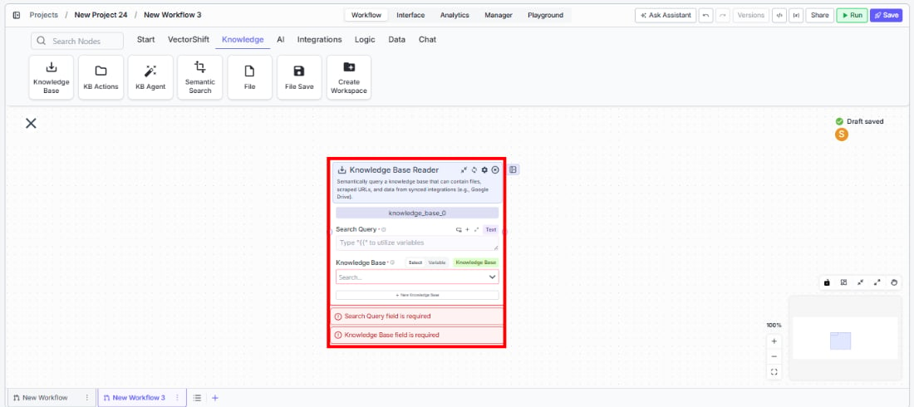
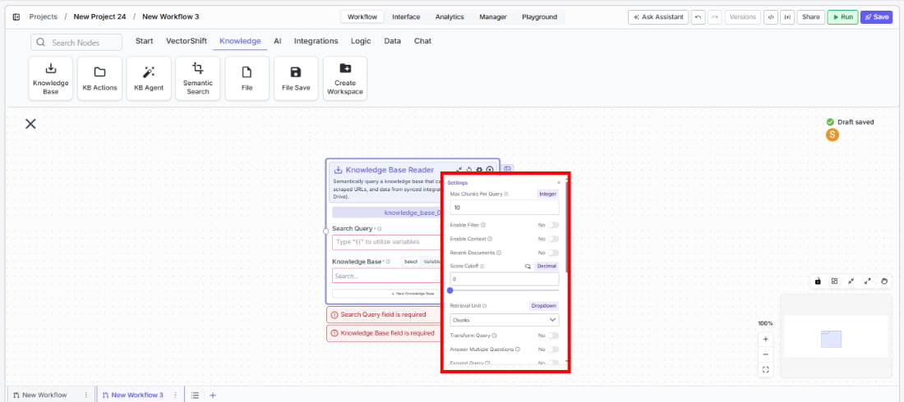
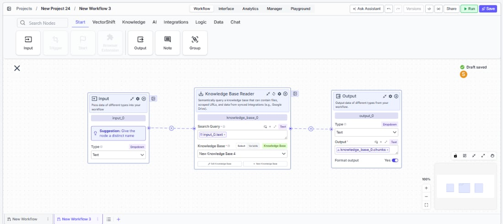
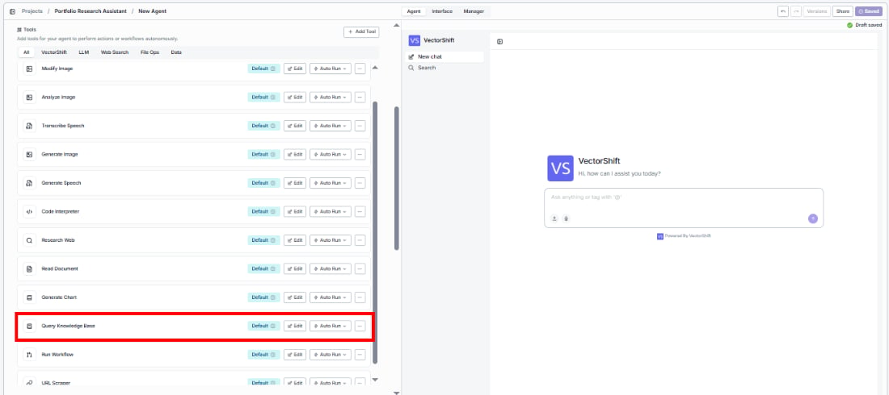
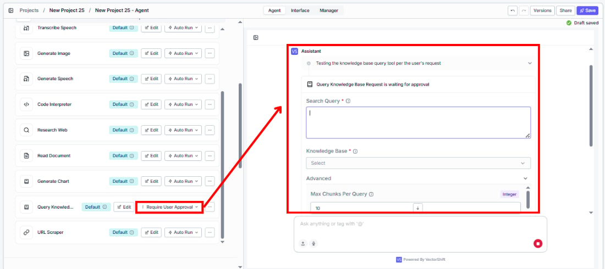
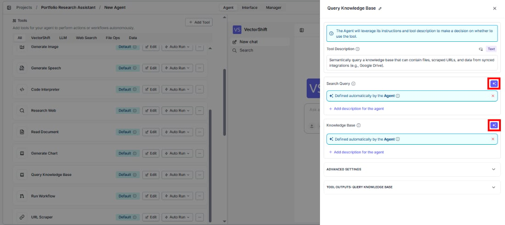

> ## Documentation Index
> Fetch the complete documentation index at: https://docs.vectorshift.ai/llms.txt
> Use this file to discover all available pages before exploring further.

# Knowledge Base Reader

> Query a knowledge base with semantic search to retrieve relevant content for workflows and agents.

<Card title="Use this node from the SDK" icon="code" href="/sdk/pipeline/nodes/knowledge#knowledge_base">
  Add it in Python with `pipeline.add(name="...").knowledge_base(...)`. See the SDK reference.
</Card>

A knowledge base stores and organizes content — documents, files, URLs, and data from external integrations — so your workflows and agents can search and retrieve relevant information on demand. It uses semantic search to find content that matches the meaning of a query, not just exact keywords.

When you query a knowledge base, it converts both the query and the stored content into numerical representations called embeddings, which capture meaning and context. It then finds the stored content whose meaning is closest to the query — so a question like "how do I reset my password?" can match a document titled "Account Recovery Steps" even if the words don't overlap.

This makes knowledge bases particularly effective for natural language queries and conversational AI use cases.

## Key Use Cases

* Answering user questions grounded in your own documents or internal content
* Building RAG workflows that pull relevant context before generating a response
* Giving an agent access to product documentation, policies, or knowledge articles
* Surfacing citations and sources alongside AI-generated responses
* Indexing structured data like tables for retrieval alongside unstructured documents

## Data Sources

**File Upload**
Upload files directly to your knowledge base. Supported formats: `doc`, `docx`, `pdf`, `csv`, `xls`, `xlsx`, `pptx`, `txt`, `md`, and more.

**Integrations**
Sync content from connected external services so your knowledge base stays current without manual updates. Supported integrations include:

* Google Drive
* And more via the Add Integration option

**Scrape URL**
Pull and index content from a web page by providing a URL.

**Workspace Files**
Use files already stored in your workspace without re-uploading.

**Index Table**
Index a structured table as a retrievable knowledge source alongside your unstructured content.

## Using the Knowledge Base Reader Node

<Tabs>
  <Tab title="Workflows">
    In workflows, the knowledge base is accessed through the **Knowledge Base Reader** node. Place it on the canvas, point it at a knowledge base, pass it a search query, and it returns the most relevant content for downstream nodes — typically an LLM — to consume.

    ### Key Use Cases

    * Retrieving relevant document chunks to answer a user's query in a Q\&A workflow
    * Feeding retrieved context into an LLM node for RAG
    * Searching across files and synced content at a specific step in a workflow
    * Using retrieved pages or documents when broader context is needed beyond individual chunks
    * Generating a direct answer from retrieved content using Advanced QA mode

    ### How It Works

    **Step 1: Add the Knowledge Base Reader Node**
    Find the **Knowledge Base Reader** node under the **Knowledge** category in the node panel and drag it onto the canvas.

    <Frame>
      
    </Frame>

    **Step 2: Name the Node**
    The node defaults to `knowledge_base_0`. Rename it to something descriptive, especially when using multiple knowledge nodes in the same workflow.

    **Step 3: Enter a Search Query**
    In the **Search Query** field, enter the query to run against the knowledge base. Use `{{` to reference a variable from an upstream node — typically an Input node carrying the user's question.

    **Step 4: Select or Create a Knowledge Base**
    Use the **Knowledge Base** field to pick an existing knowledge base from the dropdown, or click **+ New Knowledge Base** to create one inline. Switch to **Variable** mode to pass a knowledge base reference dynamically from upstream.

    <Frame>
      
    </Frame>

    **Step 5: Connect Outputs to Downstream Nodes**
    Connect the relevant output — `chunks`, `documents`, `pages`, or `formatted_text` — to the node that will consume the retrieved content.

    <Frame>
      
    </Frame>

    ### Inputs

    * `Search Query` \* — The query used to search the knowledge base. Supports variable references via `{{`.
    * `Knowledge Base` \* — The knowledge base to search. Select from a list, pass as a variable, or create inline.

    ### Outputs

    * `chunks` — A list of semantically similar text segments retrieved from the knowledge base. Available when Retrieval Unit is set to Chunks. Best for fine-grained content retrieval.
    * `documents` — A list of full or partial documents retrieved from the knowledge base. Available when Retrieval Unit is set to Documents. Best when broader document-level context is needed.
    * `pages` — A list of page-level segments retrieved from the knowledge base. Available when Retrieval Unit is set to Pages. Best for page-aware retrieval over long documents.
    * `citation_metadata` — A list of source references for the retrieved results, used to surface citations in LLM responses.
    * `formatted_text` — Retrieved content pre-formatted as a single string ready for direct LLM input. Available when **Format Context for LLM** is enabled (on by default).
    * `response` — A generated answer produced from the retrieved content. Available when **Do Advanced QA** or **Set Response Format** is enabled. Becomes `stream<string>` when **Stream Response** is also enabled.

    ### Node Options

    **Core Settings**

    * `Max Docs Per Query` *(Integer, default: 10)* — Maximum number of results to retrieve per query.
    * `Retrieval Unit` *(Dropdown, default: Chunks)* — What unit of content is retrieved. Options: `Chunks`, `Documents`, `Pages`. Each produces a different output key.
    * `Score Cutoff` *(Decimal, default: 0)* — Minimum similarity score a result must meet to be returned. A value of 0 returns everything.
    * `Format Context for LLM` *(Toggle, default: Yes)* — Formats retrieved content for LLM input.
    * `Alpha` *(Decimal, default: 0.6)* — Balance between semantic and keyword search in hybrid retrieval. Higher values weight semantic search more heavily.

    **Advanced Settings**

    * `Enable Filter` *(Toggle, default: No)* — Enables metadata-based filtering. When enabled, a `filter` input field appears.
    * `Enable Context` *(Toggle, default: No)* — Passes additional context with the query. When enabled, a `context` input field appears.
    * `Rerank Documents` *(Toggle, default: No)* — Reranks results for better relevance. When enabled:
      * `Rerank Model` — Model used for reranking (default: `cohere/rerank-english-v3.0`)
      * `Num Chunks to Rerank` *(Integer, default: 10)*
    * `Transform Query` *(Toggle, default: No)* — Rewrites the query before retrieval to improve results.
    * `Answer Multiple Questions` *(Toggle, default: No)* — Handles compound or multi-part queries in a single pass.
    * `Expand Query` *(Toggle, default: No)* — Expands the query to improve recall.
    * `Expand Query Terms` *(Toggle, default: No)* — Adds related terms to broaden search coverage.
    * `Generate Metadata Filters` *(Toggle, default: No)* — Derives metadata filters from the query automatically.
    * `Do Advanced QA (beta)` *(Toggle, default: No)* — Generates a direct answer from retrieved content. When enabled, `citation_metadata` is populated and a `response` output is added. Additional fields:
      * `QA Model` — Model used to generate the answer (default: `gpt-4o-mini`)
      * `Advanced Search Mode` — `fast` or `accurate` (default: `accurate`)
    * `Set Response Format` *(Toggle, default: No)* — Enables a custom response format with a `System Prompt` field.
    * `Stream Response` *(Toggle, default: No)* — Streams the response progressively. Only takes effect when **Set Response Format** is also enabled; changes `response` output to `stream<string>`.
    * `Enable Document DB Filter` *(Toggle, default: No)* — Applies document-level filters during retrieval. When enabled, a `document_db_filter` field appears.
    * `Do NL Metadata Query` *(Toggle, default: No)* — Enables natural language querying against document metadata.

    ### Best Practices

    * Pass the user's query dynamically from an Input node rather than hardcoding a search term
    * Use `formatted_text` for straightforward RAG workflows; use `chunks`, `documents`, or `pages` when you need more control over content assembly
    * Set `Score Cutoff` above 0 to filter out low-relevance results
    * Use **Enable List Mode** (right-click the node) when processing multiple queries in a single run
  </Tab>

  <Tab title="Agents">
    In agents, a knowledge base is added to the agent so it can query it autonomously through the **Query Knowledge Base** tool — deciding on its own when to look something up based on the conversation context, without any explicit retrieval step needed.

    The **Query Knowledge Base** tool is pre-added as a default tool for conversational agents. Once a knowledge base is added to the agent, the tool is always present in the agent's tool list.

    When the knowledge base input is set to dynamic (variable mode), the agent searches across all available knowledge bases rather than a single fixed one.

    ### Key Use Cases

    * Giving an agent access to internal documentation, policies, or support articles to answer user questions
    * Grounding an agent's responses in specific, curated content rather than relying solely on the model's training
    * Building a customer-facing assistant that can look up product information or FAQs on demand
    * Connecting an agent to a knowledge base synced from an integration like Google Drive for always-up-to-date content

    ### How It Works

    **Step 1: Open Your Agent**
    Navigate to the agent you want to configure. Knowledge base setup happens at the agent level.

    **Step 2: Add a Knowledge Base**
    Under the **Knowledge Base** section on the agent page, add content via file upload, integration sync, URL scraping, workspace files, or table indexing.

    **Step 3: Test in the Agent Chat**
    Use the agent's chat panel to test retrieval. Ask questions that should trigger a knowledge base lookup and verify the agent is pulling the right content.

    ### Query Knowledge Base Tool

    <Frame>
      
    </Frame>

    The agent uses the **Query Knowledge Base** tool autonomously — you do not need to configure when or how it is invoked. From the tool list you can:

    * **Edit** — Adjust the tool's configuration
    * **Auto Run** — Set whether the tool executes automatically or prompts the user for confirmation before running

    <Frame>
      
    </Frame>

    **Tool Description**
    The tool description tells the agent when and how to use the knowledge base. You can customize this to guide the agent's retrieval behavior — for example, specifying what types of questions should trigger a lookup.

    ### Configuring Input Fields

    Each input field on the Query Knowledge Base tool can be configured in one of two ways:

    * **Locked value** — Set a fixed value for the field. The agent will always use this value when querying the knowledge base. Use this when the input should remain constant (e.g., always query a specific knowledge base, always return 5 results).
    * **Agent-determined** — Leave the field for the agent to fill automatically based on conversation context. The agent decides the appropriate value at runtime. Use this for fields like the search query, where the value depends on what the user is asking.

    <Frame>
      
    </Frame>

    This applies to all input fields on the tool, including `Search Query`, `Knowledge Base`, `Max Docs Per Query`, and any advanced settings.

    ### Advanced Settings

    * `Settings` — Adjust retrieval settings for the knowledge base as used by the agent.
    * `Add Document` — Add more content to the knowledge base at any time after creation.

    ### Common Issues

    For a full list of known issues and troubleshooting steps, refer to the [Common Issues](#) documentation.

    ### Best Practices

    * Keep the knowledge base focused — add content directly relevant to what the agent is meant to do; a broad, unfocused knowledge base leads to lower retrieval quality
    * Sync integrations like Google Drive so the knowledge base stays current without manual updates
    * Test retrieval thoroughly in the chat panel before deploying — ask a range of questions to verify the agent surfaces the right content
    * If the agent is not querying the knowledge base when expected, check the **Auto Run** setting on the Query Knowledge Base tool
  </Tab>
</Tabs>
