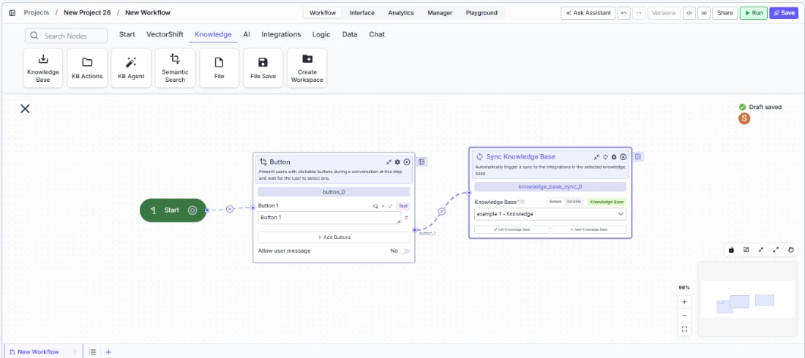
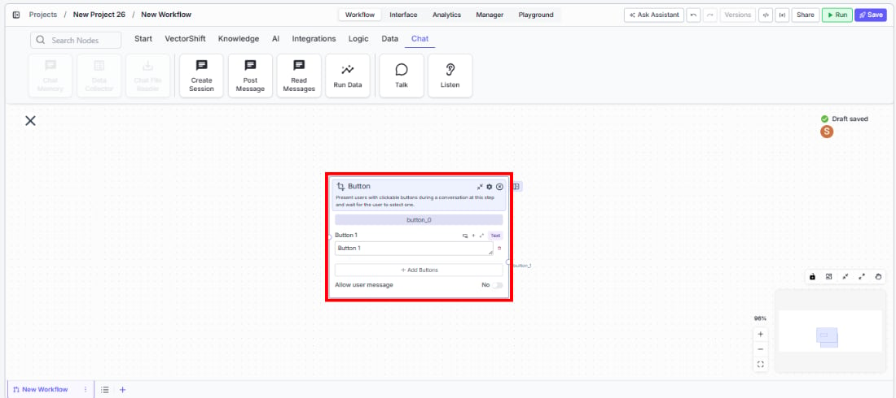

> ## Documentation Index
> Fetch the complete documentation index at: https://docs.vectorshift.ai/llms.txt
> Use this file to discover all available pages before exploring further.

# Listen — Button

> Present users with clickable buttons during a conversation and wait for their selection.

<Card title="Use this node from the SDK" icon="code" href="/sdk/pipeline/nodes/conversational#listen">
  Add it in Python with `pipeline.add(name="...").listen(...)`. See the SDK reference.
</Card>

The Button node (a variant of the Listen node) presents users with clickable buttons during a chatbot conversation and pauses the flow until the user selects one. Use it to build guided conversational experiences — for example, letting a user choose between "Check Balance", "Transfer Funds", and "Contact Support", or presenting approval options like "Approve" and "Reject" in a compliance review flow.

## Core Functionality

* Displays one or more clickable buttons to the user at a specific step in the conversation
* Pauses the conversation flow until the user clicks a button (or sends a message, if allowed)
* Routes the conversation to a different path based on which button was clicked
* Optionally allows the user to type a free-text message instead of clicking a button

## Tool Inputs

* `Button 1`, `Button 2`, `Button 3`, etc. — Text. The label displayed on each button. Default: `Button 1`. Add more buttons with the **+ Add Buttons** button. Remove buttons with the trash icon.
* `Allow user message` — Toggle. Default: `No`. When enabled, the user can type a free-text message in addition to clicking a button. The message is routed to the `User Message` output path.

## Tool Outputs

Each button creates a corresponding output path:

* `button_1` — Path. Activates when the user clicks Button 1.
* `button_2` — Path. Activates when the user clicks Button 2.
* `button_3` — Path. Activates when the user clicks Button 3. (One output per button.)
* `user_message` — Path. Activates when the user sends a typed message instead of clicking a button. Only available when `Allow user message` is enabled.
* `complete` — Path. Advanced output. Activates when any selection is made.

***

<Tabs>
  <Tab title="Workflows">
    ### Overview

    In workflows, the Button node sits in a conversational workflow and presents the user with a set of choices. When the conversation reaches this node, the chatbot displays the buttons and waits. Each button's output path connects to a different branch of the workflow, enabling conditional logic based on the user's selection. This is ideal for building menu-driven chatbots, multi-step approval flows, or guided decision trees.

    <Frame>
      
    </Frame>

    ### Use Cases

    * Present account action options ("Check Balance", "Transfer Funds", "View Statements") in a banking chatbot and route to the appropriate workflow branch
    * Build an approval flow where reviewers click "Approve" or "Reject" to trigger different downstream actions
    * Create a guided troubleshooting flow where users select their issue type from a set of buttons
    * Offer product tier selection ("Basic", "Professional", "Enterprise") in a sales chatbot to route to the right pricing workflow
    * Implement a feedback collection step with sentiment buttons ("Satisfied", "Neutral", "Dissatisfied") at the end of a support conversation

    ### How It Works

    #### Step 1: Add a Start Node

    The Button node requires a Start node on the canvas. If no Start node is present, a dialog appears: *"To use this node, drag a start node onto the canvas."* Add a Start node from the **Start** tab first.

    #### Step 2: Add the Button Node

    In the workflow canvas, click the **Chat** tab in the node palette, click **Listen**, then select **Button** from the variant list. Drag it onto the canvas.

    <Frame>
      
    </Frame>

    #### Step 3: Configure Buttons

    The node starts with one button (`Button 1`). Edit the label text for each button. Click **+ Add Buttons** to add more options. Remove unwanted buttons with the trash icon.

    #### Step 4: Configure Allow User Message (Optional)

    Toggle `Allow user message` to `Yes` if you want the user to be able to type a free-text response instead of clicking a button. When enabled, a `User Message` output path appears on the node.

    #### Step 5: Connect Output Paths

    Each button creates a separate output path handle (`button_1`, `button_2`, etc.). Connect each handle to the downstream nodes or branches that should execute when that button is clicked. If `Allow user message` is enabled, also connect the `User Message` output to a branch that handles free-text input.

    #### Step 6: Test the Flow

    Deploy the workflow as a chatbot and verify that buttons appear at the correct step. Click each button and confirm it routes to the expected branch.

    ### Settings

    | Setting                        | Type   | Default  | Description                                                           |
    | ------------------------------ | ------ | -------- | --------------------------------------------------------------------- |
    | `Button 1`, `Button 2`, etc.   | Text   | Button 1 | The label displayed on each button.                                   |
    | `Allow user message`           | Toggle | No       | Allow the user to type a message instead of clicking a button.        |
    | `Show Success/Failure Outputs` | Toggle | Off      | Show additional success/failure output handles. **Advanced setting.** |

    ### Best Practices

    * **Use clear, action-oriented button labels.** Labels like "Check Balance" or "Approve Transfer" are better than generic "Option A" or "Yes" — they tell the user exactly what will happen.
    * **Limit buttons to 3–5 options.** Too many buttons overwhelm users. If you need more choices, consider cascading Button nodes (first select a category, then a sub-option).
    * **Enable Allow user message for flexibility.** In many conversational flows, users may want to ask a question or provide context instead of picking a predefined option. Enable this toggle and route the free-text path to an LLM for handling.
    * **Use the complete output for shared logic.** If some downstream processing should happen regardless of which button was clicked, connect the `complete` advanced output to that shared branch.
    * **Pair with Talk nodes.** Place a Talk (Message) node before the Button node to explain the choices — for example, "How can I help you today?" followed by the button options.

    ### Related Templates

    <CardGroup cols={2}>
      <Card title="Customer Support Chatbot" href="https://app.vectorshift.ai/marketplace">
        Handles common customer inquiries and support tickets through conversational AI.
      </Card>

      <Card title="Banking Helpdesk" href="https://app.vectorshift.ai/marketplace">
        Assists banking customers with account inquiries, transactions, and product questions.
      </Card>

      <Card title="Webpage Customer Support Agent" href="https://app.vectorshift.ai/marketplace">
        Provides real-time customer support directly embedded within a website interface.
      </Card>

      <Card title="Refund/Expense Approval AI Agent" href="https://app.vectorshift.ai/marketplace">
        Reviews and routes refund or expense requests based on policy rules and approval thresholds.
      </Card>
    </CardGroup>

    ### Common Issues

    For help with common configuration issues, see the [Common Issues](/support) page.
  </Tab>
</Tabs>
