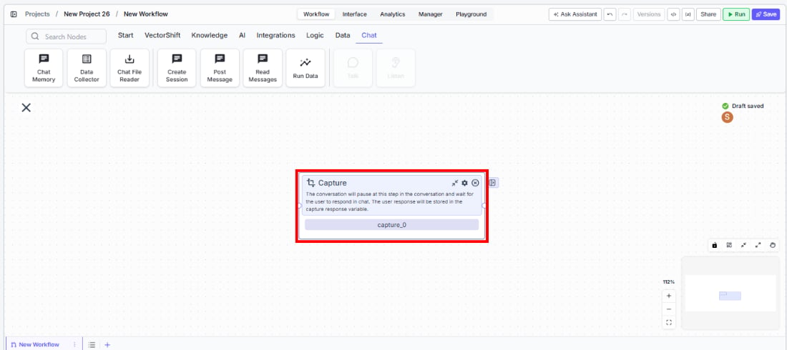
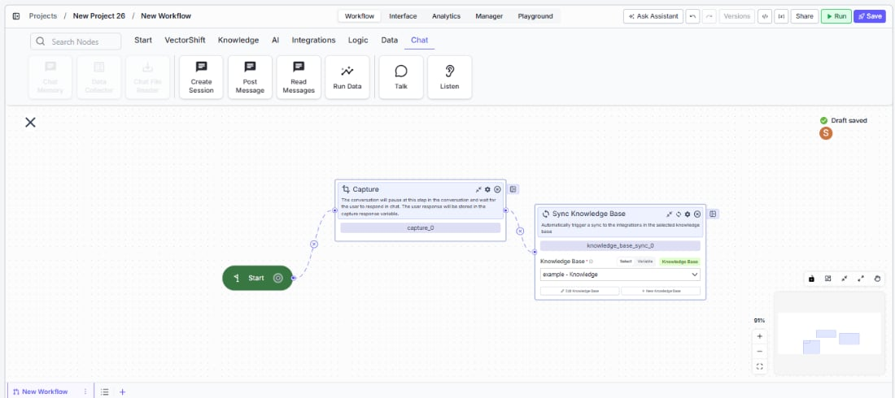

> ## Documentation Index
> Fetch the complete documentation index at: https://docs.vectorshift.ai/llms.txt
> Use this file to discover all available pages before exploring further.

# Listen — Capture

> Pause the conversation and wait for the user to respond, storing their message for downstream use.

<Card title="Use this node from the SDK" icon="code" href="/sdk/pipeline/nodes/conversational#listen">
  Add it in Python with `pipeline.add(name="...").listen(...)`. See the SDK reference.
</Card>

The Capture node (a variant of the Listen node) pauses the conversation at a specific step and waits for the user to type a response. The user's message is stored in the `response` output and passed to downstream nodes. Use it to build multi-step conversational flows — for example, asking a follow-up question after presenting information, collecting free-text feedback, or pausing for user confirmation before proceeding with an action.

## Core Functionality

* Pauses the conversational workflow at the current step and waits for the user to respond in the chat
* Captures the user's typed message and stores it in the `response` output variable
* Resumes the workflow and passes the captured response to downstream nodes
* Works with the Start node and other conversational nodes (Talk, Button) to build multi-step chat flows

## Tool Inputs

This node has no configurable input fields. It simply pauses and waits for user input.

## Tool Outputs

* `response` — Text. The user's message captured at this step in the conversation.

***

<Tabs>
  <Tab title="Workflows">
    ### Overview

    In workflows, the Capture node acts as a pause point in a conversational workflow. When the flow reaches this node, the chatbot waits for the user to type a message. Once the user responds, the workflow resumes and the `response` output carries the user's text to the next node — typically an LLM for processing, a condition node for branching, or another conversational node. Use it between Talk nodes to create back-and-forth dialogue.

    ### Use Cases

    * Pause after presenting a financial summary and capture the user's follow-up question for an LLM to answer
    * Collect free-text feedback after completing a support interaction and route it to a sentiment analysis node
    * Ask the user to confirm a transaction ("Please type CONFIRM to proceed") and validate their response with a condition node
    * Gather additional context after an initial classification — e.g., "Can you describe the issue in more detail?"
    * Build a multi-turn interview flow where each Capture node collects one answer before moving to the next question

    ### How It Works

    #### Step 1: Add a Start Node

    The Capture node requires a Start node on the canvas. If no Start node is present, a dialog appears: *"To use this node, drag a start node onto the canvas."* Add a Start node from the **Start** tab first.

    #### Step 2: Add the Capture Node

    In the workflow canvas, click the **Chat** tab in the node palette, click **Listen**, then select **Capture** from the variant list. Drag it onto the canvas.

    <Frame>
      
    </Frame>

    #### Step 3: Connect Upstream Nodes

    <Frame>
      
    </Frame>

    Connect the Capture node after a Talk (Message) node or other conversational node. The Capture node pauses the flow at this point and waits for the user's response.

    #### Step 4: Connect the Response Output

    Connect the `response` output to the downstream node that should process the user's message — for example, an LLM node, a condition node, or another Talk node.

    #### Step 5: Test the Flow

    Deploy the workflow as a chatbot. Verify that the conversation pauses at the Capture step and resumes correctly once the user sends a message.

    ### Settings

    | Setting                        | Type   | Default | Description                                                           |
    | ------------------------------ | ------ | ------- | --------------------------------------------------------------------- |
    | `Show Success/Failure Outputs` | Toggle | Off     | Show additional success/failure output handles. **Advanced setting.** |

    ### Best Practices

    * **Always precede Capture with a Talk node.** Users need context for what to type. Place a Talk (Message) node before the Capture to ask a clear question or provide instructions.
    * **Use descriptive node names.** Rename the Capture node to describe what it collects (e.g., "Capture Feedback", "Capture Confirmation") so the workflow is easy to follow.
    * **Validate captured input when needed.** If the user's response must meet specific criteria (e.g., a date format, a confirmation keyword), connect the `response` output to a condition node before proceeding.
    * **Chain multiple Talk-Capture pairs.** For multi-step data collection, alternate Talk (Message) and Capture nodes to create a structured back-and-forth conversation.
    * **Consider using Button instead for constrained choices.** If you need the user to pick from a fixed set of options rather than typing freely, use the Button variant of Listen instead.

    ### Related Templates

    <CardGroup cols={2}>
      <Card title="Customer Support Chatbot" href="https://app.vectorshift.ai/marketplace">
        Handles common customer inquiries and support tickets through conversational AI.
      </Card>

      <Card title="Banking Helpdesk" href="https://app.vectorshift.ai/marketplace">
        Assists banking customers with account inquiries, transactions, and product questions.
      </Card>

      <Card title="KYC Agent" href="https://app.vectorshift.ai/marketplace">
        Verifies customer identities and performs Know Your Customer checks for onboarding compliance.
      </Card>

      <Card title="Company Policy Compliance Chatbot" href="https://app.vectorshift.ai/marketplace">
        Answers employee questions about internal policies and flags potential compliance issues.
      </Card>
    </CardGroup>

    ### Common Issues

    For help with common configuration issues, see the [Common Issues](/support) page.
  </Tab>
</Tabs>
