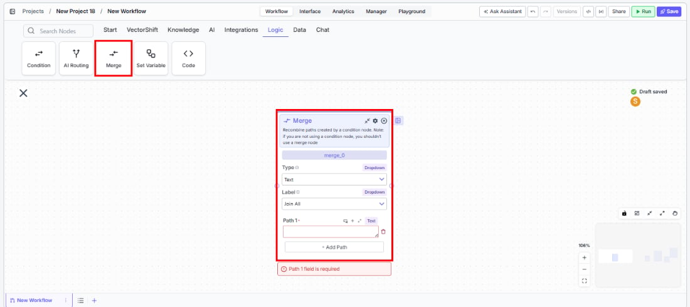
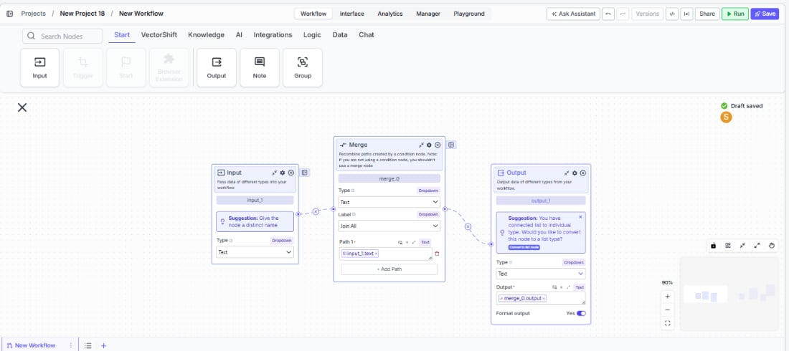

> ## Documentation Index
> Fetch the complete documentation index at: https://docs.vectorshift.ai/llms.txt
> Use this file to discover all available pages before exploring further.

# Merge - Join All

> Recombine multiple conditional paths into a single list output by joining all input values.

<Card title="Use this node from the SDK" icon="code" href="/sdk/pipeline/nodes/logic#merge">
  Add it in Python with `pipeline.add(name="...").merge(...)`. See the SDK reference.
</Card>

The Merge node in Join All mode recombines multiple execution paths into a single output by collecting all input values into a list. Use it after a Condition or AI Routing node to gather results from every branch that executed — for example, combining extracted data from parallel document processing paths into one consolidated list, or aggregating results from multiple API calls before passing them to a summary step.

## Core Functionality

* Collects values from multiple input fields and joins them into a single list output
* Designed to recombine paths created by Condition or AI Routing nodes
* Supports configurable input/output types (Text, Integer, Decimal, File, JSON, and more)
* Allows adding or removing input fields dynamically
* Outputs a list (vector) of the configured type

## Tool Inputs

* `Function` — The merge strategy. Set to `Join All` to collect all inputs into a list. Dropdown.
* `Type` — The expected data type of the input and output fields. Dropdown with options: `Text`, `List of Text`, `Integer`, `Any`, `Decimal`, `Boolean`, `File`, `Audio`, `Image`, `JSON`, `Timestamp`, `Path`, `List of Files`, `Knowledge Base`. Default: `Text`.
* `Input 1` — The first input value. Connect from an upstream node or enter directly. Type matches the selected `Type`.
* `Input 2` — The second input value. Same as above.
* Additional inputs can be added with **+ Add Field**.

## Tool Outputs

* `output` — A list (vector) of the configured type containing all input values. For example, if `Type` is `Text` and you provide three text inputs, the output is a list of three text strings.

***

<Tabs>
  <Tab title="Workflows">
    ### Overview

    In workflows, the Merge node in Join All mode sits downstream of branching nodes (Condition, AI Routing) to recombine their outputs. It collects values from all connected input fields into a single list, which you can then pass to downstream nodes for aggregation, summarization, or further processing. Use it when every branch produces a result and you need all of them together.

    ### Use Cases

    * Aggregate extracted financial metrics from parallel document processing branches into a single list for reporting
    * Combine API responses from multiple provider calls into one consolidated result set
    * Collect validation results from separate rule-checking branches into a summary list
    * Gather translated text outputs from parallel language-specific branches
    * Merge compliance check results from multiple regulatory paths into one review list

    ### How It Works

    #### Step 1: Add the Merge Node

    In the workflow canvas, click the **Logic** tab in the node palette and click **Merge**. Drag it onto the canvas.

    <Frame>
      
    </Frame>

    #### Step 2: Set the Function to Join All

    In the Merge node, set the **Function** dropdown to **Join All**. This configures the node to collect all inputs into a list.

    #### Step 3: Configure the Type

    Select the expected data type from the **Type** dropdown. This determines what kind of data the input fields accept and what the output list contains. For example, select `Text` for text values or `JSON` for structured data.

    #### Step 4: Connect Input Fields

    The node starts with two input fields (**Input 1** and **Input 2**). Connect each to an upstream node's output — typically from different branches of a Condition or AI Routing node.

    Click **+ Add Field** to add more input fields as needed. Each new field gets a connection handle on the left.

    #### Step 5: Connect the Output

    The `output` handle on the right side of the node produces a list containing all input values. Connect it to downstream nodes for further processing.

    <Frame>
      
    </Frame>

    #### Step 6: Test the Workflow

    Click **Run** to test. The Merge node collects all non-empty input values into a list and passes them downstream.

    ### Settings

    | Setting       | Type            | Default  | Description                                                                                                                                                                           |
    | ------------- | --------------- | -------- | ------------------------------------------------------------------------------------------------------------------------------------------------------------------------------------- |
    | `Function`    | Dropdown        | Join All | The merge strategy. Set to Join All to combine all inputs into a list.                                                                                                                |
    | `Type`        | Dropdown        | Text     | The data type of input fields and output list. Options: Text, List of Text, Integer, Any, Decimal, Boolean, File, Audio, Image, JSON, Timestamp, Path, List of Files, Knowledge Base. |
    | `Input 1`     | Configured type | —        | First input value. Connect from upstream.                                                                                                                                             |
    | `Input 2`     | Configured type | —        | Second input value. Connect from upstream.                                                                                                                                            |
    | `+ Add Field` | Button          | —        | Adds additional input fields.                                                                                                                                                         |

    ### Best Practices

    * **Match the Type to your data.** Set the `Type` dropdown to match what your upstream branches produce. A mismatch can cause type errors at runtime.
    * **Use after Condition nodes for aggregation.** Place the Merge (Join All) node downstream of a Condition node when you need to collect results from all branches — for example, gathering validation results from multiple checks.
    * **Add only the fields you need.** Each input field should correspond to one branch or upstream output. Remove unused fields to keep the canvas clean.
    * **Chain with a Join List Items node.** If you need the output as a single concatenated string instead of a list, connect the Merge output to a Join List Items node downstream.
    * **Handle empty inputs gracefully.** If a branch doesn't execute (because its condition wasn't met), its input to the Merge node may be empty. Plan for this in downstream processing.

    ### Related Templates

    <CardGroup cols={2}>
      <Card title="Spreadsheet Comparison Assistant" href="https://app.vectorshift.ai/marketplace">
        Compares two or more spreadsheets to identify discrepancies, changes, and anomalies.
      </Card>

      <Card title="Document Comparison AI Agent" href="https://app.vectorshift.ai/marketplace">
        Side-by-side comparison of documents to highlight differences and track revisions.
      </Card>

      <Card title="Validation Agent" href="https://app.vectorshift.ai/marketplace">
        Validates data and documents against predefined rules, schemas, or compliance standards.
      </Card>

      <Card title="Financial Statement Reconciliation Assistant" href="https://app.vectorshift.ai/marketplace">
        Reconciles financial statements by identifying mismatches and resolving discrepancies.
      </Card>
    </CardGroup>

    ### Common Issues

    For help with common configuration issues, see the [Common Issues](/support) page.
  </Tab>
</Tabs>
