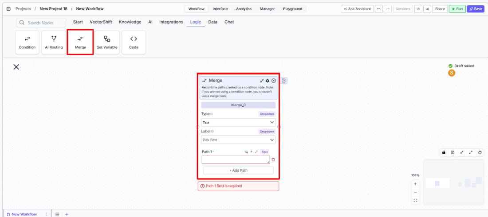
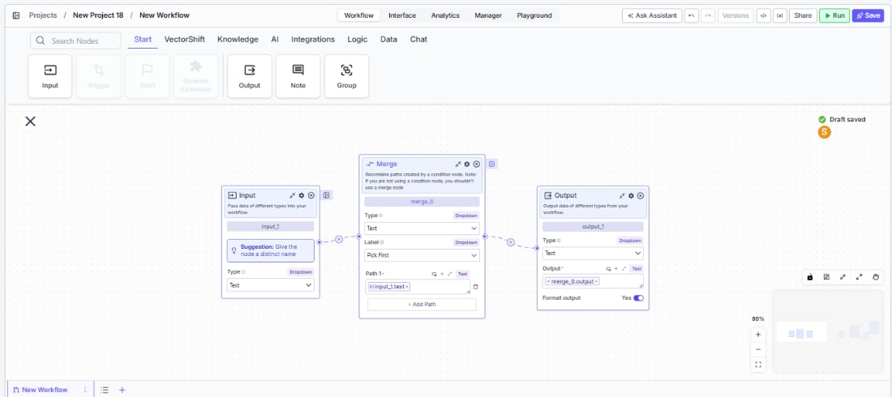

> ## Documentation Index
> Fetch the complete documentation index at: https://docs.vectorshift.ai/llms.txt
> Use this file to discover all available pages before exploring further.

# Merge - Pick First

> Recombine multiple conditional paths by selecting the first available input value.

<Card title="Use this node from the SDK" icon="code" href="/sdk/pipeline/nodes/logic#merge">
  Add it in Python with `pipeline.add(name="...").merge(...)`. See the SDK reference.
</Card>

The Merge node in Pick First mode recombines multiple execution paths by selecting the first non-empty input value. Use it after a Condition or AI Routing node when only one branch executes at a time and you need to funnel its result back into a single downstream path — for example, picking the result from whichever extraction workflow the Condition node activated, or selecting the first successful API response from multiple fallback branches.

## Core Functionality

* Selects the first non-empty input value from multiple input fields
* Designed to recombine paths created by Condition or AI Routing nodes
* Supports configurable input/output types (Text, Integer, Decimal, File, JSON, and more)
* Allows adding or removing input fields dynamically
* Outputs a single value of the configured type (not a list)

## Tool Inputs

* `Function` — The merge strategy. Set to `Pick First` to select the first non-empty input. Dropdown.
* `Type` — The expected data type of the input and output fields. Dropdown with options: `Text`, `List of Text`, `Integer`, `Any`, `Decimal`, `Boolean`, `File`, `Audio`, `Image`, `JSON`, `Timestamp`, `Path`, `List of Files`, `Knowledge Base`. Default: `Text`.
* `Input 1` — The first input value. Connect from an upstream node or enter directly. Type matches the selected `Type`.
* `Input 2` — The second input value. Same as above.
* Additional inputs can be added with **+ Add Field**.

## Tool Outputs

* `output` — A single value of the configured type. Contains the first non-empty input value, evaluated in order from Input 1 to Input N.

***

<Tabs>
  <Tab title="Workflows">
    ### Overview

    In workflows, the Merge node in Pick First mode sits downstream of branching nodes (Condition, AI Routing) to funnel their outputs back into a single path. It checks each input field in order and passes through the first one that has a value. This is the standard pattern for recombining conditional branches where only one branch executes at a time — the active branch produces a result, inactive branches are empty, and Pick First selects the one that ran.

    ### Use Cases

    * Funnel the result from whichever Condition branch executed back into a single downstream path
    * Select the first successful API response when multiple provider endpoints are tried in parallel
    * Pick the output of the matching document type extractor after AI Routing classifies the document
    * Merge results from cascading fallback logic — try the primary path, fall back to secondary
    * Recombine outputs from locale-specific processing branches into a single result

    ### How It Works

    #### Step 1: Add the Merge Node

    In the workflow canvas, click the **Logic** tab in the node palette and click **Merge**. Drag it onto the canvas.

    <Frame>
      
    </Frame>

    #### Step 2: Set the Function to Pick First

    In the Merge node, set the **Function** dropdown to **Pick First**. This configures the node to select the first non-empty input.

    #### Step 3: Configure the Type

    Select the expected data type from the **Type** dropdown. This determines what kind of data the input fields accept and what the output contains. The type should match what your upstream branches produce.

    #### Step 4: Connect Input Fields

    The node starts with two input fields (**Input 1** and **Input 2**). Connect each to the output of a different branch — typically from a Condition or AI Routing node. Input 1 has the highest priority; if it has a value, it is selected regardless of other inputs.

    Click **+ Add Field** to add more input fields. Click the red **−** button to remove one.

    #### Step 5: Connect the Output

    The `output` handle on the right side of the node produces the single selected value. Connect it to downstream nodes for further processing.

    <Frame>
      
    </Frame>

    #### Step 6: Test the Workflow

    Click **Run** to test. The Merge node evaluates inputs in order and outputs the first non-empty value.

    ### Settings

    | Setting       | Type            | Default    | Description                                                                                                                                                                      |
    | ------------- | --------------- | ---------- | -------------------------------------------------------------------------------------------------------------------------------------------------------------------------------- |
    | `Function`    | Dropdown        | Pick First | The merge strategy. Set to Pick First to select the first non-empty input.                                                                                                       |
    | `Type`        | Dropdown        | Text       | The data type of input fields and output. Options: Text, List of Text, Integer, Any, Decimal, Boolean, File, Audio, Image, JSON, Timestamp, Path, List of Files, Knowledge Base. |
    | `Input 1`     | Configured type | —          | First input value (highest priority). Connect from upstream.                                                                                                                     |
    | `Input 2`     | Configured type | —          | Second input value. Connect from upstream.                                                                                                                                       |
    | `+ Add Field` | Button          | —          | Adds additional input fields.                                                                                                                                                    |

    ### Best Practices

    * **Use after Condition nodes for single-branch results.** Pick First is the standard pattern when a Condition node routes to exactly one branch and you need to continue with a single output downstream.
    * **Order inputs by priority.** Input 1 is evaluated first. If multiple branches could produce a value, connect the highest-priority branch to Input 1.
    * **Match the Type to your upstream outputs.** Set the `Type` dropdown to match the data type your branches produce. A mismatch can cause unexpected behavior.
    * **Pair with Join All when needed.** If some workflows need all branch results (not just the first), use a second Merge node in Join All mode for those cases.
    * **Use for fallback patterns.** Connect a primary data source to Input 1 and a fallback to Input 2. If the primary fails (produces no output), Pick First automatically selects the fallback.

    ### Related Templates

    <CardGroup cols={2}>
      <Card title="Spreadsheet Comparison Assistant" href="https://app.vectorshift.ai/marketplace">
        Compares two or more spreadsheets to identify discrepancies, changes, and anomalies.
      </Card>

      <Card title="Document Comparison AI Agent" href="https://app.vectorshift.ai/marketplace">
        Side-by-side comparison of documents to highlight differences and track revisions.
      </Card>

      <Card title="Validation Agent" href="https://app.vectorshift.ai/marketplace">
        Validates data and documents against predefined rules, schemas, or compliance standards.
      </Card>

      <Card title="Financial Statement Reconciliation Assistant" href="https://app.vectorshift.ai/marketplace">
        Reconciles financial statements by identifying mismatches and resolving discrepancies.
      </Card>
    </CardGroup>

    ### Common Issues

    For help with common configuration issues, see the [Common Issues](/support) page.
  </Tab>
</Tabs>
