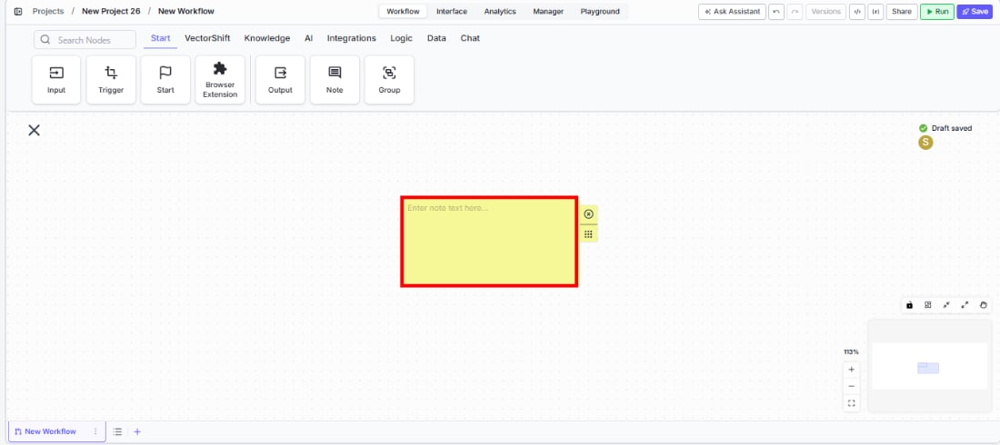
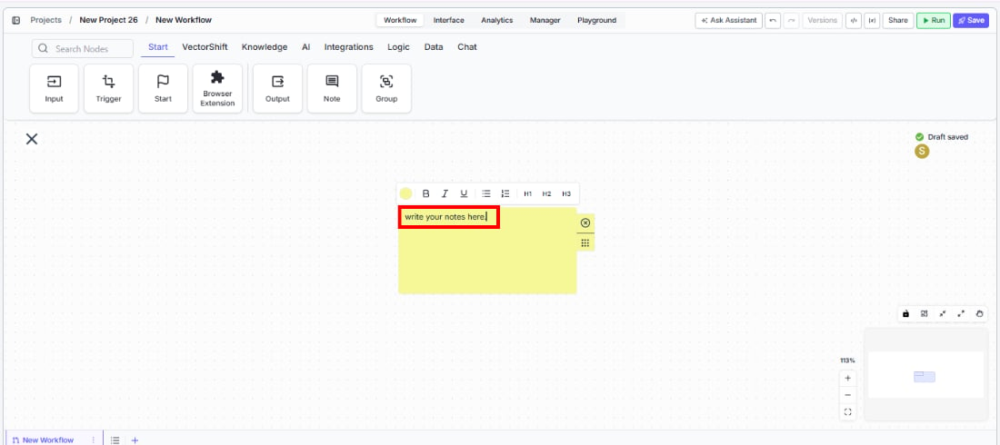
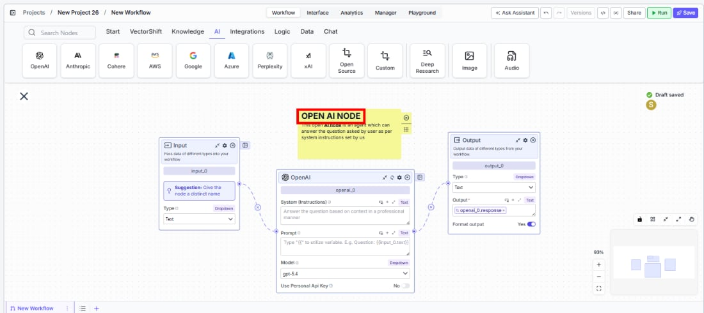

> ## Documentation Index
> Fetch the complete documentation index at: https://docs.vectorshift.ai/llms.txt
> Use this file to discover all available pages before exploring further.

# Note

> Add rich-text sticky notes to the workflow canvas for documentation and annotation.

<Card title="Use this node from the SDK" icon="code" href="/sdk/pipeline/nodes/start#sticky_note">
  Add it in Python with `pipeline.add(name="...").sticky_note(...)`. See the SDK reference.
</Card>

The Note element adds a sticky note to the workflow canvas for documentation, annotation, and team communication. Use it to leave context for collaborators — for example, explaining why a particular branching logic exists, documenting expected input formats, or marking sections of the workflow that are under construction.

## Core Functionality

* Places a resizable sticky note on the workflow canvas that does not affect execution
* Supports rich-text formatting: bold, italic, underline, lists, code blocks, and headings (H1, H2, H3)
* Includes a color picker to visually categorize notes (default: yellow)
* Purely visual — the Note has no inputs, outputs, or settings that affect the workflow

## Tool Inputs

The Note element has no inputs. It does not connect to other nodes or participate in data flow.

## Tool Outputs

The Note element has no outputs. It is a canvas annotation only.

***

<Tabs>
  <Tab title="Workflows">
    ### Overview

    In workflows, the Note element is a visual annotation tool that sits on the canvas alongside your nodes. It does not execute, produce data, or connect to other nodes — it exists solely to help you and your team document the workflow. Notes are especially valuable in complex workflows where the purpose of a section, a configuration choice, or an edge case would otherwise be unclear.

    ### Use Cases

    * Document the purpose of a complex branching section so team members understand the logic at a glance
    * Mark a section of the workflow as "in progress" or "needs review" during collaborative development
    * Record expected input formats or assumptions (e.g., "Input must be a PDF under 10 MB")
    * Leave onboarding notes for new team members who will maintain the workflow
    * Annotate workarounds or known limitations in specific parts of the workflow

    ### How It Works

    #### Step 1: Add a Note

    In the workflow canvas, click the **Start** tab in the node palette and click **Note**. A yellow sticky note appears on the canvas.

    <Frame>
      
    </Frame>

    #### Step 2: Enter Text

    Click inside the note and type your annotation. The placeholder text reads: *"Enter note text here..."*

    <Frame>
      
    </Frame>

    #### Step 3: Format the Text (Optional)

    Click the formatting toolbar above the note to apply rich-text formatting:

    * **Bold** (B), **Italic** (I), **Underline** (U)
    * Bulleted list
    * Code block
    * Headings: **H1**, **H2**, **H3**

    <Frame>
      
    </Frame>

    #### Step 4: Change the Color (Optional)

    Click the color dot in the toolbar to change the note's background color. Use different colors to categorize notes by purpose (e.g., yellow for general documentation, red for warnings).

    #### Step 5: Resize and Position

    Drag the resize handle at the bottom-right corner to adjust the note's size. Drag the note itself to reposition it on the canvas near the relevant nodes.

    ### Settings

    The Note element has no configurable settings. It is a visual canvas element only.

    ### Best Practices

    * **Place notes near the nodes they describe.** Position notes adjacent to the section of the workflow they document so the context is immediately clear.
    * **Use color coding consistently.** Adopt a team convention — for example, yellow for general documentation, red for warnings or known issues, green for completed/verified sections.
    * **Keep notes concise.** Notes are for quick context, not full documentation. A few sentences explaining "why" is more valuable than a paragraph describing "what".
    * **Use headings for multi-topic notes.** If a note covers multiple points, use H1/H2/H3 headings to organize the content.
    * **Remove stale notes.** As the workflow evolves, review and update or remove notes that no longer apply to avoid confusion.

    ### Common Issues

    For help with common configuration issues, see the [Common Issues](/support) page.
  </Tab>
</Tabs>
