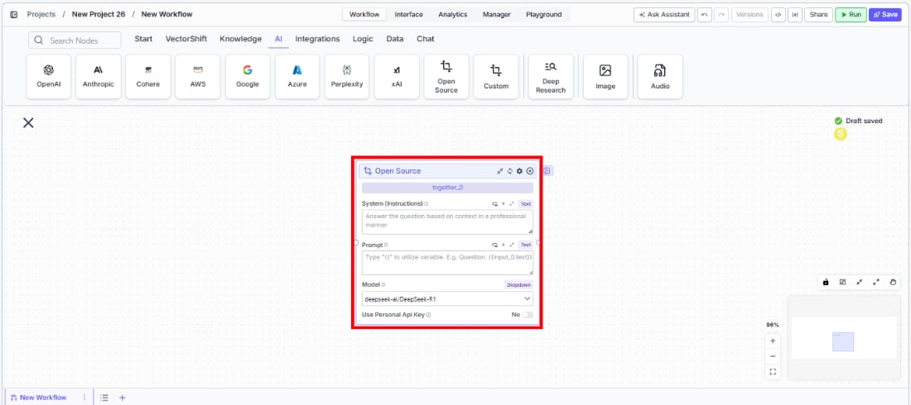
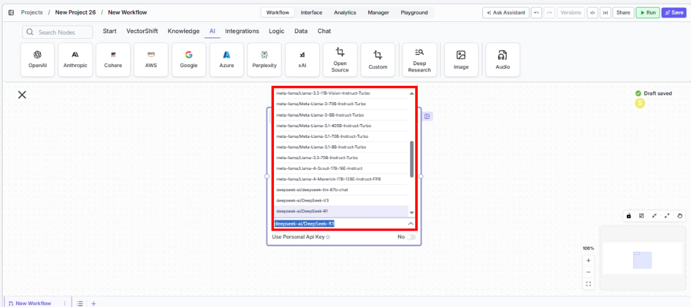
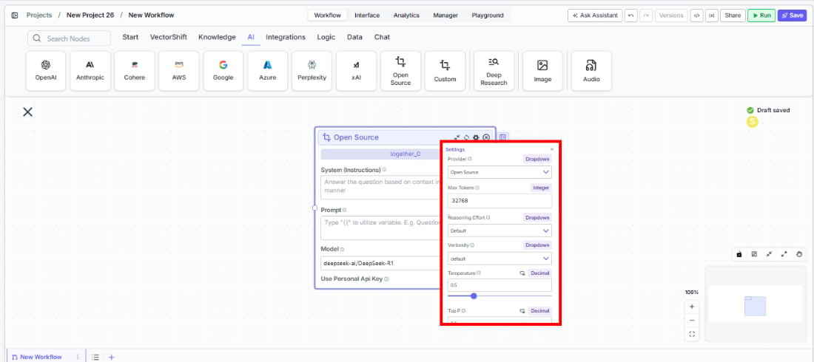

> ## Documentation Index
> Fetch the complete documentation index at: https://docs.vectorshift.ai/llms.txt
> Use this file to discover all available pages before exploring further.

# Open Source LLM

> Generate text responses using open-source models from Together AI in your workflows.

<Card title="Use this node from the SDK" icon="code" href="/sdk/pipeline/nodes/llms#llm">
  Add it in Python with `pipeline.add(name="...").llm(...)`. See the SDK reference.
</Card>

The Open Source LLM node connects your workflows to open-source language models hosted on Together AI, including Meta Llama, Mistral, Google Gemma, DeepSeek, and NVIDIA NeMo. Use it to access cost-effective, high-quality models for tasks like classifying financial transactions, generating research summaries, or building AI workflows with models you can evaluate and audit.

## Core Functionality

* Access open-source models from Meta Llama, Mistral, Google Gemma, DeepSeek, and others via Together AI
* Process system instructions and dynamic prompts with variable interpolation
* Stream responses in real time for long-running generations
* Return structured JSON output with optional schema enforcement
* Track token usage and credit consumption per run
* Apply content moderation, PII detection, and safety guardrails
* Retry failed executions automatically with configurable intervals

## Tool Inputs

* `System Instructions` — (String) Instructions that guide the model's behavior, tone, and how it should use data provided in the prompt
* `Prompt` — (String) The data sent to the model. Type `{{` to open the variable builder and reference outputs from other nodes
* `Model` \* — (Enum (Dropdown), default: `deepseek-ai/DeepSeek-R1`) Select from available open-source models. Click **Dropdown** to view all options
* `Use Personal Api Key` — (Boolean, default: `No`) Toggle to use your own Together AI API key
* `Api Key` — (String) Your Together AI API key. Required when `Use Personal Api Key` is enabled — the node will show a validation error if left blank
* `JSON Schema` — (String) JSON schema to enforce structured output. Only visible when `JSON Response` is enabled

\* indicates a required field

## Tool Outputs

* `response` — (String (or Stream\<String> when streaming)) The generated text response from the model
* `prompt_response` — (String) The combined prompt and response content
* `tokens_used` — (Integer) Total number of tokens consumed (input + output)
* `input_tokens` — (Integer) Number of input tokens sent to the model
* `output_tokens` — (Integer) Number of output tokens generated by the model
* `credits_used` — (Decimal) VectorShift AI credits consumed for this run

<Tabs>
  <Tab title="Workflows">
    ## Overview

    The Open Source LLM node in workflows lets you place an open-source model on the canvas via Together AI's hosting infrastructure. This gives you access to a wide range of models from different research labs, enabling cost optimization and model evaluation within your workflows.

    ## Use Cases

    * **Cost-optimized batch processing** — Route high-volume, lower-complexity tasks like transaction tagging to cost-effective open-source models while reserving premium models for complex analysis.
    * **Model evaluation and comparison** — Compare outputs across different open-source model families to find the best quality-to-cost ratio for specific financial tasks.
    * **Research summarization** — Use DeepSeek or Llama models to summarize research papers, market reports, or regulatory updates at scale.
    * **Regulatory document classification** — Classify documents by type, jurisdiction, or urgency using open-source models that perform well on categorization tasks.
    * **Internal knowledge Q\&A** — Build cost-effective internal chatbots using open-source models grounded in your organization's documentation.

    ## How It Works

    1. **Add the node to your workflow.** From the toolbar, open the **AI** category and drag the **Open Source** node onto the canvas.

    <Frame>
      
    </Frame>

    2. **Write your System Instructions.** Enter instructions in the `System Instructions` field to define the model's behavior.

    3. **Configure the Prompt.** In the `Prompt` field, type `{{` to open the variable builder and reference upstream node outputs.

    4. **Select a model.** Use the `Model` dropdown to choose an open-source model. Available options include `deepseek-ai/DeepSeek-R1`, `meta-llama/Llama-3-70b-chat-hf`, `mistralai/Mistral-7B-Instruct-v0.1`, `mistralai/Mixtral-8x7B-Instruct-v0.1`, `google/gemma-2-27b-it`, `nvidia/Llama-3.1-Nemotron-Ultra-253B-v1`, and others.

    <Frame>
      
    </Frame>

    5. **Provide an API key.** Toggle `Use Personal Api Key` to **Yes** and enter your Together AI API key.

    6. **Open settings.** Click the **gear icon** (⚙) to configure token limits, temperature, retry behavior, and more.

    <Frame>
      
    </Frame>

    7. **Connect outputs and run.** Wire the `response` output to downstream nodes and execute the workflow.

    ## Settings

    All settings below are accessed via the **gear icon** (⚙) on the node.

    | Setting                        | Type     | Default     | Description                                                         |
    | ------------------------------ | -------- | ----------- | ------------------------------------------------------------------- |
    | `Provider`                     | Dropdown | Open Source | The LLM provider (Together AI).                                     |
    | `Max Tokens`                   | Integer  | 128000      | Maximum number of input + output tokens per run.                    |
    | `Temperature`                  | Float    | 0.5         | Controls response creativity. Range: 0–1.                           |
    | `Top P`                        | Float    | 0.5         | Controls token sampling diversity. Range: 0–1.                      |
    | `Stream Response`              | Boolean  | Off         | Stream responses token-by-token.                                    |
    | `JSON Output`                  | Boolean  | Off         | Return output as structured JSON.                                   |
    | `Show Sources`                 | Boolean  | Off         | Display source documents used for the response.                     |
    | `Toxic Input Filtration`       | Boolean  | Off         | Filter toxic input content.                                         |
    | `Retry On Failure`             | Boolean  | Off         | Enable automatic retries when execution fails.                      |
    | `Max Retries`                  | Integer  | —           | Maximum retry attempts. Visible when `Retry On Failure` is enabled. |
    | `Max Interval b/w re-try`      | Integer  | —           | Interval in milliseconds between retry attempts.                    |
    | **PII Detection**              |          |             |                                                                     |
    | `Name`                         | Boolean  | Off         | Detect and redact personal names from input.                        |
    | `Email`                        | Boolean  | Off         | Detect and redact email addresses from input.                       |
    | `Phone`                        | Boolean  | Off         | Detect and redact phone numbers from input.                         |
    | `SSN`                          | Boolean  | Off         | Detect and redact Social Security numbers from input.               |
    | `Credit Card`                  | Boolean  | Off         | Detect and redact credit card numbers from input.                   |
    | `Show Success/Failure Outputs` | Boolean  | —           | Display additional success and failure output ports.                |

    ## Best Practices

    * **Start with DeepSeek-R1 for reasoning tasks.** It offers strong reasoning capabilities at a lower cost than commercial alternatives.
    * **Use Llama models for general-purpose tasks.** Meta's Llama family provides excellent general performance for summarization and Q\&A.
    * **Compare models before committing.** Swap the model dropdown to test different models on the same inputs and evaluate quality-to-cost tradeoffs.
    * **Monitor token usage.** Open-source models via Together AI are billed per token — track consumption for budgeting.
    * **Enable PII detection for client data.** Even with open-source models, apply PII toggles when processing sensitive financial information.

    ## Common Issues

    For troubleshooting common issues with this node, see the [Common Issues](/support) documentation.
  </Tab>
</Tabs>
