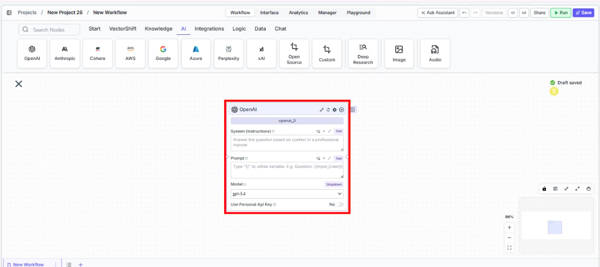
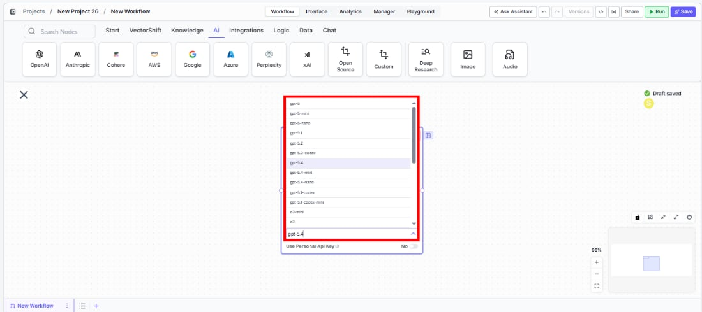
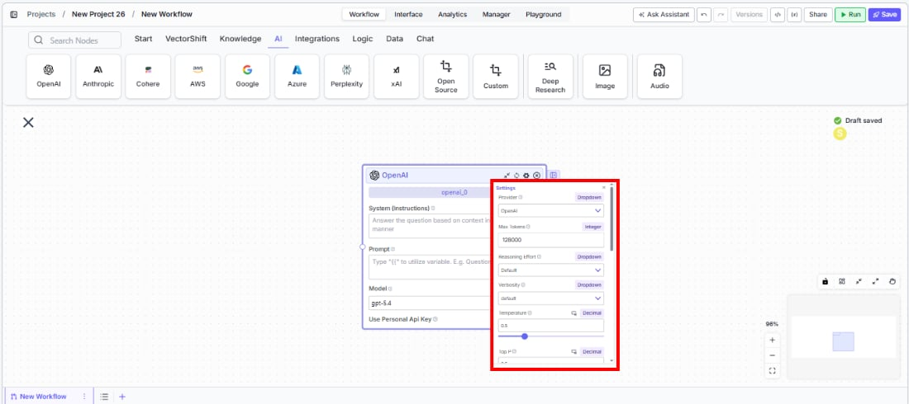
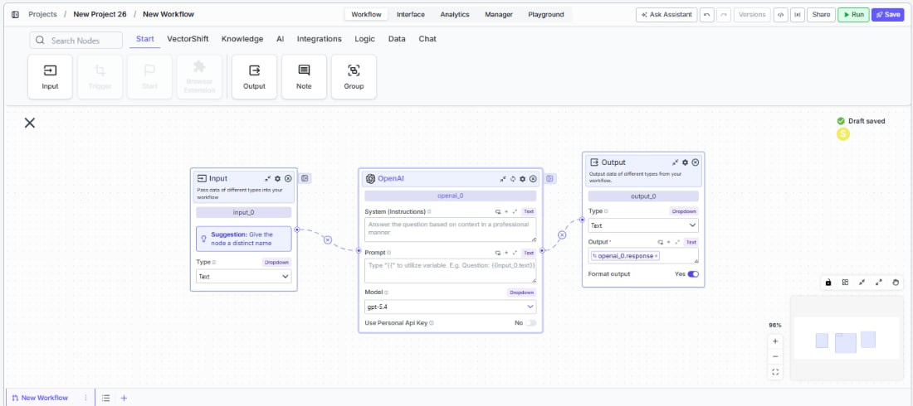

> ## Documentation Index
> Fetch the complete documentation index at: https://docs.vectorshift.ai/llms.txt
> Use this file to discover all available pages before exploring further.

# OpenAI LLM

> Generate text responses using OpenAI's GPT models in your workflows.

<Card title="Use this node from the SDK" icon="code" href="/sdk/pipeline/nodes/llms#llm">
  Add it in Python with `pipeline.add(name="...").llm(...)`. See the SDK reference.
</Card>

The OpenAI LLM node connects your workflows to OpenAI's GPT family of language models. Use it to generate text responses, analyze documents, answer questions grounded in knowledge bases, or produce structured JSON outputs — for example, drafting investment memos from research notes, classifying financial transactions, or extracting key terms from contracts using the latest GPT models.

## Core Functionality

* Generate text completions and conversational responses using GPT models
* Process system instructions and dynamic prompts with variable interpolation
* Stream responses in real time for long-running generations
* Return structured JSON output with optional schema enforcement
* Track token usage and credit consumption per run
* Apply content moderation, PII detection, and safety guardrails
* Retry failed executions automatically with configurable intervals

## Tool Inputs

* `System Instructions` — (String) Instructions that guide the model's behavior, tone, and how it should use data provided in the prompt
* `Prompt` — (String) The data sent to the model. Type `{{` to open the variable builder and reference outputs from other nodes
* `Model` \* — (Enum (Dropdown), default: `gpt-5.1`) Select from available GPT models. Click **Dropdown** to view all options
* `Use Personal Api Key` — (Boolean, default: `No`) Toggle to use your own OpenAI API key instead of VectorShift's shared key
* `Api Key` — (String) Your OpenAI API key. Only visible when `Use Personal Api Key` is enabled
* `JSON Schema` — (String) JSON schema to enforce structured output format. Only visible when `JSON Response` is enabled

\* indicates a required field

## Tool Outputs

* `response` — (String (or Stream\<String> when streaming)) The generated text response from the model
* `prompt_response` — (String) The combined prompt and response content
* `tokens_used` — (Integer) Total number of tokens consumed (input + output)
* `input_tokens` — (Integer) Number of input tokens sent to the model
* `output_tokens` — (Integer) Number of output tokens generated by the model
* `credits_used` — (Decimal) VectorShift AI credits consumed for this run

<Tabs>
  <Tab title="Workflows">
    ## Overview

    The OpenAI LLM node in workflows lets you place a GPT model directly on the canvas, wire inputs and outputs to other nodes, and configure model behavior through the settings panel. OpenAI models are widely adopted and offer strong general-purpose performance across a range of financial and analytical tasks.

    ## Use Cases

    * **Investment memo drafting** — Generate structured investment memos by combining analyst research notes, market data, and portfolio context into a coherent summary.
    * **Financial transaction classification** — Categorize transactions by type, risk level, or regulatory relevance using natural language understanding.
    * **Contract term extraction** — Extract key terms, obligations, and dates from legal and financial contracts using JSON mode for structured output.
    * **Client communication generation** — Draft personalized portfolio update emails by combining market data with client-specific holdings and preferences.
    * **Regulatory Q\&A** — Build chatbots that answer compliance questions grounded in your organization's policy knowledge base.

    ## How It Works

    1. **Add the node to your workflow.** From the toolbar, open the **AI** category and drag the **OpenAI** node onto the canvas.

    <Frame>
      
    </Frame>

    2. **Write your System Instructions.** Enter instructions in the `System Instructions` field to define the model's behavior, tone, and how it should use any data provided in the prompt.

    3. **Configure the Prompt.** In the `Prompt` field, type `{{` to open the variable builder and reference outputs from upstream nodes.

    4. **Select a model.** Use the `Model` dropdown to choose a GPT model. Available options include `gpt-5.1`, `gpt-5`, `gpt-5-mini`, `gpt-5-nano`, `gpt-5.1-codes`, `o4-mini`, `gpt-4.1`, `gpt-4.1-mini`, `chatgpt-4o-latest`, `gpt-4o`, `gpt-4o-mini`, and others.

    <Frame>
      
    </Frame>

    5. **Open settings.** Click the **gear icon** (⚙) to configure token limits, temperature, reasoning effort, retry behavior, and more.

    <Frame>
      
    </Frame>

    6. **Connect outputs.** Click the **Outputs** button to open the outputs panel. Wire the `response` output to downstream nodes.

    <Frame>
      
    </Frame>

    7. **Run your workflow.** Execute the workflow to process inputs and return the generated response along with usage metrics.

    ## Settings

    All settings below are accessed via the **gear icon** (⚙) on the node.

    | Setting                        | Type     | Default | Description                                                                                                                              |
    | ------------------------------ | -------- | ------- | ---------------------------------------------------------------------------------------------------------------------------------------- |
    | `Provider`                     | Dropdown | OpenAI  | The LLM provider.                                                                                                                        |
    | `Max Tokens`                   | Integer  | 128000  | Maximum number of input + output tokens the model will process per run.                                                                  |
    | `Reasoning Effort`             | Dropdown | Default | Controls the depth of reasoning the model applies to its response.                                                                       |
    | `Verbosity`                    | Dropdown | Default | Controls the verbosity of model responses.                                                                                               |
    | `Temperature`                  | Float    | 0.5     | Controls response creativity. Higher values produce more diverse outputs; lower values produce more deterministic responses. Range: 0–1. |
    | `Top P`                        | Float    | 0.5     | Controls token sampling diversity. Higher values consider more tokens at each generation step. Range: 0–1.                               |
    | `Stream Response`              | Boolean  | Off     | Stream responses token-by-token.                                                                                                         |
    | `JSON Response`                | Boolean  | Off     | Return output as structured JSON. When enabled, a `JSON Schema` input appears.                                                           |
    | `Show Sources`                 | Boolean  | Off     | Display source documents used for the response.                                                                                          |
    | `Toxic Input Filtration`       | Boolean  | Off     | Filter toxic input content.                                                                                                              |
    | `Safe Context Token Window`    | Boolean  | Off     | Automatically reduce context to fit within the model's maximum context window.                                                           |
    | `Retry On Failure`             | Boolean  | Off     | Enable automatic retries when execution fails.                                                                                           |
    | `Max Retries`                  | Integer  | —       | Maximum retry attempts. Visible when `Retry On Failure` is enabled.                                                                      |
    | `Max Interval b/w re-try`      | Integer  | —       | Interval in milliseconds between retry attempts.                                                                                         |
    | **PII Detection**              |          |         |                                                                                                                                          |
    | `Name`                         | Boolean  | Off     | Detect and redact personal names from input.                                                                                             |
    | `Email`                        | Boolean  | Off     | Detect and redact email addresses from input.                                                                                            |
    | `Phone`                        | Boolean  | Off     | Detect and redact phone numbers from input.                                                                                              |
    | `SSN`                          | Boolean  | Off     | Detect and redact Social Security numbers from input.                                                                                    |
    | `Credit Card`                  | Boolean  | Off     | Detect and redact credit card numbers from input.                                                                                        |
    | `Show Success/Failure Outputs` | Boolean  | —       | Display additional success and failure output ports on the node.                                                                         |

    ## Best Practices

    * **Select the right model for your task.** Use `gpt-5.1` or `gpt-5` for complex reasoning; `gpt-5-mini` or `gpt-4o-mini` for cost-effective batch processing of simpler tasks.
    * **Use JSON mode for structured extraction.** Enable `JSON Response` and provide a schema for consistent, machine-readable output when extracting financial data.
    * **Monitor token usage.** Connect `tokens_used` and `credits_used` outputs to tracking nodes, especially for high-volume batch processing.
    * **Enable Safe Context Token Window for variable-length inputs.** Prevents token-limit errors when processing documents of unpredictable size.
    * **Use streaming for interactive interfaces.** Enable streaming when powering client-facing chatbots for responsive user experience.
    * **Apply PII detection for regulated data.** Enable SSN and other PII toggles when processing client financial records.

    ## Related Templates

    <CardGroup cols={2}>
      <Card title="Document Classification Agent" href="https://app.vectorshift.ai/marketplace">
        Automatically categorizes and tags incoming documents based on content and type.
      </Card>

      <Card title="Contract AI Analyst" href="https://app.vectorshift.ai/marketplace">
        Analyzes contracts to extract key terms, flag risks, and summarize obligations.
      </Card>

      <Card title="Refund/Expense Approval AI Agent" href="https://app.vectorshift.ai/marketplace">
        Reviews and routes refund or expense requests based on policy rules and approval thresholds.
      </Card>

      <Card title="Customer Support Chatbot" href="https://app.vectorshift.ai/marketplace">
        Handles common customer inquiries and support tickets through conversational AI.
      </Card>
    </CardGroup>

    ## Common Issues

    For troubleshooting common issues with this node, see the [Common Issues](/support) documentation.
  </Tab>
</Tabs>
