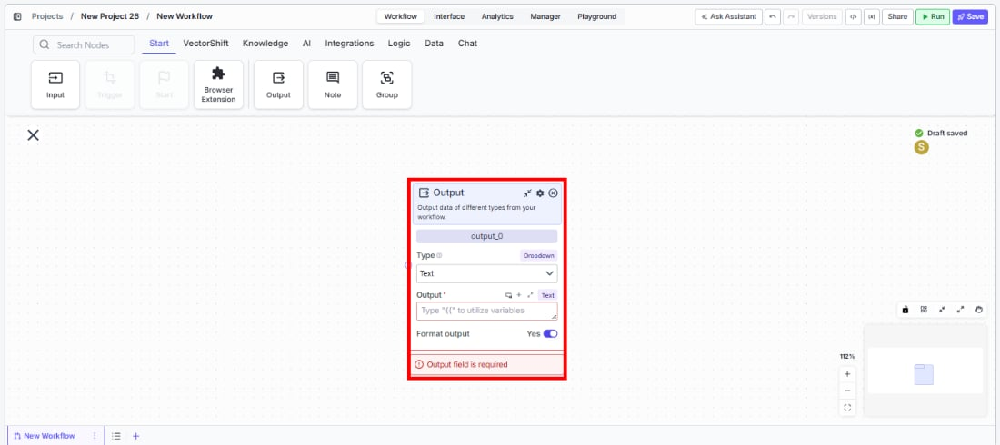
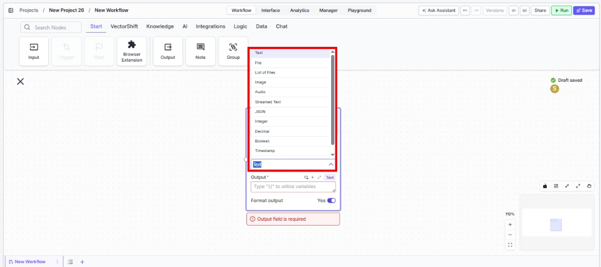

> ## Documentation Index
> Fetch the complete documentation index at: https://docs.vectorshift.ai/llms.txt
> Use this file to discover all available pages before exploring further.

# Output

> Output data of different types from your workflow as the final result of execution.

<Card title="Use this node from the SDK" icon="code" href="/sdk/pipeline/nodes/start#output">
  Add it in Python with `pipeline.add(name="...").output(...)`. See the SDK reference.
</Card>

The Output node defines the final result of a workflow. It accepts data from upstream nodes and presents it as the workflow's return value — whether in the run interface, API response, or chatbot reply. Use it to surface LLM-generated text, processed files, images, structured JSON, or any other data type as the workflow's deliverable.

## Core Functionality

* Defines a typed output parameter for the workflow that appears in the run result, API response, or chatbot reply
* Supports multiple data types: Text, File, List of Files, Image, Audio, Streamed Text, JSON, Integer, Decimal, Boolean, Timestamp, and Dataframe
* Optionally formats the output for display
* The node name becomes the output field label in the workflow's results

## Tool Inputs

* `Type` — Dropdown. Default: `Text`. The data type of the output. Options: Text, File, List of Files, Image, Audio, Streamed Text, JSON, Integer, Decimal, Boolean, Timestamp, Dataframe.
* `Output` \* — Varies by type. Required. The data to output. Connect an upstream node's output or type a value with `{{}}` variable syntax.
* `Format output` — Toggle. Default: `Yes`. When enabled, the output is formatted for display (e.g., markdown rendering for text).

\* *Required field*

## Tool Outputs

The Output node has no downstream outputs. It is a terminal node that surfaces data as the workflow's result.

***

<Tabs>
  <Tab title="Workflows">
    ### Overview

    In workflows, the Output node is the terminal point where processed data is delivered to the user or calling system. Every workflow needs at least one Output node to return results. The output appears in the Run dialog, API response, chatbot message, or form result depending on how the workflow is deployed. Use multiple Output nodes to return several result fields from a single workflow run.

    ### Use Cases

    * Return an LLM-generated summary as Text output in a document analysis workflow
    * Output a processed PDF (e.g., a filled form or generated report) as a File for the user to download
    * Stream an LLM's response in real-time using Streamed Text for a chatbot deployment
    * Return structured extraction results as JSON for an API consumer to parse programmatically
    * Output a generated chart or diagram as an Image in a data visualization workflow

    ### How It Works

    #### Step 1: Add the Output Node

    In the workflow canvas, click the **Start** tab in the node palette and click **Output**. Drag it onto the canvas.

    <Frame>
      
    </Frame>

    #### Step 2: Name the Output

    Rename the node to describe the result (e.g., "Summary", "Report File", "Analysis Results"). The name appears as the output field label in the workflow's results.

    #### Step 3: Select the Data Type

    Use the `Type` dropdown to select the appropriate type for the data being output. The default is `Text`. The `Output` input field updates to accept the matching type.

    <Frame>
      
    </Frame>

    #### Step 4: Connect the Input

    Connect the upstream node's output to the `Output` field. For example, connect an LLM node's response to a Text output, or a file processing node's result to a File output. This field is required — the node shows a validation error if left empty.

    <Frame>
      
    </Frame>

    #### Step 5: Configure Settings (Optional)

    Click the settings icon to open the Settings panel:

    * **`Description`** — Enter a description for this output. This text helps users understand what the output represents.
    * **`Format output`** — Toggle on (default) to enable formatted display (e.g., markdown rendering). Toggle off for raw output.

    ### Settings

    | Setting         | Type     | Default | Description                                  |
    | --------------- | -------- | ------- | -------------------------------------------- |
    | `Type`          | Dropdown | Text    | The data type of the output.                 |
    | `Output`        | Varies   | —       | The data to output. Required.                |
    | `Format output` | Toggle   | Yes     | Enable formatted display of the output.      |
    | `Description`   | Text     | —       | A description of what the output represents. |

    ### Best Practices

    * **Use Streamed Text for chatbots.** When deploying as a chatbot, use the Streamed Text type instead of Text to stream the LLM's response in real-time rather than waiting for the full response.
    * **Name outputs descriptively.** When a workflow returns multiple outputs, clear names like "Summary" and "Source Documents" are far better than "output\_0" and "output\_1".
    * **Use JSON for API integrations.** When the workflow is called via API, JSON output provides structured data that consuming applications can parse directly.
    * **Match the type to the upstream data.** Using the correct type ensures the output renders properly — for example, Image type for generated images, File type for downloadable documents.
    * **Add descriptions for complex outputs.** If the output requires interpretation (e.g., a JSON schema or a specific format), use the Description field to document what consumers should expect.

    ### Common Issues

    For help with common configuration issues, see the [Common Issues](/support) page.
  </Tab>
</Tabs>
