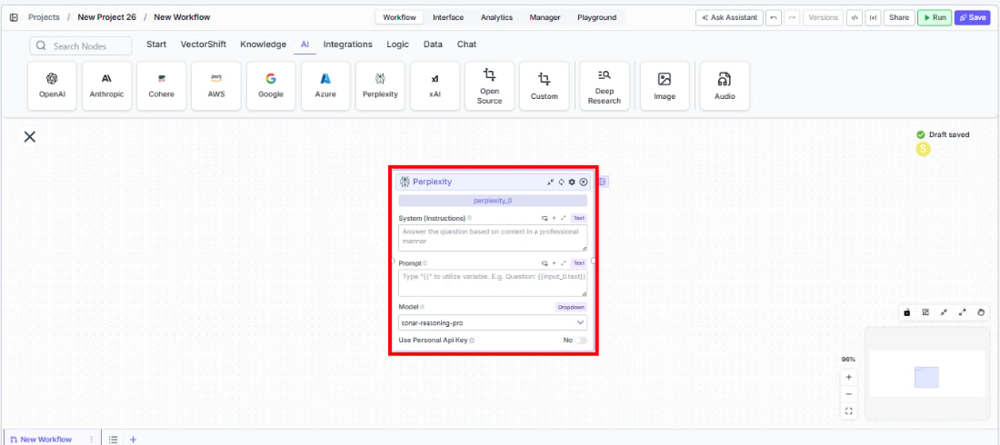
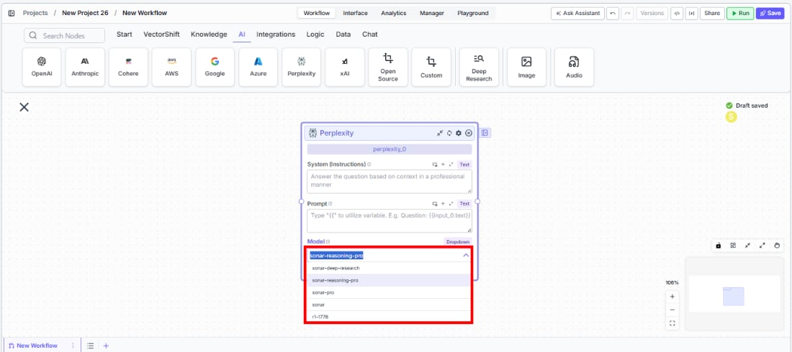
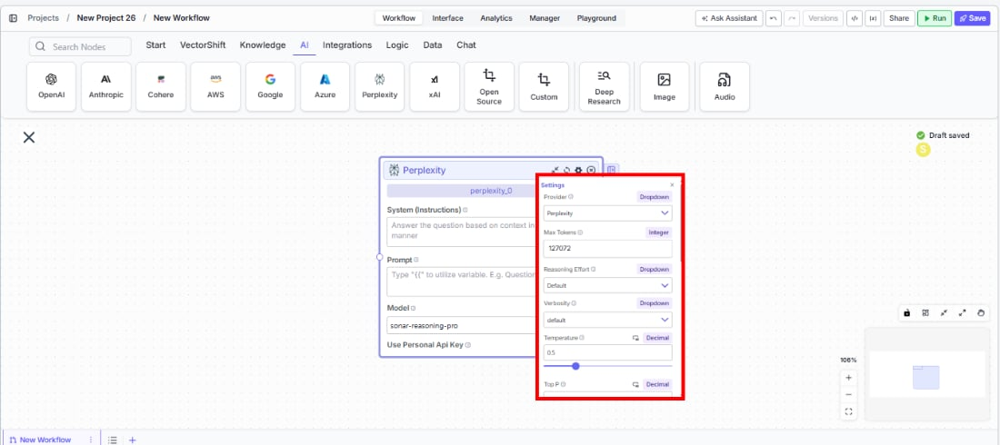
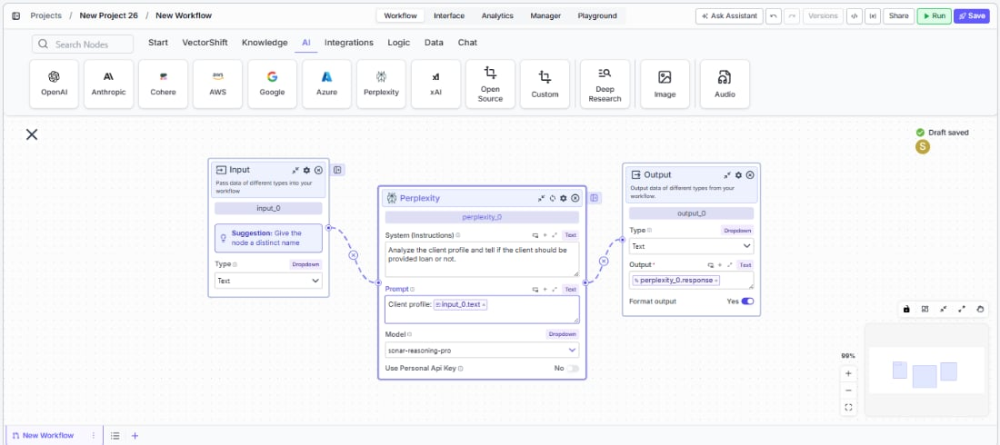

> ## Documentation Index
> Fetch the complete documentation index at: https://docs.vectorshift.ai/llms.txt
> Use this file to discover all available pages before exploring further.

# Perplexity LLM

> Generate text responses with built-in web search using Perplexity's Sonar models in your workflows.

<Card title="Use this node from the SDK" icon="code" href="/sdk/pipeline/nodes/llms#llm">
  Add it in Python with `pipeline.add(name="...").llm(...)`. See the SDK reference.
</Card>

The Perplexity LLM node connects your workflows to Perplexity's Sonar models, which combine language generation with real-time web search. Use it to generate responses grounded in current web data — for example, researching recent market developments, monitoring competitor announcements, or answering questions that require up-to-date information beyond your training data.

## Core Functionality

* Generate text responses with built-in real-time web search capabilities
* Access Perplexity Sonar models optimized for research and reasoning
* Process system instructions and dynamic prompts with variable interpolation
* Stream responses in real time for long-running generations
* Track token usage and credit consumption per run
* Apply content moderation, PII detection, and safety guardrails
* Retry failed executions automatically with configurable intervals

## Tool Inputs

* `System Instructions` — (String) Instructions that guide the model's behavior, tone, and how it should use data provided in the prompt
* `Prompt` — (String) The data sent to the model. Type `{{` to open the variable builder and reference outputs from other nodes
* `Model` \* — (Enum (Dropdown), default: `sonar-reasoning-pro`) Select from available Perplexity models
* `Use Personal Api Key` — (Boolean, default: `No`) Toggle to use your own Perplexity API key
* `Api Key` — (String) Your Perplexity API key. Only visible when `Use Personal Api Key` is enabled

\* indicates a required field

## Tool Outputs

* `response` — (String (or Stream\<String> when streaming)) The generated text response from the model
* `prompt_response` — (String) The combined prompt and response content
* `tokens_used` — (Integer) Total number of tokens consumed (input + output)
* `input_tokens` — (Integer) Number of input tokens sent to the model
* `output_tokens` — (Integer) Number of output tokens generated by the model
* `credits_used` — (Decimal) VectorShift AI credits consumed for this run

<Tabs>
  <Tab title="Workflows">
    ## Overview

    The Perplexity LLM node in workflows provides access to Sonar models that can search the web in real time as part of their response generation. Unlike standard LLMs that rely only on training data, Perplexity models actively retrieve current information, making them ideal for time-sensitive financial research and monitoring.

    ## Use Cases

    * **Real-time market research** — Query current stock prices, recent earnings announcements, or breaking financial news with responses grounded in live web data.
    * **Competitor monitoring** — Track recent competitor product launches, pricing changes, or partnership announcements across the web.
    * **Regulatory update tracking** — Monitor recent regulatory changes, SEC filings, or compliance guidance updates in real time.
    * **Due diligence research** — Research target companies using current web sources, including recent news, press releases, and financial coverage.
    * **Market sentiment analysis** — Analyze current market sentiment by searching and synthesizing recent financial commentary and analyst opinions.

    ## How It Works

    1. **Add the node to your workflow.** From the toolbar, open the **AI** category and drag the **Perplexity** node onto the canvas.

    <Frame>
      
    </Frame>

    2. **Write your System Instructions.** Enter instructions in the `System Instructions` field to guide the model's response behavior.

    3. **Configure the Prompt.** In the `Prompt` field, type `{{` to reference upstream node outputs.

    4. **Select a model.** Use the `Model` dropdown to choose a Perplexity model. The default `sonar-reasoning-pro` provides strong reasoning with web search.

    <Frame>
      
    </Frame>

    5. **Open settings.** Click the **gear icon** (⚙) to configure settings.

    <Frame>
      
    </Frame>

    6. **Connect outputs.** Wire the `response` output to downstream nodes. The response includes information retrieved from the web.

    <Frame>
      
    </Frame>

    7. **Run your workflow.** Execute the workflow to get responses grounded in current web data.

    ## Settings

    All settings below are accessed via the **gear icon** (⚙) on the node.

    | Setting                        | Type     | Default    | Description                                                                    |
    | ------------------------------ | -------- | ---------- | ------------------------------------------------------------------------------ |
    | `Provider`                     | Dropdown | Perplexity | The LLM provider.                                                              |
    | `Max Tokens`                   | Integer  | 127072     | Maximum number of input + output tokens per run.                               |
    | `Reasoning Effort`             | Dropdown | Default    | Controls the depth of reasoning.                                               |
    | `Verbosity`                    | Dropdown | Default    | Controls the verbosity of responses.                                           |
    | `Temperature`                  | Float    | 0.5        | Controls response creativity. Range: 0–1.                                      |
    | `Top P`                        | Float    | 0.5        | Controls token sampling diversity. Range: 0–1.                                 |
    | `Stream Response`              | Boolean  | Off        | Stream responses token-by-token.                                               |
    | `JSON Output`                  | Boolean  | Off        | Return output as structured JSON.                                              |
    | `Show Sources`                 | Boolean  | Off        | Display source documents used for the response.                                |
    | `Toxic Input Filtration`       | Boolean  | Off        | Filter toxic input content.                                                    |
    | `Safe Context Token Window`    | Boolean  | Off        | Automatically reduce context to fit within the model's maximum context window. |
    | `Retry On Failure`             | Boolean  | Off        | Enable automatic retries when execution fails.                                 |
    | `Max Retries`                  | Integer  | —          | Maximum retry attempts.                                                        |
    | `Max Interval b/w re-try`      | Integer  | —          | Interval in milliseconds between retries.                                      |
    | **PII Detection**              |          |            |                                                                                |
    | `Name`                         | Boolean  | Off        | Detect and redact personal names.                                              |
    | `Email`                        | Boolean  | Off        | Detect and redact email addresses.                                             |
    | `Phone`                        | Boolean  | Off        | Detect and redact phone numbers.                                               |
    | `SSN`                          | Boolean  | Off        | Detect and redact Social Security numbers.                                     |
    | `Credit Card`                  | Boolean  | Off        | Detect and redact credit card numbers.                                         |
    | `Address`                      | Boolean  | Off        | Detect and redact physical addresses.                                          |
    | `Show Success/Failure Outputs` | Boolean  | —          | Display additional success and failure output ports.                           |

    ## Best Practices

    * **Use for time-sensitive queries.** Perplexity excels when responses need current data — use it for market research, news monitoring, and regulatory tracking.
    * **Combine with static data sources.** Feed knowledge base context through the prompt alongside Perplexity's web search for comprehensive answers that blend internal and external data.
    * **Enable Show Sources.** When grounding is important (e.g., compliance workflows), enable `Show Sources` to trace where the model retrieved its information.
    * **Monitor costs.** Web-search-augmented models may consume more tokens. Track usage for budgeting.
    * **Apply PII detection.** Enable relevant PII toggles when processing financial data through the model.

    ## Related Templates

    <CardGroup cols={2}>
      <Card title="FX Arbitrage Research Agent" href="https://app.vectorshift.ai/marketplace">
        Identifies and analyzes foreign exchange arbitrage opportunities across markets and instruments.
      </Card>

      <Card title="Webpage Customer Support Agent" href="https://app.vectorshift.ai/marketplace">
        Provides real-time customer support directly embedded within a website interface.
      </Card>
    </CardGroup>

    ## Common Issues

    For troubleshooting common issues with this node, see the [Common Issues](/support) documentation.
  </Tab>
</Tabs>
