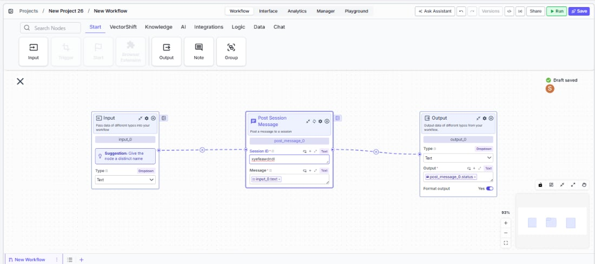
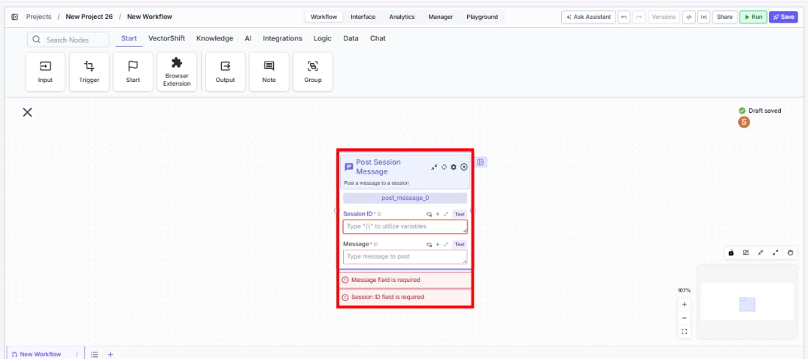

> ## Documentation Index
> Fetch the complete documentation index at: https://docs.vectorshift.ai/llms.txt
> Use this file to discover all available pages before exploring further.

# Post Message

> Post a message to an active chat session programmatically from within a workflow.

<Card title="Use this node from the SDK" icon="code" href="/sdk/pipeline/nodes/conversational#post_message">
  Add it in Python with `pipeline.add(name="...").post_message(...)`. See the SDK reference.
</Card>

The Post Message node sends a message to an active chat session from within a workflow. It enables workflows to programmatically inject messages into a conversation — useful for delivering proactive notifications, status updates, or follow-up information to a user's ongoing session without requiring the user to send a new message first.

## Core Functionality

* Posts a text message to a specified chat session by session ID
* Enables workflows to push messages into active conversations asynchronously
* Returns a status indicator confirming whether the message was delivered successfully
* Works with any VectorShift chatbot session, including those deployed via website widget, API, Slack, or WhatsApp

## Tool Inputs

* `Session ID` \* — Text. The unique identifier of the chat session to post the message to. Connect from an upstream node or reference a stored session ID using `{{variable}}` syntax.
* `Message` \* — Text. The message content to post to the session. Can be a static string, a dynamically generated LLM response, or any text value from an upstream node.

<Frame>
  
</Frame>

\* *Required field*

## Tool Outputs

* `status` — Text. The status of the message post, indicating whether the message was delivered successfully.

***

<Tabs>
  <Tab title="Workflows">
    ### Overview

    In workflows, the Post Message node allows a workflow to push messages into an active chat session without waiting for the user to send a new message. This is particularly useful for long-running workflows that need to provide progress updates, for event-driven workflows that deliver notifications to a user's session, or for multi-step processes where the system needs to follow up after an initial conversation. The node requires a valid session ID and a message, and it returns a status indicating delivery success.

    ### Use Cases

    * Send a trade confirmation or order status update to a client's active chat session after a backend process completes
    * Deliver real-time portfolio alerts (e.g., a stock crossing a price threshold) to an advisor's open session
    * Push compliance review results back to a user's conversation after an asynchronous document analysis finishes
    * Notify a customer in their chat session when a scheduled report (e.g., monthly account statement) is ready for download
    * Send follow-up information to a session after an approval workflow completes — for example, confirming a wire transfer has been initiated

    ### How It Works

    #### Step 1: Add the Post Message Node

    In the workflow canvas, click the **Chat** tab in the node palette and click **Post Message**. Drag it onto the canvas.

    <Frame>
      
    </Frame>

    #### Step 2: Provide the Session ID

    Connect the `Session ID` input to a node that supplies the target session's identifier. This is typically obtained from a trigger, a stored variable, or a previous workflow run that captured the session ID.

    #### Step 3: Provide the Message

    Connect the `Message` input to the text content you want to post. This can come from an LLM node, a Text node, a template with variables, or any upstream node that produces text.

    #### Step 4: Connect the Output

    Connect the `status` output to a downstream node if you need to verify delivery or branch logic based on success or failure. For example, connect it to a Condition node to handle failed deliveries.

    #### Step 5: Configure Settings (Optional)

    Click the settings icon to access additional options:

    * **Show Success/Failure Outputs** — Toggle on to expose separate output handles for success and failure paths, enabling conditional logic based on the delivery result.

    ### Settings

    | Setting                        | Type   | Default | Description                                                   |
    | ------------------------------ | ------ | ------- | ------------------------------------------------------------- |
    | `Session ID`                   | Text   | —       | The session to post the message to. Required.                 |
    | `Message`                      | Text   | —       | The message to post to the session. Required.                 |
    | `Show Success/Failure Outputs` | Toggle | Off     | Expose separate output handles for success and failure paths. |

    ### Best Practices

    * **Store session IDs reliably.** Ensure the session ID is captured and stored (e.g., via a variable or database) at the start of the conversation so it can be referenced later by asynchronous workflows.
    * **Validate before posting.** Use a Condition node upstream to verify that the session ID is not empty before attempting to post, avoiding unnecessary failures.
    * **Handle delivery failures.** Enable the Show Success/Failure Outputs toggle and add error-handling logic for cases where the session has expired or the ID is invalid.
    * **Keep messages concise.** Messages posted to a session should be clear and actionable — avoid sending large blocks of text that could overwhelm the chat interface.
    * **Use for asynchronous follow-ups.** The Post Message node is most valuable when a workflow runs independently of the chat session (e.g., triggered by a cron job or an external event) and needs to deliver results back to the user.

    ### Related Templates

    <CardGroup cols={2}>
      <Card title="Customer Support Chatbot" href="https://app.vectorshift.ai/marketplace">
        Handles common customer inquiries and support tickets through conversational AI.
      </Card>

      <Card title="Banking Helpdesk" href="https://app.vectorshift.ai/marketplace">
        Assists banking customers with account inquiries, transactions, and product questions.
      </Card>

      <Card title="CRM Insights Digest Agent" href="https://app.vectorshift.ai/marketplace">
        Summarizes and surfaces key CRM data insights for sales and relationship management teams.
      </Card>

      <Card title="Investor Helpdesk" href="https://app.vectorshift.ai/marketplace">
        Handles investor inquiries related to portfolios, statements, and fund performance.
      </Card>
    </CardGroup>

    ### Common Issues

    For help with common configuration issues, see the [Common Issues](/support) page.
  </Tab>
</Tabs>
