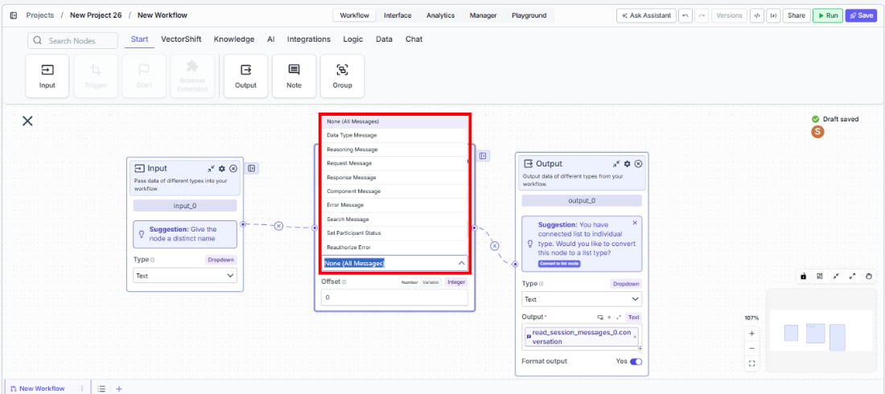
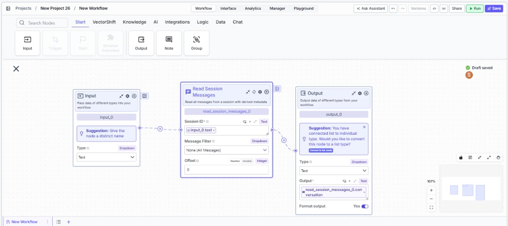
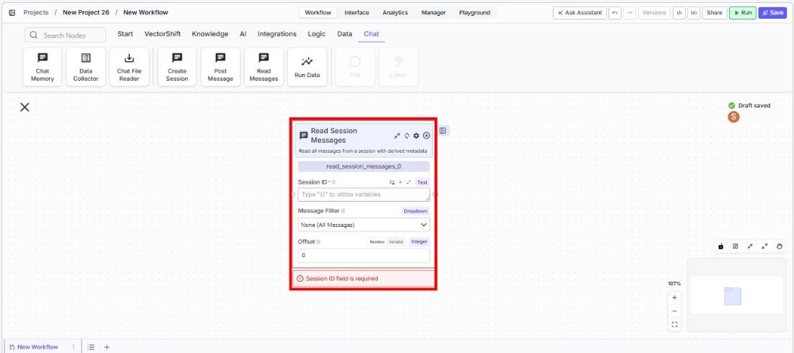

> ## Documentation Index
> Fetch the complete documentation index at: https://docs.vectorshift.ai/llms.txt
> Use this file to discover all available pages before exploring further.

# Read Session Messages

> Read all messages from an agent session with filtering, pagination, and derived metadata.

<Card title="Use this node from the SDK" icon="code" href="/sdk/pipeline/nodes/chat#read_session_messages">
  Add it in Python with `pipeline.add(name="...").read_session_messages(...)`. See the SDK reference.
</Card>

The Read Session Messages node retrieves messages from an agent session, with options to filter by message type and paginate results. Use it to extract conversation history, analyze agent responses, audit tool calls, or review reasoning traces — for example, reading the full conversation from a compliance review session, extracting all tool call results for logging, or pulling reasoning messages for quality assurance.

## Core Functionality

* Reads messages from an existing agent session by session ID
* Filters messages by type: all, data type, reasoning, request, response, component, error, search, status, and reauthorize
* Supports pagination via offset to handle large conversation histories
* Returns structured outputs: raw messages, clean conversation, tool calls, reasoning, and session result

## Tool Inputs

* `Session ID` \* — Text. Required. The ID of the session to read messages from.
* `Message Filter` — Dropdown. Default: `None (All Messages)`. Filter messages by type. Options: None (All Messages), Data Type Message, Reasoning Message, Request Message, Response Message, Component Message, Error Message, Search Message, Set Participant Status, Reauthorize Error.
* `Offset` — Integer. Default: `0`. Number of messages to skip from the beginning. Supports Number and Variable modes.

<Frame>
  
</Frame>

\* *Required field*

## Tool Outputs

* `messages` — List\<Text>. All raw session messages as JSON strings.
* `conversation` — List\<Text>. Clean conversation messages (text and reasoning only).
* `tool_calls` — List\<Text>. Tool calls with status and request/response data.
* `reasoning_messages` — List\<Text>. Reasoning and thinking messages from the agent.
* `result` — Text. Overall session result and metadata as JSON.

***

<Tabs>
  <Tab title="Workflows">
    ### Overview

    In workflows, the Read Session Messages node connects to a session created by the Create Session node (via session ID) and retrieves the conversation contents. It provides multiple output views of the data — raw messages, clean conversation text, tool calls, and reasoning — making it easy to route different aspects of the conversation to different downstream processing nodes.

    <Frame>
      
    </Frame>

    ### Use Cases

    * Read the full conversation from a client onboarding session and generate a summary report using an LLM
    * Extract all tool call results from an automated analysis session for logging and audit
    * Pull reasoning messages from a compliance review session to verify the agent's decision-making process
    * Read error messages from a failed session to diagnose issues and trigger retry logic
    * Retrieve the session result to check whether the agent completed its task successfully

    ### How It Works

    #### Step 1: Add the Read Session Messages Node

    In the workflow canvas, click the **Chat** tab and click **Read Messages**.

    <Frame>
      
    </Frame>

    #### Step 2: Connect the Session ID

    Connect the `Session ID` input from an upstream Create Session or Post Message node's session ID output.

    #### Step 3: Configure Message Filter (Optional)

    Use the `Message Filter` dropdown to narrow results to a specific message type. Leave as "None (All Messages)" to retrieve everything.

    #### Step 4: Set Offset (Optional)

    Set the `Offset` value to skip a number of messages from the beginning. Useful for pagination in long conversations.

    #### Step 5: Connect Outputs

    Connect the relevant outputs to downstream nodes: `conversation` for human-readable text, `tool_calls` for audit logs, `reasoning_messages` for QA review, or `result` for session status.

    ### Settings

    | Setting                        | Type        | Default             | Description                                           |
    | ------------------------------ | ----------- | ------------------- | ----------------------------------------------------- |
    | `Session ID`                   | Text        | —                   | The session to read from. Required.                   |
    | `Message Filter`               | Dropdown    | None (All Messages) | Filter by message type.                               |
    | `Offset`                       | Integer     | 0                   | Number of messages to skip.                           |
    | `Show Success/Failure Outputs` | Toggle      | Off                 | Show additional output handles. **Advanced setting.** |
    | `Dependencies`                 | List\<Path> | —                   | Control execution order. **Advanced setting.**        |

    ### Best Practices

    * **Use Message Filter for targeted analysis.** Instead of processing all messages, filter to the specific type you need (e.g., Error Messages for debugging, Tool Calls for audit).
    * **Pair with Create Session and Post Message.** The typical pattern is: Create Session → Post Message → Read Session Messages to orchestrate and then analyze agent conversations.
    * **Use Offset for long conversations.** In sessions with many messages, use offset to paginate and process in batches.
    * **Route outputs to specialized processing.** Connect `conversation` to an LLM for summarization, `tool_calls` to a logging workflow, and `result` to a condition node for branching.

    ### Related Templates

    <CardGroup cols={2}>
      <Card title="Customer Support Chatbot" href="https://app.vectorshift.ai/marketplace">
        Handles common customer inquiries and support tickets through conversational AI.
      </Card>

      <Card title="Banking Helpdesk" href="https://app.vectorshift.ai/marketplace">
        Assists banking customers with account inquiries, transactions, and product questions.
      </Card>

      <Card title="CRM Insights Digest Agent" href="https://app.vectorshift.ai/marketplace">
        Summarizes and surfaces key CRM data insights for sales and relationship management teams.
      </Card>

      <Card title="Investor Helpdesk" href="https://app.vectorshift.ai/marketplace">
        Handles investor inquiries related to portfolios, statements, and fund performance.
      </Card>
    </CardGroup>

    ### Common Issues

    For help with common configuration issues, see the [Common Issues](/support) page.
  </Tab>
</Tabs>
