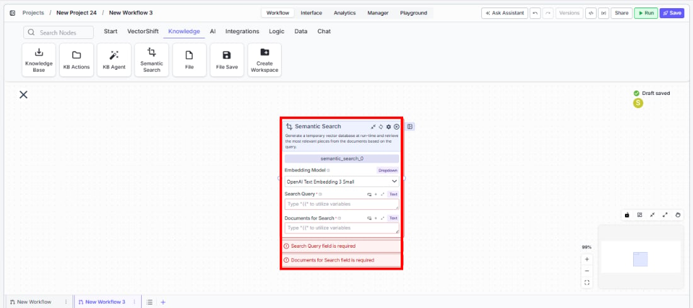
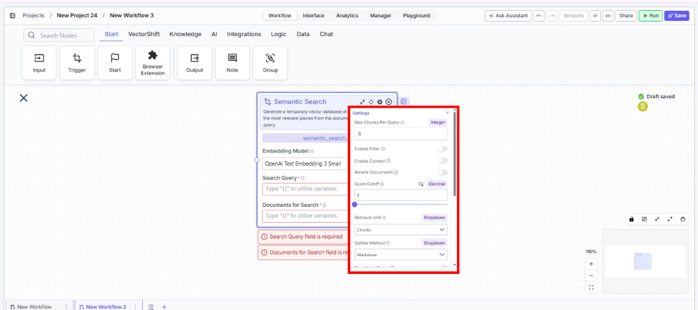
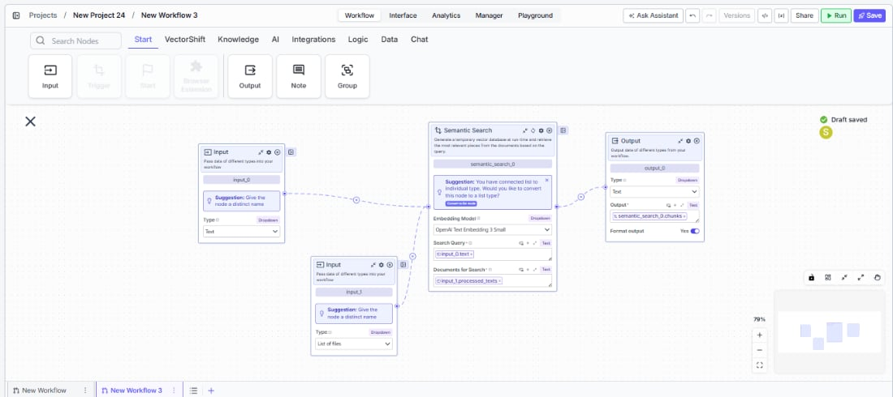

> ## Documentation Index
> Fetch the complete documentation index at: https://docs.vectorshift.ai/llms.txt
> Use this file to discover all available pages before exploring further.

# Semantic Search

> Generate a temporary vector database at runtime and retrieve the most relevant content from documents based on a query.

<Card title="Use this node from the SDK" icon="code" href="/sdk/pipeline/nodes/knowledge#semantic_search">
  Add it in Python with `pipeline.add(name="...").semantic_search(...)`. See the SDK reference.
</Card>

The Semantic Search node creates a temporary vector database at runtime from provided documents and retrieves the most relevant pieces based on a natural language query. Unlike querying a persistent knowledge base, this node embeds and searches documents on-the-fly — making it ideal for searching through dynamic content that hasn't been pre-indexed. Use it to find relevant passages in uploaded documents, filter through large text collections, or build retrieval-augmented generation (RAG) workflows.

## Core Functionality

* Generate a temporary vector index from documents at runtime
* Retrieve semantically similar chunks, documents, or pages based on a natural language query
* Choose from a wide range of embedding models (OpenAI, Cohere, Voyage, etc.)
* Optionally rerank results for improved relevancy
* Support advanced search features including query transformation, multi-question extraction, and hybrid search
* Configure chunking strategy, document analysis, and context formatting

## Tool Inputs

* `Embedding Model` — Dropdown · Default: `OpenAI Text Embedding 3 Small` · The model used to generate embeddings. Supports multiple providers including OpenAI, Cohere, Voyage, Google, and others.
* `Search Query` \* — **Required** · Text · The natural language query used to search documents for relevant content.
* `Documents for Search` \* — **Required** · Text (multiple) · The text to search through. You can connect multiple upstream nodes to this field.
* `Max Docs Per Query` — Integer · Default: `5` · Maximum number of relevant chunks to return.
* `Rerank Documents` — Boolean · Default: `false` · Refine the initial ranking of returned chunks based on relevancy.
* `Retrieval Unit` — Dropdown · Default: `Chunks` · Options: `Chunks`, `Documents`, `Pages` · What to return — individual chunks, full documents with metadata, or complete pages.
* `Splitter Method` — Dropdown · Default: `Markdown` · Options: `Sentence`, `Markdown`, `Dynamic` · Chunking strategy for the temporary index.
* `Segmentation Method` — Dropdown · Default: `Words` · Options: `Words`, `Sentences`, `Paragraphs` · Text segmentation method (visible when Splitter Method is Dynamic).
* `Analyze Documents` — Boolean · Default: `false` · Analyze and enrich document contents when parsing.
* `Hybrid Mode` — Boolean · Default: `false` · Create a hybrid index combining vector and keyword search.
* `Enable Filter` — Boolean · Default: `false` · Filter content returned from the search.
* `Enable Context` — Boolean · Default: `false` · Provide additional context to advanced search and query analysis.
* `Transform Query` — Boolean · Default: `false` · Transform the query for better semantic search.
* `Answer Multiple Questions` — Boolean · Default: `false` · Extract separate questions and retrieve content for each.
* `Expand Query` — Boolean · Default: `false` · Expand the query to improve search.
* `Expand Query Terms` — Boolean · Default: `false` · Expand query terms to improve search.
* `Do Advanced QA` — Boolean · Default: `false` · Use additional LLM calls to analyze each document and improve answer correctness.
* `Format Context for LLM` — Boolean · Default: `false` · Format the retrieved context for LLM consumption.
* `Score Cutoff` — Float · Default: `0` · Minimum similarity score threshold for returned results.
* `Alpha` — Float · Default: `0.5` · The alpha value for hybrid retrieval.

\* indicates a required field.

## Tool Outputs

* `chunks` — List of Text · Semantically similar chunks retrieved from the documents. Present when Retrieval Unit is Chunks.
* `documents` — List of Text · Semantically similar documents with metadata. Present when Retrieval Unit is Documents.
* `response` — Text · The response from advanced QA. Present when Do Advanced QA is enabled.
* `formatted_text` — Text · Knowledge base outputs formatted for LLM input. Present when Format Context for LLM is enabled.
* `citation_metadata` — List of Text · Citation metadata for search outputs. Present when Do Advanced QA is enabled.

<Tabs>
  <Tab title="Workflows">
    ## Overview

    In workflows, the Semantic Search node embeds and searches through documents provided at runtime. Connect upstream text or document nodes to provide the search corpus, and wire a query input to find relevant content. The node creates a temporary vector index, performs the search, and outputs matching chunks or documents for downstream processing.

    ## Use Cases

    * **RAG workflow** — A workflow takes a user question as input, loads relevant documents, runs Semantic Search to find the most relevant passages, and passes them to an LLM for answer generation.
    * **Document comparison** — A workflow searches through a set of uploaded contracts to find clauses relevant to a specific topic or keyword.
    * **Dynamic content retrieval** — A workflow receives fresh data (API responses, web scrapes) and performs semantic search without needing to pre-index into a knowledge base.
    * **Financial document analysis** — A workflow searches through earnings transcripts or regulatory filings for passages related to specific financial metrics or risk factors.
    * **Multi-document Q\&A** — A workflow ingests multiple uploaded PDFs and uses Semantic Search to find and aggregate answers across all of them.

    ## How It Works

    1. **Add the node** — On the workflow canvas, open the node panel and navigate to the **Knowledge** category. Drag **Semantic Search** onto the canvas.

    <Frame>
      
    </Frame>

    2. **Select the embedding model** — Choose an embedding model from the `Embedding Model` dropdown. The default (OpenAI Text Embedding 3 Small) works well for most use cases.
    3. **Connect the query** — Wire a text input to the `Search Query` field. This field is required.
    4. **Connect the documents** — Wire one or more text outputs to the `Documents for Search` field. This field is required. You can connect multiple upstream nodes.
    5. **Configure search options** — Set `Max Docs Per Query`, `Retrieval Unit`, and optional features like `Rerank Documents`, `Hybrid Mode`, or `Do Advanced QA`.

    <Frame>
      
    </Frame>

    6. **Connect outputs** — Wire `chunks`, `documents`, `response`, or `formatted_text` to downstream nodes.

    <Frame>
      
    </Frame>

    7. **Run the workflow** — Execute the workflow. The node builds a temporary index, searches it, and passes results downstream.

    ## Settings

    * `Embedding Model` — Dropdown · Default: `OpenAI Text Embedding 3 Small` · Vector embedding model.
    * `Search Query` — Text · **Required** · The search query.
    * `Documents for Search` — Text (multiple) · **Required** · Documents to index and search.
    * `Max Docs Per Query` — Integer · Default: `5` · Max results to return.
    * `Rerank Documents` — Boolean · Default: `false` · Rerank results for relevancy.
    * `Retrieval Unit` — Dropdown · Default: `Chunks` · Return type (Chunks, Documents, Pages).

    **Advanced Settings:**

    * `Splitter Method` — Dropdown · Default: `Markdown` · Chunking strategy.
    * `Segmentation Method` — Dropdown · Default: `Words` · Segmentation method (with Dynamic splitter).
    * `Analyze Documents` — Boolean · Default: `false` · Enrich documents during parsing.
    * `Hybrid Mode` — Boolean · Default: `false` · Vector + keyword hybrid search.
    * `Enable Filter` — Boolean · Default: `false` · Filter returned content.
    * `Transform Query` — Boolean · Default: `false` · Query transformation.
    * `Answer Multiple Questions` — Boolean · Default: `false` · Multi-question extraction.
    * `Expand Query` / `Expand Query Terms` — Boolean · Default: `false` · Query expansion.
    * `Do Advanced QA` — Boolean · Default: `false` · LLM-enhanced answer generation.
    * `Format Context for LLM` — Boolean · Default: `false` · Format output for LLM input.
    * `Score Cutoff` — Float · Default: `0` · Minimum similarity threshold.
    * `Alpha` — Float · Default: `0.5` · Hybrid retrieval balance.
    * `Enable Context` — Boolean · Default: `false` · Pass additional context to search.

    ## Best Practices

    * **Choose the right embedding model** — For financial documents, models like OpenAI Text Embedding 3 Large or Voyage provide higher accuracy at slightly higher cost. Use smaller models for speed on less critical searches.
    * **Enable reranking for precision** — When accuracy matters more than speed, enable `Rerank Documents` to refine the initial results using a dedicated reranking model.
    * **Use hybrid mode for keyword-heavy content** — Financial documents often contain specific identifiers (tickers, CUSIP numbers, regulation names) where keyword matching complements semantic search.
    * **Set appropriate max docs** — Start with 5 and increase if the downstream LLM needs more context. Too many results can overwhelm the LLM's context window.
    * **Connect multiple document sources** — The Documents for Search input accepts multiple connections, so you can search across documents from different upstream nodes in a single query.
    * **Use Advanced QA sparingly** — Enabling Do Advanced QA adds LLM calls per document, which increases latency and cost. Use it only when answer accuracy is critical.

    ## Related Templates

    <CardGroup cols={2}>
      <Card title="Document Classification Agent" href="https://app.vectorshift.ai/marketplace">
        Automatically categorizes and tags incoming documents based on content and type.
      </Card>

      <Card title="Document Comparison AI Agent" href="https://app.vectorshift.ai/marketplace">
        Side-by-side comparison of documents to highlight differences and track revisions.
      </Card>

      <Card title="Spreadsheet Comparison Assistant" href="https://app.vectorshift.ai/marketplace">
        Compares two or more spreadsheets to identify discrepancies, changes, and anomalies.
      </Card>

      <Card title="Validation Agent" href="https://app.vectorshift.ai/marketplace">
        Validates data and documents against predefined rules, schemas, or compliance standards.
      </Card>
    </CardGroup>

    ## Common Issues

    For troubleshooting and common issues, see the [Common Issues](/docs/common-issues) page.
  </Tab>
</Tabs>
