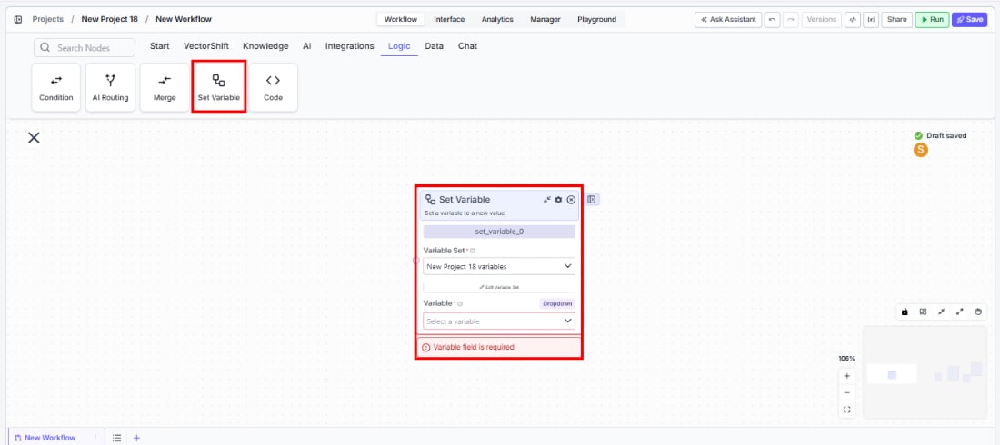
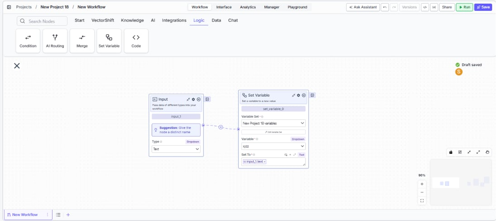

> ## Documentation Index
> Fetch the complete documentation index at: https://docs.vectorshift.ai/llms.txt
> Use this file to discover all available pages before exploring further.

# Set Variable

> Set a workflow variable to a new value or expression during workflow execution.

<Card title="Use this node from the SDK" icon="code" href="/sdk/pipeline/nodes/logic#set_variable">
  Add it in Python with `pipeline.add(name="...").set_variable(...)`. See the SDK reference.
</Card>

The Set Variable node lets you assign a new value to a workflow variable during workflow execution. Use it to update counters, store intermediate results, toggle flags, or pass computed values between different stages of a workflow — for example, updating a running total as you process line items in a financial report, or setting a status variable that downstream nodes reference for conditional logic.

## Core Functionality

* Sets a workflow variable to a new value at runtime
* Selects from existing variable sets defined in the project
* Supports any variable data type defined in the variable set
* Validates that a variable is selected before execution

## Tool Inputs

* `Variable Set` \* — The variable set containing the target variable. Dropdown listing variable sets defined in the project (e.g., `New Project 1 Variables`). Required.
* `Variable` \* — The specific variable to update. Dropdown listing variables within the selected variable set. Required. Shows the variable reference (e.g., `{{Variables_1}}`).
* `Value` \* — The new value to assign to the variable. Required. The input type is determined by the selected variable's data type. Can be entered directly or connected from an upstream node.

\* *Required field*

## Tool Outputs

The Set Variable node does not produce data outputs. It updates the variable's value in place. Downstream nodes access the updated value by referencing the variable directly.

***

<Tabs>
  <Tab title="Workflows">
    ### Overview

    In workflows, the Set Variable node updates a workflow variable's value during execution. It references the project's variable sets and lets you select which variable to update. The value can come from an upstream node connection or be entered manually. Use it to maintain state across workflow steps — for example, accumulating a running total, storing a flag that controls downstream conditional branches, or saving an intermediate calculation result for later use.

    ### Use Cases

    * Update a running total variable as each line item in a financial report is processed
    * Set a status flag variable to control downstream Condition node branching
    * Store an extracted value (e.g., account number, total amount) from a document for use later in the workflow
    * Reset a counter variable at the start of a loop iteration
    * Save an LLM-generated classification result into a variable for reference by multiple downstream nodes

    ### How It Works

    #### Step 1: Add the Set Variable Node

    In the workflow canvas, click the **Logic** tab in the node palette and click **Set Variables**. Drag it onto the canvas.

    <Frame>
      
    </Frame>

    #### Step 2: Select the Variable Set

    In the `Variable Set` dropdown, select the variable set that contains the variable you want to update. Variable sets are defined at the project level — for example, `New Project 1 Variables`.

    #### Step 3: Select the Variable

    In the `Variable` dropdown, select the specific variable to update. The dropdown lists all variables defined in the selected variable set, displayed as references (e.g., `{{Variables_1}}`).

    #### Step 4: Set the Value

    Enter the new value in the `Value` field, or connect it from an upstream node's output. The input type matches the selected variable's data type.

    If the `Variable` field is left empty, the node shows a validation error: *"Variable field is required."*

    #### Step 5: Connect and Run

    Connect the Set Variable node into your workflow at the point where the variable should be updated. Downstream nodes can reference the updated variable value.

    <Frame>
      
    </Frame>

    Click **Run** to test. Verify that the variable is updated correctly by checking its value in downstream nodes.

    ### Settings

    | Setting        | Type          | Default | Description                                                                                            |
    | -------------- | ------------- | ------- | ------------------------------------------------------------------------------------------------------ |
    | `Variable Set` | Dropdown      | —       | The project variable set containing the target variable. Required.                                     |
    | `Variable`     | Dropdown      | —       | The specific variable to update. Required. Displays as a variable reference (e.g., `{{Variables_1}}`). |
    | `Value`        | Variable type | —       | The new value to assign. Type matches the variable's defined data type. Required.                      |

    ### Best Practices

    * **Define variables before using this node.** Create your variable sets and variables at the project level first. The Set Variable node can only update existing variables — it cannot create new ones.
    * **Use meaningful variable names.** Name your variables descriptively (e.g., `running_total`, `approval_status`) so the workflow logic is clear when reviewing the canvas.
    * **Place strategically in the workflow.** Position the Set Variable node at the exact point where the variable's value should change. Variable updates are immediate — any downstream node that references the variable will see the new value.
    * **Pair with Condition nodes for stateful logic.** Set a flag variable (e.g., `is_approved = true`) and then use a Condition node downstream to branch based on that flag.
    * **Avoid circular dependencies.** Do not create loops where a Set Variable node's input depends on the same variable it is setting. This can cause unpredictable behavior.

    ### Common Issues

    For help with common configuration issues, see the [Common Issues](/support) page.
  </Tab>
</Tabs>
