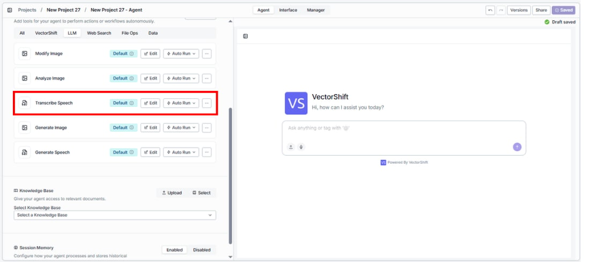
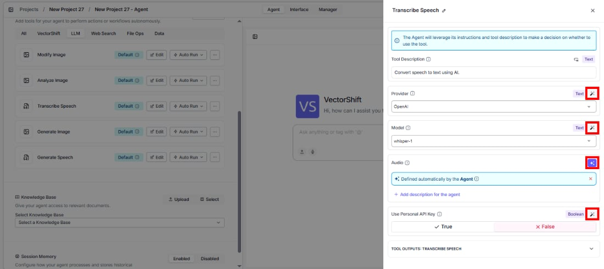
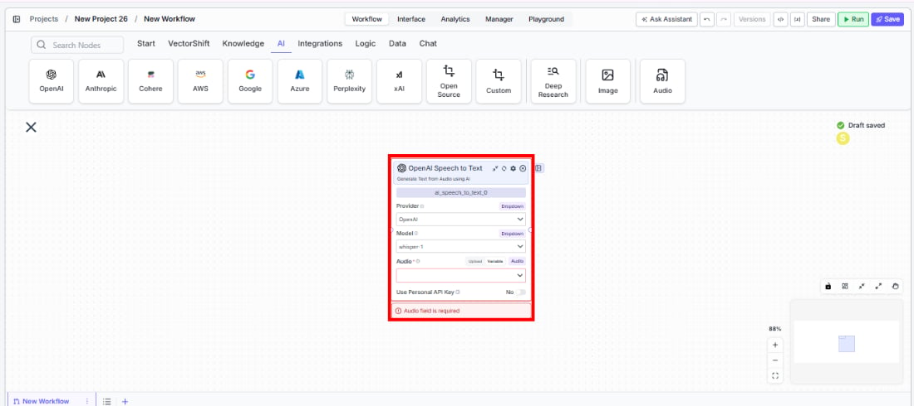

> ## Documentation Index
> Fetch the complete documentation index at: https://docs.vectorshift.ai/llms.txt
> Use this file to discover all available pages before exploring further.

# Speech to Text

> Transcribe audio to text using AI models in your workflows and agents.

<Card title="Use this node from the SDK" icon="code" href="/sdk/pipeline/nodes/multi-modal#ai_speech_to_text">
  Add it in Python with `pipeline.add(name="...").ai_speech_to_text(...)`. See the SDK reference.
</Card>

The Speech to Text node converts audio input into text using AI transcription models. Use it to transcribe meeting recordings, earnings call audio, client voicemails, or any audio content — enabling downstream text processing like summarization, search indexing, or compliance review.

## Core Functionality

* Transcribe audio files to text using AI speech recognition models
* Support multiple providers including OpenAI (Whisper) and Deepgram
* Select specialized model tiers for different accuracy and speed tradeoffs
* Use personal API keys for dedicated access

## Tool Inputs

* `Provider` \* — (Enum (Dropdown), default: `OpenAI`) Select the transcription provider (OpenAI, Deepgram)
* `Model` \* — (Enum (Dropdown), default: `whisper-1`) Select the speech-to-text model
* `Audio` \* — (Audio) The audio file to transcribe
* `Tier` — (Enum (Dropdown), default: `general`) Deepgram-specific: select the transcription tier. Only visible when provider is Deepgram
* `Use Personal API Key` — (Boolean, default: `No`) Toggle to use your own API key
* `Api Key` — (String) Your API key. Only visible when `Use Personal API Key` is enabled

\* indicates a required field

## Tool Outputs

* `text` — (String) The transcribed text from the audio

<Tabs>
  <Tab title="Agents">
    ## Overview

    The Speech to Text tool in agents allows the AI to transcribe audio files shared during conversations. The agent can process voice messages, meeting recordings, or any audio content and return the transcribed text.

    ## Use Cases

    * **Meeting transcription** — Users share meeting recordings and the agent provides full transcriptions for note-taking.
    * **Voicemail processing** — Transcribe client voicemails for documentation and follow-up tracking.
    * **Audio content search** — Convert audio to text to enable search across audio archives.
    * **Compliance recording review** — Transcribe compliance-relevant recordings for review and documentation.

    ## How It Works

    1. **Add the tool to your agent.** In the agent builder, click **Add Tool** and select **Speech to Text** from the available tools.

    <Frame>
      
    </Frame>

    2. **Configure input fields.** Each field can either be filled automatically by the agent based on conversation context, or locked to a fixed value:
       * `Provider` — Select the transcription provider (e.g., OpenAI)
       * `Model` — Choose the model (e.g., `whisper-1`)
       * `Audio` — The agent uses audio files shared in the conversation

    <Frame>
      
    </Frame>

    3. **Write the Tool Description.** Describe what the tool does so the agent knows when to use it.

    4. **Set Auto Run behavior.** Choose: Auto Run, Require User Approval, or Let Agent Decide.

    5. **Test the tool.** Share an audio file with the agent and ask it to transcribe.

    ## Settings

    | Setting                | Type     | Default     | Description                 |
    | ---------------------- | -------- | ----------- | --------------------------- |
    | `Provider`             | Dropdown | OpenAI      | The transcription provider. |
    | `Model`                | Dropdown | `whisper-1` | The speech-to-text model.   |
    | `Use Personal API Key` | Boolean  | No          | Use your own API key.       |

    ## Best Practices

    * **Use OpenAI Whisper for general transcription.** It provides strong accuracy across languages and accents.
    * **Select Deepgram for specialized needs.** Deepgram offers different tiers optimized for specific use cases.
    * **Chain with an LLM node.** Connect the `text` output to an LLM node for automatic summarization of transcribed content.

    ## Related Templates

    <CardGroup cols={2}>
      <Card title="Earnings Call Insight and Sentiment Analyzer" href="https://app.vectorshift.ai/marketplace">
        Analyzes earnings call transcripts for sentiment, key themes, and forward-looking signals.
      </Card>
    </CardGroup>

    ## Common Issues

    For troubleshooting common issues with this node, see the [Common Issues](/support) documentation.
  </Tab>

  <Tab title="Workflows">
    ## Overview

    The Speech to Text node in workflows lets you connect an audio input to a transcription model and output the text to downstream nodes. This enables automated audio processing workflows.

    ## Use Cases

    * **Earnings call transcription** — Automatically transcribe earnings call recordings and feed the text to summarization nodes.
    * **Batch audio processing** — Process multiple audio files through consistent transcription settings.
    * **Voice-to-text workflows** — Convert voice inputs into text for further analysis, classification, or storage.
    * **Compliance monitoring** — Transcribe recorded client interactions for compliance review workflows.

    ## How It Works

    1. **Add the node to your workflow.** From the toolbar, open the **Audio** category and drag the **Speech to Text** node onto the canvas.

    <Frame>
      
    </Frame>

    2. **Select a provider and model.** Choose the `Provider` (e.g., OpenAI) and `Model` (e.g., `whisper-1`) from the dropdowns.

    3. **Connect the audio input.** Wire an audio output from an upstream node to the `Audio` input.

    4. **Connect the text output.** Wire the `text` output to downstream nodes for further processing.

    5. **Run your workflow.** Execute the workflow to transcribe the audio.

    ## Settings

    | Setting                | Type     | Default     | Description                                                                   |
    | ---------------------- | -------- | ----------- | ----------------------------------------------------------------------------- |
    | `Provider`             | Dropdown | OpenAI      | The transcription provider (OpenAI, Deepgram).                                |
    | `Model`                | Dropdown | `whisper-1` | The speech-to-text model.                                                     |
    | `Tier`                 | Dropdown | `general`   | Deepgram-specific transcription tier. Only visible when provider is Deepgram. |
    | `Use Personal API Key` | Boolean  | No          | Use your own API key.                                                         |

    ## Best Practices

    * **Match the provider to your needs.** Use OpenAI Whisper for general-purpose transcription; Deepgram for real-time or specialized use cases.
    * **Chain with LLM nodes.** Feed transcribed text directly into LLM nodes for summarization, analysis, or data extraction.
    * **Process audio in supported formats.** Ensure audio files are in a supported format (MP3, WAV, etc.) before feeding them to the node.

    ## Related Templates

    <CardGroup cols={2}>
      <Card title="Earnings Call Insight and Sentiment Analyzer" href="https://app.vectorshift.ai/marketplace">
        Analyzes earnings call transcripts for sentiment, key themes, and forward-looking signals.
      </Card>
    </CardGroup>

    ## Common Issues

    For troubleshooting common issues with this node, see the [Common Issues](/support) documentation.
  </Tab>
</Tabs>
