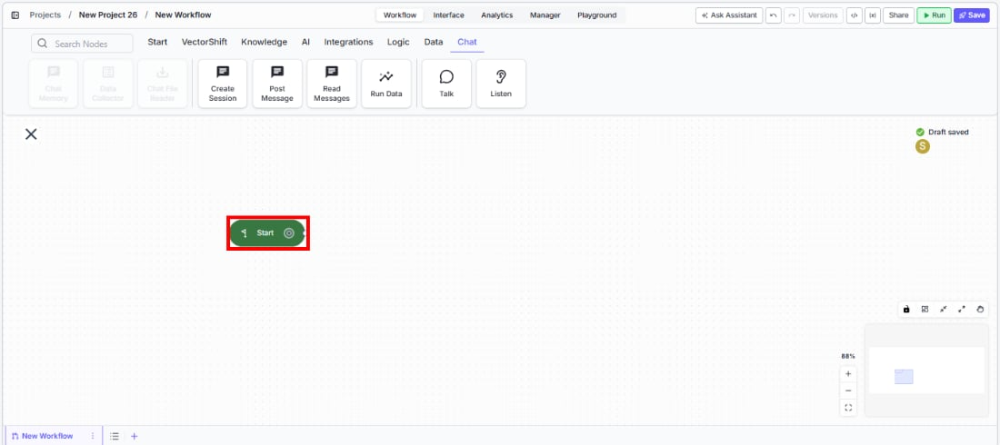
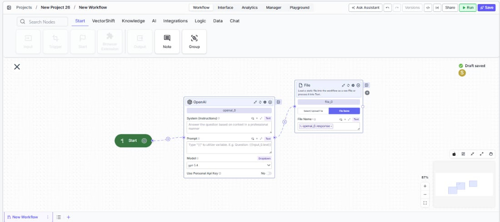

> ## Documentation Index
> Fetch the complete documentation index at: https://docs.vectorshift.ai/llms.txt
> Use this file to discover all available pages before exploring further.

# Start

> Define the entry point for conversational workflows that use Talk and Listen nodes.

<Card title="Use this node from the SDK" icon="code" href="/sdk/pipeline/nodes/start#start_flag">
  Add it in Python with `pipeline.add(name="...").start_flag(...)`. See the SDK reference.
</Card>

The Start node marks the beginning of a conversational workflow. It tells the workflow engine where to begin executing a step-by-step conversation flow built with Talk and Listen nodes. Every conversational workflow requires exactly one Start node.

## Core Functionality

* Defines the single entry point for conversational workflows that use Talk and Listen nodes
* Signals to the workflow engine that the workflow follows a sequential conversational flow rather than a standard data-processing workflow
* Replaces Input, Output, and Trigger nodes — adding a Start node converts the workflow to conversational mode and prevents those node types from being used
* Connects to downstream conversational nodes (e.g., Message, Capture, Button, Card, Carousel) via edge connections

## Tool Inputs

This node has no configurable inputs. The Start node functions purely as an entry-point marker with no parameters to set.

## Tool Outputs

This node has no data outputs. It defines the conversational flow entry point and connects to downstream nodes through edge connections rather than data handles.

***

<Tabs>
  <Tab title="Workflows">
    ### Overview

    In workflows, the Start node is the required entry point for any conversational workflow. When a workflow contains a Start node, it operates in conversational mode — the engine walks through the connected nodes sequentially, presenting messages (Talk nodes) and collecting responses (Listen nodes) one step at a time. Without a Start node, conversational nodes like Message and Capture display a warning and cannot execute. Only one Start node is allowed per workflow.

    ### Use Cases

    * Build a client intake chatbot that greets the user, collects account details, and routes to the appropriate advisor based on responses
    * Create a loan pre-qualification flow that asks income, credit, and employment questions step by step before returning an eligibility decision
    * Design an expense-report submission assistant that walks employees through category selection, amount entry, and receipt upload in a guided conversation
    * Implement a portfolio risk-assessment questionnaire that captures investment horizon, risk tolerance, and asset preferences through sequential prompts
    * Automate a KYC (Know Your Customer) verification process that collects identification documents and personal information through a structured conversational flow

    ### How It Works

    #### Step 1: Add the Start Node

    In the workflow canvas, click the **Start** tab in the node palette and click **Start**. Drag the node onto the canvas.

    <Frame>
      
    </Frame>

    #### Step 2: Connect to the First Conversational Node

    Draw an edge from the Start node to your first Talk or Listen node (e.g., a Message node that greets the user). This edge defines where the conversation begins.

    <Frame>
      
    </Frame>

    #### Step 3: Build the Conversation Flow

    Continue connecting Talk and Listen nodes in sequence. Each edge defines the next step in the conversation. The workflow engine follows these connections in order at runtime.

    #### Step 4: Deploy

    Deploy the workflow as a chatbot or voicebot interface. When a user starts a session, the engine begins at the Start node and walks through the connected conversational nodes.

    ### Settings

    The Start node has no configurable settings. It functions as a simple entry-point marker for the conversational flow.

    ### Best Practices

    * **Use exactly one Start node per workflow.** The engine requires a single entry point. Adding more than one Start node is not supported.
    * **Keep the Start node at the top or left of the canvas.** Position it where the flow begins visually so the conversation path reads naturally from left to right or top to bottom.
    * **Do not mix with Input/Output nodes.** Once a Start node is present, the workflow is in conversational mode. Use Talk nodes to present information and Listen nodes to collect input instead.
    * **Connect directly to a greeting message.** The first node after Start should be a Talk Message node that orients the user — for example, "Welcome! How can I help you today?"
    * **Test the full conversation path before deploying.** Use the preview or run dialog to walk through every branch and confirm the flow behaves as expected.

    ### Common Issues

    For help with common configuration issues, see the [Common Issues](/support) page.
  </Tab>
</Tabs>
