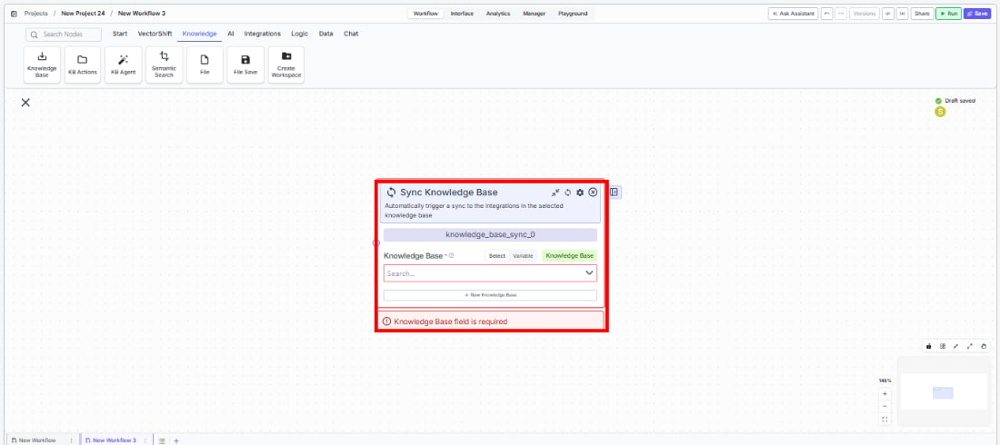
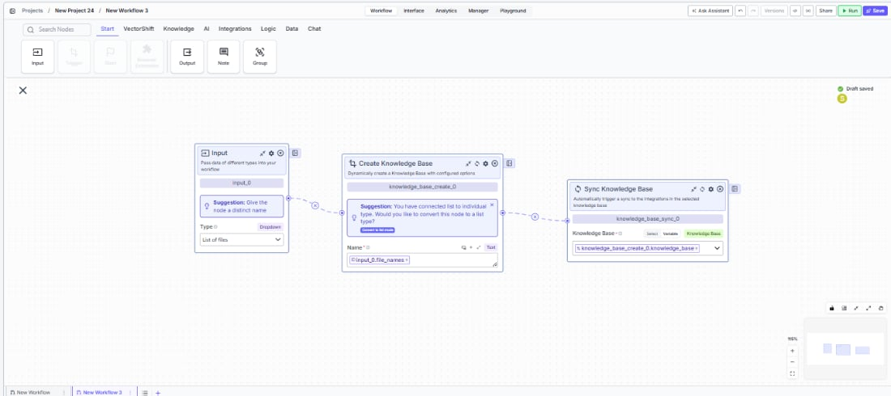

> ## Documentation Index
> Fetch the complete documentation index at: https://docs.vectorshift.ai/llms.txt
> Use this file to discover all available pages before exploring further.

# Sync Knowledge Base

> Trigger a sync to re-process all documents and integrations in a knowledge base.

<Card title="Use this node from the SDK" icon="code" href="/sdk/pipeline/nodes/knowledge#knowledge_base_sync">
  Add it in Python with `pipeline.add(name="...").knowledge_base_sync(...)`. See the SDK reference.
</Card>

The Sync Knowledge Base node triggers a synchronization for a selected knowledge base, re-processing all its documents and refreshing any connected integrations. Use it to keep knowledge bases up to date — for example, triggering a sync after loading new documents, or scheduling periodic refreshes to pick up changes from connected data sources like Google Drive or Confluence.

## Core Functionality

* Trigger a sync operation on an existing knowledge base
* Re-process all documents in the knowledge base to update embeddings and indexes
* Refresh content from connected integrations (e.g., Google Drive, Confluence, Notion)
* Can be triggered manually or as part of an automated workflow

## Tool Inputs

* `Knowledge Base` \* — **Required** · Knowledge Base selector · The knowledge base to sync.

\* indicates a required field.

## Tool Outputs

This node does not produce outputs. It triggers the sync operation on the selected knowledge base.

<Tabs>
  <Tab title="Workflows">
    ## Overview

    In workflows, the Sync Knowledge Base node triggers a sync operation as a workflow step. This is useful for automated workflows that need to ensure a knowledge base is up to date before querying it, or for scheduled workflows that periodically refresh knowledge base content from connected integrations.

    ## Use Cases

    * **Post-load refresh** — After loading new documents with a Knowledge Base Loader node, trigger a sync to ensure the new content is fully indexed and searchable.
    * **Scheduled integration sync** — A cron-triggered workflow syncs a knowledge base connected to Google Drive or Confluence on a daily schedule to pick up any document changes.
    * **Pre-query freshness guarantee** — Before running a Knowledge Base Agent query, sync the knowledge base to ensure results reflect the latest document state.
    * **Multi-knowledge-base refresh** — A workflow iterates over multiple knowledge bases and syncs each one as part of a nightly maintenance workflow.

    ## How It Works

    1. **Add the node** — On the workflow canvas, open the node panel and navigate to the **Knowledge** category. Drag **Sync Knowledge Base** onto the canvas.

    <Frame>
      
    </Frame>

    2. **Select the knowledge base** — Use the `Knowledge Base` selector to choose which knowledge base to sync. This field is required.
    3. **Position in the workflow** — Place the Sync Knowledge Base node after any document loading or modification steps, and before any query or retrieval steps that depend on fresh data.

    <Frame>
      
    </Frame>

    4. **Run the workflow** — Execute the workflow. The node triggers the sync operation on the selected knowledge base.

    ## Settings

    * `Knowledge Base` — Knowledge Base selector · **Required** · The knowledge base to sync.

    ## Best Practices

    * **Sync after loading** — Always place a Sync Knowledge Base node after Knowledge Base Loader nodes to ensure newly loaded documents are fully processed and indexed.
    * **Use with cron triggers** — For knowledge bases connected to external integrations, set up a cron-triggered workflow that runs the sync on a regular schedule (e.g., daily or hourly).
    * **Allow processing time** — Sync operations can take time for large knowledge bases. If downstream nodes depend on the sync being complete, consider adding appropriate dependencies.
    * **Avoid unnecessary syncs** — Only sync when content has changed or when integration sources may have updated. Frequent syncs on unchanged knowledge bases consume processing resources without benefit.

    ## Related Templates

    <CardGroup cols={2}>
      <Card title="IC Memos Knowledge Base" href="https://app.vectorshift.ai/marketplace">
        Centralized searchable repository of investment committee memos for quick reference.
      </Card>

      <Card title="Company Policy Compliance Chatbot" href="https://app.vectorshift.ai/marketplace">
        Answers employee questions about internal policies and flags potential compliance issues.
      </Card>

      <Card title="Investor Helpdesk" href="https://app.vectorshift.ai/marketplace">
        Handles investor inquiries related to portfolios, statements, and fund performance.
      </Card>

      <Card title="Closing Compliance Agent" href="https://app.vectorshift.ai/marketplace">
        Ensures all closing documents meet regulatory and legal requirements before settlement.
      </Card>
    </CardGroup>

    ## Common Issues

    For troubleshooting and common issues, see the [Common Issues](/docs/common-issues) page.
  </Tab>
</Tabs>
