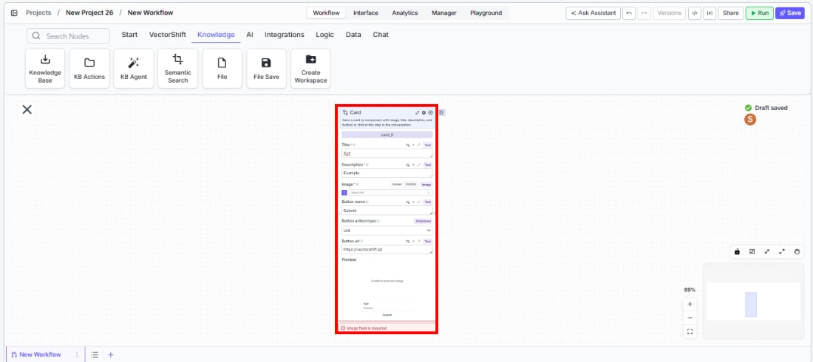
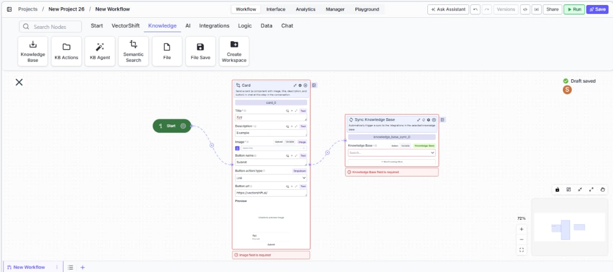

> ## Documentation Index
> Fetch the complete documentation index at: https://docs.vectorshift.ai/llms.txt
> Use this file to discover all available pages before exploring further.

# Talk — Card

> Send a rich card with image, title, description, and button in a conversational workflow.

<Card title="Use this node from the SDK" icon="code" href="/sdk/pipeline/nodes/conversational#talk">
  Add it in Python with `pipeline.add(name="...").talk(...)`. See the SDK reference.
</Card>

The Card node (a variant of the Talk node) sends a rich card component to the user at a specific step in a chatbot conversation. A card combines an image, title, description, and a clickable button into a single visual element. Use it to present structured information — for example, displaying a product listing with a purchase link, showing a service option with a booking button, or presenting a document summary with a download link.

## Core Functionality

* Sends a card component with image, title, description, and action button to the user
* The button supports Link action type, navigating the user to a specified URL when clicked
* Requires a Start node on the canvas to function
* Does not produce outputs — it is a display-only node

## Tool Inputs

* `Title` — Text. The card's title text.
* `Description` — Text. The card's description text.
* `Image` — Image. The card's header image.
* `Content` — Text. Additional content text for the card. Default: "This is content".
* `Button Name` — Text. The label displayed on the button. Default: "Submit".
* `Button URL` — Text. The URL to navigate to when the button is clicked. Default: "[https://vectorshift.ai/](https://vectorshift.ai/)".
* `Button Action Type` — The action to occur when the button is clicked. Default: "Link".

## Tool Outputs

The Card node has no outputs. It is a display-only node.

***

<Tabs>
  <Tab title="Workflows">
    ### Overview

    In workflows, the Card node presents a visually rich component in the chat interface. It combines multiple pieces of information — an image, title, description, and call-to-action button — into a single card that users can interact with. This is ideal for presenting options, showcasing products, or providing structured summaries with actionable links.

    ### Use Cases

    * Present investment fund options with fund name, description, performance chart, and a "Learn More" link
    * Show product recommendations in an e-commerce chatbot with image, name, price, and a "Buy Now" button
    * Display a document summary card with a title, brief description, and "Download PDF" button
    * Present service tier options (Basic, Professional, Enterprise) with features and pricing links
    * Show a contact card for a financial advisor with their photo, name, role, and a "Schedule Meeting" button

    ### How It Works

    #### Step 1: Add a Start Node

    The Card node requires a Start node on the canvas.

    #### Step 2: Add the Card Node

    In the workflow canvas, click the **Chat** tab, click **Talk**, then select **Card** from the variant list.

    <Frame>
      
    </Frame>

    #### Step 3: Configure the Card Content

    Fill in the card fields: `Title`, `Description`, `Image`, and `Content`. These can be static text or connected from upstream nodes via variables.

    <Frame>
      
    </Frame>

    #### Step 4: Configure the Button

    Set the `Button Name` (label), `Button URL` (destination), and `Button Action Type` (default: Link). The button appears at the bottom of the card.

    #### Step 5: Connect in the Flow

    Place the Card node at the appropriate point in the conversation where the card should appear.

    ### Settings

    | Setting              | Type  | Default                                            | Description                                 |
    | -------------------- | ----- | -------------------------------------------------- | ------------------------------------------- |
    | `Title`              | Text  | —                                                  | The card's title.                           |
    | `Description`        | Text  | —                                                  | The card's description.                     |
    | `Image`              | Image | —                                                  | The card's header image.                    |
    | `Content`            | Text  | This is content                                    | Additional content text.                    |
    | `Button Name`        | Text  | Submit                                             | The button label.                           |
    | `Button URL`         | Text  | [https://vectorshift.ai/](https://vectorshift.ai/) | The URL the button navigates to.            |
    | `Button Action Type` | Text  | Link                                               | The action type when the button is clicked. |

    ### Best Practices

    * **Use dynamic content for personalized cards.** Connect upstream node outputs to the title, description, and image fields to generate cards tailored to each user's context.
    * **Write action-oriented button labels.** Labels like "View Report" or "Book Meeting" are clearer than generic "Submit" or "Click Here".
    * **Include an image for visual impact.** Cards with images are more engaging. Use relevant visuals like charts, product photos, or icons.
    * **Keep descriptions concise.** Card descriptions should be 1-2 sentences that convey the key information at a glance.
    * **Use multiple cards via Carousel.** If you need to present several options, consider using the Carousel variant instead of multiple Card nodes.

    ### Related Templates

    <CardGroup cols={2}>
      <Card title="Customer Support Chatbot" href="https://app.vectorshift.ai/marketplace">
        Handles common customer inquiries and support tickets through conversational AI.
      </Card>

      <Card title="Banking Helpdesk" href="https://app.vectorshift.ai/marketplace">
        Assists banking customers with account inquiries, transactions, and product questions.
      </Card>

      <Card title="Webpage Customer Support Agent" href="https://app.vectorshift.ai/marketplace">
        Provides real-time customer support directly embedded within a website interface.
      </Card>

      <Card title="Investor Helpdesk" href="https://app.vectorshift.ai/marketplace">
        Handles investor inquiries related to portfolios, statements, and fund performance.
      </Card>
    </CardGroup>

    ### Common Issues

    For help with common configuration issues, see the [Common Issues](/support) page.
  </Tab>
</Tabs>
