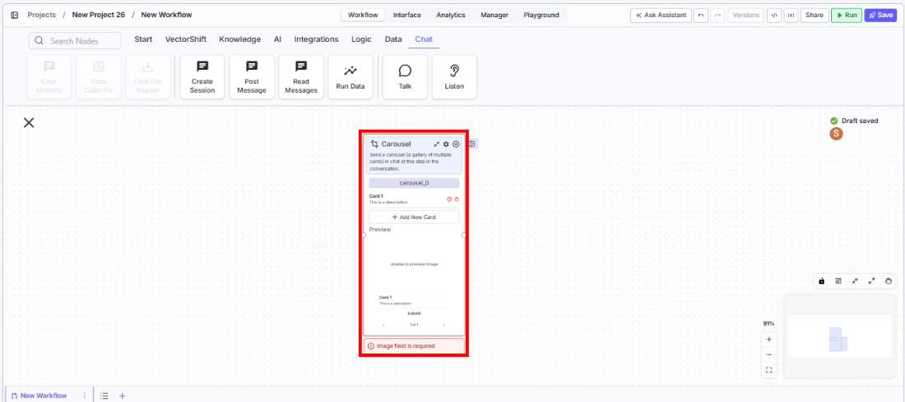
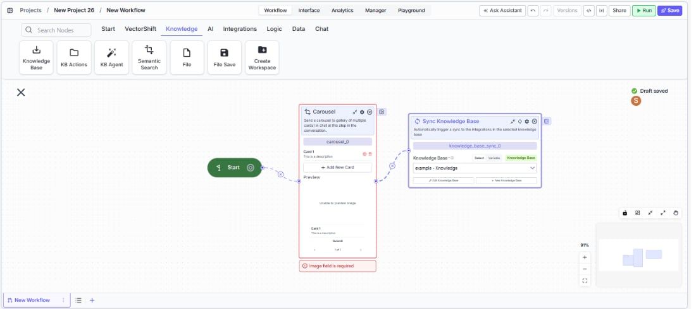

> ## Documentation Index
> Fetch the complete documentation index at: https://docs.vectorshift.ai/llms.txt
> Use this file to discover all available pages before exploring further.

# Talk — Carousel

> Send a gallery of multiple cards in a conversational workflow for users to browse.

<Card title="Use this node from the SDK" icon="code" href="/sdk/pipeline/nodes/conversational#talk">
  Add it in Python with `pipeline.add(name="...").talk(...)`. See the SDK reference.
</Card>

The Carousel node (a variant of the Talk node) sends a scrollable gallery of multiple cards to the user at a specific step in a chatbot conversation. Each card has a title, description, image, and a clickable button. Use it to present multiple options side by side — for example, showing several product recommendations, listing service plans, or displaying a set of document results for the user to browse and select.

## Core Functionality

* Sends a horizontally scrollable gallery of cards to the user in the chat
* Each card includes a title, description, image, and action button
* Cards are managed as a dynamic list — add or remove cards as needed
* Requires a Start node on the canvas to function

## Tool Inputs

Each card in the carousel has the following fields:

* `Title` — Text. The card's title.
* `Description` — Text. The card's description.
* `Image` — Image. The card's header image.
* `Button Name` — Text. The label on the card's button. Default: "Submit".
* `Button URL` — Text. The URL the button navigates to.
* `Button Action Type` — The action when the button is clicked. Default: "Link".

The carousel starts with one card. Add more cards to the gallery as needed.

## Tool Outputs

The Carousel node has no outputs. It is a display-only node.

***

<Tabs>
  <Tab title="Workflows">
    ### Overview

    In workflows, the Carousel node presents multiple rich cards in a scrollable gallery within the chat interface. Users can browse through the cards and interact with individual buttons. This is ideal for presenting multiple options, search results, or recommendations where the user needs to compare and choose.

    ### Use Cases

    * Display multiple investment fund options with performance charts, descriptions, and "View Details" buttons for comparison
    * Present search results from a knowledge base as browsable cards with titles, snippets, and "Read More" links
    * Show available service plans (Basic, Pro, Enterprise) with features, pricing, and sign-up links
    * List recent financial reports with titles, dates, summaries, and download buttons
    * Display product catalog items in an e-commerce chatbot with images, prices, and purchase links

    ### How It Works

    #### Step 1: Add a Start Node

    The Carousel node requires a Start node on the canvas.

    #### Step 2: Add the Carousel Node

    In the workflow canvas, click the **Chat** tab, click **Talk**, then select **Carousel** from the variant list.

    <Frame>
      
    </Frame>

    #### Step 3: Configure Cards

    Each card has fields for Title, Description, Image, and Button. Fill in the details for the first card, then add more cards as needed.

    #### Step 4: Connect in the Flow

    <Frame>
      
    </Frame>

    Place the Carousel node at the point in the conversation where the gallery should appear.

    ### Settings

    | Setting                         | Type  | Default                                            | Description                      |
    | ------------------------------- | ----- | -------------------------------------------------- | -------------------------------- |
    | `Title` (per card)              | Text  | Card 1                                             | The card's title.                |
    | `Description` (per card)        | Text  | This is a description                              | The card's description.          |
    | `Image` (per card)              | Image | —                                                  | The card's header image.         |
    | `Button Name` (per card)        | Text  | Submit                                             | The button label.                |
    | `Button URL` (per card)         | Text  | [https://vectorshift.ai/](https://vectorshift.ai/) | The URL the button navigates to. |
    | `Button Action Type` (per card) | Text  | Link                                               | The action when clicked.         |

    ### Best Practices

    * **Limit to 3-5 cards.** Too many cards make it hard for users to browse and compare. If you have more options, consider filtering or categorizing first.
    * **Use consistent formatting.** Keep titles, descriptions, and images at similar lengths and sizes across cards for a clean gallery appearance.
    * **Make cards self-contained.** Each card should convey enough information for the user to make a decision without needing to click through.
    * **Use action-oriented buttons.** Labels like "View Fund Details" or "Download Report" clearly communicate what happens next.
    * **Connect dynamic data.** Use upstream processing nodes to generate card content dynamically based on user queries or data lookups.

    ### Related Templates

    <CardGroup cols={2}>
      <Card title="Customer Support Chatbot" href="https://app.vectorshift.ai/marketplace">
        Handles common customer inquiries and support tickets through conversational AI.
      </Card>

      <Card title="Webpage Customer Support Agent" href="https://app.vectorshift.ai/marketplace">
        Provides real-time customer support directly embedded within a website interface.
      </Card>

      <Card title="Banking Helpdesk" href="https://app.vectorshift.ai/marketplace">
        Assists banking customers with account inquiries, transactions, and product questions.
      </Card>

      <Card title="Investor Helpdesk" href="https://app.vectorshift.ai/marketplace">
        Handles investor inquiries related to portfolios, statements, and fund performance.
      </Card>
    </CardGroup>

    ### Common Issues

    For help with common configuration issues, see the [Common Issues](/support) page.
  </Tab>
</Tabs>
