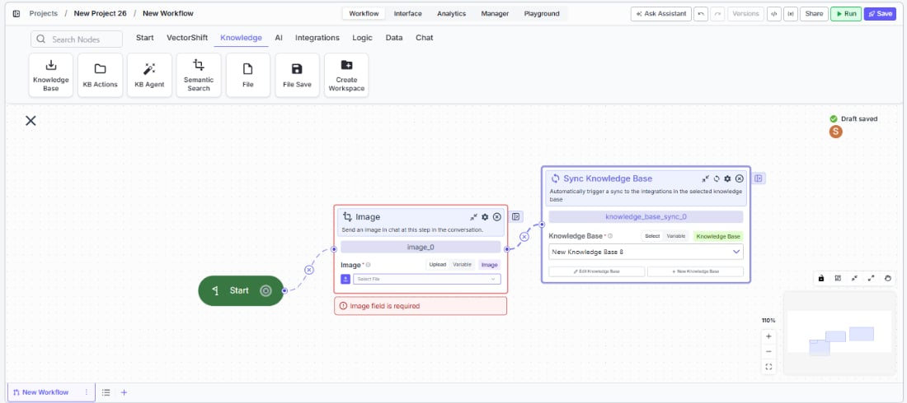
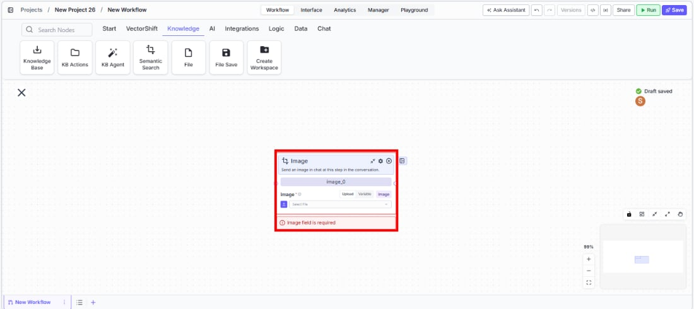

> ## Documentation Index
> Fetch the complete documentation index at: https://docs.vectorshift.ai/llms.txt
> Use this file to discover all available pages before exploring further.

# Talk — Image

> Send an image to the user at a specific step in a conversational workflow.

<Card title="Use this node from the SDK" icon="code" href="/sdk/pipeline/nodes/conversational#talk">
  Add it in Python with `pipeline.add(name="...").talk(...)`. See the SDK reference.
</Card>

The Image node (a variant of the Talk node) sends an image to the user at a specific step in a chatbot conversation. Use it to display visual content inline in the chat — for example, showing a generated chart, presenting a product image, or displaying a captured screenshot from an upstream node.

## Core Functionality

* Sends an image to the user at a defined point in the conversational flow
* Accepts images via upload or from upstream node variables
* Requires a Start node on the canvas to function
* Does not produce outputs — it is a display-only node

## Tool Inputs

* `Image` \* — Image. Required. The image to send. Can be uploaded directly or connected from an upstream node's image output. Supports Upload and Variable modes.

<Frame>
  
</Frame>

\* *Required field*

## Tool Outputs

The Image node has no outputs. It is a display-only node that sends visual content to the user.

***

<Tabs>
  <Tab title="Workflows">
    ### Overview

    In workflows, the Image node sits in a conversational workflow and displays an image to the user when the flow reaches it. Use it to present charts, diagrams, screenshots, or any visual content generated or loaded by upstream nodes.

    ### Use Cases

    * Display a dynamically generated financial chart or graph from an upstream image generation node
    * Show a product image in a sales chatbot based on the user's selection
    * Present a screenshot captured by a Browser Extension node for review
    * Display a company logo or branding image at the start of a branded chatbot experience
    * Show a scanned document or receipt image uploaded by the user back to them for confirmation

    ### How It Works

    #### Step 1: Add a Start Node

    The Image node requires a Start node on the canvas.

    #### Step 2: Add the Image Node

    In the workflow canvas, click the **Chat** tab, click **Talk**, then select **Image** from the variant list.

    <Frame>
      
    </Frame>

    #### Step 3: Provide the Image

    In the `Image` field, either upload an image directly or switch to Variable mode to connect an upstream node's image output. This field is required.

    #### Step 4: Connect in the Flow

    Place the Image node at the appropriate point in the conversation where the image should appear.

    ### Settings

    | Setting | Type  | Default | Description                                                         |
    | ------- | ----- | ------- | ------------------------------------------------------------------- |
    | `Image` | Image | —       | The image to display. Required. Supports Upload and Variable modes. |

    ### Best Practices

    * **Use Variable mode for dynamic images.** Connect upstream nodes (text-to-image, screenshots, file processing) to display context-specific visuals.
    * **Pair with Message nodes for context.** Add a Talk (Message) node before the Image node to explain what the image shows.
    * **Optimize image size.** Large images may slow the chat experience. Use reasonably sized images for the best user experience.
    * **Use for visual confirmation.** Display processed or extracted images back to the user so they can verify the content before proceeding.

    ### Related Templates

    <CardGroup cols={2}>
      <Card title="Customer Support Chatbot" href="https://app.vectorshift.ai/marketplace">
        Handles common customer inquiries and support tickets through conversational AI.
      </Card>

      <Card title="Webpage Customer Support Agent" href="https://app.vectorshift.ai/marketplace">
        Provides real-time customer support directly embedded within a website interface.
      </Card>

      <Card title="Banking Helpdesk" href="https://app.vectorshift.ai/marketplace">
        Assists banking customers with account inquiries, transactions, and product questions.
      </Card>

      <Card title="Company Policy Compliance Chatbot" href="https://app.vectorshift.ai/marketplace">
        Answers employee questions about internal policies and flags potential compliance issues.
      </Card>
    </CardGroup>

    ### Common Issues

    For help with common configuration issues, see the [Common Issues](/support) page.
  </Tab>
</Tabs>
