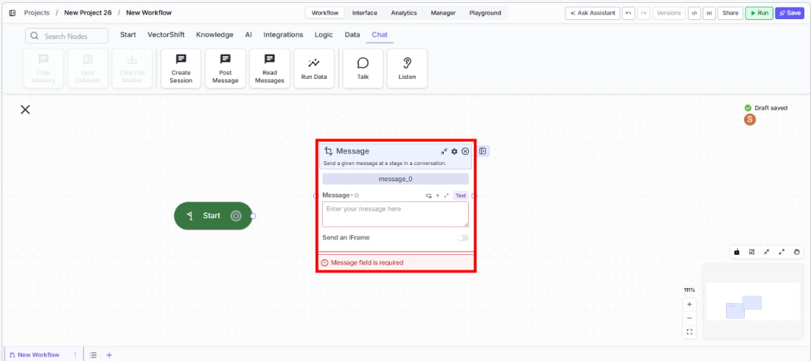
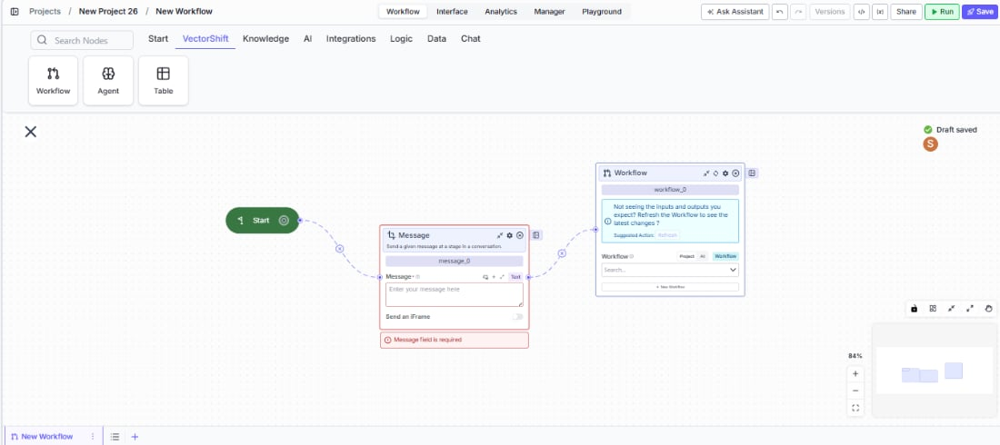

> ## Documentation Index
> Fetch the complete documentation index at: https://docs.vectorshift.ai/llms.txt
> Use this file to discover all available pages before exploring further.

# Talk — Message

> Send a text message to the user at a specific step in a conversational workflow.

<Card title="Use this node from the SDK" icon="code" href="/sdk/pipeline/nodes/conversational#talk">
  Add it in Python with `pipeline.add(name="...").talk(...)`. See the SDK reference.
</Card>

The Message node (a variant of the Talk node) sends a text message to the user at a specific step in a chatbot conversation. Use it to deliver information, ask questions, provide instructions, or display dynamic content — for example, greeting a user, presenting a financial summary, or asking a follow-up question before a Listen node captures their response.

## Core Functionality

* Sends a text message to the user at a defined point in the conversational flow
* Supports static text or dynamic content via variable references from upstream nodes
* Optionally embeds an iframe for displaying external web content inline in the chat
* Requires a Start node on the canvas to function

## Tool Inputs

* `Message` \* — Text. Required. The text content to send to the user. Supports variable references via `{{}}` syntax.
* `Send an iFrame` — Toggle. Default: `Off`. When enabled, the message content is rendered as an iframe.

\* *Required field*

## Tool Outputs

The Message node has no outputs. It is a display-only node that sends content to the user.

***

<Tabs>
  <Tab title="Workflows">
    ### Overview

    In workflows, the Message node sits in a conversational workflow and delivers text to the user when the flow reaches it. It is typically paired with Listen (Capture or Button) nodes to create back-and-forth dialogue.

    ### Use Cases

    * Greet the user and explain what the chatbot can help with at the start of a financial advisory conversation
    * Display a portfolio summary or account balance pulled from upstream data processing nodes
    * Ask a clarifying question before a Capture node collects the user's response
    * Present compliance disclaimers or terms of service that the user must acknowledge
    * Show a dynamically generated report or analysis result from an LLM node

    ### How It Works

    #### Step 1: Add a Start Node

    The Message node requires a Start node on the canvas. Add one from the **Start** tab if not already present.

    #### Step 2: Add the Message Node

    In the workflow canvas, click the **Chat** tab, click **Talk**, then select **Message** from the variant list.

    <Frame>
      
    </Frame>

    #### Step 3: Enter the Message Content

    Type the message text in the `Message` field, or use `{{}}` syntax to reference outputs from upstream nodes. This field is required.

    #### Step 4: Enable iFrame (Optional)

    Toggle `Send an iFrame` to embed an external webpage or widget inline in the chat.

    #### Step 5: Connect in the Flow

    <Frame>
      
    </Frame>

    Connect the Message node between other conversational nodes. A common pattern is: Start → Message (greeting) → Capture (user input) → processing → Message (result).

    ### Settings

    | Setting          | Type   | Default | Description                               |
    | ---------------- | ------ | ------- | ----------------------------------------- |
    | `Message`        | Text   | —       | The text content to send. Required.       |
    | `Send an iFrame` | Toggle | Off     | Render the message as an embedded iframe. |

    ### Best Practices

    * **Use variables for dynamic content.** Reference upstream node outputs with `{{}}` to display personalized information.
    * **Pair with Listen nodes.** Place a Message node before every Capture or Button node so users know what is expected.
    * **Use iFrame for rich content.** Embed dashboards, forms, or visualizations from external tools directly in the chat.
    * **Keep messages concise.** Long messages reduce engagement. Break complex information across multiple Message nodes.
    * **Test the full conversational flow.** Deploy and walk through the entire conversation to ensure messages appear correctly.

    ### Related Templates

    <CardGroup cols={2}>
      <Card title="Customer Support Chatbot" href="https://app.vectorshift.ai/marketplace">
        Handles common customer inquiries and support tickets through conversational AI.
      </Card>

      <Card title="Banking Helpdesk" href="https://app.vectorshift.ai/marketplace">
        Assists banking customers with account inquiries, transactions, and product questions.
      </Card>

      <Card title="Company Policy Compliance Chatbot" href="https://app.vectorshift.ai/marketplace">
        Answers employee questions about internal policies and flags potential compliance issues.
      </Card>

      <Card title="Webpage Customer Support Agent" href="https://app.vectorshift.ai/marketplace">
        Provides real-time customer support directly embedded within a website interface.
      </Card>
    </CardGroup>

    ### Common Issues

    For help with common configuration issues, see the [Common Issues](/support) page.
  </Tab>
</Tabs>
