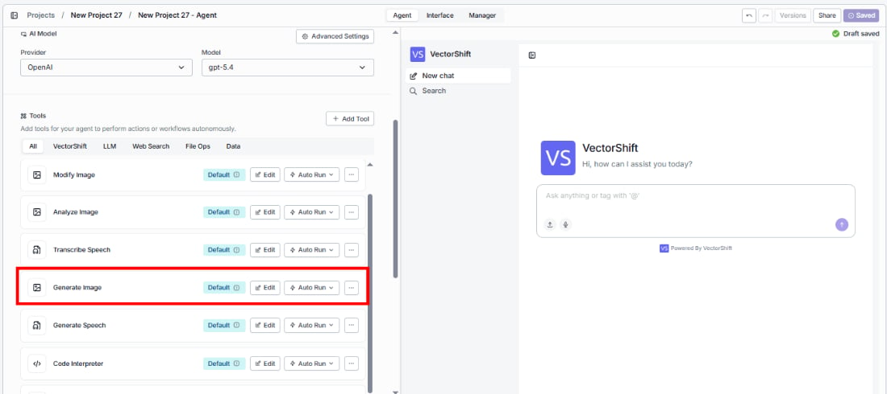
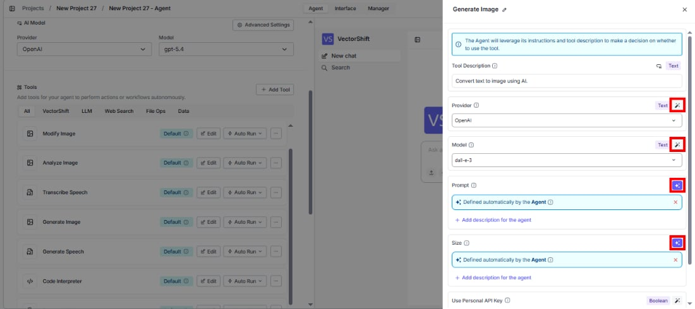
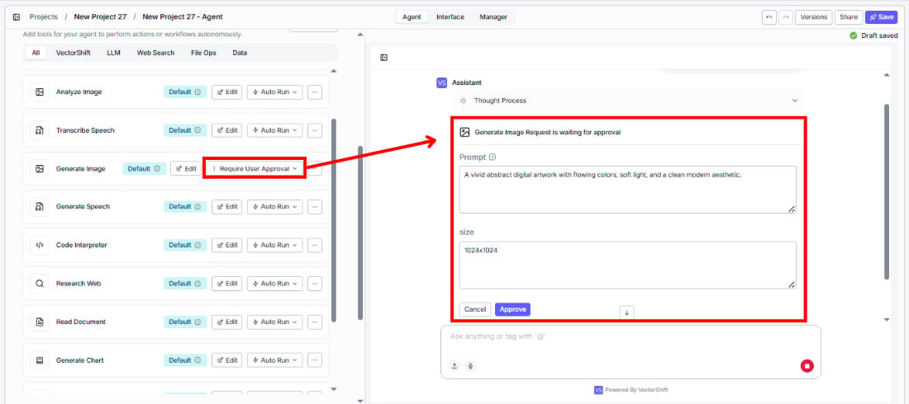
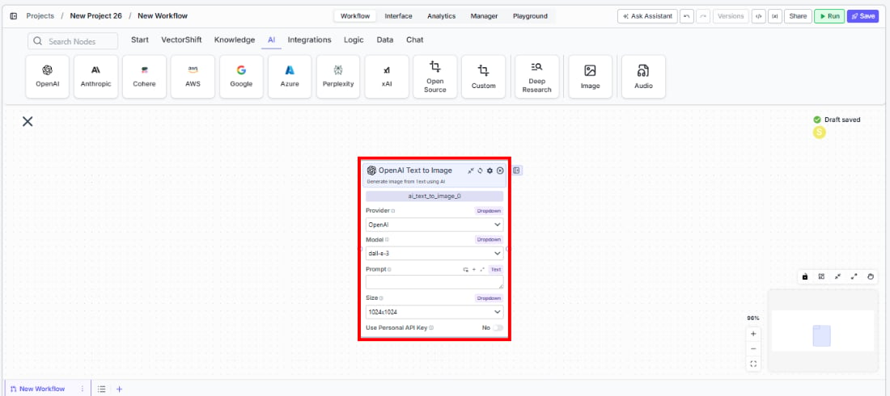

> ## Documentation Index
> Fetch the complete documentation index at: https://docs.vectorshift.ai/llms.txt
> Use this file to discover all available pages before exploring further.

# Text to Image

> Generate images from text descriptions using AI models in your workflows and agents.

<Card title="Use this node from the SDK" icon="code" href="/sdk/pipeline/nodes/multi-modal#ai_text_to_image">
  Add it in Python with `pipeline.add(name="...").ai_text_to_image(...)`. See the SDK reference.
</Card>

The Text to Image node generates images from text prompts using AI image generation models. Use it to create visuals, illustrations, or graphics — for example, generating custom chart illustrations for reports, creating presentation visuals from descriptions, or producing marketing imagery from text briefs.

## Core Functionality

* Generate images from text descriptions using AI models
* Support multiple providers including Google, OpenAI, Stability AI, Flux, and xAI
* Configure output size and aspect ratio
* Use personal API keys for dedicated access

## Tool Inputs

* `Provider` \* — (Enum (Dropdown), default: `Google`) Select the image generation provider
* `Model` \* — (Enum (Dropdown), default: `gemini-2.5-flash-image`) Select the text-to-image model. Options vary by provider
* `Prompt` \* — (String) Text description of the image to generate. Be specific about desired content, style, and composition
* `Size` — (Enum (Dropdown), default: `1024x1024`) Output image dimensions. Only visible for OpenAI provider
* `Aspect Ratio` — (Enum (Dropdown), default: `1:1`) Output aspect ratio. Workflows only
* `Use Personal API Key` — (Boolean, default: `No`) Toggle to use your own API key
* `Api Key` — (String) Your API key. Only visible when `Use Personal API Key` is enabled

\* indicates a required field

## Tool Outputs

* `image` — (Image) The generated image

<Tabs>
  <Tab title="Agents">
    ## Overview

    The Text to Image tool in agents allows the AI to generate images during conversations based on user descriptions. The agent interprets the user's request and creates appropriate prompts for the image generation model.

    ## Use Cases

    * **Presentation visual creation** — Users describe the visual they need and the agent generates it for their presentation.
    * **Report illustration** — Generate custom illustrations or diagrams to accompany financial reports.
    * **Marketing content** — Create visual content from text descriptions for marketing materials.
    * **Concept visualization** — Turn abstract financial concepts into visual representations.

    ## How It Works

    1. **Add the tool to your agent.** In the agent builder, click **Add Tool** and select **Text to Image** from the available tools.

    <Frame>
      
    </Frame>

    2. **Configure input fields.** Each field can either be filled automatically by the agent based on conversation context, or locked to a fixed value:
       * `Provider` — Select the image generation provider
       * `Model` — Choose the generation model
       * `Prompt` — The agent fills this based on the user's request
       * `Quality` — Set the output quality

    <Frame>
      
    </Frame>

    3. **Write the Tool Description.** Describe what the tool does so the agent knows when to use it.

    4. **Set Auto Run behavior.** Choose: Auto Run, Require User Approval, or Let Agent Decide.

    <Frame>
      
    </Frame>

    5. **Test the tool.** Ask the agent to generate an image and verify the output.

    ## Settings

    | Setting                | Type     | Default                  | Description                    |
    | ---------------------- | -------- | ------------------------ | ------------------------------ |
    | `Provider`             | Dropdown | Google                   | The image generation provider. |
    | `Model`                | Dropdown | `gemini-2.5-flash-image` | The text-to-image model.       |
    | `Use Personal API Key` | Boolean  | No                       | Use your own API key.          |

    ## Best Practices

    * **Write detailed prompts.** The more specific the description, the better the output. Include details about composition, style, colors, and content.
    * **Use Require User Approval.** Let users review generated images before they're used in outputs.
    * **Match the provider to your quality needs.** Different providers excel at different image styles.

    ## Common Issues

    For troubleshooting common issues with this node, see the [Common Issues](/support) documentation.
  </Tab>

  <Tab title="Workflows">
    ## Overview

    The Text to Image node in workflows lets you generate images from text prompts and pass them to downstream nodes. This enables automated image generation workflows.

    ## Use Cases

    * **Automated report visuals** — Generate custom illustrations based on data analysis results from upstream nodes.
    * **Batch image generation** — Create multiple images from a list of prompts for marketing or presentation purposes.
    * **Dynamic content creation** — Generate visuals that adapt based on data flowing through the workflow.
    * **Template-based generation** — Create consistent imagery using standardized prompts with variable substitution.

    ## How It Works

    1. **Add the node to your workflow.** From the toolbar, open the **Image** category and drag the **Text to Image** node onto the canvas.

    <Frame>
      
    </Frame>

    2. **Select a provider and model.** Choose the `Provider` and `Model` from the dropdowns.

    3. **Write your prompt.** In the `Prompt` field, describe the image to generate. Use `{{` to reference outputs from upstream nodes.

    4. **Configure size or aspect ratio.** For OpenAI, select the `Size`. For other providers, choose the `Aspect Ratio`.

    5. **Connect the output.** Wire the `image` output to downstream nodes.

    6. **Run your workflow.** Execute the workflow to generate images.

    ## Settings

    | Setting                | Type     | Default                  | Description                                                              |
    | ---------------------- | -------- | ------------------------ | ------------------------------------------------------------------------ |
    | `Provider`             | Dropdown | Google                   | The image generation provider (Google, OpenAI, Stability AI, Flux, xAI). |
    | `Model`                | Dropdown | `gemini-2.5-flash-image` | The text-to-image model.                                                 |
    | `Size`                 | Dropdown | `1024x1024`              | Output image size. Only visible for OpenAI provider.                     |
    | `Aspect Ratio`         | Dropdown | `1:1`                    | Output aspect ratio.                                                     |
    | `Use Personal API Key` | Boolean  | No                       | Use your own API key.                                                    |

    ## Best Practices

    * **Be specific in prompts.** Include details about style, composition, and content for better results.
    * **Use variables for dynamic generation.** Reference upstream node outputs in the prompt using `{{variable}}` syntax.
    * **Test across providers.** Different providers produce different visual styles — test to find the best fit.

    ## Common Issues

    For troubleshooting common issues with this node, see the [Common Issues](/support) documentation.
  </Tab>
</Tabs>
